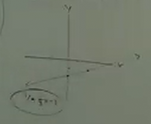
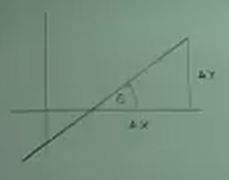

# Calculus 1 Lecture 0.1: Lines, Angle of Inclination, and the Distance Formula

[Video](https://www.youtube.com/watch?v=fYyARMqiaag)

---

This lecture will cover a basic review of essential concepts we learned in
Algebra and Precalculus that will be necessary for us to have a solid grasp on
before moving forward into the subject of Calculus.

---

## Lines

In order to graph a basic line, you'll need at lest 2 points, or one point and
the slope.

**Slope**

Recall that the slope of the line, with two points on it. Each point always has
two coordinates:

$$ P = (x, y) $$

In order to tell the difference between two points on a line, we'll need to
subscript them:

$$ P_1 = (x_1, y_1) \text{, } P_2 = (x_2, y_2) $$

Recall the standard slope formula is:

$$ \text{SLOPE} = \frac{\text{RISE}}{\text{RUN}} $$

Now, the rise and run can be determined simply by subtracting one point from
another:

$$ \text{RISE} = y_2 - y_1 $$

$$ \text{RUN} = x_2 - x_1 $$

And slope is typically represented by the variable $m$. This leaves us with a
more succinct slope formula:

$$ \boxed{m = \frac{y_2 - y_1}{x_2 - x_1}} $$

---

## Equations

$$ m = \frac{y_2 - y_1}{x_2 - x_1} $$

Now, we did say that we could actually find the equation for a line with just
one point and the slope. This is done by setting a generic point by removing the
subscripts of one of our points, usually the one that is preceding the
subtration sign:

$$ m = \frac{y - y_1}{x - x_1} $$

This denotes a "floating point" at the generic, unknown point of $(x, y)$.

We now can change the form of the slope formula by multiplying by the
denominator on both sides:

$$ m(x - x_1) = y - y_1 $$

Or more commonly:

$$ \boxed{y - y_1 = m(x - x_1)} $$

This is what is known as the **Point-Slope** formula.

---

**Example**

Find the equation through the following two points:

$$ (-2, -3) \text{, } (8, 2) $$

$$ m = \frac{2 - (-3)}{8 - (-2)} $$

$$ m = \frac{5}{10} $$

$$ m = \frac{1}{2} $$

We have the slope, and we can now fill out the Point Slope formula:

$$ y - (-3) = \frac{1}{2}(x - (-2)) $$

$$ y + 3 = \frac{1}{2}(x + 2) $$

Now, if we were simply asked to put the formula into Point Slope form, we'd be
done. But if we want to graph this line, we'll need it in a different form.
Let's start out by distributing:

$$ y + 3 = \frac{1}{2}(x + 2) $$

$$ y + 3 = \frac{1}{2}x + 1 $$

And then get $y$ to one side:

$$ y = \frac{1}{2}x - 2 $$

And this is in **Slope Intercept** form.

$$ y = mx + b $$

Or also as:

$$ y - k = m(x - h) $$

If we find our $y$-interept at $(0, -2)$, we can then go up $1$ and to the right
$2$ to find our second point and graph it:

---

**NOTE:** Say we have some line $y = c$ where $c$ is some constant. This is a
straight line. It is a _horizontal_ line.

You can make a _vertical line_ similarly by setting $x = c$ where $c$ is some
constant.

$$ y = c \text{, } c = \text{ constant } \text{, horizontal line} $$

$$ x = c \text{, } c = \text{ constant } \text{, vertical line} $$

---

**Example**

$$ 4x + 2y - 3 = 0 $$

Let's put this in Slope Intercept Form:

$$ 2y = -4x + 3 $$

$$ y = -2x + \frac{3}{2} $$

**Parallel and Perpendicular Lines**

Parallel Lines have the same slope.

$$ m_1 = m_2 $$

Perpendicular Lines have an negative reciprocal slope of each other.

$$ m_1 = -\frac{1}{m_2} $$

---

**Example**

Find the equation of a line that passes through this point: $(6, 7)$ and is
parallel to:

$$ 2x + 3y = 12 $$

You at least need a slope and a point to find the equation of the line.

Let's find the slope.

$$ 3y = -2x + 12 $$

$$ y = -\frac{2}{3}x + 4 $$

$$ m = -\frac{2}{3} $$

Now we can use the Point Slope formula to find the equation of the other line:

$$ y - y_1 = m(x - x_1) $$

$$ y - 7 = -\frac{2}{3}(x - 6) $$

$$ y - 7 = -\frac{2}{3}x + 4 $$

$$ \boxed{y = -\frac{2}{3}x + 11} $$

What if we wanted to get perpendicular? We could still do it, it's just that the
$m$ would be different for the perpendicular line. Specifically it would be the
reciprocal of the original slope. Let's denote this perpendicular line's slope
as $m_2$:

$$ m_2 = \frac{3}{2} $$

And then it is solved in the same fashion

$$ y - 7 = \frac{3}{2}(x - 6) $$

$$ y - 7 = \frac{3}{2}x - 9 $$

$$ \boxed{y = \frac{3}{2}x - 2} $$

---

## Angle of Inclination

When we talk about the angle of inclination, what we are referring to is any
angle that any line makes with the $x$-axis.

We can see on a graph, that this creates an angle $\theta$, and when a vertical
line is dropped from our sloped line to the $x$ axis we create a right triangle.
This creates two distances, $\Delta x$ and $\Delta y$.

The third leg of this triangle is the hypotenuse, and the relation to the angle
$\theta$ is Tangent:

$$ \tan\theta = \frac{\Delta y}{\Delta x} $$

But this is also the slope!

$$ m = \tan\theta $$

---

**Example**

Let's say we have an angle:

$$ \theta = 30\degree = \frac{\pi}{6} \text{ radians} $$

We can find the slope simply by finding the tangent of this angle:

$$ m = \tan\theta = \tan(30\degree) = \frac{\sqrt{3}}{3} $$

$$ \boxed{m = \frac{\sqrt{3}}{3}} $$

---

**Example**

What if we were given a slope and needed to find the angle?

$$ m = -1 $$

$$ \theta = \text{ ?} $$

$$ m = \tan\theta $$

Well we can use ArcTangent to find $\theta$:

$$ \tan^{-1}(m) = \theta $$

In this case $m = -1$:

$$ \tan^{-1}(-1) = \theta $$

$$ \theta = -\frac{\pi}{4} $$

Recall that you do get two answers from Arctangent, but if you think about the
direction of the slope, it points downwards towards the right, it can only be
the angle that exists in Quadrant II:

$$ \boxed{\theta = \frac{3\pi}{4} \text{, } \theta = 135\degree} $$

---

## Distance Formula

Let's once again pick two random points on a line:

$$ (x_2, y_2) \text{, } (x_1, y_1) $$

This time, let's find the distance between them.

Recall that the distance between the two corresponding coordinates are:

$$ \Delta y = y_2 - y_1 $$

$$ \Delta x = x_2 - x_1 $$

And we can use the pythagorean theorem to find the distance, let's call the
distance $D$:

$$ D^2 = (\Delta x)^2 + (\Delta y)^2 $$

$$ D^2 = (x_2 - x_1)^2 + (y_2 - y_1)^2 $$

And then square root it, omit the $\pm$ as you can't have a negative distance:

$$ \boxed{D = \sqrt{(x_2 - x_1)^2 + (y_2 - y_1)^2}} $$
