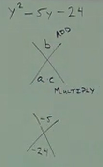

# C.1 A Brief Review of Solving Equations and Factoring

## Equations

Ex.

$$ 4(x - 2) = 6x - 10 $$

**Steps:**

1. Simplify both sides.
   - Distribute
   - Combine Like Terms (like terms are on the same side of the equation)

$$ 4x - 8 = 6x - 10 $$

2. Eliminate the <em>smaller</em> variable.

$$ 4x - 4x - 8 = 6x - 4x - 10 $$

$$ -8 = 2x - 10 $$

$$ -8 + 10 = 2x - 10 + 10 $$

$$ 2 = 2x $$

$$ \frac{2}{2} = \frac{2x}{2} $$

$$ 1 = x $$

3. Solve as usual.

---

Ex.

$$ 6x - 3 = 3(x - 5) $$

$$ 6x - 3 = 3x - 15 $$

$$ 6x - 3x - 3 = 3x - 3x - 15 $$

$$ 3x - 3 = -15 $$

$$ 3x - 3 + 3 = -15 + 3 $$

$$ 3x = -12 $$

$$ \frac{3x}{3} = \frac{-12}{3} $$

$$ x = -4 $$

---

**Fractions:**

$$ \frac{x}{6} - \frac{x}{8} = \frac{1}{8} $$

When we have an equation that has fractions, find the LCD and multiply both
sides by the LCD.

Find LCD: Take the highest denominator and start finding its multiples: $8$,
$16$, $24$... and ask if any of them are a multiple of the other denominator (in
this case it is $24$).

$$ LCD = 24 $$

$$ 24 \times (\frac{x}{6} - \frac{x}{8}) = (\frac{1}{8}) \times 24 $$

$$ (\frac{24}{1} \times \frac{x}{6}) - (\frac{24}{1} \times \frac{x}{8}) = \frac{1}{8} \times \frac{24}{1} $$

To multiply two fractions with one being the whole LCD, you simply have to
determine how many times the denominator goes into the LCD:

$$ \frac{24}{6} = 4 $$

And thusly the initial part of our equation:

$$ (\frac{24}{1} \times \frac{x}{6})  $$

Turns into:

$$ (\frac{4}{1} \times \frac{x}{1}) $$

Similarly with our the next two terms of our equation:

$$ \frac{24}{1} \times \frac{x}{8} $$

$$ \frac{24}{8} = 3 $$

Turns into:

$$ \frac{3}{1} \times \frac{x}{1} $$

And the same on our other side of our equals sign:

$$ \frac{1}{8} \times \frac{24}{1} $$

Turns into:

$$ \frac{1}{1} \times \frac{3}{1} $$

This leaves us with our simplified equation:

$$ 4x - 3x = 3 $$

WHich can evaluate to:

$$ x = 3 $$

---

Ex.

$$ \frac{y}{2} - \frac{y}{5} = \frac{1}{4} $$

---

$$ LCD = 20 $$

---

$$ \frac{20}{1} \times (\frac{y}{2} - \frac{y}{5}) = \frac{1}{4} \times \frac{20}{1} $$

---

$$ (\frac{20}{1} \times \frac{y}{2}) - (\frac{20}{1} \times \frac{y}{5}) = \frac{1}{4} \times \frac{20}{1} $$

---

$$ (\frac{10}{1} \times \frac{y}{1}) - (\frac{4}{1} \times \frac{y}{1})  = \frac{1}{1} \times \frac{5}{1} $$

---

$$ 10y - 4y = 5 $$

---

$$ 6y = 5 $$

---

$$ y = \frac{5}{6} $$

---

Ex.

$$ x^2 + 5x + 6 = 0 $$

**Factoring:**

1. Factor out the Greatest Common Factor(GCF) <em>first</em> (if one exists).

2. Count the number of terms you have (numbers/variables separated by operands).
   - For two terms:
     - Difference of squares:

     $$ a^2 - b^2 = (a - b)(a + b) $$

     - Difference of cubes:

     $$ a^3 - b^3 = (a - b)(a^2+ab + b^2) $$

     - Sum of cubes:

     $$ a^3 + b^3 = (a + b)(a^2 - ab + b^2) $$

     -Sum of squares:

     <em>You cannot factor a sum of squares!</em>

3. For three terms:
   - Diamond Method:

4. For four terms:
   - Factor By Grouping:

<em>NOTE: Check if factors can be factored further!!</em>

---

Ex.

$$ 8a^2b -4ab $$

---

Find the GCF.

$$ 4ab(2a - 1) $$

Since this is no longer factorable, has two terms, and doesn't fill the criteria
for the "Difference of Squares", "Difference of Cubes", nor "Sum of Cubes", this
expression is no longer factorable. this is our answer.

$$ 4ab(2a - 2) $$

---

$$ 36x^2 - 9 $$

$$ LCD = 9 $$

$$ 9(4x^2 - 1) $$

$$ 9((2x)^2 - (1)^2) $$

The insides of our parentheses fulfilles our two terms, "Difference of Squares"
factoring parameter, thusly the formula:

$$ a^2 - b^2 = (a - b)(a + b) $$

Can be utilized to further factor our expression, to find our final, fully
factored answer:

$$ 9(2x - 1)(2x + 1) $$

---

$$ y^2 - 16 $$

Fulfills "Difference of Squares":

$$ (y - 4)(y + 4) $$

---

$$ y^2 + 25 $$

This is "Sum of Squares", which <em>cannot be factored.</em>

---

$$ y^2 - 5y - 24 $$

Can you find a GCF? No...

Count the terms...3.

Diamond Method:

    

This method can be utilized with this formula:

$$ ax^2 + bx + c $$

Where you find two numbers that <em>both</em> multiple to equal $a \times c$ and
also add up to equal $b$.

Since $ a \times c $ is in our formula

$$ 1 \times -24 $$

Thusly, our bottom diamond is $-24$.

Our top diamond is simply $b$, which is $-5$.

What two numbers, when multiplied equal $-24$, and when added equal $-5$?

$-8$ and $3$ fill this criteria. We can then fill in our original formula as:

$$ y^2 - 8y + 3y - 24 $$

We can then factor this now that we have four terms like so:

$$ y(y - 8) + 3(y - 8) $$

Which simplifies to:

$$ (y + 3)(y - 8) $$

---

$$ x^2 - 7x + 12 $$

$$ a \times c = 1 \times 12 $$

$ b = -7 $$

$-3$ and $-4$ fulfill criteria.

$$ (x - 3)(x - 4) $$

---

$$ 5y^2 + 5 + xy^2 + x $$

$$ 5(y^2 + 1) + x(y^2 + 1)$$

$$ (5 + x)(y^2 + 1) $$

---

$$ 2x^2 - 5x - 7 $$

$$ a * c = 2 \times -7 = -14 $$

$$ b = -5 $$

$-7$ and $2$ fulfill criteria.

$$ 2x^2 -7x + 2x - 7 $$

$$ x(2x - 7) + 1(2x - 7) $$

$$ (x + 1)(2x - 7) $$

---

$$ 9x^2 + 24x + 16 $$

$$ a \times c = 144 $$

$$ b = 24 $$

$12$ and $12$ fulfill criteria.

$$ 9x^2 + 12x + 12x + 16 $$

$$ 3x(3x + 4) +  4(3x + 4) $$

$$ (3x + 4)(3x + 4) $$

$$ (3x + 4)^2 $$

---

$$ 5x^2 + 2x - 3 $$

$$ a \times c = -15 $$

$$ b = 2 $$

$5$ and $-3$ fulfill criteria.

$$ 5x^2 + 5x - 3x - 3 $$

$$ 5x(x + 1) - 3(x + 1) $$

$$ (5x - 3)(x + 1) $$

---

**Zero Product Property**

If you have two multiples that equal $0$, then one of them must be $0$.

$$ x^2 + 5x + 6 = 0 $$

$$ (x + 3)(x + 2) = 0 $$

$$ x + 3 = 0 $$

$$ x + 2 = 0 $$

**Solution:**

$$ x = -3 $$

$$ x = -2 $$

---

**Solving Equations:**

$$ 2(x^2 + 5) + 10 = -2(x^2 + 10x) - 5 $$

$$ 2x^2 + 10 + 10 = -2x^2 - 20x - 5 $$

$$ 2x^2 + 20 = -2x^2 - 20x - 5 $$

$$ 2x^2 + 2x^2 + 20 = -2x^2 - 20x - 5 $$

$$ 4x^2 + 20 = -20x -5 $$

$$ 4x^2 + 20x + 20 = -5 $$

$$ 4x^2 + 20x + 25 = 0 $$

$$ a \times c = 100 $$

$$ b = 20 $$

$10$ and $10$ fulfill criteria.

$$ 4x^2 + 10x + 10x + 25 = 0 $$

$$ 2x(2x + 5) +  5(2x + 5) = 0 $$

$$ (2x + 5)(2x + 5) = 0

$$ (2x + 5)^2 = 0 $$

$$ 2x + 5 = 0 $$

$$ 2x = -5 $$

$$ \frac{2x}{2} = \frac{-5}{2} $$

A

**Solution:**

$$ x = -\frac{5}{2} $$

<em>NOTE: For equations with a power of two, set entire equation to one side of
$0$ and factor.</em>

---

$$ 8(x^2 + 3) + 4 = -8x(x + 3) + 19 $$

$$ 8x^2 + 24 + 4 = -8x^2 - 24x + 19 $$

$$ 8x^2 + 8x^2 + 24x + 24 + 4 - 19 = 0 $$

$$ 16x^2 + 24x + 9 = 0 $$

$$ a \times c = 144 $$

$$ b = 24 $$

$12$ and $12$ fulfill criteria.

$$ 16x^2 + 12x + 12x + 9 = 0 $$

$$ 4x(4x + 3) +  3(4x + 3) = 0 $$

$$ (4x + 3)(4x + 3) = 0 $$

$$ (4x + 3)^2 = 0 $$

$$ 4x + 3 = 0 $$

$$ 4x = -3 $$

$$ \frac{4x}{4} - \frac{-3}{4} $$

**Solution:**

$$ x = -\frac{3}{4} $$

---

$$ \frac{x-1}{3} + \frac{2}{3} = x - \frac{2x+3}{9} $$

$$ LCD = 9 $$

$$ 9(\frac{x-1}{3}) + 9(\frac{2}{3}) = 9(x) - 9(\frac{2x+3}{9}) $$

$$ (3x - 3) + 6 = 9x - 1(2x + 3)$$

$$ 3x + 3 = 9x - 2x - 3 $$

$$ 3x + 3 = 7x - 3 $$

$$ 3x - 7x + 3 = -3 $$

$$ -4x + 3 = -3 $$

$$ -4x = -6 $$

$$ x = \frac{-6}{-4} $$

**Solution:**

$$ x = \frac{3}{2} $$

---

$$ x - \frac{x-2}{12} = \frac{x+3}{4} + \frac{1}{4} $$

$$ LCD = 12 $$

$$ 12(x) - 12(\frac{x-2}{12}) = 12(\frac{x+3}{4}) + 12(\frac{1}{4}) $$

$$ 12x - 1(x - 2) = 3x + 9 + 3 $$

$$ 12x -x + 2 = 3x + 12 $$

$$ 11x + 2 = 3x + 12 $$

$$ 8x = 10 $$

$$ \frac{8x}{8}  = \frac{10}{8} $$

**Solution:**

$$ x = \frac{5}{4} $$

---

$$ 2x^2 + \frac{5}{2}x = 3 $$

$$ 2(2x^2) + 2(\frac{5}{2}x) = 2(3) $$

$$ 4x^2 + 5x = 6 $$

$$ 4x^2 + 5x - 6 = 0 $$

$$ a \times c = -24 $$

$$ b = 5 $$

$-3$ and $8$ fulfill the criteria.

$$ 4x^2 +8x - 3x - 6  = 0 $$

$$ 4x(x + 2) - 3(x + 2) = 0 $$

$$ (4x - 3)(x + 2) = 0 $$

$$ 4x - 3 = 0 $$

$$ x + 2 = 0 $$

$$ 4x = 3 $$

**Solution:**

$$ x = \frac{3}{4} $$

$$ x = -2 $$

---

$$ 4x^2 = \frac{15}{2}x + 1 $$

$$ 4x^2 - \frac{15}{2}x - 1 = 0 $$

$$ LCD = 2 $$

$$ 2(4x^2) - 2(\frac{15}{2}x) - 2(1) = 0 $$

$$ 8x^2 - 15x - 2 = 0 $$

$$ a \times c = -16 $$

$$ b = -15 $$

$1$ and $-16$ fulfill the criteria.

$$ 8x^2 - 16x + x - 2 = 0 $$

$$ 8x(x -2) + 1(x - 2) = 0 $$

$$ (8x + 1)(x - 2) = 0 $$

$$ 8x + 1 = 0 $$

$$ 8x = -1 $$

$$ x - 2 = 0 $$

**Solution:**

$$ x = -\frac{1}{8} $$

$$ x = 2 $$
