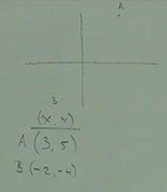
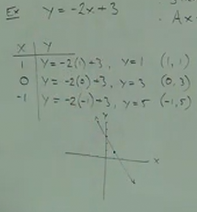
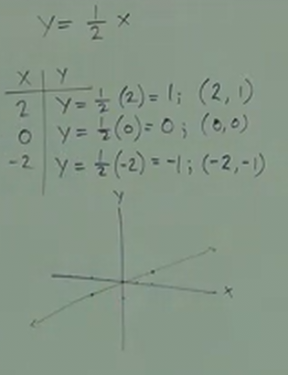
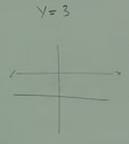
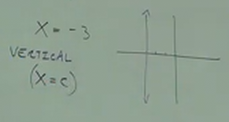

# C.3 A BRIEF Review of Graphing

## The Rectangular Coordinate System

Also known as the "X/Y Axis" or "The Cartesian Plane".

**Plotting Points:**

```
             y-axis
             |
      Q2     |       Q1
             |
             |
____________________________ x-axis
             |
             |
      Q3     |       Q4
             |
             |
```

The center point is called the "origin". This graph is divided into 4 quadrants,
known as "1, 2, 3, 4".

The x-axis follows very much like a number line:

```
<--|--|--|--|--|--|--|--|--|--|--|-->
  -5 -4 -3 -2 -2  0  1  2  3  4  5
```

Similarly, the y-axis acts like a vertical number line:

```
              ^
              |_ 4
              |_ 3
              |_ 2
              |_ 1
_________________0__________
              |_ -1
              |_ -2
              |_ -3
              |_ -4
              |
```

Plotting points is simply placing a point along the $(x, y)$ axis:

Thusly we start at the point of our origin, and if we were plotting $(3, 5)$ at
a point we called "A", we would first follow the x-axis $3$ units to the right,
and then, from there, $5$ units upwards along the y-axis.

<div style="text-align:center;">
    
</div>

Similarly, if we were to plot $(-2, -4)$ at a point we called "B", we would move
left along the x-axis by $-2$, and then move downwards along our y-axis $-5$.

**Linear Equations:**

$$ 7x - 2y = 4 $$

In this context, we always have two variables, $x$ and $y$, as they relate to
two points along a graph.

When both the variables are on one side of the equality operator, and all the
constants on the other side, this is what is known as "Standard Form".

When performing linear equations, we have two variables.

The Graph, in this context, is a straight line.

And in standard form, we can represent this as such:

$$ Ax + By = C $$

Ex.

Another form that can be used is what is known as a "Slope Intercept Form":

$$ y = -2x + 3 $$

We can go from one form to another. So if we wanted the above example to be
presented as "Standard Form", we could simply add $2x$ to each side so that it
conforms to this standard:

$$ 2x + y = 3 $$

In "Slope Intercept Form", the variable $y$ is isolated on one side of the
equation. Thusly taking our original example from Standard Form:

$$ 7x - 2y = 4 $$

Would be slightly more difficult as we need to have $y$ by itself. This could
ultimately be calculated as such:

$$ -2y = -7x + 4 $$

$$ \frac{-2y}{-2} = \frac{(-7x + 4)}{-2} $$

$$ y = \frac{(-7x + 4)}{-2} $$

$$ y = -\frac{7}{2}x + \frac{2}{2}$$

$$ y = -\frac{7}{2}x + 1 $$

**T-Tables:**

$$ y = -2x + 3 $$

```
__x__|__y__
  1  |  y = -2(1) + 3, y = 1  (1, 1)
  0  |  y = -2(0) + 3, y = 3  (0, 3)
 -1  |  y = -2(-1) + 3, y = 5 (-1, 5)
     |
     |
     |
     |
     |
```

Now, graphing simply means taken our calculated points, and placing them on the
Graph. By drawing our pointes and seeing if they form a line, we can tell
whether or not our equation is "Linear".

<div style="text-align:center;">
    
</div>

What we are finding when we use our T-Tables in this way is finding what is
known as the "y-intercept", where the Graph crosses the y-axis. You can always
find the "y-intercept" by plugging in where $x = 0$.

- Where the Graph crosses the y-axis is called the y-intercept.

- Where our graph crosses the x-axis is called the x-intercept.

- To find the y-intercept, set $x = 0$.

- To find the x-intercept, set $y = 0$. i.e: $$ 0 = -2x + 3 $$

<em>Note:</em> If our $x$ term is preceded by a negative sign $-$, then we can
safely assume that our Graph is always "Falling", as opposed to when the sign is
positive, $+$, we can safely assume that our Graph is "Rising".

---

Ex.

$$ y = \frac{1}{2}x $$

Note that we have no constant variable at the end of our equation above. This
indicates that $y$ crosses the origin $(0, 0)$. Let's see if that indication
plays out by first plugging in $x$ values on a T-Table:

```
__x__|__y__
  2  |  y = 1/2(2) = 1   (2, 1)
  0  |  y = 1/2(0) = 0   (0, 0)
 -2  |  y = 1/2(-2) = -1 (-2, -1)
     |
     |
     |
     |
     |
```

<em>Note:</em> The use of $2$ and $-2$ for our $x$ values is not a mistake. It
is to simplify the output of our equation, thusly we don't have a fractional
output that we have to graph.

<div style="text-align:center;">
    
</div>

And our assumption was correct, our graph intersected at $(0, 0)$ as indicated
by the lack of a constant in our equation. Additionally, note that the line is
"Rising", this is because our $x$ variable is not preceded by a negative
coefficient $-$.

---

If we have no definition for $x$:

$$ y = 3 $$

In the context of linear graphing, this means that $x$ could be <em>any</em>
number. Thusly our graph would have a perfectly <em>horizontal line</em>
intersectiong the y-axis at $3$:

<div style="text-align:center;">
    
</div>

This can be expressed as:

$$ y = c $$

Where $c$ represents some constant.

---

$$ x = -3 $$

Likewise, if we have no definition for $y$, this means that $y$ could be
<em>any</em> number. Thus our graph would have a perfectly <em>vertical
line</em> intersecting the x-axis.

<div style="text-align:center;">
    
</div>
