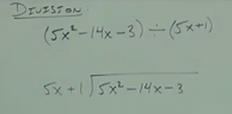
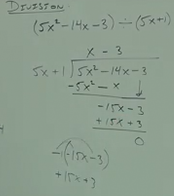
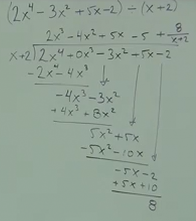

# C.4 A BRIEF Review of Polynomial Mathematics

**Definitions:**

Poly - Several

Nomial - Terms

---

Ex.

**Adding Polynomials:**

$$ (-y^2 + 6y + 1) + (3y^2 - 4y - 10) $$

First polynomial:

$$ (-y^2 + 6y + 1) $$

Has three terms: $-y^2$, $6y$, $1$.

And our second polynomial:

$$ ( 3y^2 - 4y - 10 ) $$

Has three terms: $3y^2$, $-4y$, $-10$.

$$ -y^2 + 6y + 1 + 3y^2 - 4y - 10 $$

$$ 2y^2 + 2y - 9 $$

**Subtracting Polynomials:**

$$ (5x^4 - 6x^2 + z + 1) - (7x^4 - 2z + 1) $$

Note that we have to distribute the $-$ as if it were a $-1$:

$$ (5x^4 - 6x^2 + z + 1) - 1(7x^4 - 2z + 1) $$

$$ 5x^4 - 6x^2 + z + 1 - 7x^4 + 2z - 1 $$

$$ -2x^4 - 6x^2 + 3z $$

---

**Multiplying Polynomials:**

$$ (4x - 1)(x^2 - 3x - 2) $$

$$ 4x^3 - 12x^2 - 8x - x^2 + 3x + 2 $$

$$ 4x^3 - 13x^2 - 5x + 2 $$

---

$$ (5x - 2)^2 $$

$$ (5x - 2)(5x - 2) $$

$$ 25x^2 - 10x - 10x - 4 $$

$$ 25x^2 - 20x - 4 $$

---

**Dividing Polynomials:**

$$ (5x^2 - 14x - 3) \div (5x + 1) $$

    

We can simplify our problem by first diving our first term by the first term of
the divisor:

$$ \frac{5x^2}{5x} = x $$

When we then multiple x by our divisor:

$$ x(5x + 1) $$

We can then subract our first two terms of the dividend:

$$ (5x^2 - 14x) - (5x^2 + x) = - 15x $$

We can then bring down the next term from our dividend $-3$:

$$ -15x - 3 $$

And we can now see how many times $5x + 1$ goes into $-15x - 3$.

$$ -15x/5x = -3 $$

And then we multiply this by our divisor:

$$ -3(5x + 1) = -15x - 3 $$

Thusly we can now subtract our remaining within our division equation from this
new multiple:

$$ (-15x - 3) - (-15x - 3) = 0 $$

Leaving us with no remainder, thusly:

**Solution:**

$$ x - 3 $$

    

---

$$ (2x^4 - 3x^2 + 5x - 2) \div (x + 2) $$

    

$$ 2x^3 - 4x^2 + 5x - 5 + \frac{8}{x+2} $$
