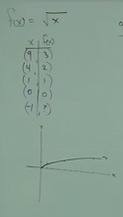
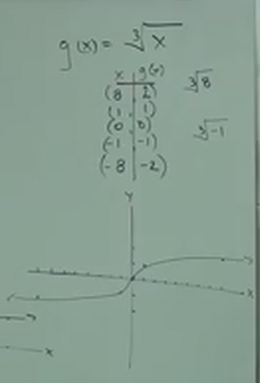
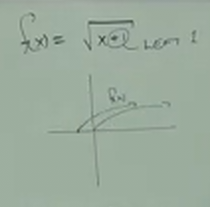
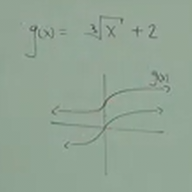

# 10.1 An Introduction to Radicals (Roots) and Radical Functions

**Review of _Square Roots_**

$$ \sqrt{25} =  5 $$

Here, $25$ is our _Radicand_. Let's take a look at a few more _square root_
examples:

$$ \sqrt{0} = 0 $$

$$ \sqrt{\frac{9}{49}} = \frac{3}{7} $$

$$ -\sqrt{49} = -7 $$

$$ \sqrt{-49} = \text{NO REAL SOLUTION} $$

$$ \sqrt{.36} = .6 $$

**Square Root Of Variables:**

$$ \sqrt{x^{10}} = \sqrt{({x^5})^2} = x^5 $$

The "squared" in our second iteration fo the expression cancels out the "square
root", leaving us with $x^5$. We also can solve this a different way:

$$ \sqrt{x^{10}} = \sqrt{x^2x^2x^2x^2x^2} $$

We can then cross out the "sqaured"s and this will leave us with $x$ multiplied
by itself $5$ times, leaving us also with $x^5$. This method becomes useful,
say, when we need to simplify a square root expression where the variable is
raised to the power of an odd number:

$$ \sqrt{x^{11}} = \sqrt{x^2x^2x^2x^2x^2x} $$

Here we divide out our $x^{11}$ into five $x^2$ and a single $x$ (or $x^1$).
This way we can once again eliminate our "squared" notations, and we will get
this:

$$ \sqrt{x^{11}} = x\times x\times x\times x \times x \times \sqrt{x} = x^5\sqrt{x} $$

Note how we keep our last $x$ inside of the square root notation, this is
because there is no way for us to determine the square root of a variable that
has no exponent. Thusly our answer for this simplification is:

$$ \sqrt{x^{11}} = x^5\sqrt{x} $$

---

Let's try to simplify this square root expression:

$$ \sqrt{36x^6} $$

$$ \sqrt{36x^6} = \sqrt{36(x^3)^2} = 6x^3 $$

To reiterate our different potential ways to solve this, let's also solve it
like so:

$$ \sqrt{36x^6}= \sqrt{36\times x^2\times x^2\times x^2} = 6x^3 $$

---

**Ex:**

$$ \sqrt{-81} = $$

$$ \sqrt{-81} = \text{NO REAL SOLUTION} $$

$$ -\sqrt{121} = $$

$$ -\sqrt{121} = -11 $$

$$ \sqrt{16x^8} = $$

$$ \sqrt{16x^8} = \sqrt{16(x^4)^2} = 4x^4 $$

---

**Perfect Squares and Irrational Numbers:**

Easily determined square roots are easily determined because they are numbers
known as _Perfect Squares_, which are numbers where the square of the integer
can be determined by _multiplying that integer by itself_. Example of perfect
square numbers include:

$$ 1, 4, 9, 16, 25 $$

If you take the square root of a number that is _not a Perfect Square_, the
result will be _Irrational_.

$$ \sqrt{30} \approx 5.477 $$

$$ \sqrt{45} \approx 6.708 $$

---

**Cube Roots:**

**Ex:**

$$ \sqrt[3]{8} = 2 $$

$$ \sqrt[3]{27} = 3 $$

$$ \sqrt[3]{-64} = -4 $$

$$ \sqrt[3]{y^3} = y $$

---

**Ex:**

$$ \sqrt[3]{0} = 0 $$

$$ \sqrt[3]{-1000} = -10 $$

$$ \sqrt[3]{\frac{1}{64}} = \frac{1}{4}$$

$$ \sqrt[3]{x^9} = \sqrt[3]{(x^3)^3} = x^3 $$

$$ \sqrt[3]{-64x^6} = \sqrt[3]{-64(x^2)^3} = -4x^2 $$

---

**Ex:**

$$ \sqrt[3]{\frac{27}{64}} $$

$$ \sqrt[3]{\frac{27}{64}} = \frac{3}{4} $$

$$ \sqrt[3]{x^12} $$

$$ \sqrt[3]{x^12} = \sqrt[3]{(x^4)^3} = x^4 $$

$$ \sqrt[3]{-8x^3} $$

$$ \sqrt[3]{-8x^3} = -2x $$

---

**nth Roots:**

$$ \sqrt[n]{} $$

$$ \sqrt[4]{16} = 2 $$

Note that if the root is _even_, then you _cannot_ have a _negative radicand!_

Further note, however, that if the root is _odd_, then you _can_ have a
_negative radicand!_

$$ \sqrt[5]{-32} = -2 $$

$$ -\sqrt{36} = -6 $$

$$ \sqrt[4]{-64} = \text{NO REAL SOLUTION} $$

$$ \sqrt[5]{32x^5} = 2x $$

---

**Roots of the Form:**

$$ \sqrt[n]{a^n} $$

$$ \sqrt{(-5)^2} \neq -5 $$

$$ \sqrt{(-5)^2} = |-5| $$

$$ \sqrt[3]{(-2)^3} = -2 $$

Note the above, if the root variable $n$ is _even_, then the statement
simplifies to the absolute value of the simplified form, but if it's _odd_, then
it just simplifies, this can be expressed as such:

$$ \sqrt[n]{a^n} = |a| \text{ IF n IS EVEN} $$

$$ \sqrt[n]{a^n} = a \text{ IF n IS ODD} $$

---

$$ \sqrt[6]{x^6} = |x| $$

$$ \sqrt[3]{(-3)^3} = -3 $$

$$ \sqrt[4]{(x+6)^4} = |x+6| $$

$$ \sqrt[5]{(7x-1)^5} = 7x-1 $$

---

**Graphing Radicals:**

$$ f(x) = \sqrt{x} $$

| x  | f(x) | point    |
| -- | ---- | -------- |
| 9  | 3    | (9, 3)   |
| 4  | 2    | (4, 2)   |
| 1  | 1    | (1, 1)   |
| 0  | 0    | (0, 0)   |
| -1 | ??   | (-1, ??) |

$$ g(x) = \sqrt[3]{x} $$

| x  | g(x) | point    |
| -- | ---- | -------- |
| 8  | 2    | (8, 2)   |
| 1  | 1    | (1, 1)   |
| 0  | 0    | (0, 0)   |
| -1 | -1   | (-1, -1) |
| -8 | -2   | (-8, -2) |

Note that shifting of our graph works as expected (see chapter 8 on graphs).
Inside function moves along the _x-axis_, outside function moves along the
_y-axis_).

$$ f(x) = \sqrt{x+1} $$

Because the $+1$ is _inside_ the square root function, it shifts the
intersection of the graph along the _x-axis_, specifically by $1$ point to the
_left_:

$$ g(x) = \sqrt[e]{x} + 2 $$

Because the $+2$ is _outside_ the cube root function, it shifts the intersection
of the graph along the _y-axis_, specifically by $2$ points _up_.

