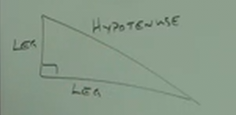
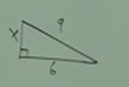

# 10.6 Solving Radical (Roots) Equations and Pythagorean Theorem

> We can raise both sides of an equation to the _same power_.

**Ex:**

$$ \sqrt{3x-2} = 5 $$

$$ (\sqrt{3x-2})^2 = (5)^2 $$

$$ 3x - 2 = 25 $$

$$ 3x = 27 $$

$$ x = 9 $$

---

**Practice:**

$$ \sqrt{3x-5} = 7 $$

$$ (\sqrt{3x-5})^2 = (7)^2 $$

$$ 3x-5 = 49 $$

$$ 3x = 54 $$

$$ x = 18 $$

---

**Practice:**

**NOTE:** If you have trouble with the factoring of the polynomial that comes
out of this equation, please review section C.4.

$$ \sqrt{9x-2} - 2x = 0 $$

$$ \sqrt{9x-2} = 2x $$

$$ (\sqrt{9x-2})^2 = (2x)^2 $$

$$ 9x-2 = 4x^2 $$

$$ 0 = 4x^2 - 9x + 2 $$

$$ 4x^2 - 9x + 2 = 0 $$

$$ 4x^2 - 8x + 1x + 2 = 0 $$

$$ 4(x-2) - 1(x - 2) $$

$$ (x-2)(4x - 1) $$

$$ x-2 = 0 $$

$$ x = 2 $$

$$ 4x - 1 = 0 $$

$$ 4x = 1 $$

$$ x = \frac{1}{4} $$

$$ x = 2, \frac{1}{4} $$

**NOTE:** Make sure to check your solution here, if you end up with a negative
number inside of a root, that is a complex number, and we have not yet covered
that yet.

---

**Practice:**

$$ \sqrt{3 - 2x} - 4x = 0 $$

$$ \sqrt{3 - 2x} = 4x $$

$$ (\sqrt{3 - 2x})^2 = (4x)^2 $$

$$ 3 - 2x = 16x^2 $$

$$ 0 = 16x^2 + 2x - 3 $$

$$ 16x^2 + 2x - 3 = 0 $$

$$ 16x^2 + 8x - 6x - 3 = 0 $$

$$ 8x(2x + 1) - 3(2x + 1) = 0 $$

$$ (8x - 3)(2x + 1) = 0 $$

$$ 8x - 3 = 0 $$

$$ 8x = 3 $$

$$ x = \frac{3}{8} $$

$$ 2x + 1 = 0 $$

$$ 2x  = -1 $$

$$ x  = \frac{-1}{2} $$

$$ x = \frac{3}{8}, -\frac{1}{2} $$

But if we double check our work, we see that one of our solutions doesn't work:

$$ \sqrt{3 - 2(-\frac{1}{2})} - 4(-\frac{1}{2}) = 0 $$

$$ \sqrt{3 + 1} + 2 = 0$$

$$ \sqrt{4} + 2 = 0$$

$$ 2 + 2 = 0 $$

$$ 4 \neq 0 $$

Let's now check our other answer:

$$ \sqrt{3 - 2x} - 4x = 0 $$

$$ x = \frac{3}{8} $$

$$ \sqrt{3 - 2(\frac{3}{8})} - 4(\frac{3}{8}) = 0 $$

$$ \sqrt{3 - \frac{6}{8}} - \frac{12}{8} = 0 $$

$$ \sqrt{3 - \frac{3}{4}} - \frac{12}{8} = 0 $$

$$ \sqrt{\frac{12}{4} - \frac{3}{4}} - \frac{12}{8} = 0 $$

$$ \sqrt{\frac{9}{4}} - \frac{12}{8} = 0 $$

$$ \frac{3}{2} - \frac{3}{2} = 0 $$

$$ 0 = 0 $$

---

**Ex:**

$$ \sqrt[3]{x - 5} + 2 = 1 $$

$$ \sqrt[3]{x - 5} = -1 $$

$$ (\sqrt[3]{x - 5})^3 = (-1)^3 $$

$$ x - 5 = -1 $$

$$ x = 4 $$

And check our work:

$$ \sqrt[3]{x - 5} + 2 = 1 $$

$$ x = 4 $$

$$ \sqrt[3]{4 - 5} + 2 = 1 $$

$$ \sqrt[3]{-1} + 2 = 1 $$

$$ -1 + 2 = 1 $$

$$ 1 = 1 $$

True, so our answer is:

$$ x = 4 $$

---

**Ex:**

$$ \sqrt{9 + x} = x + 3 $$

$$ (\sqrt{9 + x})^2 = (x + 3)^2 $$

$$ 9 + x = (x+3)(x+3) $$

$$ 9 + x = x^2 + 6x + 9 $$

$$ x = x^2 + 6x $$

$$ 0 = x^2 + 5x $$

$$ 0 = x(x + 5) $$

$$ 0 = x $$

$$ 0 = x + 5 $$

$$ -5 = x $$

$$ x = 0, -5 $$

Let's check our work:

$$ x = 0 $$

$$ \sqrt{9 + x} = x + 3 $$

$$ \sqrt{9 + 0} = 0 + 3 $$

$$ \sqrt{9} = 3 $$

$$ 3 = 3 $$

True. Let's check our next answer:

$$ x = -5 $$

$$ \sqrt{9 + x} = x + 3 $$

$$ \sqrt{9 + (-5)} = -5 + 3 $$

$$ \sqrt{9 - 5} = -2 $$

$$ \sqrt{4} = -2 $$

$$ 2 \neq -2 $$

False.

So our final answer is:

$$ x = 0 $$

---

$$ \sqrt{3x + 1} + \sqrt{3x} = 2 $$

$$ \sqrt{3x + 1} = 2 - \sqrt{3x} $$

$$ (\sqrt{3x + 1})^2 = (2 - \sqrt{3x})^2 $$

$$ 3x + 1 = (2 - \sqrt{3x})(2 - \sqrt{3x}) $$

$$ 3x + 1 = 4 - 2\sqrt{3x} - 2\sqrt{3x} + 3x $$

$$ 3x - 3 =  -4\sqrt{3x} + 3x $$

$$ -3 =  -4\sqrt{3x} $$

$$ \frac{3}{4} = \sqrt{3x} $$

$$ (\frac{3}{4})^2 = (\sqrt{3x})^2 $$

$$ \frac{9}{16} = 3x $$

$$ \frac{9}{16} \times \frac{1}{3} = 3x \times \frac{1}{3} $$

$$ \frac{9}{48} = x $$

$$ \frac{3}{16} = x $$

Let's check:

$$ x = \frac{3}{16} $$

$$ \sqrt{3x + 1} + \sqrt{3x} = 2 $$

$$ \sqrt{3(\frac{3}{16}) + 1} + \sqrt{3(\frac{3}{16})} = 2 $$

$$ \sqrt{\frac{9}{16} + 1} + \sqrt{\frac{9}{16}} = 2 $$

$$ \sqrt{\frac{9}{16} + \frac{16}{16}} + \sqrt{\frac{9}{16}} = 2 $$

$$ \sqrt{\frac{25}{16}} + \sqrt{\frac{9}{16}} = 2 $$

$$ \frac{5}{4} + \frac{3}{4} = 2 $$

$$ \frac{8}{4} = 2 $$

$$ 2 = 2 $$

True.

---

**Ex:**

$$ \sqrt{8x + 1} + \sqrt{3x} = 0 $$

$$ \sqrt{8x + 1} = -\sqrt{3x} $$

$$ (\sqrt{8x + 1})^2 = (-\sqrt{3x})^2 $$

$$ 8x + 1 = 3x $$

$$ 5x = -1 $$

$$ x = -\frac{1}{5} $$

---

**Pythagorean Theorem:**

The Pythagorean theorem is based around the conventions around right triangles,
in which there are always two _Legs_ and one _Hypotenuse_. In which the angle
created by the two _Legs_ is right (aka $90\degree$), and the third _Leg_
opposite the right angle is the _Hypotenuse_.

The Pythagorean Theorem essentially states:

$$ (LEG)^2 + (LEG)^2 = (HYPOTENUSE)^2 $$

So, for example:

We can find the value of $x$ using the Pythagorean Theorem:

$$ x^2 + 6^2 = 9^2 $$

$$ x^2 + 36 = 81 $$

$$ x^2 = 45 $$

$$ \sqrt{x^2} = \sqrt{45} $$

$$ x = \sqrt{9}\sqrt{5} $$

$$ x = 3\sqrt{5} $$
