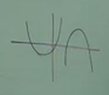
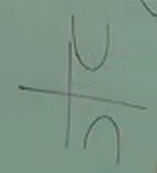
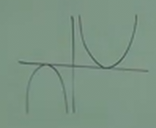
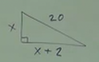

# 11.2 Solving Quadratic Equations with the Quadratic Formula

---

**The Quadratic Formula:**

$$ x = \frac{-b \pm \sqrt{b^2 - 4ac}}{2a} $$

---

To review from the last section, here is how we can determine a formula, known
as the _Quadratic Formula_, from a _Perfect Square Trinomial_ equation:

$$ ax^2 + bx + c = 0 $$

$$ ax^2 + bx = -c $$

$$ \frac{ax^2}{a} + \frac{bx}{a} = \frac{-c}{a} $$

$$ x^2 + \frac{b}{a}x = -\frac{c}{a} $$

$$ x^2 + \frac{b}{a}x + (\frac{b}{2a})^2 = -\frac{c}{a} + (\frac{b}{2a})^2 $$

$$ (x + \frac{b}{2a})^2 = \frac{-c}{a} + (\frac{b}{2a})^2 $$

$$ (x + \frac{b}{2a})^2 = \frac{-c}{a} + \frac{b^2}{4a^2} $$

$$ (x + \frac{b}{2a})^2 = \frac{-4ac}{4a^2} + \frac{b^2}{4a^2} $$

$$ (x + \frac{b}{2a})^2 = \frac{b^2 - 4ac}{4a^2} $$

$$ \sqrt{(x + \frac{b}{2a})^2} = \pm\sqrt{\frac{b^2 - 4ac}{4a^2}} $$

$$ x + \frac{b}{2a} = \pm\sqrt{\frac{b^2 - 4ac}{4a^2}} $$

$$ x + \frac{b}{2a} = \pm \frac{\sqrt{b^2 - 4ac}}{2a} $$

$$ x = -\frac{b}{2a} \pm \frac{\sqrt{b^2 - 4ac}}{2a} $$

$$ x = \frac{-b \pm \sqrt{b^2 - 4ac}}{2a} $$

Knowing a mathematical proof like this is _powerful_, because it means we can
simply _plug in_ our numbers for $a$, $b$, and $c$ into the final _Quadratic
Formula_, and we can determine our solution, $x$.

---

**Ex:**

$$ 2x^2 + 9x + 10 = 0 $$

The _Quadratic Formula_ is so effective, but essentially, unless you can factor
the answer in 10 seconds or less, you should probably use the _Quadratic
Formula_.

Let's start by determining the values of $a$, $b$, and $c$:

$$ a = 2 $$

$$ b = 9 $$

$$ c = 10 $$

Thusly we can plug it into the _Quadratic Formula_ to determine the value of
$x$:

$$ x = \frac{-b \pm \sqrt{b^2 - 4ac}}{2a} $$

$$ x = \frac{-9 \pm \sqrt{9^2 - 4(2)(10)}}{2(2)} $$

$$ x = \frac{-9 \pm \sqrt{81 - 80}}{4} $$

$$ x = \frac{-9 \pm \sqrt{1}}{4} $$

$$ x = \frac{-9 \pm 1}{4} $$

$$ x = \frac{-9 + 1}{4}, \frac{-9 - 1}{4} $$

$$ x = \frac{-8}{4}, \frac{-10}{4} $$

$$ x = -2, -\frac{5}{2} $$

---

$$ x = \frac{-b \pm \sqrt{b^2 - 4ac}}{2a} $$

**Ex:**

$$ 3x^2 - 5x - 2 = 0 $$

$$ a = 3 $$

$$ b = -5 $$

$$ c = -2 $$

$$ x = \frac{-(-5) \pm \sqrt{(-5)^2 - 4(3)(-2)}}{2(3)} $$

$$ x = \frac{5 \pm \sqrt{25 + 24}}{6} $$

$$ x = \frac{5 \pm \sqrt{49}}{6} $$

$$ x = \frac{5 \pm 7}{6} $$

$$ x = \frac{5 + 7}{6}, \frac{5 - 7}{6} $$

$$ x = \frac{12}{6}, \frac{-2}{6} $$

$$ x = 6, -\frac{1}{3} $$

---

$$ x = \frac{-b \pm \sqrt{b^2 - 4ac}}{2a} $$

**Ex:**

$$ 3x^2 - 8x = 2 $$

$$ 3x^2 - 8x - 2 = 0 $$

$$ a = 3 $$

$$ b = -8 $$

$$ c = -2 $$

$$ x = \frac{-(-8) \pm \sqrt{(-8)^2 - 4(3)(-2)}}{2(3)} $$

$$ x = \frac{8 \pm \sqrt{64 + 24}}{6} $$

$$ x = \frac{8 \pm \sqrt{88}}{6} $$

$$ x = \frac{8 \pm \sqrt{4 \times 22}}{6} $$

$$ x = \frac{8 \pm \sqrt{4} \times \sqrt{22}}{6} $$

$$ x = \frac{8 \pm 2\sqrt{22}}{6} $$

$$ x = \frac{4 \pm 1\sqrt{22}}{3} $$

$$ x = \frac{4 + \sqrt{22}}{3}, \frac{4 - \sqrt{22}}{3} $$

---

$$ x = \frac{-b \pm \sqrt{b^2 - 4ac}}{2a} $$

$$ \frac{1}{6}x^2 - \frac{1}{2}x - 1 = 0 $$

In this situation, we want to _Eliminate Fractions_.

First look for the _LCD_.

$$ LCD = 6 $$

$$ (\frac{6}{1})(\frac{1}{6})x^2 - (\frac{6}{1})(\frac{1}{2})x - (\frac{6}{1})(1) = (0)(\frac{6}{1}) $$

$$ x^2 - 3x - 6 = 0 $$

$$ a = 1 $$

$$ b = -3 $$

$$ c = -6 $$

$$ x = \frac{-(-3) \pm \sqrt{(-3)^2 - 4(1)(-6)}}{2(1)} $$

$$ x = \frac{3 \pm \sqrt{9 + 24}}{2} $$

$$ x = \frac{3 \pm \sqrt{33}}{2} $$

$$ x = \frac{3 + \sqrt{33}}{2}, \frac{3 - \sqrt{33}}{2} $$

---

$$ x = \frac{-b \pm \sqrt{b^2 - 4ac}}{2a} $$

**Ex:**

$$ \frac{1}{8}x^2 - \frac{1}{4}x - 2 = 0 $$

$$ LCD = 8 $$

$$ (\frac{8}{1})(\frac{1}{8})x^2 - (\frac{8}{1})(\frac{1}{4})x - (\frac{8}{1})(2) = (\frac{8}{1})(0) $$

$$ x^2 - 2x - 16 = 0 $$

$$ a = 1 $$

$$ b = -2 $$

$$ c = -16 $$

$$ x = \frac{-(-2) \pm \sqrt{(-2)^2 - 4(1)(-16)}}{2(1)} $$

$$ x = \frac{-2 \pm \sqrt{4 + 64}}{2} $$

$$ x = \frac{-2 \pm \sqrt{68}}{2} $$

$$ x = \frac{-2 \pm \sqrt{4 \times 17}}{2} $$

$$ x = \frac{-2 \pm 2\sqrt{17}}{2} $$

$$ x = \frac{-2}{2} \pm \frac{2\sqrt{17}}{2} $$

$$ x = -1 \pm \sqrt{17} $$

$$ x = -1 + \sqrt{17}, -1 - \sqrt{17} $$

---

Let's take a moment to discuss what we are doing here. If you recall our graph
when we plot $x^2$, we get a parabola shape. What we are doing when we determine
when our graph crosses the $x$-axis.

The above shows graphs where $x$ is represented by $2$ _REAL NUMBERS_.

However, if our graphs _NEVER CROSSES THE $x$-axis$_:

Then this indicates that $x$ is represnted by $2$ _COMPLEX NUMBERS_.

Then we have the situation in which the graphs only touch at _one point_ per
graph, this indicates that $x$ is represented by $1$ _REAL NUMBER_:

This leads into what is known as the _Discriminant_, which will be covered in a
future section.

---

**Ex:**

$$ x = -4x^2 - 4 $$

$$ 4x^2 + x + 4 = 0 $$

$$ a = 4 $$

$$ b = 1 $$

$$ c = 4 $$

$$ x = \frac{-(1) \pm \sqrt{(1)^2 - 4(4)(4)}}{2(4)} $$

$$ x = \frac{-1 \pm \sqrt{1 - 64}}{8} $$

$$ x = \frac{-1 \pm \sqrt{-63}}{8} $$

$$ x = \frac{-1 \pm \sqrt{-1 \times 9 \times 7}}{8} $$

$$ x = \frac{-1 \pm i \times \sqrt{9} \times \sqrt{7}}{8} $$

$$ x = \frac{-1 \pm 3i\sqrt{7}}{8} $$

$$ x = \frac{-1 + 3i\sqrt{7}}{8}, \frac{-1 - 3i\sqrt{7}}{8} $$

---

Let's now recall the _Pythagorean Theorem_:

$$ a^2 + b^2 = c^2 $$

Where both $a$ and $b$ reprsent the _legs_ of a _right triangle_ and $c$
represents the _hypotenuse_, we can determine $a$, $b$, or $c$, by having the
values of at least two of the three sides. Thusly if we have:

We can determine represent the hypotenuse as:

$$ (x)^2 + (x + 2)^2 = (20)^2 $$

We can determine the value of $x$ like so:

$$ x^2 + (x+2)(x+2) = 400 $$

$$ x^2 + x^2 + 4x + 4 = 400 $$

$$ 2x^2 + 4x + 4 = 400 $$

$$ 2x^2 + 4x - 396 = 0 $$

This shows that factoring would be far less efficient then simply using the
_Quadratic Formula_ in this situation.

$$ a = 2 $$

$$ b = 4 $$

$$ c = -396 $$

$$ x = \frac{-(4) \pm \sqrt{(4)^2 - 4(2)(-396)}}{2(2)} $$

$$ x = \frac{-4 \pm \sqrt{16 + 3168}}{4} $$

$$ x = \frac{-4 \pm \sqrt{3184}}{4} $$

$$ x = \frac{-4 \pm \sqrt{16 \times 1990}}{4} $$

$$ x = \frac{-4 \pm \sqrt{16} \times \sqrt{1990}}{4} $$

$$ x = \frac{-4 \pm 4\sqrt{1990}}{4} $$

$$ x = \frac{-4}{4} \pm \frac{4\sqrt{1990}}{4} $$

$$ x = -1 \pm \sqrt{1990} $$

$$ x = -1 + \sqrt{1990}, -1 - \sqrt{1990} $$
