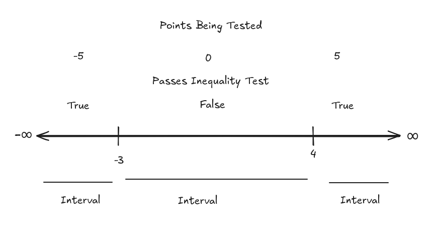

# 11.4 Solving Non-Linear and Quadratic Inequalities

**Steps:**

1. Write in Standard Form (everything to one side).

$$ ax^2 + bx + c \leq 0 $$

2. Temporarily write as an _equation_, and then solve.

3. Write those solutions on a number line.

4. For each interval (intervals are the ranges inbetween $-\infty$ and your
   smallest solution from step 2, between your smallest solution and largest
   solution, and also from your largest solution up to $\infty$, usually 3
   interavals), test a point in the original _inequality_.

5. Write your _true_ intervals in _Interval Notation_, this is your _solution_.

---

**Ex:**

$$ x^2 + 2x - 8 > 0 $$

$$ x^2 + 2x - 8 = 0 $$

$$ (x + 4)(x - 2) = 0 $$

$$ x + 4 = 0, x - 2 = 0 $$

$$ x = -4, x = 2 $$

Now we draw our number line, and check our intervals:

$x=-5$:

$$ x^2 + 2x - 8 > 0 $$

$$ (-5)^2 + 2(-5) - 8 > 0 $$

$$ 25 - 10 - 8 > 0 $$

$$ 25 - 18 > 0 $$

$$ 25 - 18 > 0 $$

$$ 7 > 0 $$

True.

$x=0$:

$$ (0)^2 + 2(0) - 8 > 0 $$

$$ 0 + 0 - 8 > 0 $$

$$ -8 > 0 $$

False.

$x=3$:

$$ (3)^2 + 2(3) - 8 > 0 $$

$$ 9 + 6 - 8 > 0 $$

$$ 15 - 8 > 0 $$

$$ 7 > 0 $$

**Solution:**

$$ (-\infty, -4)\cup(2, \infty) $$

---

**Ex:**

$$ x^2 - x - 12 > 0 $$

$$ x^2 - x - 12 = 0 $$

$$ (x - 4)(x + 3)= 0 $$

$$ x - 4 = 0, x + 3 = 0 $$

$$ x = 4, x = -3 $$

$x=-5$:

$$ x^2 - x - 12 > 0 $$

$$ (-5)^2 - (-5) - 12 > 0 $$

$$ 25 + 5 - 12 > 0 $$

$$ 30 - 12 > 0 $$

$$ 18 > 0 $$

True.

$x=0$:

$$ x^2 - x - 12 > 0 $$

$$ (0)^2 - (0) - 12 > 0 $$

$$ 0 - 0 - 12 > 0 $$

$$ -12 > 0 $$

False.

$x=5$:

$$ x^2 - x - 12 > 0 $$

$$ (5)^2 - (5) - 12 > 0 $$

$$ 25 - 5 - 12 > 0 $$

$$ 20 - 12 > 0 $$

$$ 8 > 0 $$

True.

**Solution:**

$$ (-\infty, -3)\cup(4, \infty) $$

---

**Ex:**

$$ x^2 - 6x \leq 0 $$

$$ x^2 - 6x = 0 $$

$$ x(x - 6) = 0 $$

$$ x = 0, x - 6 = 0 $$

$$ x = 0, x = 6 $$

$x=-1$

$$ x^2 - 6x \leq 0 $$

$$ (-1)^2 - 6(-1) \leq 0 $$

$$ 1 + 6 \leq 0 $$

$$ 7 \leq 0 $$

False.

$x=1$

$$ x^2 - 6x \leq 0 $$

$$ (1)^2 - 6(1) \leq 0 $$

$$ 1 - 6 \leq 0 $$

$$ -5 \leq 0 $$

True.

$x=7$

$$ x^2 - 6x \leq 0 $$

$$ (7)^2 - 6(7) \leq 0 $$

$$ 49 - 42 \leq 0 $$

$$ 7 \leq 0 $$

False.

$$ [0, 6] $$

---

**Ex:**

$$ x^2 - 8x < 0 $$

$$ x(x - 8) = 0 $$

$$ x = 0, x - 8 = 0 $$

$$ x = 0, x = 8 $$

$x=-1$:

$$ x^2 - 8x < 0 $$

$$ (-1)^2 - 8(-1) < 0 $$

$$ 1 + 8 < 0 $$

$$ 9 < 0 $$

False.

$x=1$:

$$ x^2 - 8x < 0 $$

$$ (1)^2 - 8(1) < 0 $$

$$ 1 - 8 < 0 $$

$$ -7 < 0 $$

True.

$x=9$:

$$ x^2 - 8x < 0 $$

$$ (9)^2 - 8(9) < 0 $$

$$ 81 - 72 < 0 $$

$$ 9 < 0 $$

False.

**Solution:**

$$ (0, 8) $$

---

This technically is _Cubic_, but we can still solve this using much of the same
strategies we've been using thus far.

$$ (x - 2)(x + 1)(x + 5) \leq 0 $$

$$ (x - 2)(x + 1)(x + 5) = 0 $$

$$ x - 2 = 0, x + 1 = 0, x + 5 = 0 $$

$$ x = 2, x = -1, x = -5 $$

$x=-6$

$$ (x - 2)(x + 1)(x + 5) \leq 0 $$

$$ ((-6) - 2)((-6) + 1)((-6) + 5) \leq 0 $$

$$ (-8)(-5)(-1) \leq 0 $$

$$ -40 \leq 0 $$

True.

$x=-3$

$$ (x - 2)(x + 1)(x + 5) \leq 0 $$

$$ ((-3) - 2)((-3) + 1)((-3) + 5) \leq 0 $$

$$ (-5)(-2)(2) \leq 0 $$

$$ 20 \leq 0 $$

False.

$x=0$

$$ (x - 2)(x + 1)(x + 5) \leq 0 $$

$$ ((0) - 2)((0) + 1)((0) + 5) \leq 0 $$

$$ (-2)(1)(5) \leq 0 $$

$$ -10 \leq 0 $$

True.

$x=3$

$$ (x - 2)(x + 1)(x + 5) \leq 0 $$

$$ ((3) - 2)((3) + 1)((3) + 5) \leq 0 $$

$$ (1)(4)(8) \leq 0 $$

$$ 32 \leq 0 $$

False.

$$ (-\infty, -5]\cup[-1, 2] $$

---

**Ex:**

Here we deal with rational inequalities. To address this, we will first:

1. Set both the numerator and denominator equal to $0$.

$$ \frac{x - 3}{x + 5} \leq 0 $$

$$ x - 3 = 0, x + 5 = 0 $$

$$ x = 3, x = -5 $$

$x=-6$

$$ \frac{x - 3}{x + 5} \leq 0 $$

$$ \frac{(-6) - 3}{(-6) + 5} \leq 0 $$

$$ \frac{-9}{-1} \leq 0 $$

$$ 9 \leq 0 $$

False.

$x=0$

$$ \frac{x - 3}{x + 5} \leq 0 $$

$$ \frac{(0) - 3}{(0) + 5} \leq 0 $$

$$ \frac{-3}{5} \leq 0 $$

$$ -\frac{3}{5} \leq 0 $$

True.

$x=4$

$$ \frac{x - 3}{x + 5} \leq 0 $$

$$ \frac{(4) - 3}{(4) + 5} \leq 0 $$

$$ \frac{1}{9} \leq 0 $$

False.

**Solution:**

$$ [-5, 3] $$

---

**Ex:**

$$ \frac{3}{x - 2} < 2 $$

This will throw you off, because we don't have everything off to one side. We
can solve this however, by temporarily setting our inequality to an equation:

$$ \frac{3}{x - 2} = 2 $$

Our denominator can still be treated as being set to $0$:

$$ x - 2 = 0 $$

$$ x = 2 $$

But for our numerator, we'll have to instead solve it like a regular equation:

$$ \frac{3}{x - 2} = 2 $$

$$ (x - 2)(\frac{3}{x - 2}) = 2(x - 2) $$

$$ 3 = 2(x - 2) $$

$$ 3 = 2x - 4 $$

$$ 7 = 2x $$

$$ \frac{7}{2} = x $$

We would then set it on the number line, and treat it as the others.
