# 11.5 Sketching Graphs of Quadratic Functions

**Review of Basic Graphs**

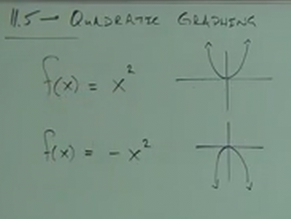

Please note that the $x^2$ indicates that our function is a _Quadratic
Function_.

$$ f(x) = x^2 $$

Specifically, this can be expressed as a _Quadratic Function_ like so:

$$ ax^2 + bx + c $$

And thusly, the graph is a _Parabola_.

---

Review of Chapter 8.

**Ex:**

$$ f(x) = x^2 + 4 $$

If you will recall from Chapter 8, our $x^2$ indeed indicates the shape of our
graph will be a _Parabola_. It will not, however, diverge perfectly at our
$(x, y)$ coordinates of $(0, 0)$. Instead, due to the $+4$ in our function, this
indicates that our graph's point along the $y$-axis will be shifted _up_ $4$
units. This is known as the _Vertical Shift_.

Much of the graphing of _Quadratic Formulas_ will be a review of what was
covered in Chapter 8. Note, however, that because the definition of a _Quadratic
Formula_ requires the use of $x^2$, that the only shape our graph can take is
that of a _Parabola_.

$$ f(x) = x^2 + k $$

Here, we _shift up $k$ units_ (along the $y$-axis).

$$ f(x) = x^2 - k $$

Here, we _shift down $k$ units_ (along the $y$-axis).

$$ f(x) = x^2 + 4 $$

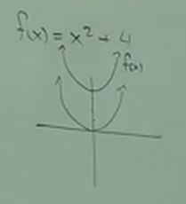

---

**Ex:**

$$ g(x) = x^2 - 2 $$

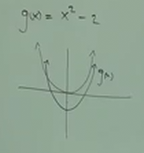

---

**Ex:**

$$ f(x) = (x - 1)^2 $$

Note here that we are _not_ shifting down, but rather we are implementing a
_Horizontal Shift_ along the $x$-axis, in this case, to the _right_.

$$ f(x) = (x - h)^2 $$

Here, we _shift right $h$ units_ (along the $x$-axis).

$$ f(x) = (x + h)^2 $$

Here, we _shift left $h$ units_ (along the $x$-axis).

**Ex:**

$$ f(x) = (x - 1)^2 $$

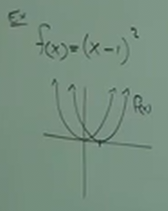

$$ g(x) = (x + 2)^2 $$

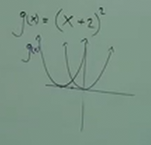

---

**Ex:**

$$ h(x) = (x - 2)^2 + 3 $$

We can combine shifts, here we are shifting _right_ $2$ units along the
$x$-axis, and shifting _up_ $3$ units along the $y$-axis.

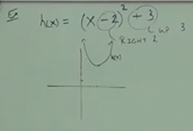

---

**Ex:**

$$ f(x) = (x + 2)^2 + 5 $$

Here, we shift _up_ $5$ units along the $y$-axis, and shift _left_ $2$ units
along the $x$-axis. Also as a review, if we had a _negative_ multiplier before
our $x$ variable like so:

$$ f(x) = -(x + 2)^2 + 5 $$

Then this would indicate that our _Parabola_ is _Inverted_ along the $x$-axis
(an upside down _Parabola_).

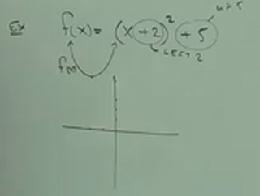

---

**Ex:**

Our first function $f(x)$ graphs to display a classic _Parabola_ shape.

$$ f(x) = x^2 $$

| x  | f(x) |
| -- | ---- |
| -2 | 4    |
| -1 | 1    |
| 0  | 0    |
| 1  | 1    |
| 2  | 4    |

With our second function, $g(x)$, the graph displays _thinner_, as the points
graph along the $x$-axis much "faster", exponentiating to larger numbers at an
accelerated rate.

$$ g(x) = 2x^2 $$

| x  | g(x) |
| -- | ---- |
| -2 | 8    |
| -1 | 2    |
| 0  | 0    |
| 1  | 2    |
| 2  | 8    |

Conversely, with our third function, $h(x)$, the graph displays _wider_, as the
points graph along the $x$-axis much "slower", as the multiplier of
$\frac{1}{3}$ causes the graph to exponentiate at a slower rate.

$$ h(x) = \frac{1}{3}x^2 $$

| x  | h(x) |
| -- | ---- |
| -2 | 4/3  |
| -1 | 1/3  |
| 0  | 0    |
| 1  | 1/3  |
| 2  | 4/3  |

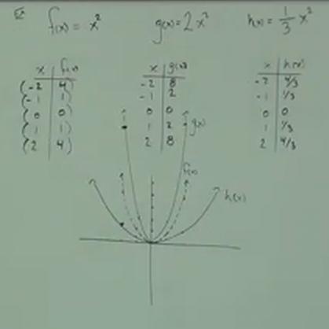

---

**Notes:**

$$ f(x) = ax^2 + bx + c $$

1. If the value of $a$ is _positive_, then the _Parabola_ opens _Upwards_. If
   it's _negative_, then the _Parabola_ opens _Downwards_.

2. If $|a|$ is _greater than $1$_, then the _Parabola_ will be _Narrow_. The
   larger $|a|$ is, the more _Narrow_ the graph is.

3. If $|a|$ is _less than $1$_, then the _Parabola_ will be _Wider_. The smaller
   $|a|$ is, the more _Wider_ the graph is.

---

**Ex:**

$$ f(x) = -3x^2 $$

If we look at $f(x)$ above, we can determine quite a bit just looking at it.
There is _NO_ shifting along the $x$-axis or the $y$-axis. Our $-3$ indicates
that our _Parabola_ will open _Downwards_. The value $|-3|$ is _greater than
$1$_, which means that the _Parabola_ will be quite _Narrow_.

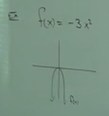

$$ g(x) = -\frac{1}{5}x^2 $$

We can similarly discern the look of a graph of the function, $g(x)$. There is
_NO_ shifting from the $x$-axis or the $y-axis$. Our $-\frac{1}{5}$ indicates
that our _Parabola_ will open _Downwards_. The value $|-\frac{1}{5}|$ is _less
than $1$_, which means that the _Parabola_ will be quite _Wider_.

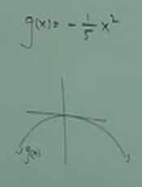

---

$$ f(x) = \pm a(x \pm h)^2 \pm k $$

$$ k \text{ indicates moving up/down along the y-axis} $$

$$ h \text{ indicates moving left/right along the x-axis} $$

$$ a \text{ indicates how Wide or Narrow the Parabola is} $$

$$ \text{the } \pm \text{ before } a \text{ indicates whether the Parabola opens Upward or Downward} $$

---

**Ex:**

$$ f(x) = -2(x + 3)^2 - 4 $$

So let's break this down. We _shift downward_ by $4$ units along the $y$-axis.
We _shift left_ by $3$ units along the $x$-axis. The $-2$ indicates that our
_Parabola_ opens _Downwards_. The $|-2|$ indicates that our _Parabola_ will be
quite _Narrow_.

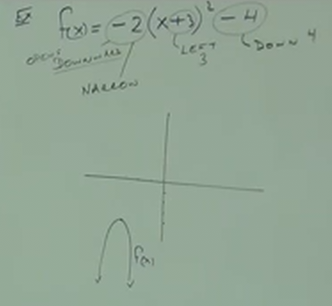

---

**Ex:**

$$ g(x) = \frac{1}{3}(x - 4)^2 + 2 $$

We _shift upwards_ by $2$ units along the $y$-axis. We _shift right_ by $4$
units along the $x$-axis. The $\frac{1}{3}$ indicates that our _Parabola_ opens
_Upwards_. The $|\frac{1}{3}| indicates that our _Parabola_ will be quite
_Wide_.

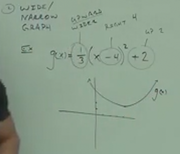
