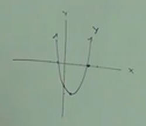
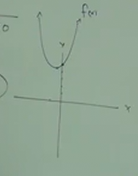
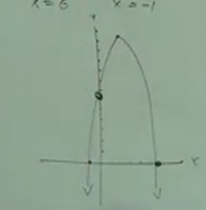

# 11.6: Graphing of Quadratics. Vertex, X - Intercept, Y - Intercept

**Ex:**

$$ f(x) = x^2 - 4x - 5 $$

The issue with this currently is that it's not in the proper form that we're
used to for determining the _shift_ of our initial $(x, y)$ point (our
_Vertex_). But we still have, for example, our $a$ value ($1$) in front of our
$x^2$, indicating whether our _Parabola_ is _Upwards_ facing or _Downwards_
facing.

**How To Graph:**

$$ f(x) = ax^2 + bx + c $$

$$ f(x) = x^2 - 4x - 5 $$

1. Find the _Vertex_. A point, reading like $(x, y)$. Which can be represented
   like so: $(\frac{-b}{2a}, f(x))$

$$ (\frac{-(-4)}{2(1)}, ?) $$

$$ (\frac{4}{2}, ?) $$

$$ (2, ?) $$

Note here how we actually have the value of $x$ now, and the way we determine
the value of $y$ is to plug $x$ into $f(x)$:

$$ f(x) = x^2 - 4x - 5 $$

$$ f((2)) = (2)^2 - 4(2) - 5 $$

$$ f((2)) = 4 - 8 - 5 $$

$$ f((2)) = -4 - 5 $$

$$ f((2)) = -9 $$

Thusly, our initial _Vertex_ is:

$$ (2, -9) $$

2. Find Intercepts:
   - $y$-intercept: $c$ (the constant)

$$ f(x) = x^2 - 4x - 5 $$

$$ y\text{-interecept} = -5 $$

2. Find Intercepts:
   - $x$-intercepts: Set the entire equation ($f(x)$) equal to $0$, and then
     solve.

$$ x\text{-interecept} = x^2 - 4x - 5 = 0 $$

$$ x\text{-interecept} = (x - 5)(x + 1) = 0 $$

$$ x\text{-interecept} = x - 5 = 0, x + 1 = 0 $$

$$ x\text{-interecept} = x = 5, x = -1 $$

3. Graph
   - Plot the _Vertex_.
   - Plot the $y$-intercept.
   - Plot the $x$-intercepts (you may not have 2, or any of these).
   - Graph from the _Vertex_ to the $y$-intercept to the _left most_
     $x$-intercept.
   - Graph from the _Vertex to the _right most_ $x$-intercept, trying to keep
     the _Parabola_ symmetrical, and noting that the shape has a _curve_ (it's
     not a "V" shape).
   - Name your graph with the name of the function, (i.e. $f(x)$).

---

**Ex:**

$$ y = x^2 - 2x - 3 $$

1. Find the _Vertex_:

$$ (\frac{-b}{2a}, ?) $$

$$ (\frac{-(-2)}{2(1)}, ?) $$

$$ (\frac{2}{2}, ?) $$

$$ (1, ?) $$

$$ y = (1)^2 - 2(1) - 3 $$

$$ y = 1 - 2 - 3 $$

$$ y = -1 - 3 $$

$$ y = -4 $$

$$ \text{VERTEX} = (1, -4) $$

2.1 Find the $y$-intercept:

$$ y = x^2 - 2x - 3 $$

$$ \text{Y-INTERCEPT} = -3 $$

2.2 Find the $x$-intercept:

$$ y = x^2 - 2x - 3 = 0 $$

$$ y = (x - 3)(x + 1) = 0 $$

$$ y = x - 3 = 0, x + 1 = 0 $$

$$ y = x = 3, x = -1 $$

3. Graph

---

$$ f(x) = 2x^2 + 2x + 5 $$

1. Find the _Vertex_:

$$ (\frac{-b}{2a}, ?) $$

$$ (\frac{-(2)}{2(2)}, ?) $$

$$ (\frac{-2}{4}, ?) $$

$$ (-\frac{1}{2}, ?) $$

$$ f(-\frac{1}{2}) = 2(-\frac{1}{2})^2 + 2(-\frac{1}{2}) + 5 $$

$$ f(x) = 2(\frac{1}{4}) + 2(-\frac{1}{2}) + 5 $$

$$ f(x) = \frac{2}{4} - \frac{2}{2} + 5 $$

$$ f(x) = \frac{1}{2} - 1 + 5 $$

$$ f(x) = -\frac{1}{2} + 5 $$

$$ f(x) =  -\frac{1}{2} + \frac{10}{2} $$

$$ f(x) =  \frac{9}{2} $$

$$ \text{VERTEX} = (-\frac{1}{2}, \frac{9}{2}) $$

2.1 Find the $y$-intercept:

$$ f(x) = 2x^2 + 2x + 5 $$

$$ \text{Y-INTERCEPT} = 5 $$

2.2 Find the $x$-intercept:

$$ f(x) = 2x^2 + 2x + 5 = 0 $$

$$ x = \frac{-(2) \pm \sqrt{(2)^2 - 4(2)(5)}}{2(2)} $$

$$ x = \frac{-2 \pm \sqrt{4 - 40}}{4} $$

$$ x = \frac{-2 \pm \sqrt{-36}}{4} $$

Taking the square root of a negative number indicates _NO_ $x$-intercept.

$$ x = \text{ NO x-intercept} $$

---

**Ex:**

$$ f(x) = -x^2 + 5x + 6 $$

1. Find the _Vertex_:

$$ (\frac{-b}{2a}, ?) $$

$$ (\frac{-(5)}{2(-1)}, ?) $$

$$ (\frac{-5}{-2}, ?) $$

$$ (\frac{5}{2}, ?) $$

$$ f(x) = -(\frac{5}{2})^2 + 5(\frac{5}{2}) + 6 $$

$$ f(x) = -(\frac{25}{4}) + \frac{25}{2} + 6 $$

$$ f(x) = -(\frac{25}{4}) + \frac{50}{4} + 6 $$

$$ f(x) = \frac{25}{4} + 6 $$

$$ f(x) = \frac{25}{4} + \frac{24}{4} $$

$$ f(x) = \frac{49}{4} $$

$$ \text{VERTEX} = (\frac{5}{2}, \frac{49}{4}) $$

2.1 Find the $y$-intercept:

$$ f(x) = -x^2 + 5x + 6 $$

$$ \text{Y-INTERCEPT} = 6 $$

2.2 Find the $x$-intercept:

$$ f(x) = -x^2 + 5x + 6 = 0 $$

$$ f(x) = \frac{x^2}{-1} + \frac{5x}{-1} + \frac{6}{-1} = 0 $$

$$ f(x) = x^2 - 5x - 6 = 0 $$

$$ f(x) = (x - 6)(x + 1) = 0 $$

$$ f(x) = x - 6 = 0, x + 1 = 0 $$

$$ f(x) = x = 6, x = -1 $$

3. Graph:

---

**Applying Graphing Quadratic Formulas to Real Life**

Let's say you are trying to find the max height of a rocket. Consider this:

$$ h(T) $$

Where $h$ represents _height_ and $T$ represents _Time_ in _seconds_.

$$ h(T) - -16T^2 + 10T + 100 $$

At what point will the rocket reach _Maximum_ height?

For the _Maximum_ height, find the _Vertex_.

When will the rocket hit the ground/land?

It will hit the ground at the max $x$-intercept.

(Note that it cannot hit the ground at the minimum $x$-intercept, as that would
indicate hitting in _negative Time_, i.e. the rocket can only ever travel in one
direction through time, forward).
