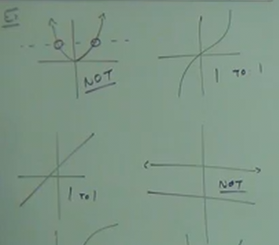
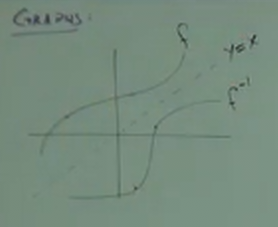

# 12.2: An Introduction to Inverse Functions

Before talking about _Inverse Functions_, we first have to talk about something
called _"One-to-One"_.

**_One-to-One_:** A function is _"One-to-One"_ if each input has a _UNIQUE_
output.

**Ex:**

Let's say we have a function that has only $4$ points:

$$ \{(7, 3), (-1, 1), (5, 0), (4, -2)\} $$

Here, let's assume that our _input_ is the $x$ coordinate of each point, and the
$y$ coordinate is the _output_ of each point.

When considering if our function is _"One-to-One"_, we ask ourselves, "is each
output of the above function _UNIQUE_?". In this situation it, is therefore the
above function is considered _"One-to-One"_.

And let's say we have another function to compare it to:

$$ \{(-3, 2), (6, 3), (2, 14), (-6, 2)\} $$

Here, the output, $2$, is produced _twice_ from our functions (i.e. $(-3, 2)$
and $(-6, 2)$). Thusly our function, in this case is _NOT_ _"One-to-One"_.

Keep in mind that if our _inputs_ were the same (and produced different
outputs), then this would _NOT_ represent a _function_ (since the definition of
a function is that given a specific input, it will _ALWAYS_ produce the same
_output_).

---

Now, we can talk about this according to the _Horizontal Line Test_. We have
already had something called the _Vertical Line Test_.

The _Vertical Line Test_ tells us whether our outputs are the results of a
_Function_ or not.

The _Horizontal Line Test_ will tell you whether those outputs are the result of
a _"One-to-One"_ function or not.

Let's refresh our memory on the _Vertical Line Test_. This test says that "If
you draw vertical lines throughout your graph and it ever hits more than _one_
point on the graph, it is NOT a Function."

The _Horizontal Line Test_ is similar. This test says that "If you draw
horizontal lines throughout your graph it ever hits more than _one_ point on the
graph, it is NOT a One-to-One Function."

The reason for this is because we have the _same output twice or more times_.

---

**Inverse Functions**

An Inverse Function is a Function that has an _Inverse_ _If And Only If_ it is
_"One-to-One"_ Function.

**Note:**

Inverses are Functions that "Undo" each other.

For a Function, $f$, the _Inverse_ is Denoted: $f^{-1}$ and is also
"_One-to-One_".

**Ex:**

$$ f = \{(2, -4), (-1, 13), (0, 0), (7, 8)\} $$

$$ f^{-1} = \{(-4, 2), (13, -1), (0, 0), (8, 7)\} $$

In essence the _Inverse_ function, $f^{-1}$, simply "swaps" or "flips" the
_inputs_ and _outputs_ of our original function, $f$.

To find an _Inverse_, switch the $x$ and $y$. (This _undoes_ what was done).

**Ex:**

Most of the time though, we'll be presented with a standard Algebraic function
like so:

$$ f(x) = x - 6 $$

To find the _Inverse_ of this function, we have to follow some steps:

**Steps:**

1. Write as $y =$ instead of $f(x) =$

$$ y = x - 6 $$

2. Switch $x$ and $y$

$$ x = y - 6 $$

3. Solve for $y$

$$ x + 6 = y $$

4. Write $y$ as the _Inverse_ function $f^{-1}(x)$

$$ f^{-1}(x) = x + 6 $$

---

**Practice:**

$$ f(x) = 7 - x $$

$$ y = 7 - x $$

$$ x = 7 - y $$

$$ x - 7 = -y $$

$$ -1(x - 7) = -1(-y) $$

$$ -x + 7 = y $$

**Solution:**

$$ f^{-1}(x) = -x + 7 $$

---

**Practice:**

$$ g(x) = 2x + 3 $$

$$ y = 2x + 3 $$

$$ x = 2y + 3 $$

$$ x - 3 = 2y $$

$$ \frac{x - 3}{2} = y $$

**Solution:**

$$ g^{-1}(x) = \frac{x - 3}{2} $$

---

**Practice:**

$$ h(x) = 5x + 2 $$

a$ y = 5x + 2 $$

$$ x = 5y + 2 $$

$$ x - 2 = 5y $$

$$ \frac{x - 2}{5} = y $$

**Solution:**

$$ h^{-1}(x) = \frac{x - 2}{5} $$

---

**Practice:**

$$ f(x) = \frac{x - 2}{3} $$

$$ y = \frac{x - 2}{3} $$

$$ x = \frac{y - 2}{3} $$

$$ 3x = y - 2 $$

$$ 3x + 2 = y $$

**Solution:**

$$ f^{-1}(x) = 3x + 2 $$

---

**Graphs**

So what do these _Inverse Functions_ look like graphically? If I take any
function:

First and foremost, is this a function? (see _Vertical Line Test_). Yes, it is a
_Function_. Secondly, is this a "_One-to-One_" function? (see _Horizontal Line
Test_). Yes it is a "_One-to-One_" function.

If function is "_One-to-One_", it has an _Inverse_.

When thinking on how this _Inverse Function_ will look graphically, keep in mind
that we are simply "flipping" the $x$ and $y$ coordinates. This means that along
an axis plane (known as the _"$y=x$ line"_), the graph will also "flip",
essentially creating a "reflection" of our original function:

---

**How to determine if two functions are inverses of each other.**

**Note:**

The _Composition_ of a _Function_ and its _Inverse_ must equal $x$.

$$ (f \circ f^{-1})(x) = x $$

Or also:

$$ (f^{-1} \circ f)(x) = x $$

---

**Ex:**

$$ f(x) = 2x - 5, f^{-1}(x) = \frac{x + 5}{2} $$

This is what needs to be true if the two above are truly inverses:

$$ (f \circ f^{-1})(x) = x $$

Let's simplify our statement:

$$ (f \circ f^{-1})(x) = f(f^{-1}(x)) $$

$$ (f \circ f^{-1})(x) = f(f^{-1}(x)) = f(\frac{x + 5}{2})$$

$$ (f \circ f^{-1})(x) = f(f^{-1}(x)) = 2(\frac{x + 5}{2}) - 5 $$

$$ (f \circ f^{-1})(x) = f(f^{-1}(x)) = x + 5 - 5 $$

$$ (f \circ f^{-1})(x) = f(f^{-1}(x)) = x $$

**Solution:**

$$ (f \circ f^{-1})(x) = x $$

And thusly we have determined that indeed, $f^{-1}$ is the _Inverse_ of $f$.

---

**Ex:**

$$ f(x) = 2x - 5, f^{-1}(x) = \frac{x + 5}{2} $$

But we can also use the following formula to determine if $f^{-1}$ is the
_Inverse_ of $f$.

$$ (f^{-1} \circ f)(x) = x $$

$$ (f^{-1} \circ f)(x) = f^{-1}(f(x)) $$

$$ (f^{-1} \circ f)(x) = f^{-1}(2x - 5) $$

$$ (f^{-1} \circ f)(x) = \frac{(2x - 5) + 5}{2} $$

$$ (f^{-1} \circ f)(x) = \frac{2x - 5 + 5}{2} $$

$$ (f^{-1} \circ f)(x) = \frac{2x}{2} $$

$$ (f^{-1} \circ f)(x) = x $$

And thusly we have determined that indeed, $f$ is the _Inverse_ of $f^{-1}$.
