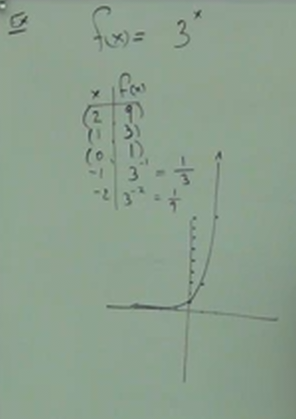
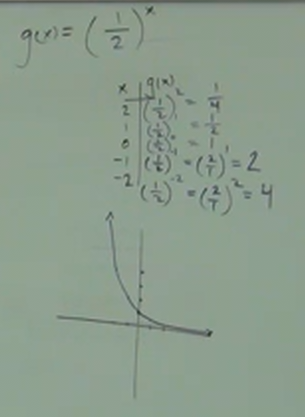
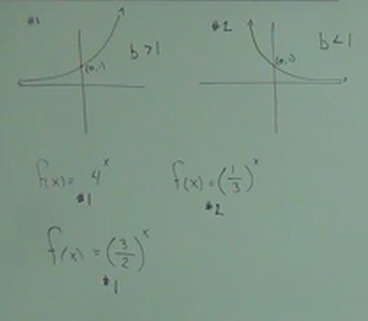
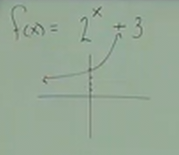
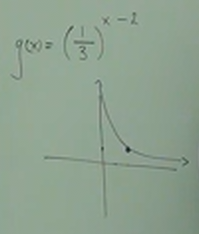

# 12.3: Graphing and Solving Exponential Functions

**Exponential Functions**

Every exponential is of this form:

$$ b^x $$

Where $b$ is the _Base_ that doesn't change, and is _always greater than $0$_.

And $x$ is the _Exponent_.

Thusly an _Exponential Function_ will take this form:

$$ f(x) = b^x $$

---

So how do these _Exponent_ Functions_ look graphically?

$$ f(x) = 3^x, g(x) = (\frac{1}{2})^x $$

| x  | f(x) |
| -- | ---- |
| 2  | 9    |
| 1  | 3    |
| 0  | 1    |
| -1 | 1/3  |
| -2 | 1/9  |

We see our graph grow (incline) exponentially when $b > 1$.

Note how the graph grows very quickly once it crosses the $y$-axis. Also note
how slowly it grows from the $x$-axis. Also note that our $x$ coordinate will
_Never be negative nor $0$_. This graph is what is known as being "_asymptotic
to the $x$-axis"_.

| x  | g(x) |
| -- | ---- |
| 2  | 1/4  |
| 1  | 1/2  |
| 0  | 1    |
| -1 | 2    |
| -2 | 4    |

We see our graph shrink (decline) exponentially when $b < 1$.

---

To hammer home this point, consider the following image, which demonstrates the
importance of our _Base_ in how our _Exponential Functions_ will graph:

As was demonstrated in Chapter 8, we can indeed shift our graphs around.
Consider the following _Exponential Function_:

$$ f(x) = 2^x + 3 $$

As anticipated, this means that we can expect to have an exponential incline in
our graph due to the _Base_ being $2$. Also consider that the $3$ indicates that
we will _shift_ _up_ $3$ units along the $y$-axis.

Recall that the exponential shift starts to "accelerate" usually at the axis,
$(0, 1)$ due to the fact that whenever we take a _Base_ to the power of $0$, we
get $1$.

But because we _shift_ _up_ along the $y$-axis $3$ units, this means that we
will shift when our graph starts to "accelerate" to the point, $(0, 4)$.

---

Now let's consider this next example:

$$ g(x) = (\frac{1}{3})^{x - 2} $$

Our _Base_ of $\frac{1}{3}$ indicates _decline_ in our graph.

Note that the exponent, $x - 2$ can be thought of as shifting along the
$x$-axis, as it is "inside of the function" (See Chapter 8). Recall that when
this horizontal shift is _positive_, that we shift to the _left_, and that when
this horizontal shift is _negative_, that we shift to the _right_.

Thusly we shift to the _right_ $2$ units along the $x$-axis.

If we normally cross at the coordinate $(0, 1)$, then this means that we will
now be crossing in this graph at $(2, 1)$.

---

So how do we solve these Exponentials?

**Solving:**

**Idea:**

$$ b^x = b^y $$

$$ 2^3 = 2^? $$

If our _Bases_ are equal, then our _Exponents_ must also be equal.

**Ex:**

$$ 2^x = 16 $$

If you can make your bases the same, then you know for a fact that your
exponents are going to be equal.

**Goal**:

- Make The Bases the Same.

$$ 2^x = 2^? = 16 $$

$$ 2^x = 2^4 = 16 $$

And thusly, we can "drop" our _Bases_ and solve for $x$:

$$ x = 16 $$

---

**Ex:**

$$ 5^x = 125 $$

$$ 5^x = 5^? = 125 $$

$$ 5^x = 5^3 = 125 $$

$$ x = 3 $$

---

**Ex:**

$$ 4^x = 8 $$

Here, we have to write both our sides with a _Common Base_:

$$ (2^2)^x = 2^3 $$

$$ 2^2x = 2^3 $$

$$ 2x = 3 $$

$$ x = \frac{3}{2} $$

---

**Ex:**

$$ 9^{x-1} = 27^x $$

Again, we're looking for a _Common Base_.

$$ (3^2)^{x-1} = (3^3)^x $$

$$ 3^{2x - 2} = 3^{3x} $$

$$ 2x - 2 = 3x $$

$$ -2 = x $$

---

**Practice:**

$$ 3^x = 9 $$

$$ 3^x = 3^2 $$

$$ x = 2 $$

---

**Practice:**

$$ 125^x = 25^{x-2} $$

$$ (5^3)^x = (5^2)^{x-2} $$

$$ 5^{3x} = 5^{2(x-2)} $$

$$ 3x = 2(x-2) $$

$$ 3x = 2x - 4 $$

$$ x = -4 $$

---

**Practice:**

_Hint_: Think about negative exponents for this one:

$$ (\frac{1}{4})^x = 16 $$

$$ 4^{-x} = 4^2 $$

$$ -x = 2 $$

$$ x = -2 $$

This also could be solved like so:

$$ (\frac{1}{4})^x = 16 $$

$$ (\frac{1}{2^2})^x = 2^4 $$

$$ (2^{-2})^x = 2^4 $$

$$ 2^{-2x} = 2^4 $$

$$ -2x = 4 $$

$$ x = -2 $$

---

**Interest**

$$ A = P(1 + \frac{r}{n})^{n \times T} $$

$$ A = \text{AMOUNT} $$

$$ P = \text{PRINCIPLE} $$

$$ r = \text{INTEREST RATE} $$

$$ n = \text{NUMBER OF COMPOUNDS PER YEAR} $$

$$ T = \text{TIME IN YEARS} $$

**Ex:**

> Find the amount owed at the end of $6$ years if $\$12000$ is loaned at a rate
> of $5\%$ and compounted **_monthly_** ?

$$ A = 12000(1 + \frac{0.05}{12})^{12 \times 6} $$

Note that since this word problem deals with _Dollars_, we want to ensure we are
accurate **to the penny**.

Before plugging this into our calculator, let's first determine what the value
of our exponent, $n \times T$ is:

$$ 12 \times 6 = 72 $$

Now, using our calculator, we'll dtermine the fraction part of the equation:

$$ \frac{r}{n} $$

$$ \frac{0.05}{12} $$

Now let's add the $1$ from within our parentheses:

$$ 1 + \frac{0.05}{12} $$

$$ 1 + \frac{0.05}{12} = 1.004 $$

Now take that to the power of $72$:

$$ (1 + \frac{0.05}{12})^2 = 1.349 $$

Finally, multiply by $12000$:

$$ 12000((1 + \frac{0.05}{12})^2) = 16188.213 $$

Thusly:

$$ A = \$16188.21 $$

> _Note that this is not a realistic estimate of the total amount owed for the
> car. It _would_ be accurate if you **NEVER** paid your monthly loan at all._

---

Let's change our problem statement to see what would happen if $n$, our
$\text{NUMBER OF COMPOUNDS PER YEAR}$ were **_daily_** instead:

> Find the amount owed at the end of $6$ years if $\$12000$ is loaned at a rate
> of $5\%$ and compounted **_daily_** ?

This changes our formula to:

$$ A = 12000(1 + \frac{0.05}{365})^{365 \times 6} $$

$$ A = \$16197.97 $$

Note how changing $n$, the $\text{NUMBER OF COMPOUNDS PER YEAR}$, barely changes
are total.

The interest rate, $r$, and the total time, $T$, are what _dramatically_ affect
our final total.

---

The following are the various wording for interpretations of $n$:

- Semi-Anually -> $2$
- Weekly -> $52$
- Quarterly -> $4$
- Monthly -> $12$
- Daily -> $365$
