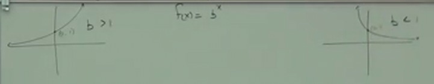
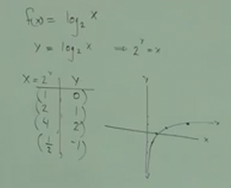
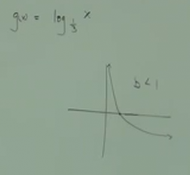

# 12.4: Introduction to Graphing and Solving Logarithmic Functions

Solve $f(x) = 2^x$ for an _Inverse_.

$$ f(x) = 2^x $$

$$ y = 2^x $$

$$ x = 2^y $$

But how do we now solve for $y$?

This is where we'll need what is known as a _Logarithm_.

Specifically using what is known as _Logarithmic Notation_.

If $x = b^y$, then $log_{b}x = y$.

---

In exploring _Logarithms_, let's lay down a few base rules:

$$ b = \text{BASE}, b \neq 1, b > 0 $$

$$ x > 0 $$

---

**Ex:**

$$ log_{b}x = y $$

What this means in English is:

> $y$ is the _Power_ to which the base $b$ is _Raised_ in order to get $x$

---

**Ex:**

$$ log_{3}9 = 2 $$

Can be expressed as:

$$ 3^2 = 9 $$

---

**Ex:**

$$ log_{7}49 = 2 $$

$$ 2^7 = 49 $$

---

**Ex:**

$$ log_{8}\frac{1}{8} = -1 $$

$$ 8^{-1} = \frac{1}{8} $$

---

**Ex:**

$$ log_{3}\sqrt{3} = \frac{1}{2} $$

$$ 3^{\frac{1}{2}} = \sqrt{3} $$

---

**Ex:**

$$ log_{12}x = 6 $$

$$ 12^6 = x $$

---

**Ex:**

$$ log_{13}y = 4 $$

$$ 13^4 = y $$

---

**Ex:**

Now let's try going backwards

$$ 9^3 = 729 $$

$$ log_{9}729 = 3 $$

---

**Ex:**

$$ 3^4 = 81 $$

$$ log_{3}81 = 4 $$

---

**Ex:**

$$ 2^{-3} = \frac{1}{8} $$

$$ log_{2}\frac{1}{8} = -3 $$

---

**Ex:**

$$ 7^{\frac{1}{3}} = \sqrt[3]{7} $$

$$ log_{7}\sqrt[3]{7} = \frac{1}{3} $$

---

**Ex:**

$$ 5^\pi = y $$

$$ log_{5}y = \pi $$

---

**Practice:**

$$ 5^{-3} = \frac{1}{125} $$

$$ log_{5}\frac{1}{125} = -3 $$

---

**Practice:**

$$ \pi^7 = x $$

$$ log_{\pi}x = 7 $$

---

Now, can you find out what some missing information is?

**Ex:**

$$ log_{2}8 = ? $$

$$ 2^? = 8 $$

$$ ? = 3 $$

---

**Ex:**

$$ log_{3}\frac{1}{9} = ? $$

$$ 3^? = \frac{1}{9} $$

$$ ? = -2 $$

---

**Ex:**

$$ log_{25}5 = ? $$

$$ 25^? = 5 $$

$$ ? = \frac{1}{2} $$

---

**Ex:**

$$ log_{2}\frac{1}{8} = ? $$

$$ 2^? = \frac{1}{8} $$

$$ ? = -3 $$

---

In order to _Solve_ a _Logarithm_ is to set it up as an _Exponential_.

Conversely, you can also _Solve_ an _Exponential_ is to use a _Logarithm_.

**Ex:**

$$ log_{2}x = 4 $$

**Solving:**

1. Write as an _Exponential_:

$$ 2^4 = x $$

2. Solve:

$$ 16 = x $$

---

**Ex:**

$$ log_{x}9 = 2 $$

$$ x^2 = 9 $$

$$ \sqrt{x^2} = \pm\sqrt{9} $$

$$ x = 3, x = -3 $$

But recall that $x$, which is our _Base_, has a few rules. Recall our rules from
before:

---

$$ log_{b}x = y $$

$$ b = \text{BASE}, b \neq 1, b > 0 $$

$$ x > 0 $$

---

Thusly, $x = -3$ _cannot_ be true. so our answer reduces to:

$$ x = 3, x \neq 3 $$

---

**Ex:**

$$ log_{7}\frac{1}{7} = x $$

$$ 7^x = \frac{1}{7} $$

$$ x = -1 $$

---

**Ex:**

$$ log_{2}1 = x $$

$$ 2^x = 1 $$

$$ x = 0 $$

Note here that our _Base_, $2$, could be _ANY NUMBER_. This establishes a
_Logarithmic Property_:

$$ log_{b}1 = 0 $$

---

**Logarithmic Properties:**

1.

$$ log_{b}1 = 0, b^0 = 1 $$

2.

$$ log_{b}b^x = x, b^x = b^x $$

3.

$$ b^{log_{b}x} = x, log_{b}x = log_{b}x $$

---

These _Logarithmic Properties_ can make solving some of our logarithms very
easy:

**Ex:**

$$ log_{6}6^3 = 3 $$

---

**Ex:**

$$ log_{11}11^{-4} =  -4 $$

---

**Ex:**

$$ 7^{log_{7}5} = 5 $$

---

**Ex:**

$$ 3^{log_{3}10} = 10 $$

---

**Practice:**

$$ log_{5}5^{-2} = -2 $$

---

**Practice:**

$$ 9^{log_{9}4} = 4 $$

---

**Graphing:**

Finding The _Inverse Function_ using _Logarithms_:

$$ f(x) = 2^x $$

$$ y = 2^x $$

$$ x = 2^y $$

$$ log_{2}x = y $$

$$ f^{-1}(x) = log_{2}x $$

_Logarithmic Functions_ follow this general form:

$$ f(x) = log_{b}x $$

A _Logarithmic Function_ is always the _Inverse_ of an _Exponential Function_.

---

Briefly, let's review graphing _Exponential Functions_:

And also let's recall that the _Inverse Function_ is simply "flipping" our graph
on the _"$y=x$ line"_.

To reiterate, the _Inverse Function_ of an _Exponential Function_ is a
_Logarithmic Function_.

---

$$ f(x) = log_{2}x $$

$$ y = log_{2}x $$

We can, of course, write any logarithm as an exponential:

$$ 2^y = x $$

| x = 2^y | y  |
| ------- | -- |
| 1       | 0  |
| 2       | 1  |
| 4       | 2  |
| 1/2     | -1 |

Note how our general rules about _Exponential Functions_ have changed. Instead
of _never crossing the $x$-axis$, like in _Exponential Functions_, _Logarithmic
Functions_ never cross the $y$-axis. Additionally, instead of defaulting to
crossing at $(0, 1)$ like for _Exponential Functions_, _Logarithmic Functions_
cross by default at $(1, 0)$.

This is for your $b > 1$.

---

$$ g(x) = log_{\frac{1}{3}}x $$

Due to time constraints, this graph will have to be approximated for
demonstration purposes:

