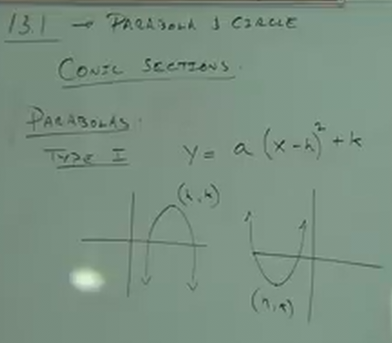
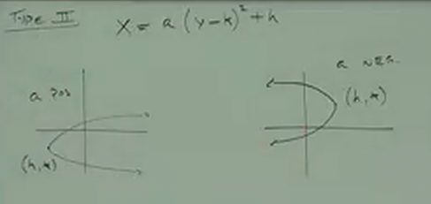
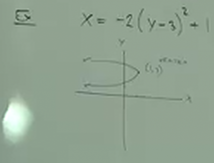
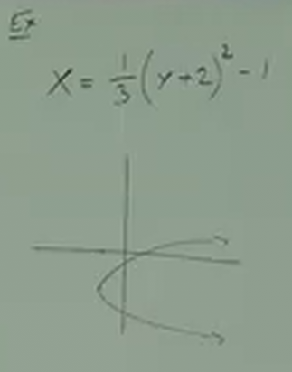
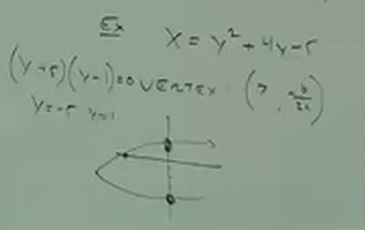
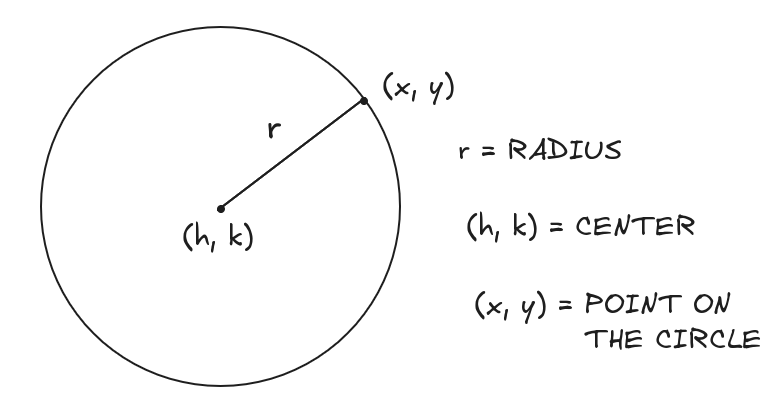
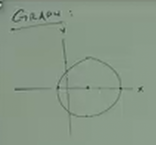
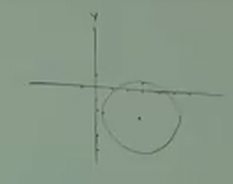
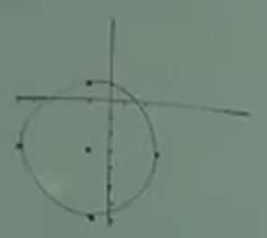

# 13.1: A Study of Conic Sections -- Parabola and Circle

**Conic Sections**

<b><ins>Parabolas:</ins></b>

**Type I:**

$$ y = a(x - h)^2 + k $$

As a brief review, recall that the above refers to a formula on how to draw a
graph.

$$ k = \text{VERTICAL SHIFT} $$

$$ h = \text{HORIZONTAL SHIFT} $$

$$ x = \text{VARIABLE REPRESENTING HORIZONTAL COORDINATE x} $$

$$ a = \text{POSITIVE OR NEGATIVE NUMBER REPRESENTING WHETHER SHAPE IS REFLECTED} $$

$$ y = \text{VARIABLE REPRESENTING HORIZONTAL COORDINATE y} $$

**Type II:**

$$ x = a(y - k)^2 + h $$

Notice the similarities here. We are essentially graphing _Parabolas_ that are
oriented along the $x$-axis instead of the $y$-axis. This is why we have
switched the $k$ and $h$ variables in the above formula, they still represent
the same _shifts_, but they are placed in different parts of the equation
because they represent the _shifts_ as they relate to the $x$ coordinate.

If $a$ is positive, then this indicates the _Parabola_ opens _to the right_ of
the graph. If $a$ is negative, then this indicates that the _Parabola_ opens _to
the left_ of the graph.

**Ex:**

$$ x = -2(y - 3)^2 + 1 $$

Note that $1$ here indicates a _Right_ shift. And the $-3$ indicates an $up$
shift. Very much how it is somewhat unintuitive when graphing $y$ (recall that a
+1 there indicates a shift _left_ along the $x$-axis), the same unintuitive
thinking applies here, where a positive number within the parentheses indicates
a shift _down_ the $y$-axis, and a negative number within the parentheses
indicates a shift _up_ the $y$-axis.

---

**Ex:**

$$ x = \frac{1}{3}(y + 2)^2 - 1 $$

---

**Ex:**

$$ x = ay^2 + by + c $$

$$ x = y^2 + 4y - 5 $$

$$ \text{X-INTERECEPT} = -5 $$

$$ \text{VERTEX} = (?, \frac{-b}{2a}) $$

---

**Circle**

A circle is a set of points a fixed distance away from some center.

> Circle: A plane figure, bounded bya single curve line called its
> circumference, every part of which is equally distant from a point within it,
> called the center. [Websters, 1913]

**Equation For Circle:**

$$ (x - h)^2 + (y - k)^2 = r^2 $$

Note the similarities in reference points to our _Parabola_ shape formulas. In
the above $h$ indeed represents _Horizontal Shift_, and because it is inside
parentheses squared, the logic behind the shift is counterintuitive. In this
case, a negative number indicates a shift _to the right_ along the $x$-axis.

Similarly, our $k$ variable represents _Vertical Shift_, and because it is
inside parentheses squared, the logic behind the shift is counterintuitive. In
this case, a negative number indicates a shift _upwards_ along the $y$-axis.

---

Finding the center of a circle:

$$ (x - 2)^2 + y^2 = 9 $$

First and foremost, how do we determine if an equation represents a circle. In
order for an equation to represent a circle, it must have some number squared
_plus_ another number squared to equal a number squared. Note that the
_addition_, the _plus_, is _NECESSARY_ for our equation to represent a circle.

$$ (x - h)^2 + (y - k)^2 = r^2 $$

$$ (x - 2)^2 + y^2 = 9 $$

$$ (x - 2)^2 + y^2 = 3^2 $$

$$ (x - 2)^2 + (y - 0)^2 = 3^2 $$

$$ \text{RADIUS} = 3 $$

$$ \text{CENTER} = (2, 0) $$

Notice that in determining the center, we didn't list it as $-2$, but rather as
$2$. This is because, for one, our formula includes the _minus_ symbol, but
thinking on this more logically, recall that our thinking inside of parentheses
is counterintuitive, we are shifting our center's $x$ axis to _the right_ when
there is a _minus_ symbol there.

---

**Ex:**

$$ x^2 + y^2 = 4 $$

$$ r = 2 $$

$$ c = (0, 0) $$

---

**Ex:**

$$ (x - 3)^2 + (y + 2)^2 = 6 $$

$$ r = \sqrt{6} $$

$$ c = (3, -2) $$

---

**Ex:**

$$ (x + 1)^2 + (y + 3)^2 = 16 $$

$$ r = 4 $$

$$ c = (-1, -3) $$

---

**Ex:**

Write the equation of a circle with center $(-2, 4)$ and radius of $9$.

$$ (x + 2)^2 + (y - 4)^2 = 9^2 $$

$$ (x + 2)^2 + (y - 4)^2 = 81 $$

---

**Ex:**

Same question, center = $(0, -3)$ and r = $5$.

$$ x^2 + (y + 3)^2 = 5^2 $$

$$ x^2 + (y + 3)^2 = 25 $$
