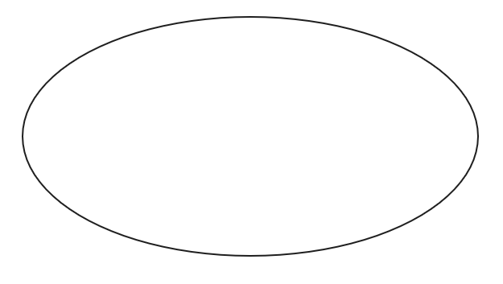
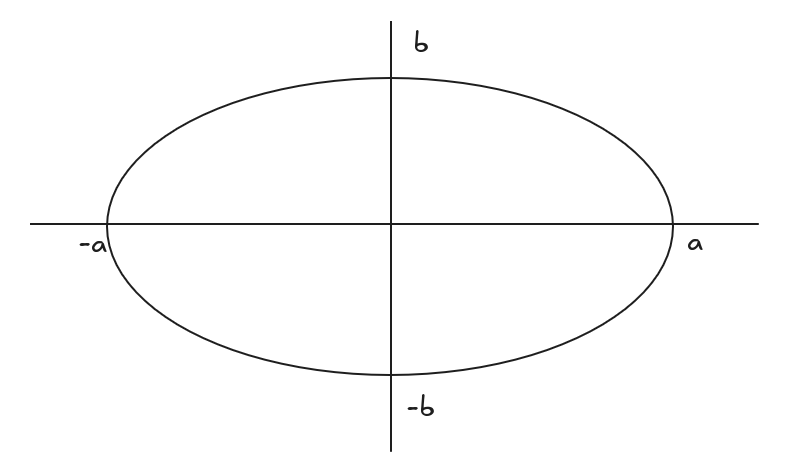
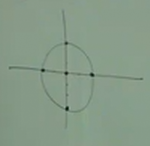
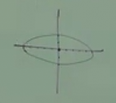
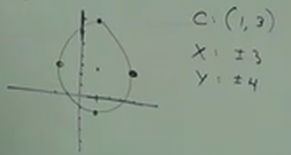
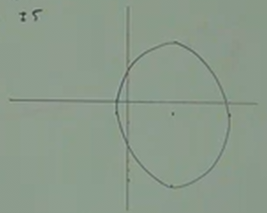
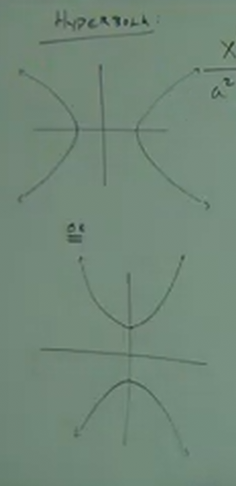
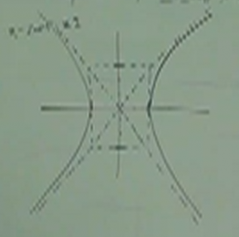
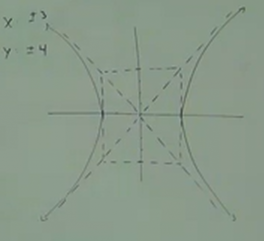
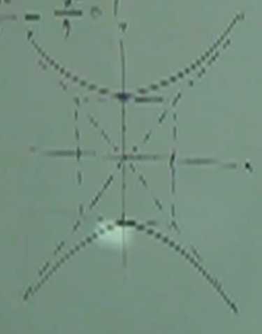

# 13.2: A Study of Conic Sections -- Ellipse and Hyperbola.

**Ellipse**

An Ellipse essentially looks like an elongated circle. It is either elongated
length-wise or height-wise.

Unlike Circles, where from the Center, we can draw it by expanding outwards by a
radius in all directions, an Ellipses does not expand outwards from center by a
fixed single number. Instead, we go out a certain direction along the $y$-axis,
and a certain direction along the $x$-axis. These directions can be represented
by the variables, $a$, $b$, $-a$, and $-b$.

**Equation For Ellipses:**

$$ \frac{x^2}{a^2} + \frac{y^2}{b^2} = 1 $$

Note that in order for this to be an Ellipse, $a$ and $b$ _must be different
numbers_. If they are the same, it is not an Ellipse, but rather, a Circle.

- $x$-intercepts are given by $\pm a$

- $y$-intercepts are given by $\pm b$

- centered at (0, 0), but can be shifted just like a Circle.

---

**Ex:**

$$ \frac{x^2}{4} + \frac{y^2}{9} = 1 $$

$$ \frac{x^2}{2^2} + \frac{y^2}{3^3} = 1 $$

$$ \text{CENTER} = (0, 0) $$

$$ \text{X-INTERCEPTS} = \pm 2 $$

$$ \text{Y-INTERCEPTS} = \pm 3 $$

---

**Ex:**

$$ 4x^2 + 25y^2 = 100 $$

This may be offputting at first, but we can indeed simplify this down to a
formula that indicates an Ellipse:

$$ \frac{4x^2 + 25y^2}{100} = \frac{100}{100} $$

$$ \frac{4x^2}{100} + \frac{25y^2}{100} = \frac{100}{100} $$

$$ \frac{x^2}{25} + \frac{y^2}{4} = 1 $$

$$ \text{CENTER} = (0, 0) $$

$$ \text{X-INTERCEPTS} = \pm 5 $$

$$ \text{Y-INTERCEPTS} = \pm 2 $$

---

$$ 9x^2 + 4y^2 = 36 $$

$$ \frac{9x^2 + 4y^2}{36} = \frac{36}{36} $$

$$ \frac{9x^2}{36} + \frac{4y^2}{36} = 1 $$

$$ \frac{x^2}{4} + \frac{y^2}{9} = 1 $$

$$ \text{CENTER} = (0, 0) $$

$$ \text{X-INTERCEPTS} = \pm 2 $$

$$ \text{Y-INTERCEPTS} = \pm 3 $$

---

**Shifting Ellipses**

$$ \frac{(x - h)^2}{a^2} + \frac{(y - k)^2}{b^2} = 1 $$

---

**Ex:**

$$ \frac{(x - 1)^2}{9} + \frac{(y -3)^2}{16} = 1 $$

$$ \text{CENTER} = (1, 3) $$

$$ \text{X-INTERCEPTS} = \pm 3 $$

$$ \text{Y-INTERCEPTS} = \pm 4 $$

---

**Ex:**

$$ \frac{(x - 4)^2}{25} + \frac{(y + 1)^2}{49} = 1 $$

$$ \text{CENTER} = (4, -1) $$

$$ \text{X-INTERCEPTS} = \pm 5 $$

$$ \text{Y-INTERCEPTS} = \pm 7 $$

---

**Hyperbola:**

**Equation For Hyperbolas:**

$$ \frac{x^2}{a^2} - \frac{y^2}{b^2} = 1 $$

Notice that the only difference between the equation for an _Ellipse_ and a
_Hyperbola_ is the changing of the addition sign $+$ to the subraction sign $-$.

Note that this function:

$$ \frac{x^2}{a^2} - \frac{y^2}{b^2} = 1 $$

Represents a _Hyperbola_ that opens up to the _left_ and _right_ along the
$x$-axis (the first graph in the image above).

If we switch the x and y parts of the equation:

$$ \frac{y^2}{a^2} - \frac{x^2}{b^2} = 1 $$

Then this represents a _Hyperbola_ that opens up to the _bottom_ and _top_ along
the $y$-axis (the second graph in the image above).

Note that in both equations, $a$ represents where the _Hyperbola_ will cross the
$x$-axis, just like with _Circles_ and _Ellipses_. And the center is determined
in a similar way to _Ellipses_.

Recall our first _Hyperbola_ equation:

$$ \frac{x^2 - h}{a^2} - \frac{y^2 - k}{b^2} = 1 $$

$$ \text{CENTER} = (h, k) $$

$$ \text{X-INTERCEPTS} = \pm a $$

$$ \text{Y-INTERCEPTS} = \text{NO Y-INTERCEPTS} $$

The reason we don't have any $\text{Y-INTERCEPTS}$ is because the _Hyperbola_ in
this case _NEVER CROSSES THE $y$-AXIS_.

Consider our other _Hyperbola_ equation:

$$ \frac{y^2 - k}{a^2} - \frac{x^2 - h}{b^2} = 1 $$

$$ \text{CENTER} = (h, k) $$

$$ \text{X-INTERCEPTS} = \text{NO X-INTERCEPTS}$$

$$ \text{Y-INTERCEPTS} = \pm b $$

Again, in this case, our _Hyperbola_ spreads _upwards_ and _downwards_ _away_
from the $x$-axis. Thusly it never crosses the $x$-axis.

---

**Ex:**

$$ \frac{x^2}{4} - \frac{y^2}{9} = 1 $$

$$ \text{CENTER} = (0, 0) $$

$$ \text{X-INTERCEPTS} = \pm 2 $$

$$ \text{Y-INTERCEPTS} = \text{NO Y-INTERCEPTS} $$

A Note here to make on the image of this _Hyperbola_:

The value of $b$ (the denominator beneath the $y^2$) is still valuable in
determining the shape of the _Hyperbola_, It determines the bounds by which our
_Hyperbola_ expands out diagonally along our graph (which the above image
demonstrates).

Thusly, you can still use $b$ to determine the shape of your _Hyperbola_ by
creating a box shape in your graph to find the diagonal lines that will help
guide the _shape of your Hyperbola_.

---

**Ex:**

$$ \frac{x^2}{9} - \frac{y^2}{16} = 1 $$

$$ \text{CENTER} = (0, 0) $$

$$ \text{X-INTERCEPTS} = \pm 3 $$

$$ \text{Y-INTERCEPTS} = \text{NO Y-INTERCEPTS} $$

---

**Ex:**

$$ 9y^2 - 16x^2 = 144 $$

$$ \frac{9y^2 - 16x^2}{144} = \frac{144}{144} $$

$$ \frac{9y^2}{144} - \frac{16x^2}{144} = 1 $$

$$ \frac{y^2}{16} - \frac{x^2}{9} = 1 $$

$$ \text{CENTER} = (0, 0) $$

$$ \text{X-INTERCEPTS} = \text{NO X-INTERCEPTS} $$

$$ \text{Y-INTERCEPTS} = \pm 4 $$

---

Don't Attempt to solve the following, just identify which shape they will create
on the graph:

---

$$ 9x^2 + 9y^2 = 81 $$

Circle with a Radius of 3.

---

$$ y^2 -4x^2 = 100 $$

Hyperbola. Along $y$.

---

$$ 5x^2 + y2 = 25 $$

Ellipse. Along $y$

---

$$ 8x^2 - 2y^2 = 72 $$

Hyperbola. Along $x$.
