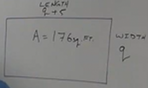
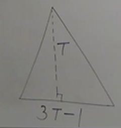
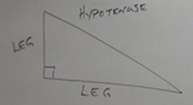

# 6.7 Word Problems

**Before Starting Any Word Problem:**

1. Read Carefully.
2. Draw a Picture (if applicable).
3. Find A Formula (if you can).
4. Verbal Model like an equation, but with words.
5. Fill in Verbal Model with variables, but use just 1 variable.
6. Solve & Interpret back to the original problem.

---

Ex.

You stand on top of a building 225 ft. tall. Obviously, you want to throw
something at the people below (rather dark of us, isn't it?). You throw a water
melon. If the height of the water melon is given by the following:

$$ h(T) = -16T^2 + 225 for\ T\ seconds $$

How long will it take for the water melon to hit the ground?

Simplified, this looks like:

$$ h(T) = -16T^2 + 225 $$

When the watermelon hits the ground, the height $h$ will be 0:

$$ 0 = -16T^2 + 225 $$

$$ 16T^2 - 225 = 0 $$

$$ (4T - 15)(4T + 15) = 0 $$

$$ (4T - 15) = 0 $$

$$ (4T + 15) = 0 $$

$$ 4T = 15 $$

$$ 4T = -15 $$

**SOLUTION:**

$$ T = \frac{15}{4} \ seconds $$

---

Ex.

The square of a number minus twice the number is $63$.

Breaking down the word problem:

"square" = "power 2"

"a number" = "a variable"

"minus" = "subtract"

"twice" = "2 *"

"the number" = "the previoulsy mentioned variable"

"is" = "equals"

$$ n^2 - 2n = 63 $$

This indicates that we should find $n$. As we can see, this is a <em>Quadratic
Equation</em>. Let's factor this out:

$$ n^2 - 2n = 63 $$

$$ n^2 - 2n - 63 = 0 $$

$b=-2$ and $a(c) = -63$.

$-9$ and $7$ factor out approrpiately via Diamond problem:

$$ (n - 9)(n + 7) = 0 $$

**SOLUTION:**

$$ n = 9 $$

$$ n = -7 $$

---

The length of a rectangle is 5 ft more than the width. The area is 176 square
feet. Find the length and the width.

    

$$ l = w + 5 $$

$$ a = l * w $$

$$ a = (5 + w) * w $$

$$ w^2 + 5w = 176 $$

$$ w^2 + 5w - 176 = 0 $$

$$ (w + 16)(w - 11) = 0 $$

**SOLUTION:**

$$ l = w + 5 $$

$$ w = 11\ ft. $$

$$ l = 16\ ft. $$

---

Ex.

I need a sail for my racing boat.

Conditions:

1. Triangular.

2. Base must be 1 foot less than 3 times the height.

3. Area must be 210sq. ft.

    

$$ b = 3h - 1 $$

$$ A = \frac{1}{2}bh $$

$$ 210 = \frac{1}{2}(3h - 1)(h) $$

$$ 420 = (3h - 1)(h) $$

$$ (3h - 1)(h) = 420 $$

$$ 3h^2 - h = 420 $$

$$ 3h^2 - h - 420 = 0 $$

$b = -1$ and $c = (-420)(3) = -1260$

<em>Hint:</em> When apart by only one on a large number, take the square root of
that number to find an approximation of the two numbers we're looking for (they
are only an order of one unit apart).

$$ 3h^2 - 36h + 35h - 420 = 0 $$

$$ 3h(h - 12) + 35(h - 12) = 0 $$

$$ (3h + 35)(h - 12) = 0 $$

$$ 3h + 35 = 0 $$

$$ 3h = -35 $$

No need to go further, result is negative, cannot exist in real space.

$$ h - 12 = 0 $$

**Solution:**

$$ h = 12\ ft. $$

$$ b = 35\ ft. $$

## Pythagorean Theorem

    

Each side of the triangle along the right angle of a right triangle is called a
"leg". If you draw a straight line from the corner that is the right angle
outwards, you will eventually encounter the enclosing boundary of the triangle,
called the hypotenuse.

This can be expressed as:

$$ a^2 + b^2  = c^2 $$

Where $a$ represents the length of one leg, $b$ representing the length of a
second leg, and $c$ representing the length of the hypotenuse.

**Consecutive Expressions:**

$$ x,\ x+1,\ x+2,\ ... $$

Where $x$ is the "start" variable.

**Consecutive Even:**

$$ 16,\ 18,\ 20,\ ... $$

$$ x,\ x+2,\ x+4,\ ... $$

<em>Note:</em> Consecutive odds can be represented by the same expression:

$$ 17,\ 19,\ 21,\ ... $$

$$ x,\ x+2,\ x+4,\ ... $$

---

Ex.

Find two consecutive odd integers whose product is $23$ more than their sum.

$$ x(x + 2) = (x + x + 2) + 23 $$

$$ x(x + 2) = 2x + 2 + 23 $$

$$ x^2 + 2x = 2x + 25 $$

$$ x^2 - 25 = 0 $$

$$ (x + 5)(x - 5) = 0 $$

**SOLUTION:**

$$ x = 5 $$

$5$ and $7$ are two consecutive odd integers whose product is $23$ more than
their sum.

---

Ex.

In a certain right triangle, whose sides are consecutive even integers. Find the
lengths.

$$ a^2 + b^2 = c^2 $$

$a = x$, $b = x + 2$, and $c = x + 4$

Therefore:

$$ x^2 + (x + 2)^2 = (x + 4)^2 $$

$$ x^2 + (x + 2)(x + 2) = (x + 4)(x + 4) $$

$$ x^2 + x^2 + 4x + 4 = x^2 + 8x + 16 $$

$$ 2x^2 + 4x + 4 = x^2 + 8x + 16 $$

$$ x^2 - 4x - 12 = 0 $$

$b = -4$ and $c = -12$.

$$ (x + 2)(x - 6) = 0 $$

**SOLUTION:**

$$ x = 6 $$
