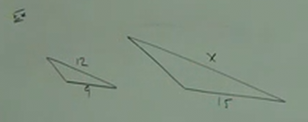
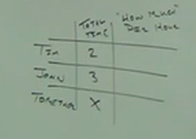
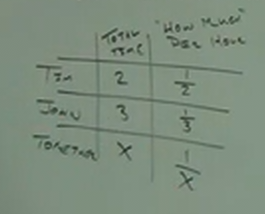
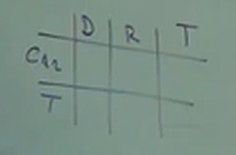
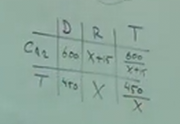

# 7.5: Using Proportions and Rational Methods in Problem Solving

---

**Ex:**

$$ \frac{3x+2}{9} = \frac{x-1}{2} $$

$$ 2(3x+2) = 9(x-1) $$

$$ 6x + 4 = 9x - 9 $$

$$ 4 = 3x - 9 $$

$$ 13 = 3x $$

<ins>Answer:</ins>

$$ x = \frac{13}{3} $$

---

**Problem Solving:**

**Ex:**

You are throwing a party. You went to the store and bought 4, 2 Liter bottles of
sodas, and it cost you $5.16. But when you get home, you realize 4 isn't going
to be enough sodas, so you go back to the store. How much will 7 more sodas cost
you?

$$ \frac{4 bottles}{7 bottles} = \frac{\$5.16}{\$x} $$

$$ 4x = 7(5.16) $$

$$ 4x = 36.12 $$

$$ \frac{4x}{4} = \frac{36.12}{4} $$

<ins>Answer:</ins>

$$ x = \$9.03 $$

**NOTE:** You also could express the original proportion like so:

$$ \frac{4 bottles}{\$5.16} = \frac{7 bottles}{\$x} $$

---

_A little bit of geometry now._

**Similar Triangles:**

A pair or group of similar triangles are two or more triangles where the
corresponding sides of the triangles are proportional (they can be different
sizes, but the proportions/ratio of the sides to each other is the same).

$$ \frac{12}{9} = \frac{x}{15} $$

$$ 9x = 12\times15 $$

$$ 9x = 180 $$

$$ \frac{9x}{9} = \frac{180}{9} $$

<ins>Answer:</ins>

$$ x = 20 $$

---

The _quotient_($\div$) of _a number_($b$) and $2$, _minus_($-$) $\frac{1}{3}$
_is_ the _quotient_($\div$) of _the number_($b$) and $6$.

$$ \frac{b}{2} - \frac{1}{3} = \frac{b}{6} $$

$$ LCD = 6 $$

$$ \frac{6}{1}\times\frac{b}{2} - \frac{6}{1}\times\frac{1}{3} = \frac{6}{1}\times\frac{b}{6} $$

$$ \frac{3}{1}\times\frac{b}{1} - \frac{2}{1}\times\frac{1}{1} = b $$

$$ 3b - 2 = b $$

$$ 3b - 2 - b = 0  $$

$$ 2b - 2 = 0 $$

$$ 2b = 2 $$

<ins>Answer:</ins>

$$ b = 1 $$

---

**Work:**

Tim and John have the same job. Time takes $2$ hours for a job. John takes $3$
hours for a job. How long would it take them if they worked together?

Thusly to calculate how long it would take them if they worked together can be
expressed with the following formula:

$$ \frac{1}{2} + \frac{1}{3} = \frac{1}{x} $$

$$ LCD = 2\times3\times x $$

$$ LCD = 6x $$

$$ \frac{6x}{1}\times\frac{1}{2} + \frac{6x}{1}\times\frac{1}{3} = \frac{6x}{1}\times\frac{1}{x} $$

$$ \frac{3x}{1}\times\frac{1}{1} + \frac{2x}{1}\times\frac{1}{1} = \frac{6}{1}\times\frac{1}{1} $$

$$ 3x + 2x = 6 $$

$$ 5x = 6 $$

<ins>Answer:</ins>

$$ x = \frac{6}{5} $$

Or

$$ x = 1\frac{1}{5} hours $$

---

**Ex:**

A car travels $600$ miles in the _same time_ that a truck travels $450$ miles.
If the car's speed is $15$ mph more than the truck's, then what are the speeds?

$$ distance = rate\times time $$

Which is the same as:

$$ time = \frac{distance}{rate} $$

$$ \frac{600}{x+15} = \frac{450}{x} $$

$$ 600x = 450(x+15) $$

$$ 600x = 450x+6750 $$

$$ 600x -450x = 6750 $$

$$ 150x = 6750 $$

$$ \frac{150x}{150} = \frac{6750}{150} $$

<ins>Answer:</ins>

$$ x = 45 hours $$
