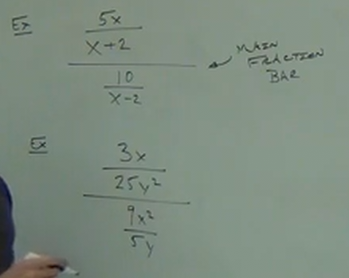

# 7.5: Introducing and Simplifying Complex Fractions

---

**Ex:**

$$ \frac{\dfrac{5x}{x+2}}{\dfrac{10}{x-2}} $$

---

**Steps:**

1. Simplify that the main numerator and the main denominator only have _one_
   fraction.

2. Set up a _division_ problem.

3. Simplify as usual.

$$ \frac{\dfrac{3x}{25y^2}}{\dfrac{9x^2}{5y}} $$

$$ \frac{3x}{25y^2}\div\frac{9x^2}{5y} $$

$$ \frac{3x}{25y^2}\times\frac{5y}{9x^2} $$

$$ \frac{3x\times 5y}{25y^2\times 9x^2} $$

$$ \frac{3x\times 1}{5y\times 9x^2} $$

$$ \frac{1\times 1}{5y\times 3x} $$

<ins>Answer:</ins>

$$ \frac{1}{15xy} $$

---

**Ex:**

$$ \frac{\dfrac{6x}{x-5}}{\dfrac{12}{x+5}} $$

$$ \frac{6x}{x-5}\div\frac{12}{x+5} $$

$$ \frac{6x}{x-5}\times\frac{x+5}{12} $$

$$ \frac{6x(x+5)}{(x-5)12} $$

<ins>Answer:</ins>

$$ \frac{x(x+5)}{2(x-5)} $$

---

**Ex:**

$$ \frac{\dfrac{x}{y^2} - \dfrac{1}{y}}{\dfrac{y}{x^2} - \dfrac{1}{x}} $$

This is actually 3 problems in one. Focus on the numerator first:

$$ \frac{x}{y^2} - \frac{1}{y} $$

$$ LCD = y^2 $$

$$ \frac{1}{1}\times\frac{x}{y^2} - \frac{1}{y}\times\frac{y}{y} $$

Which simplifies our numerator to:

$$ \frac{x-y}{y^2} $$

Now let's do the same with our denominator:

$$ \frac{y}{x^2} - \frac{1}{x} $$

$$ LCD = x^2 $$

$$ \frac{1}{1}\times\frac{y}{x^2} - \frac{1}{x}\times\frac{x}{x} $$

Which simplifies our denominator to:

$$ \frac{y}{x^2} - \frac{x}{x^2} $$

This then gives us the simplified form of our original, major fraction:

$$ \frac{\dfrac{x-y}{y^2}}{\dfrac{y-x}{x^2}} $$

Or:

$$ \frac{x-y}{y^2}\div\frac{y-x}{x^2} $$

$$ \frac{x-y}{y^2}\times\frac{x^2}{y-x} $$

$$ \frac{x^2(x-y)}{y^2(y-x)} $$

$$ \frac{x^2(x-y)}{-y^2(x-y)} $$

<ins>Answer:</ins>

$$ -\frac{x^2}{y^2} $$

---

**Ex:**

$$ \frac{2x^{-1} + 3y^{-1}}{x^{-1} - 2y^{-1}} $$

In order to solve this one, we'll need to take a brief side detour to explore
negative exponents:

---

**Negative Exponents:**

Note with negative exponents, you can always convert them to positive exponents
like so:

$$ x^{-1} = \frac{1}{x^1} $$

Here are some other examples:

$$ x^{-3} = \frac{1}{x^3} $$

Note this one:

$$ 4y^{-1} = \frac{4}{y} $$

Or this one:

$$ -3x^{-4} = \frac{-3}{x^4} $$

Here are a few more sample exercises:

$$ x^{-7} = \frac{1}{x^7} $$

$$ 5x^{-1} = \frac{5}{x} $$

$$ -7y^{-3} = \frac{-7}{y^3} $$

With this in mind, let's return to our original problem:

---

$$ \frac{2x^{-1} + 3y^{-1}}{x^{-1} - 2y^{-1}} $$

With our new knowledge of how to convert negative exponents, we can now write
this expression as such:

$$ \frac{\dfrac{2}{x}+ \dfrac{3}{y}}{\dfrac{1}{x} - \dfrac{2}{y}} $$

Now let's grab our LCDs:

Numerator LCD:

$$ LCD =  xy $$

Denomiantor LCD:

$$ LCD =  xy $$

Now we can write our numerator as:

$$ \frac{y}{y}\times\frac{2}{x} + \frac{3}{y}\times\frac{x}{x} $$

This makes our numerator:

$$ \frac{2y}{xy} + \frac{3x}{xy} $$

Now for our denominator:

$$ \frac{y}{y}\times\frac{1}{x} - \frac{2}{y}\times\frac{x}{x} $$

And this makes our denominator:

$$ \frac{y}{xy} - \frac{2x}{xy} $$

Now let's simplify our main fraction:

$$ \frac{\dfrac{2y + 3x}{xy}}{\dfrac{y - 2x}{xy}} $$

Which can also be written as:

$$ \frac{2y+3}{xy}\div\frac{y-2x}{xy} $$

And also written as:

$$ \frac{2y+3}{xy}\times\frac{xy}{y-2x} $$

Now we can simply simplify by removing the $xy$ from both the denominator and
numerator, leaving us with our answer:

<ins>Answer:</ins>

$$ \frac{2y+3x}{y-2x}$$

---

**Ex:**

$$ \frac{x^{-1} + 2xy^{-1}}{x^{-2} - x^{-2}y^{-1}} $$

$$ \frac{\dfrac{1}{x} + \dfrac{2x}{y}}{\dfrac{1}{x^2} - \dfrac{1}{x^2y}} $$

$$ LCD\_NUMERATOR = xy $$

$$ LCD\_DENOMINATOR = x^2y $$

Numerator, simplified:

$$ \frac{1}{x} + \frac{2x}{y} $$

$$ \frac{y}{y}\times\frac{1}{x} + \frac{x}{x}\times\frac{2x}{y} $$

$$ \frac{y}{xy} + \frac{2x^2}{xy} $$

$$ \frac{y + 2x^2}{xy} $$

Denominator, simplified:

$$ \frac{1}{x^2} - \frac{1}{x^2y} $$

$$ \frac{y}{y}\times\frac{1}{x^2} - \frac{1}{x^2y}\times\frac{1}{1} $$

$$ \frac{y}{x^2y} - \frac{1}{x^2y} $$

$$ \frac{y - 1}{x^2y} $$

Simplified main fraction:

$$ \frac{\dfrac{y+2x^2}{xy}}{\dfrac{y-1}{x^2y}} $$

$$ \frac{y+2x^2}{xy}\div\frac{y-1}{x^2y} $$

$$ \frac{y+2x^2}{xy}\times\frac{x^2y}{y-1} $$

<ins>Answer:</ins>

$$ \frac{x(y+2x^2)}{y-1} $$
