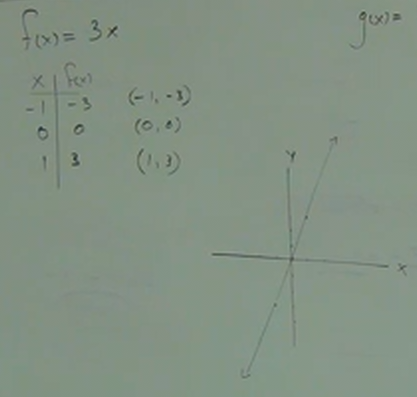
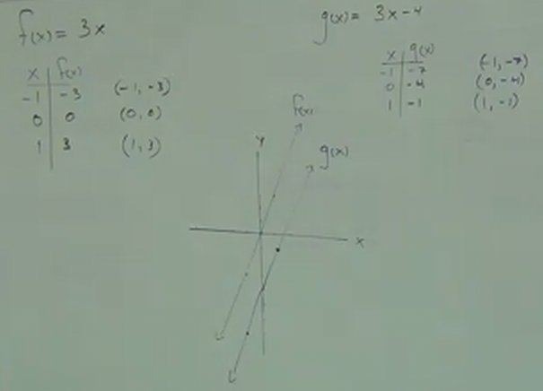
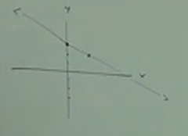
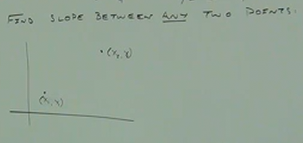
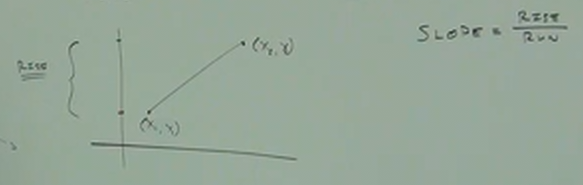

# 8.1 Graphing Lines. Equations of Parallel and Perpendicular Lines

**Introduction to Graphs:**

---

$$ f(x) = 3x $$

| x  | f(x) |
| -- | ---- |
| -1 | -3   |
| 0  | 0    |
| 1  | 3    |

---

$$ g(x) = 3x - 4 $$

| x  | g(x) |
| -- | ---- |
| -1 | -7   |
| 0  | -4   |
| 1  | -1   |

Note that all functions, when plotted on a graph, will follow what is known as
the "Vertical Line Test", which essentially means that the plotted line of
returned points will never "double back on itself" (otherwise it wouldn't be a
function).

In our examples, note that both $f(x)$ and $g(x)$ have an $x$ coordinate that is
multiplied by the same value, $3$. The following number indicates where the
plotted line will intercept the $y$ axis ($0$ for $f(x)$ and $-4$ for $g(x)$).

Because both $x$ values are multiplied by the same value, $3$, the slope is the
same, in fact $3$ represents the "slope" of our plot.

---

**Types Of Linear Functions:**

1. $$ y = mx + b $$
   - This is what is known as the "Slope-Intercept Form".
   - Where $m$ represents the slope, which for all intents and purposes
     represents an angle (a comparison of rise(vertical) over run(horizontal)):

     $$ m = SLOPE = \frac{RISE}{RUN} $$

     $$ b = Y\_INTERCEPT $$

**Ex:**

$$ y = -\frac{1}{2}x + 3 $$

$$ m = -\frac{1}{2} $$

$$ b = 3 $$

NOTE that $m$ or the "slope" indicates our "rise" and "run" here. Our "rise" is
$-1$ and our "run" is $2$, indicating we are going "down" the $y$ axis by $1$,
and "to the right" by $2$.

2.

$$ y - y_1 = m(x-x_1) $$

- This is what is known as the "Point-Slope".
  - Note that the $y_1$ subscript notation is denoting a specific point on the
    graph, _not_ a general function.

    $$ m = SLOPE = \frac{RISE}{RUN} $$

    $$ (x_1, y_1) = A\_POINT\_ON\_THE\_LINE $$

3.

$$ y = c $$

    - This is what is known as a "Constant", it indicates no slope, indicating a
    horizontal line.

    $$ m = SLOPE = 0 $$

     $$ b = Y\_INTERCEPT = (0, c)$$

---

**Ex:**

Write the equation of a line with a slope of $-2$ and a y-intercept of
$(0,\frac{3}{4})$.

$$ y = -2x + \frac{3}{4} $$

Note that this is not the usual form of standard math problems within this
domain. Usually you are taking a problem which can be expressed in "Point-Slope"
form, wher eyou are given at least one point and a slope, and it is expected for
you to express the function it in "Slope-Intercept" form.

---

Find the slope between _any

Note in the above image, to express this slope along this graph, we are
_subscripting_ two points in order to indicate they are different, but not
indicating their specific coordinate values. It is hard to see, but the
subscripting is indicating two points: $(x_1, y_1)$ and $(x_2, y_2)$.

Recall how slope is calculated:

$$ m = SLOPE = \frac{RISE}{RUN} $$

Notice that given this graph, we can determine the RISE like so:

$$ RISE = y_2 - y_1 $$

Likewise, we can determine the RUN like so:

$$ RUN = x_2 - x_1 $$

And thusly, we can determine $m$, or the $SLOPE$ like so:

$$ m = SLOPE = \frac{RISE}{RUN} = \frac{y_2 - y_1}{x_2 - x_1} $$

---

**Ex:**

Find the slope between $(3, 0)$ and $(-2, 4)$.

$$ m = \frac{4 - 0}{-2 - 3} = \frac{4}{-5} = -\frac{4}{5} $$

Note that you don't have to worry about _which_ point is subscripted as $1$ or
$2$.

---

Now let's write the above as a function.

Note that because we don't have a y-intercept (indicated by the fact that
neither our two initial points take the form of $(0, y)$. This means we can only
express our function in Point-Slope form.

$$ y - 0 = -\frac{4}{5}(x - 3) $$

Note that our choice of which point is represented by subscript $1$ matters when
expressing our function in Point-Slope form, with a preference to have any
points with the number $0$ being used for the $1$ subscript so that we can
express our function in Point-Slope form more succinctly.

---

Now we can change our Point-Slope form into Slope-Intercept form. First let's
get rid of the unnecessary 0:

$$ y = -\frac{4}{5}(x - 3) $$

Now, let's distribute our $\frac{4}{5}$ over $(x - 3)$

$$ y = -\frac{4}{5}x + \frac{12}{5} $$

---

**Ex:**

Find the slope between $(-1,2)$ and $(2,0)$ and write the equation.

$$ (x_1, y_1) = (2, 0) $$

$$ (x_2, y_2) = (-1, 2) $$

$$ RISE = 2 - 0  = 2 $$

$$ RUN = -1 - 2 = -3 $$

$$ m = SLOPE = \frac{RISE}{RUN} $$

$$ m = \frac{2}{-3} = -\frac{2}{3} $$

$$ POINT\_INTERCEPT\_FORM = y - y_1 = m(x-x_1) $$

$$ y - 0 = -\frac{2}{3}(x-2) $$

<ins>Answer:</ins>

$$ y = -\frac{2}{3}x+\frac{4}{3}$$

---

Write the equation of a horizontal line containing...

$$ (-1, 6) $$

And

$$ (6, -2) $$

Note that a _horizontal line_ indicates that there is _NO SLOPE_ and it is
always the constant of y (thusly it is indicative of our 3rd example
above).

$$ (-1, 6) $$

Can be expressed as:

$$ y = 6 $$

And also with our second example:

$$ (6, -2) $$

Can be expressed as:

$$ y = -2 $$

---

**Ex:**

Write the equation of a line containing $(-1,2)$ and _PARALLEL_ to:

$$ 3x + y = 5 $$

**Notes:**

- In order to write an equation of a line, you _must_ have a _POINT_ and a
  _SLOPE_.

1. A _POINT_ is always given.

2. Find the _SLOPE_.
   - The _SLOPE_ might be given.
   - Otherwise, you might have to calculate the _SLOPE_ <b>if</b> two points are
     given:

   $$ m = \frac{y_2 - y_1}{x_2 - x_1} $$

   - Otherwise (if the slope is not given, and only one point is given, you are
     likely given another equation, from which you will need to determine the
     slope). You can determine the slope, by taking that equation and expressing
     it in Slope-Intercept Form:

   $$ y = mx + b $$

- _PARALLEL LINES_ have the _SAME SLOPE_.
- _PERPENDICULAR LINES_ always _intersect_ at exactly _one point_, do <b>NOT</b>
  have the same slope, and create a $90\degree$ angle. In order to find
  perpendicular lines, their slopes must have two characteristics:

  1. Their slopes must be _negatives_ of each other.
  2. Their slopes must be _reciprocals_ of each other.

As a refresher, the _negative reciprocal_ of $\frac{1}{2}$ would be
$-\frac{2}{1}$.

The _negative reciprocal_ of $-\frac{3}{4}$ is $\frac{4}{3}$.

The _negative reciprocal_ of $-8$ is $\frac{1}{8}$.

Given all this, let's return to our original problem.

---

Write the equation of a line containing $(-1,2)$ and _PARALLEL_ to:

$$ 3x + y = 5 $$

Considering our above conditions for finding the slope, only one point is given,
and we are given an equation, thusly using Slope-Intercept Form, we can find $m$
our slope.

$$ y = mx + b $$

$$ y = -3x + 5 $$

Therefore, our slope, $m$, is $-3$.

If we are looking for the _PARALLEL_ slope, then it simply is the same as our
_SLOPE_. Thusly our _PARALLEL_ slope is also $-3$.

We can now write our equation of the line in Point-Slope form since we now have
a single _POINT_ and our _SLOPE_:

$$ y - y_1 = m(x-x_1) $$

Write the equation of a line containing $(-1,2)$ and _PARALLEL_ to:

$$ y - 2 = -3(x + 1) $$

And now, we express this equation in Slope-Intercept form:

$$ y - 2 = -3x - 3 $$

$$ y = -3x - 3 + 2 $$

<ins>Answer:</ins>

$$ y = -3x - 1 $$

---

**Ex:**

Write the equation of a line containing $(8, -3)$ and _PARALLEL_ to:

$$ 3x + 4y = 1 $$

Because we are only given a single _POINT_, and an equation, we must first
determine the _SLOPE_ by expressing the given equation in Slope-Intercept form.

$$ y = mx + b $$

$$ 4y = -3x + 1 $$

$$ y = -\frac{3}{4}x + \frac{1}{4} $$

Thusly our _SLOPE_ $m$ is $-\frac{3}{4}$. The initial problem statement
indicates that we are looking for an equation that expresses a line _PARALLEL_.
Thusly our _PARALLEL SLOPE_ is the same as _SLOPE_, which is $-\frac{3}{4}$.

$$ PARALLEL\_SLOPE = -\frac{3}{4} $$

We can now use our given _POINT_ to use this _PARALLEL SLOPE_ to express our
equation in Point-Intercept form.

$$ y - y_1 = m(x-x_1) $$

$$ y - (-3) = -\frac{3}{4}(x - 8) $$

And now we can express our equation in the final Slope-Intercept form:

$$ y + 3 = -\frac{3}{4}x + \frac{24}{4} $$

$$ y = -\frac{3}{4}x + 6 - 3$$

<ins>Answer:</ins>

$$ y = -\frac{3}{4}x + 3 $$

---

**Ex:**

Write an equation of a line containing $(3,4)$ and _PERPENDICULAR_ to:

$$ 2x + 4y = 5 $$

Because we are given only one point and an equation, we must use Slope-Intercept
form to determine the _SLOPE_.

$$ y = mx + b $$

$$ 4y = -2x + 5 $$

$$ y = -\frac{2}{4}x + \frac{5}{4}$$

$$ y = -\frac{1}{2}x + \frac{5}{4} $$

Thusly our _SLOPE_ is $-\frac{1}{2}$. Because the initial problem statement
indicates we are looking for an equation expressing a line _PERPENDICULAR_ to
our slope, we must determine the _negative reciprocal_ of our _SLOPE_ in order
to find the _PERPENDICULAR SLOPE_. This determines or _PERPENDICULAR SLOPE_ is
$2$.

$$ PERPENDICULAR\_SLOPE = 2 $$

We can now plug in our _PERPENDICULAR SLOPE_ into our Point-Slope form:

$$ y - y_1 = m(x-x_1) $$

$$ (x_1, y_1) = (3,4) $$

$$ y - 4 = 2(x - 3) $$

And now we can express this as the final Slope-Intercept form:

$$ y - 4 = 2x - 6 $$

$$ y = 2x - 6 + 4 $$

<ins>Answer:</ins>

$$ y = 2x - 2 $$

---

**Ex:**

Write an equation of a line containing $(8, -3)$ and _PERPENDICULAR_ to:

$$ 3x + 4y = 1 $$

$$ y = mx + b $$

$$ 4y = -3x + 1 $$

$$ y = -\frac{3}{4}x + \frac{1}{4} $$

$$ SLOPE = -\frac{3}{4} $$

$$ PERPENDICULAR\_SLOPE = \frac{4}{3} $$

$$ y - y_1 = m(x-x_1) $$

$$(x_1, y_1) = (8, -3) $$

$$ y - (-3) = \frac{4}{3}(x - 8) $$

$$ y + 3 = \frac{4}{3}x - \frac{32}{3} $$

$$ y = \frac{4}{3}x - \frac{32}{3} - 3 $$

$$ y = \frac{4}{3}x - \frac{32}{3} - \frac{9}{3} $$

<ins>Answer:</ins>

$$ y = \frac{4}{3}x - \frac{41}{3} $$
