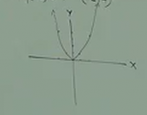
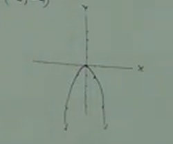
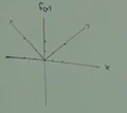
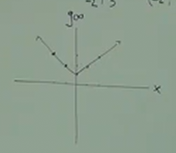
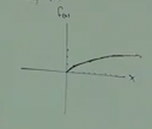
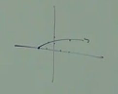

# 8.2 An Introduction to Non-Linear Functions

---

**Function Notation**

$$ f(x) $$

The above is an example of "Function Notation", which stands for a function,
whose "independant variable" is, in this case, $x$.

$$ y = 3x + 2 $$

Can also be written as:

$$ f(x) = 3x + 2 $$

Function notation has some advantages over simple expressions. For example, if
we plug $2$ in for the value of $x$, the standard expression would look like
this:

$$ y = 3x + 2 $$

$$ y = 8 $$

However, if we use Function Notation, it is clear which value $x$ is that gives
us that evaluation:

$$ f(x) = 3x + 2 $$

$$ f(2) = 8 $$

---

**Square Roots**

**Ex:**

$$ \sqrt{49} = 7 $$

$$ \sqrt{16} = 4 $$

$$ \sqrt{121} = 11 $$

$$ \sqrt{36} = 6 $$

$$ \sqrt{\frac{1}{9}} = \sqrt{\frac{\sqrt{1}}{\sqrt{9}}} = \frac{1}{3} $$

$$ \sqrt{\frac{1}{81}} = \frac{1}{9} $$

This one is a unique example in the context of this lecture:

$$ \sqrt{-64} = NO\_REAL\_SOLUTION $$

Note that the above is not possible with _real_ numbers, but is possible with
_imaginary_ numbers (to be covered later on...).

Note that the following is different due to the placement of the negative
symbol:

$$ -\sqrt{64} = -8 $$

This is essentially multiplying the square root of $64$ by $-1$.

$$ -\sqrt{144} = -12 $$

$$ \sqrt{-144} = NO\_REAL\_SOLUTION $$

---

**Non-Linear Graphs**

- Make a table, but use both positive and negative numbers.

**Ex:**

$$ f(x) = x^2 $$

| x  | f(x) | point   |
| -- | ---- | ------- |
| 2  | 4    | (2, 4)  |
| 1  | 1    | (1, 1)  |
| 0  | 0    | (0, 0)  |
| -1 | 1    | (-1, 1) |
| -2 | 4    | (-2, 4) |

This, when graphed, creates a parabola:

$$ g(x) = -x^2 $$

| x  | f(x) | point    |
| -- | ---- | -------- |
| 2  | -4   | (2, -4)  |
| 1  | -1   | (1, -1)  |
| 0  | 0    | (0, 0)   |
| -1 | -1   | (-1, -1) |
| -2 | -4   | (-2, -4) |

This, when graphed, creates an inverse parabola:

By simply multiplying our original function $f(x)$ by $-1$, like we did in the
function $g(x)$, we created what is known as a "reflection" of our graph.

---

$$ f(x) = |x| $$

| x  | f(x) | point   |
| -- | ---- | ------- |
| 2  | 2    | (2, 2)  |
| 1  | 1    | (1, 1)  |
| 0  | 0    | (0, 0)  |
| -1 | 1    | (-1, 1) |
| -2 | 2    | (-2, 2) |

When graphed, this does _NOT_ create a parabola, but rather creates a "V" shape,
a $45\degree$ angle.

$$ g(x) = |x| + 1 $$

| x  | g(x) | point   |
| -- | ---- | ------- |
| 2  | 3    | (2, 3)  |
| 1  | 2    | (1, 2)  |
| 0  | 1    | (0, 1)  |
| -1 | 2    | (-1, 2) |
| -2 | 3    | (-2, 3) |

When graphed, this also creates a "V" shape, is simply _raised_ or _shifed_ up
the y-axis:

The $ + 1$ in our function $g(x)$ is an example of _vertical shift_, where that
number will shift the y-intercept up or down depending on the value.

---

$$ f(x) = \sqrt{x} $$

| x  | f(x)      | point     |
| -- | --------- | --------- |
| 9  | 3         | (9, 3)    |
| 4  | 2         | (4, 2)    |
| 1  | 1         | (1, 1)    |
| 0  | 0         | (0, 0)    |
| -1 | undefined | undefined |
| -4 | undefined | undefined |

This creates a _half_ horizontal leaning parabola, but only on one side of the
graph (half because you cannot find a real number from square rooting a negative
number).

$$ g(x) = \sqrt{x+2} $$

| x  | g(x) | point   |
| -- | ---- | ------- |
| 2  | 2    | (2, 2)  |
| -1 | 1    | (-1, 1) |
| -2 | 0    | (-2, 0) |

This creates a similar graph, but it is "shifted" $2$ axis points to the left on
the x-axis:

