# 8.3 Study of Piecewise Functions and Basic Translations of Graphs

---

**Piecewise Functions**

**Ex:**

$$
f(x) = \begin{cases}
3x + 4, \text{ if } x < 0 \\
-x + 2, \text{ if } x \geq 0
\end{cases}
$$

This is a form of a conditional, executing two different functions depending on
if $x$ is _less than_ $0$ _OR_ if $x$ is _greater than or equal to_ $0$. Note
that there is _never_ going to be two _or equal to_ expressions as that would
cause a situation where _both_ functions could be considered for execution
(which cannot happen in a _Piecewise Function_).

Thusly, if we take:

$$ f(-4) $$

That means that $x$, which is $-4$, is _less than_ $0$, and thusly the first
line of your _Piecewise Function_ executes, plugging in $-4$ for $x$:

$$ f(-4) = 3(-4) + 4 $$

$$ f(-4) = -8 $$

Conversely if we plug in $3$ for $x$:

$$ f(3) $$

$3$ is _greater than or equal to_ $0$, and thusly the second condition of our
_Piecewise Function_ executes:

$$ f(3) = -(3) + 2 $$

$$ f(3) = -1 $$

In the case that $x$ is $0$:

$$ f(0) $$

This demonstrates why we _cannot_ have to _or equal to_ statements in our
_Piecewise Function_, that way we know that _only one_ of our conditions can be
true, and the corresponding function can execute. In this case or _greater than
or equal to_ condition is true, so our _Piecewise Function_ would execute like
so:

$$ f(0) = -(0) + 2 $$

$$ f(0) = 0 + 2 $$

$$ f(0) = 2 $$

---

**Ex:**

$$
g(x) = \begin{cases}
-4x - 2, \text{ if } x \leq 0 \\
x + 1, \text{ if } x > 0
\end{cases}
$$

$$ g(4) $$

$$ g(4) = 4 + 1 $$

$$ g(4) = 5 $$

$$ g(-2) $$

$$ g(-2) = -4(-2) - 2 $$

$$ g(-2) = 8 - 2 $$

$$ g(-2) = 6 $$

$$ g(0) $$

$$ g(0) = -4(0) - 2 $$

$$ g(0) = 0 - 2 $$

$$ g(0) = -2 $$

---

**Graphing Piecewise Functions**

**Steps:**

1. Graph the first function

Let's take our previous example of $f(x)$, our first function is:

$$ 3x + 4 $$

Recall that our y-intercept is the latter number, so our _y-intercept_ is $4$.
Our _slope_ is specifically $\frac{3}{1}$, thusly we can plot a point by
following our _slope_ from our _y-intercept_ by going _up_ 3 units on our
y-axis, and going _right_ 1 unit on our x-axis:

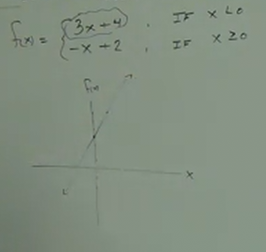

2. Erase the part of the graph that doesn't actually exist.

Basically we remove the part of our original graph path that doesn't fulfill our
_Piecewise Function_'s first condition, In this case, of the values along the
graph are _less than_ $0$, then they fulfill the condition and remain plotted,
but if they are _greater than or equal to_ $0$, then they are _erased_ from the
graph:

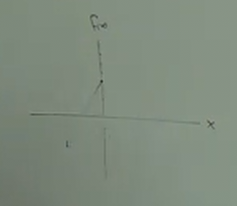

3. Repeat for the second function

So once again, we look at our _y-axis_ for a second function, which is $2$, and
our slope is $\frac{-1}{1}$ with our graph going _down_ $1$ unit on the _y-axis_
and going _right_ $1$ on the _x-axis_.

Once plotted, it will look like this:

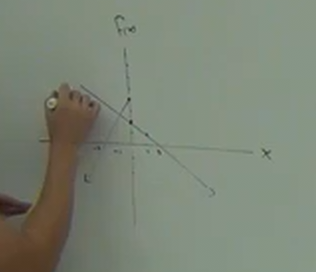

Then we go to the point where our condition for our second function executes,
which is $x \geq 0$. Note that once done, our two graphs (lines) _DO NOT CROSS_.
If you ever see your two graph lines crossing, it is likely you have done
something wrong.

Another note to make is that a graph from a _Piecewise Function_ can only have
_one_ _y-intercept_ point. The way to determine this is which of your
conditional cases _can equal_ $0$. In this case, this is our latter function.
The other graph line, therefore, can represent it _not equalling_ $0$, by
indicating it with an open or "not filled in" dot/point.

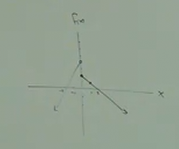

Although not entirely visible in the above image, the top graph line
(representing the plot of our first function), has an _open_ or _not filled in_
dot at it's _y-intercept_.

---

Here is the graphing of $g(x)$:

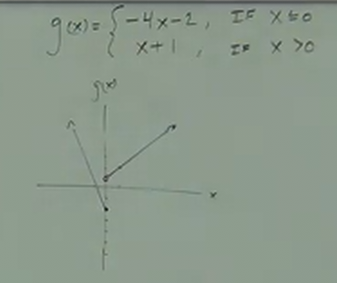

Note a couple things.

One, to reiterate, our formula is this:

$$
g(x) = \begin{cases}
-4x - 2, \text{ if } x \leq 0 \\
x + 1, \text{ if } x > 0
\end{cases}
$$

When plotting the first graph, note that we start at our _y-axis_ of $-2$, and
to just make sure you understand, the _slope_ is $\frac{-4}{1}$, where $-4$
represents the amount traveled on the _y-axis_ and the and $1$ represents the
amount traveled on the _x-axis_.

To reiterate, This is easy to forget, the _numerator_ is always the amount
traveled on the _y-axis_, while the _denominator_ is always the amount traveled
on the _x-axis_.

Otherwise, the above image should indicate the principles learned from the
previous example with $f(x)$.

---

**Basic Graphs**

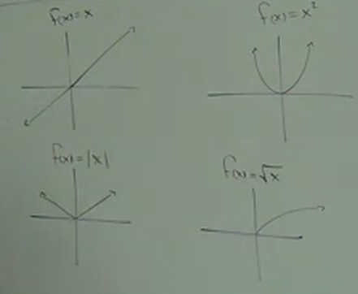

Memorize these shapes and which functions output them on the graph.

**Vertical Shift**

- If you add or subtract _at the end_ of the function, it will shift up or down.

**Ex:**

$$ g(x) = f(x) + k $$

This above example shift _up_ $k$ units.

$$ g(x) = f(x) - k $$

This above example shift _down_ $k$ units.

---

**Ex:**

$$ f(x) = x^2 $$

$$ g(x) = x^2 - 1 $$

Simple demonstration of these two above functions graphed are as follows:

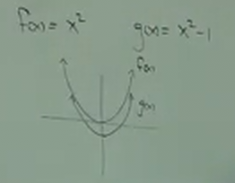

---

**Ex:**

$$ f(x) = \sqrt{x} $$

$$ g(x) = \sqrt{x} + 2 $$

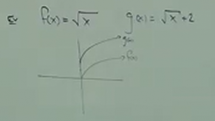

---

**Horizontal Shift**

- If you add or subtact _within the function_, the graph will shift _left_ or
  _right_ (on the x-axis).

$$ g(x) = f(x + h) $$

The above _shifts left_ $h$ units along the _x-axis_.

$$ g(x) = f(x - h) $$

The above _shifts right_ $h$ units along the _x-axis_.

---

**Ex:**

$$ f(x) = |x| $$

$$ g(x) = |x+2| $$

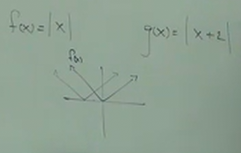

---

**Combining Shifts:**

**Ex:**

$$ f(x) = x^2 $$

$$ g(x) = (x+2)^2-1 $$

At this point, hopefully this is relatively straight forward. Our original
$f(x) = x^2$ should indicate that we have a classic _Parabola_ graph shape.
Then, with $g(x)$, we are simply shifting it along the _y-axis_ by $-1$ units or
_down_ the _y-axis_. We then look _inside_ or function by the $x$ variable, and
we see that it is shifted along the _x-axis_ by $2$, which indicates we shift
our starting point $2$ unites _left_ along the _x-axis_. Our final graphs of
both $f(x)$ and $g(x)$ should look like this:

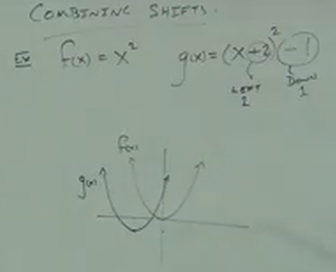

---

**Ex:**

$$ f(x) = |x| $$

$$ g(x) = |x - 2| + 3 $$

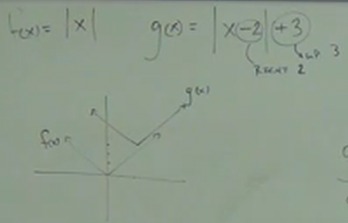

---

**Refecting Across X-Axis**

$$ g(x) = -f(x) $$

The above reflects across the _x-axis_.

---

**Ex:**

$$ f(x) = x^2 $$

$$ g(x) = -x^2 $$

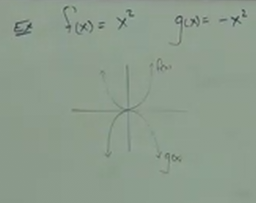

---

**Ex:**

$$ h(x) = -(x-3)^2+2 $$

Note that despite the reflection happening here (indicated by the initial
negative symbol prior to the declaration of the $x$ axis), we should still
determine the starting point per usual. Thusly we _shift up_ by $2$ due to the
last addition of $2$. We should also _shift right_ indicated by the $-3$ within
our $x$ axis function. We know it should be a _Parabola_ shape due to the
squaring of our $x$ axis function, and lastly we know it is _reflected_ due,
again, to the initial _negative_ sign prior to the $x$ axis function. The below
image should demonstrate this with the inversed parabola:

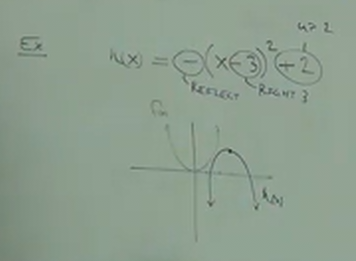

---

**Ex:**

$$ g(x) = - |x + 2| - 3 $$

$$ f(x) = -\sqrt{x - 1} + 1 $$

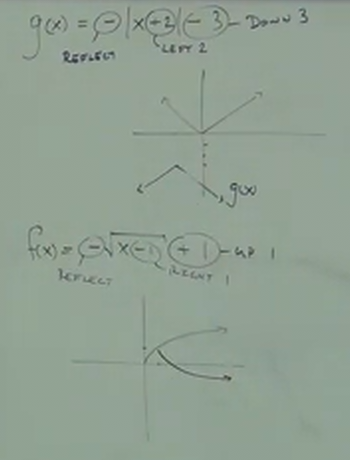
