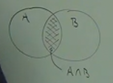
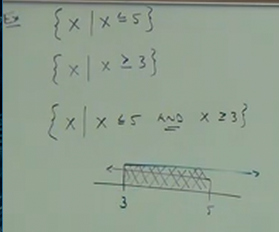
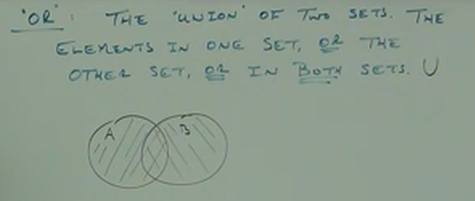

# 9.1 Compound Inequalities (Inequalities with "And" and "Or")

**Compound Inequalities**

Two inequalities joined by the words, "And" or "Or".

**And:**

"And" in this context, is the _intersection_ of two sets. The elements common to
both sets. "And", in mathematical notation is represented by the character
$\cap$.

$$ A \cap B $$

Here is a vendiagram representation of two sets, $A$, and $B$ intersecting:

---

**Ex:**

Find the intersection of these two explicitly written sets:

$$ \{1, 2, 3, 4, 5\}\cap\{3, 4, 5, 6\} = \{3, 4, 5\}$$

---

**Ex:**

Note: Recall that the $|$ symbol indicates the phrase, "such that...".

$$ A = \{x | x \text{ is an odd number and x is less than 10} \} $$

$$ B = \{1,2,3,4\} $$

$$ A \cap B = \{1,3\} $$

---

**Ex:**

$$ \{x|x\leq5\} $$

$$ \{x|x\geq3\} $$

$$ \{x|x\leq5 \text{ AND } x\geq3\} $$

Note that this expression can also be expressed as:

$$ 3 \leq x \leq 5 $$

Or, you can opt for _Interval Notation_:

Interval Notation involves the use of two different form of brackets. One is the
square brackets, $[\text{ }]$, and the other is the use of parentheses,
$(\text{ })$. The square brackets, $[\text{ }]$, are used for _inclusive_ number
sets (i.e. use of _or equal comparisons_, $\leq$, $\geq$). The parentheses,
$(\text{ })$, are used for _exclusive_ number sets (i.e. use of _greater than_
or _less than_ _comparisons_, $>$, $<$).

Thusly are previous example:

$$ 3 \leq x \leq 5 $$

Could be expressed in _Interval Notation_ like so:

$$ [3, 5] $$

If our equation, however, was _exclusive_:

$$ 3 < x < 5 $$

Then we would instead express this in _Interval Notation_ like so:

$$ (3, 5) $$

---

Brief review of solving inequalities:

**Ex:**

$$ x+3<8 $$

$$ (x+3)-3<8-3 $$

<ins>Answer:</ins>

$$ x < 5 $$

This would be expressed like so in _Interval Notation_:

$$ (-\infty, 5) $$

Note the use of parentheses instead of square brackets, this is because $\infty$
and $-\infty$ are _unknowable_ values/_nonreal_ numbers, so we cannot know if
negative infinity is included as the value of $x$ or not.

Note that even if our expression were _inclusive_:

$$ x \leq 5 $$

Our expression would still be parentheses where the $-\infty$ is:

$$ (-\infty, 5] $$

---

**Ex:**

$$ -2x-1<3 $$

$$ -2x<3+1 $$

$$ -2x<4 $$

$$ -\frac{2x}{2}<\frac{4}{2} $$

$$ -x<2 $$

When multiplying or dividing by a negative number, we _flip_ the comparison
operator:

$$ x>-2 $$

Or, in _Interval Notation_:

$$ (-2, \infty) $$

---

**Ex:**

$$ 2x+5<9 $$

$$ 2x<9-5 $$

$$ 2x<4 $$

$$ \frac{2x}{2}<\frac{4}{2} $$

$$ x<2 $$

$$ (-\infty, 2) $$

---

**Ex:**

$$ -3x-1\leq2 $$

$$ -3x\leq2+1 $$

$$ -3x\leq3 $$

$$ -\frac{3x}{3}\leq\frac{3}{3} $$

$$ -x\leq1 $$

$$ -x\times-1\leq1\times-1 $$

$$ x\geq-1 $$

$$ [-1, \infty) $$

---

**Ex:**

Let's say we adjust our previous two problems, and instead our problem statement
reads as:

$$ 2x+5<9 \text{ AND } -3x-1\leq2 $$

Then we would have both these statements as true:

$$ x < 2 $$

$$ x \geq -1 $$

This would then read as:

$$ -1 \leq x < 2 $$

Or also as:

$$ [-1, 2) $$

---

**Ex:**

$$ 4x \geq 0 \text{ AND } 2x + 4 \geq 2 $$

Solve both:

$$ 4x \geq 0 $$

$$ \frac{4x}{4} \geq \frac{0}{4} $$

$$ x \geq 0 $$

Next:

$$ 2x + 4 \geq 2 $$

$$ 2x \geq 2 - 4 $$

$$ 2x \geq -2 $$

$$ \frac{2x}{2}\geq\frac{-2}{2} $$

$$ x\geq-1 $$

Since the overlap over these two ranges starts at $0$, the final expression
reads as:

$$ x\geq0  $$

Or also as:

$$ [0, \infty) $$

---

**Ex:**

$$ 2x\leq0\text{ AND }3x+2>8 $$

$$ 2x\leq0 $$

$$ x\leq0 $$

$$ 3x+2>8 $$

$$ 3x>6 $$

$$ x>2 $$

There is no intersection. $x$ _cannot_ be both _greater than_ $2$ and also _less
than or equal to_ $0$. This amounts to what is known as an _empty set_, which
can be represented like so:

$$ \emptyset $$

Or like so:

$$ \varnothing $$

---

**Ex:**

And inequalities can often be written as compound statement:

$$ 5 < 1 - x < 9 $$

The only difference with this is that we have two different equality
comparitors, thusly if we wish to "get rid of the 1" in the middle, we must
perform the subraction of $1$ on both sides of the equality operations:

$$ 5-1<-x<9-1 $$

$$ 4<-x<8 $$

Similarly, we'll need to multiply (or divide) by $-1$ to get rid of the negative
$x$ in the middle, and just like with our other equality operation expressions,
we'll need to _flip_ our operations when performing multiplication/division on
negative numbers.

$$ -4>x>-8 $$

But notice that this is not expressed in order (from smallest to greatest).
Let's fix that:

$$ -8<x<-4 $$

And, of course, we can express this range in _Interval Notation_:

$$ (-8,-4) $$

---

**Ex:**

$$ 3 < 5 - 2x \leq 9 $$

$$ 3 - 5 < -2x \leq 9 - 5 $$

$$ -2 < -2x \leq 4 $$

$$ \frac{-2}{-2}<\frac{-2x}{-2}\leq\frac{4}{-2} $$

$$ 1>x\geq-2 $$

$$ -2\leq x<1 $$

$$ [-2,1) $$

---

**Ex:**

$$ -3\leq\frac{x}{2}+1<5 $$

$$ -3-1\leq\frac{x}{2}<5-1 $$

$$ -4\leq\frac{x}{2}<4 $$

$$ -8\leq x<8 $$

$$ [-8,8) $$

---

**OR:**

Unlike in English, "OR" in mathematics does _NOT_ mean "one or the other".
Instead it means, "one or the other _or both_". Whereas "AND" refers to what is
known as a _Intersection_, "OR" is refers to what is known as a _Union_.
Essentially, it means it includes _everything!_ _Unions/Or_ are denoted by the
$\cup$ symbol. Here is a vendiagram demonstrating this:

This is notated like so:

$$ A \cup B $$

---

**Ex:**

$$ \{1,2,3,4,5\}\cup\{3,4,5,6\} = \{1,2,3,4,5,6\}$$

---

**Ex:**

$$ A=\{x|x\text{ is an odd integer greater than 0 and less than 10 }\} $$

$$ B=\{2,3,4,5,6\} $$

Find the _Union_ of $A$ and $B$.

$$ A \cup B = \{1,2,3,4,5,6,7,9\} $$

---

**Ex:**

$$ A = \{x|x\leq1\} $$

$$ B = \{x|x\geq3\} $$

These two sets can be expressed in a single set like so:

$$ A \cup B = \{x|x\leq1\text{ OR }x\geq3\} $$

Note that this is another case where there is no intersection, but because this
is a _Union/Or_ expression, unlike an "AND" expression, we include all the
numbers in the set. We can express that like so in _Interval Notation_:

$$ A \cup B = (-\infty, 1] \cup [3,\infty) $$

---

**Ex:**

$$ 3x-2\geq10\text{ OR }x-6\leq-4 $$

Note that unlike "AND", you _CANNOT_ chain comparison operations. Thusly, for
the above, you simply solve each inequality comparison individually.

$$ 3x-2\geq10 $$

$$ 3x\geq10+2 $$

$$ 3x\geq12 $$

$$ \frac{3x}{3}\geq\frac{12}{3} $$

$$ x\geq4 $$

$$ x-6\leq-4 $$

$$ x\leq-4+6 $$

$$ x\leq2 $$

<ins>Answer:</ins>

$$ (-\infty, 2]\cup[4,\infty) $$

---

**Ex:**

$$ x-7\leq-1\text{ OR }2x-6\geq2 $$

$$ x-7\leq-1 $$

$$ x\leq-1+7 $$

$$ x\leq6 $$

$$ 2x-6\geq2 $$

$$ 2x\geq2+6 $$

$$ 2x\geq8 $$

$$ \frac{2x}{2}\geq\frac{8}{2} $$

$$ x\geq4 $$

<ins>Answer:</ins>

$$ (-\infty, \infty) $$

---

**Ex:**

$$ 8x+5\leq8\text{ OR }x-1>2 $$

$$ 8x+5\leq8 $$

$$ 8x\leq8-5 $$

$$ 8x\leq3 $$

$$ \frac{8x}{8}\leq\frac{3}{8} $$

$$ x\leq\frac{3}{8} $$

$$ x-1>2 $$

$$ x>2+1 $$

$$ x>3 $$

<ins>Answer:</ins>

$$ (-\infty, \frac{3}{8}]\cup(3, \infty) $$
