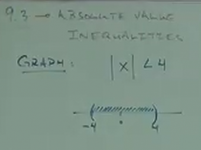

# 9.3 Solving Absolute Value Inequalities

**Graph:**

$$ |x| < 4 $$

This indicates that the value of $x$ lies anywhere between $-4$ and $4$ (but not
including $-4$ and $4$).

This can be expressed as:

$$ x>-4 \text{ AND } x<4 $$

Similar to Solving Absolute Value Equalities, we will (usually) have 2
solutions. This can be summarized as such:

Must make _TWO_ inequalities.

- One without changing any signs
- One by _changing the signs_ and _flipping_ the inequality operator

---

**Ex:**

$$ |x-2|\leq1 $$

$$ x-2\leq1 \text{ AND } x-2\geq-1$$

$$ -1 \leq x-2 \leq 1 $$

$$ 1 \leq x \leq 3 $$

<ins>Answer:</ins>

$$ [1,3] $$

Note that this signifies a short hand rule:

$$ |x| < a $$

This above expression, when using the _less than_ inequality comparison, can be
interpreted as an "AND" operation. And can be expressed/solved:

$$ -a<x<a $$

---

**Ex:**

$$ |y+1|<3 $$

$$ -3<y+1<3 $$

$$ -4<y<2 $$

<ins>Answer:</ins>

$$ (-4,2) $$

---

**Ex:**

$$ |2x-5|+2\leq9 $$

In this situation, we have to first _isolate the absolute value_ before
evaluating the rest of the expression:

$$ |2x-5|\leq7 $$

$$ -7\leq2x-5\leq7 $$

$$ -2\leq2x\leq12 $$

$$ -1\leq x\leq6 $$

<ins>Answer:</ins>

$$ [-1,6] $$

---

**Ex:**

$$ |3x-2|+5\leq9 $$

$$ |3x-2|\leq4 $$

$$ -4\leq3x-2\leq4 $$

$$ -2\leq3x\leq6 $$

$$ -\frac{2}{3}\leq x\leq2 $$

<ins>Answer:</ins>

$$ [-\frac{2}{3}, 2] $$

---

**Ex:**

$$ |5x+\frac{2}{7}|-1\leq-4 $$

$$ |5x+\frac{2}{7}|\leq-3 $$

$$ \text{NO SOLUTION} $$

---

**Ex:**

$$ |x|\geq3 $$

Because are range ranges from $-\infty$ to $-3$ and from $3$ to $\infty$, this
is an example of an "OR" expression:

$$ (-\infty, -3]\cup[3, \infty) $$

NOTE: A _greater than_ or _greater than or equal to_ expression cannot be
expressed in the same way an "AND" expression is, they must be divided up and
solved separately.

---

**Ex:**

$$ |x+2|>4 $$

$$ x+2>4 $$

$$ x>2 $$

$$ x+2<-4 $$

$$ x<-6 $$

<ins>Answer:</ins>

$$ (-\infty, -6)\cup(2, \infty) $$

---

**Ex:**

$$ |x+1|+11\geq9 $$

$$ |x+1|\geq-2 $$

You'd think this would be NO SOLUTION, but the $\geq$ operation indicates that
any number plugged into $x$ would be correct, thusly our answer is actually:

$$ (-\infty, \infty) $$

---

**Ex:**

$$ |4x+3|+5>10 $$

$$ |4x+3|>5 $$

$$ 4x+3>5 $$

$$ 4x>2 $$

$$ x>\frac{1}{2} $$

$$ 4x+3<-5 $$

$$ 4x<-8 $$

$$ x<-2 $$

<ins>Answer:</ins>

$$ (-\infty,-2)\cup(\frac{1}{2},\infty) $$

---

**Ex:**

$$ |\frac{x}{2}-3|-5>-2 $$

$$ |\frac{x}{2}-3|>3 $$

$$ \frac{x}{2}-3>3 $$

$$ \frac{x}{2}>6 $$

$$ x>12 $$

$$ \frac{x}{2}-3<-3 $$

$$ \frac{x}{2}<0 $$

$$ x<0 $$

<ins>Answer:</ins>

$$ (-\infty,0)\cup(12,\infty) $$
