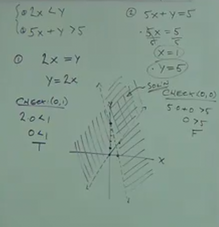

# 9.4 How to Graph Systems of Linear Inequalities

**Linear Equation:**

Two forms of linear equations:

- Standard Form:
  - $$ Ax + By = C $$

- Slope Intercept Form:
  - $$ y = mx + b $$

**Linear Inequality:**

$$ Ax+By\leq C $$

--

**Ex:**

$$ 3x+5y<15 $$

A solution is an ordered pair, $(x,y)$ that satisfies the inequality.

Does $(0,0)$ satisfy the inequality?

Yes, $0<15$ is true.

Does $(1,2)$ satisfy the inequality?

Yes, $13<15$ is true.

Does $(1,5)$ satisfy the inequality?

No, $28<15$ is false.

Does $(-2,10)$ satisfy the inequality?

No, $44<15$ is false.

**NOTE:** There's more than one solution. In fact, one entire side of the line
(called a "half-plane") is going to be our solution set.

---

**Graph:**

$$ x-y>3 $$

Is this linear? Yes, any expression where our variables are an expression to the
power of $1$ is linear.

Is this an inequality expression? Yes. It is not an equation (no $=$ sign).

How do we graph this?

**Steps:**

1. Replace the inequality sign with an equal sign _temporarily_, and then find
   the $x$ and $y$ intercepts:

   - To find the _x-intercept_, set $y=0$ and solve. (cover $y$ and write the
     rest).
   - To find the _y-intercept_, set $x=0$ and solve. (cover $x$ and write the
     rest).

2. Graph Line.

   - Use a _Dotted Line_ for $<$ or $>$.
   - Use a _Solid Line_ for $\leq$ or $\geq$.

3. Check one point _NOT_ on the line (unless it intersects the graph line, use
   (0,0) if you can).

   - If the point makes a _true_ statement, shade the half-plane that the point
     is on.
   - If the point makes a _false_ statement, shade the half-plane opposite of
     the point.

$$ x-y=3 $$

$$ x-0=3 $$

$$ x=3 $$

Above, this is our _x-intercept_.

$$ 0-y=3 $$

$$ -y=3 $$

$$ y=-3 $$

Above, this is our _y-intercept_.

**Check:** $(0,0)$

$$ 0-0>3 $$

$$ 0>3 $$

False statement, thusly we should shade the half-plane _opposite_ of the point
$(0,0)$

---

**Ex:**

$$ x-4y\leq4 $$

$$ x-4y=4 $$

$$ x-4(0)=4 $$

$$ x-0=4 $$

$$ x=4 $$

$$ x-4y=4 $$

$$ 0-4y=4 $$

$$ -4y=4 $$

$$ \frac{-4y}{-4}=\frac{4}{-4} $$

$$ y=-1 $$

_x-intercept_ is $4$, and _y-intercept_ is $-1$.

**Check:**

$$ (0,0) $$

$$ x-4y\leq4 $$

$$ 0-4(0)\leq4 $$

$$ 0-0\leq4 $$

$$ 0\leq4 $$

True statement, shade with sold line half-plane that includes point $(0,0)$.

---

**Ex:**

$$ 3x+2y>12 $$

$$ 3x+2y=12 $$

$$ 3x+2(0)=12 $$

$$ 3x+0=12 $$

$$ 3x=12 $$

$$ x=4 $$

$$ 3(0)+2y=12 $$

$$ 0+2y=12 $$

$$ 2y=12 $$

$$ y=6 $$

_x-intercept_ is $4$, and _y-intercept_ is $6$.

**Check:**

$$ (0,0) $$

$$ 3x+2y>12 $$

$$ 0+0>12 $$

False, half dotted line, shade the half-plane not including $(0,0)$.

---

**Ex:**

$$ 3x-6y\leq12 $$

$$ 3x-6y=12 $$

$$ 3x-6(0)=12 $$

$$ 3x=12 $$

$$ x=4 $$

$$ 3(0)-6y=12 $$

$$ -6y=12 $$

$$ y=-2 $$

_x-intercept_ is $4$, and _y-intercept_ is $-2$.

**Check:**

$$ (0,0) $$

$$ 3(0)-6(0)\leq12 $$

$$ 0\leq12 $$

True, include point $(0,0)$ in half plane, solid line.

---

**Ex:**

NOTE: If you have:

$$ Ax+By<0 $$

You _CANNOT_ use the standard form, you _MUST_ use _Slope-Intercept_ form.

**WRONG, USING STANDARD FORM:**

$$ y=mx+b $$

$$ y<3x $$

$$ -3x+y<0 $$

$$ -3x+0=0 $$

$$ -3x=0 $$

$$ x=0 $$

$$ -3(0)+y=0 $$

$$ 0+y=0 $$

$$ y=0 $$

**CORRECT, USING SLOPE-INTERCEPT FORM:**

$$ y<3x $$

$$ y=3x $$

$$ y=\frac{3}{1}x + 0 $$

$$ SLOPE=\frac{3}{1} $$

One point is $(0,0)$, the other is (1,3).

Since one of our points is $(0,0)$, we cannot use that point for our standard
check.

**Check:**

$$ (0,1) $$

$$ y<3x $$

$$ 1<3(0) $$

$$ 1<0 $$

False, so shade in the half-plane that does not include $(0,1)$, use a dotted
line.

---

**Ex:**

$$ x>3y $$

$$ x=3y $$

$$ 3y=x $$

$$ y=\frac{1}{3}x $$

**Check:**

$$ (0,1) $$

$$ x>3y $$

$$ 0>3(1) $$

False, shade in half-plane that does _not_ include $(0,1)$, dotted line.

---

$$ x>3 $$

$$ x=3 $$

Since there is no _y-coordinate_, this creates a vertical line parallel to the
_y-axis_, running through the _x-axis_ at $3$, dotted line, shaded on the
half-plane that is larger than the _x-axis_ at $3$.

---

$$ y\leq2 $$

$$ y=2 $$

Since there is no _x-coordinate_, this creates a horizontal line parallel to the
_x-axis_, running through the _y-axis_ at $2$, solid line, shaded on the half
plan that is smaller than the _y-axis_ at $2.

---

**Systems of Inequality**

$$
\begin{cases}
y-x\geq4 \\
x+3y\leq-2
\end{cases}
$$

**Steps:**

1. Graph each inequality, including _shading_.

2. Where the shading of the two half-planes overlaps is your solution set.

$$ y-x=4 $$

_x-intercept_ is $-4$, and _y-intercept_ is $4$.

**CHECK:**

$$ (0,0) $$

$$ y-x\geq4 $$

$$ 0\geq4 $$

False, shade the half-plane where $(0,0)$ isn't, solid line.

$$ x+3y=-2 $$

_x-intercept_ is $-2$, and _y-intercept_ is $-\frac{2}{3}$

**CHECK:**

$$ (0,0) $$

$$ x+3y\leq-2 $$

$$ 0+3(0)\leq-2 $$

$$ 0\leq-2 $$

False, shade the half-plane where $(0,0)$ isn't, solid line.

---

**Ex:**

$$
\begin{cases}
4x\leq y\\
x+3y\geq9
\end{cases}
$$

$$ 4x=y $$

_x-intercept_ is $0$, and _y-intercept_ is $0$.

**CHECK:**

$$ (0,1) $$

$$ 4x\leq y $$

$$ 4(0)\leq 1 $$

$$ 0\leq 1 $$

True, shade in, sold line, half-plane including $(0,1)$

$$ x+3y=9 $$

_x-intercept_ is $9$, and _y-intercept_ is $3$.

**CHECK:**

$$ (0,0) $$

$$ x+3y\geq9 $$

$$ 0+3(0)\geq9 $$

$$ 0\geq9 $$

False, shade in, solid line, half-plane _NOT_ including $(0,0)$.

---

**Ex:**

$$
\begin{cases}
2x<y\\
5x+y>5
\end{cases}
$$

$$ 2x=y $$

_x-intercept_ is $0$, and _y-intercept_ is $0$.

**CHECK:**

$$ (0,1) $$

$$ 2x<y $$

$$ 2(0)<1 $$

$$ 0<1 $$

True, set half-plane within point $(0,1)$, dotted line.

$$ 5x+y=5 $$

_x-intercept_ is $1$, and _y-intercept_ is $5$.

**CHECK:**

$$ (0,0) $$

$$ 5x+y>5 $$

$$ 5(0)+0>5 $$

$$ 0>5 $$

False, set half-plane _NOT_ within point $(0,0)$, dotted line.

---

**Ex:**

$$
\begin{cases}
-2x+5y<10\\
y\leq3
\end{cases}
$$

$$ -2x+5y=10 $$

_x-intercept_ is $-5$, and _y-intercept_ is $2$.

**CHECK:**

$$ (0,0) $$

$$ -2x+5y<10 $$

$$ -2(0)+5(0)<10 $$

$$ 0<10 $$

True, shade, dotted line, half-plane that includes $(0,0)$.

$$ y=3 $$

_x-intercept is $0$, and y_intercept is $3$.

**CHECK:**

$$ (0,0) $$

$$ y\leq3 $$

$$ 0\leq3 $$

True, shade, solid line, half-plane that includes $(0,0)$.
