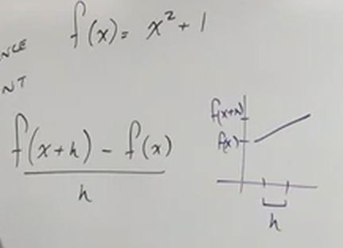

# How to Evaluate Functions (Precalculus - College Algebra 3)

[Video](https://www.youtube.com/watch?v=p1sGAHulT8w)

---

## Evaluating Functions:

$$ y = -7x + 5 \quad f(x) = -7x + 5 $$

$$ y = \frac{3}{2}x - 1 \quad g(x) = \frac{3}{2}x - 1 $$

The above are the same, the $f(x)$ and $g(x)$ are preferred as there is no
ambiguity due to the function names.

Let's take an example by plugging in a value for $x$.

$$ f(x) = -7x + 5 $$

$$ f(2) = -7(2) + 5 $$

$$ f(2) = -14 + 5 $$

$$ f(2) = -9 $$

And thusly our answer is:

$$ \boxed{(2, -9)} $$

---

When testing our functions, we want to explore whether there are some numbers
that don't work, in other words, are there domain issues? Can we plug in other
functions, in other words, function composition?

$$ h(x) = -2x^2 + x - 1 $$

$$ h(-1) = -2(-1)^2 + (-1) - 1 $$

$$ h(-1) = -2(1) - 1 - 1 $$

$$ h(-1) = -2 - 2 $$

$$ h(-1) = -4 $$

$$ \boxed{(-1, 4)} $$

$$ h(-x) = -2(-x)^2 + (-x) - 1 $$

$$ h(-x) = -2x^2 - x - 1 $$

Notice that this is the same as $h(x)$. This indicates either _even_ and _odd_
functions. We'll get to that in a few sections.

$$ h(x + 1) = -2(x + 1)^2 + (x + 1) - 1 $$

$$ h(x + 1) = -2(x + 1)(x + 1) + x + 1 - 1 $$

$$ h(x + 1) = -2(x^2 + 2x + 1) + x $$

$$ h(x + 1) = -2x^2 - 4x - 2 + x $$

$$ h(x + 1) = -2x^2 - 3x - 2 $$

---

$$ f(x) = \sqrt{x^2 - 3x} $$

$$ f(5) = \sqrt{(5)^2 - 3(5)} $$

$$ f(5) = \sqrt{25 - 15} $$

$$ f(5) = \sqrt{10} $$

$$ \boxed{(5, \sqrt{10})} $$

$$ f(0) = \sqrt{(0)^2 - 3(0)} $$

$$ f(0) = \sqrt{0 - 0} $$

$$ f(0) = \sqrt{0} = 0 $$

$$ \boxed{(0, 0)} $$

$$ f(2x) = \sqrt{(2x)^2 - 3(2x)} $$

$$ f(2x) = \sqrt{4x^2 - 6x} $$

$$ f(x + h) = \sqrt{(x + h)^2 - 3(x + h)} $$

$$ f(x + h) = \sqrt{(x + h)(x + h) - 3(x + h)} $$

$$ f(x + h) = \sqrt{x^2 + 2xh + h^2 - 3x - 3h} $$

$$ f(1) = \sqrt{(1)^2 - 3(1)} $$

$$ f(1) = \sqrt{1 - 3} $$

$$ f(1) = \sqrt{-2} $$

$$ f(1) = \sqrt{2}i $$

Note that this is not a real number and not capable of being graphed.

---

$$ g(x) = \frac{2x + 1}{x - 5} $$

$$ g(0) = \frac{2(0) + 1}{(0) - 5} $$

$$ g(0) = \frac{1}{-5} $$

$$ g(0) = -\frac{1}{5} $$

$$ \boxed{\left(0, -\frac{1}{5}\right)} $$

$$ g(x^2) = \frac{2(x^2) + 1}{(x^2) - 5} $$

$$ \boxed{g(x^2) = \frac{2x^2 + 1}{x^2 - 5}} $$

$$ g(5) = \frac{2(5) + 1}{(5) - 5} $$

$$ g(5) = \frac{10 + 1}{0} $$

$$ \boxed{\text{NO SOLUTION, DIVISION BY ZERO}} $$

$$ -g(x) = -\left(\frac{2(x) + 1}{(x) - 5}\right) $$

$$ -g(x) = -\frac{2x + 1}{x - 5} $$

---

## The Difference Quotient

$$ f(x) = x^2 + 1 $$

$$ \frac{f(x + h) - f(x)}{h} $$

This difference quotient is a part of precalculus, but indicates something
you'll learn in Calculus I, which is that inputs can determine a slope between
two functions, in this case two functions are divided by $h$, because they show
the formula for calculating the _rise_ over the _run_:

The main goal is to simplify and cancel out the $h$.

$$ f(x + h) = (x + h)^2 + 1 $$

$$ f(x + h) = (x + h)(x + h) + 1 $$

$$ f(x + h) = x^2 + 2xh + h^2 + 1 $$

$$ \frac{(x^2 + 2xh + h^2 + 1) - (x^2 + 1)}{h} $$

$$ \frac{x^2 + 2xh + h^2 + 1 - x^2 - 1}{h} $$

$$ \frac{2xh + h^2}{h} $$

$$ \frac{h(2x + h)}{h}$$

$$ \boxed{2x + h} $$
