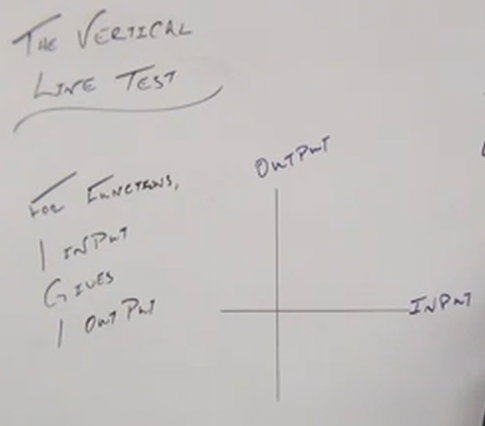
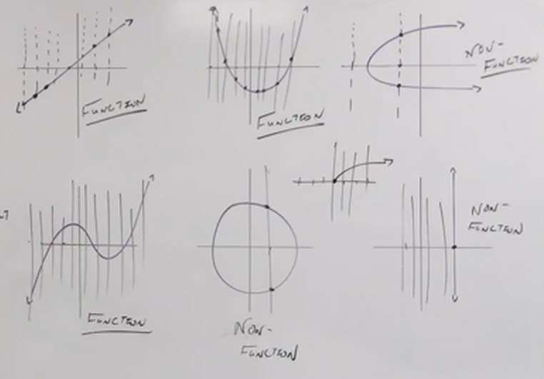

# Using the Vertical Line Test (Precalculus - College Algebra 6)

[Video](https://www.youtube.com/watch?v=7j6kh8Z2H90)

The vertical line test is a method by which we can determien whether a graph or
line is representative of a function or not.

If our graph has more than one output for any one input, then it is a
_non-function_.

This is better explained visually:

