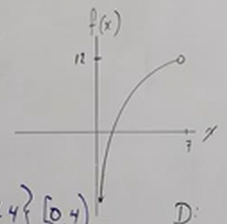

# Features of Graphs, Domain, Range (Precalculus - College Algebra 7)

[Video](https://www.youtube.com/watch?v=d3b-4Zz65ZE)

---

Graphs are a representation that satisfies a function that you're given. On a
typical graph, we have a visual representation of what is supposed to be an
_infinite number of ponits_. What is typically asked within the realm of algebra
and calculus is what are the relations of some _specific points_.

---

## Features of Graphs, Points, Domain, and Range

Consider the following graph of the function $f(x)$:

If we were asked to find the point $f(0)$ on this graph, we could represent that
as:

$$ f(0) = 5 $$

Which is also noted as the specific point $(0, 5)$.

Typical questions in regards to finding specific outputs, usually are
represented by plugging in values for $x$ in order to find values for $f(x)$.

$$ f(-6) = -3 $$

---

Consider also the following questions in regards this graph:

> Is $f(3)$ positive or negative?

The answer is there on the graph, the answer is _positive_ as you can see on the
graph, it lies at $(3, 4)$.

---

> Is $f(8)$ positive or negative?

This one is very obvious as it is not only graphed by highlighted for us with
the specific point graphed. The answer is _negative_ as it sits at $(8, -3)$.

---

> For what "$x$" is $f(x) = 0$?

Consider that all points are represented as $\left(x, f(x)\right)$. Instead of
solving for $f(x)$ like we have previously, we are now being asked to solve for
$x$. In this case we have three points that output $f(x) = 0$ along our graph,
they are $-4$, $6$, and $10$. This can be properly demarcated as:

$$ \left\{(-4, 0), (6, 0), (10, 0)\right\}  $$

---

> For what "$x$" is $f(x) > 0$?

The statement above is a common phrasing of a math problem, but it might be
better worded as "For what $x$-axis is your graph positive?" Consider the
following image of our adjustment graph, where the squigly line indicates the
range along the $x$-axis where the graph is positive (_i.e._ the output, $f(x)$
is positive).

This indicates that the _interval_ along the $x-axis$ from $-4$ to $6$ will
yield positive outputs for $f(x)$. We can write this as:

$$ -4 < x < 6 $$

Notice that we _can't write this with a $\leq$ sign, as the original question
didn't write it as:

> For what "$x$" is $f(x) \geq 0$?

Thusly when it hits the $x$-axis at 0, we write this range without the "or equal
to" version.

We can also write this as _interval notation_, albeit it looks confusing as it's
written form can be confused as representing a point:

$$ (-4, 6) $$

Note at this point there is a second interval where the outputs are positive
(towards the very right hand side of the graph).

This means we adjust our answer to include this range as well like so:

$$ -4 < x < 6, \quad 10 < x < 11 $$

And we adjust our interval notation as well:

$$ (-4, 6) \cup (10, 11) $$

---

> For what "$x$" is $f(x) < 0$?

This is the same question as the previous, but in reverse.

We take our leftmost plotted point that is below the $x$-axis, which in this
case is represented at $(-6, -3)$, and follow it until the graph rises above the
$x$-axis, which happens at $(-4, 0)$. This also happens from $6$ to $10$ on the
right hand side of the graph. Note that we start this range where we cross from
$(6, 0)$ as this is where $f(x)$ becomes negative again, and we end it at
$(10, 0)$ as this is where $f(x)$ becomes positive again.

Thusly our first range can be represented like so:

$$ -6 < x < -4, \quad 6 < x < 10 $$

Or in interval notation:

$$ (-6, -4) \cup (6, 10) $$

---

**Domain**

Let's revisit the definition of the _Domain_. Essentially the domain is defined
as "What section of the $x$-axis does my graph cover?"

In the case of our entire graph we've been using thus far, we can represent this
with the following notation:

$$ \text{D: } \left\{x | -6 \leq x \leq 11 \right\} $$

Notice here that we are using $\leq$ instead of $<$ signs. Why? Well the when
asked to define the _Domain_ of a function, we are essentially asking, "Give me
_every_ value of $x$ that gives me an output." This means we use these "or equal
to" signs in order to signify that these values for $x$ (_i.e._ $-6$ and $11$)
produce an output that lies within our _Domain_. In other words, these values
are _inclusive_. This can also be demarcated in _interval notation_ like so:

$$ [-6, 11] $$

In which the square brackets indicate _inclusivity_ of the values represented as
well.

---

**Range**

When asked to define the _Range_ of a function, you are essentially tasked with
"representing the section of the $y$-axis the graph covers". So first look, what
is the lowest representation of $f(x)$, or, what is the lowest point represented
on the graph along the $y$-axis? In this case our two lowest points are
$(-6, -3)$ and $(8, -3)$. Thusly, our _Range_ starts at $-3$. What about the
highest value? Well, that is represented by a single point, $(0, 5)$, thusly the
_Range_ ends at $5$.

We can represent this like so:

$$ \text{R: } \left\{f(x) | -3 \leq f(x) \leq 5 \right\} $$

Or in _interval notation_ like so:

$$ [-3, 5] $$

---

**$x$-intercepts**

What about finding the $x$-intercepts? Here we are simply being asked to find
the points where our graph crosses the $x$-axis. A simple quick look at our
graph indicates that the following points are the $x$-intercepts:

$$ x\text{-intercepts: } \left\{(-4, 0), (6, 0), (10, 0)\right\} $$

---

**$y$-intercept**

What about finding the $y$-intercept? Notice here that we _don't use the plural_
when referring to the $y$-intercept. The reason why is because a function that
has multiple $x$ inputs that give the same $f(x)$ output would indicate that we
have a _non-function_.

Our $y$-intercept in this case crosses at $5$ along the $y$-axis. Thusly we can
simply say:

$$ y\text{-intercept: } (0, 5) $$

---

**How Many Times Does $y = 2$ cross the graph?**

For this we can simply draw a horizontal line across our graph that crosses $y$
at $2$:

Note the dotted line and the open circles indicating $y = 2$ with the dotted
line and the open circles representing where our graph crosses at $y = 2$. In
this case, we are not asked what the values for $x$ are at $y = 2$, but rather
more simply, how many times it crosses $y = 2$. As you can see, it crosses
exactly $2$ times, and that is our answer.

---

> For what $x$ does $f(x) = 3$?

Simply put, do we have some points where $y = 3$ or $f(x) = 3$? Yes,
specifically we have:

$$ \left\{(-2, 3), (4, 3)\right\} $$

---

> For what $x$ does $f(x) = -3$?

Same idea, just for $f(x) = -3$ instead.

$$ \left\{(-6, -3), (8, -3)\right\} $$

---

## Domain and Range Revisited

Let's do some exercises to really hammer home our understanding of the Domain
and Range in different graph contexts.

---

Consider the following graph:

Here, we are asked to give the _Domain_ and the _Range_ of this graph.

When asked about our _Domain_, we are asking what set of points are included
along the $x$-axis. In this case, our range goes from $-\pi$ to $\pi$. This can
be represented like so;

$$ \text{D: } \left\{x | -\pi \leq x \leq \pi \right\} $$

Or in _interval notation_:

$$ [-\pi, \pi] $$

Our range is doing the same kind of analysis, just along the $y$-axis or
$f(x)$-axis. Thusly our _Range_ in this case can be represented as:

$$ \text{R: } \left\{f(x) | -1 \leq f(x) \leq 1 \right\} $$

Or in _interval notation_ like so:

$$ [-1, 1] $$

---

Consider the following graph:

Again, we are asking for the _Domain_ and _Range_ of this graph.

Notice that the arrows point _infinitely_ in both directions.

When finding the _Domain_, this means we are looking at all points included in
our graph that are along the $x$-axis. This is infinite in both directions, and
thusly are _Domain_ can be defined as:

$$ \text{D: } \left\{x | -\infty < x \infty \right\} $$

Also notice that whenever representing positive of negative infinity, we _cannot
include_ the infinity representations (whether positive or negative) themselves.
Hence why we use the $<$ symbol rather than the $\leq$ symbol.

This can also be represented in _interval notation_ like so:

$$ (-\infty, \infty) $$

When determining the _Range_, we might think that this covers the entirety of
the $y$-axis, but that is not the case. If we look at the graph, we notice that
the graph runs along the $x$-axis, but never actually touches it. This indicates
that this is a _Horizontal Asymptote_, and thusly our graph will never have a
$y$ value that _equals to 0 or is negative_, note that it will get _very_ close
to $0$, but it will never include $0$.

$$ \text{R: } \left\{f(x) | 0 < y < \infty \right\} $$

Also written in _interval notation_ like so:

$$ (0, \infty) $$

---

Consider the following graph:

Here, notice the black and white dots, the leftmost dot is filled in black while
the rightmost dot is filled in white. The black dot indicates that we _include_
this point_, while the white dot indicates that we _exclude_ this point. Also
notice the lack of arrows, indicating that our graph does not expand out towards
negative or positive infinity.

We can therefore represent our Domain like so:

$$ \text{D: } \left\{0 \leq x < 4 \right\} $$

Where $0$ is the point along the $x$-axis that is _included_ in our _Domain_,
while where the graph ends along the $x$-axis at $4$, this point runs up to, but
_does not include_ $4$. In interval notation, we can demarcate this as such:

$$ [0, 4) $$

What about our _Range_? The inclusivity and exclusivity rules still apply here,
just along the $y$-axis instead. Thusly our _Range_ can be represented as:

$$ \text{R: } \left\{f(x) | 0 \leq f(x) < 5 \right\} $$

Or in interval notation as:

$$ [0, 5) $$

---

Consider the following graph:

This time our graph does veer off towards negative infinity along the $y$-axis,
indicating that we have a _Vertical Asymptote_ along the $y$-axis. We also have
an _exclusive_ point at $(7, 12)$. We can define our _Domain_ as such:

$$ \text{D: } \left\{x | 0 < x < 7 \right\} $$

Or in _interval notation_ as:

$$ (0, 7) $$

What about our _Range_?

$$ \text{R: } \left\{f(x) | -\infty < f(x) < 12 \right\} $$

Or in _interval notation_ as:

$$ (-\infty, 12) $$

---

## Working without Graphical Representations of Functions.

Consider the following function:

$$ f(x) = \frac{x + 2}{x - 6} $$

---

Can we still find points? Such as:

$$ f(1) =  $$

Here we are simply looking for $f(x)$ when $x = 1$, which we can easily do by
plugging it in:

$$ f(1) = \frac{(1) + 2}{(1) - 6} $$

$$ f(1) = \frac{3}{-5} \rightarrow -\frac{3}{5} $$

$$ \boxed{\left(1, -\frac{3}{5}\right)} $$

---

Or what about the other way around? Can we find $x$ instead when given an
equation?

$$ f(x) = 2 $$

Certainly, here is how we would solve this:

$$ 2 = \frac{x + 2}{x - 6} $$

$$ 2(x - 6) = x + 2 $$

$$ 2x - 12 = x + 2 $$

$$ x = 14 $$

$$ \boxed{(14, 2)} $$

---

What about finding the _Domain_? Well recall that we are concerned in this case
with _square roots_, _logarithms_, and _denominators_, which affect our
_Domain_. In this case we have a _denominator_, which as we have covered in
previous sections _cannot equal_ $0$. Let's solve for when our denominator would
be $0$:

$$ x - 6 = 0 $$

$$ x = 6 $$

This the number that $x$ _cannot_ be, as it would give us a divide by zero
error. Therefore we can write our domain to specifically exclude this number
like so:

$$ \text{D: } \left\{x | x \neq 6 \right\} $$

Or in interval notation as:

$$ (-\infty, 6) \cup (6, \infty) $$

---

What about finding $x$-intercepts? To find $x$-intercepts, recall that these are
the points at which the graph crosses the $x$-axis, in other words, when $f(x) =
0$:

$$ f(x) = 0 $$

$$ 0 = \frac{x + 2}{x - 6} $$

$$ 0 = x + 2 $$

$$ -2 = x $$

We can represent this as:

$$ x\text{-intercepts: } \left\{(-2, 0)\right\} $$

---

Similarly, we can find our $y$-intercept through a similar process. In this
case, we are looking for when $f(x)$ when $x = 0$:

$$ f(x) = \frac{(0) + 2}{(0) - 6} $$

$$ f(x) = \frac{2}{-6} \rightarrow -\frac{1}{3} $$

And this can be written out as:

$$ y\text{-intercept: } \left(0, -\frac{1}{3}\right) $$
