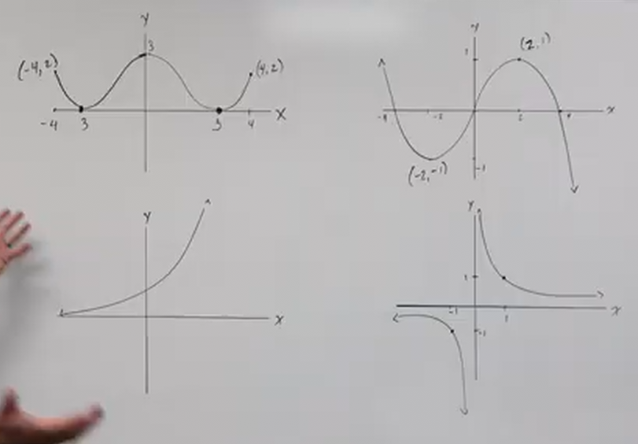

# Properties of Functions - Even vs Odd (Precalculus - College Algebra 8)

[Video](https://www.youtube.com/watch?v=6897XAx3O9Q)

---

When we're talking about even vs odd properties of functions, what we mean is by
"even vs odd" is formally defined as:

> When a function is even, it's graph is going to have the property of
> _symmetry_ about the _$y$-axis_.

> Whereas when a function is odd, it's graph is going to have the property of
> _symmetry_ about the _origin_.

---

**Examples**

Consider the following graphs:

Looking at these, can we determine which graphs are _even_ ?

The first graph on the upper left is indeed _even_ as it has _symmetry_ about
the $y$-axis.

Note that the second function on the top row to the right is _not_ even, as if
you "fold" it in half along the $y$-axis, it will not match. However, if you
_rotate the graph $180\degree$ about the origin, it would remain visually the
same, and thusly this is an example of an _odd_ property function.

As an aside, this second graph is an example of a _trigonometric function_,
which we will cover in a future lecture.

Let's skip the third graph and move to the fourth on the bottom right hand side.
Is this an even or an odd property function? Yes, if you _fold_ the graph along
the $y$-axis and then _rotate it $180\degree$, you'll get the same graphed
function, which indicates a _symmetry along the origin_. From a visual
representation, this is what we can expect of an _odd_ property function.

The other example is _neither even nor odd_.

---

# Revisiting Domains and Ranges Again

Because the subjects of Domain and Range are so important, let's revisit them
within this context, albeit very briefly.

For the first graph, we can represent the domain and range like so:

$$ \text{D: } \left\{x | -4 \leq x \leq 4 \right\} $$

$$ [-4, 4] $$

$$ \text{R: } \left\{f(x) | 0 \leq f(x) \leq 3 \right\} $$

$$ [0, 3] $$

For the second graph, we can represent the domain and range like so:

$$ \text{D: } \left\{x | -\infty < x < \infty \right\} $$

$$ (-\infty, \infty) $$

$$ \text{R: } \left\{f(x) | -\infty < f(x) < \infty \right\} $$

$$ (-\infty, \infty) $$

For the third graph, we can represent the domain and range like so:

$$ \text{D: } \left\{x | -\infty < x < \infty \right\} $$

$$ (-\infty, \infty) $$

$$ \text{R: } \left\{f(x) | 0 < f(x) < \infty \right\} $$

$$ (0, \infty) $$

For the fourth graph, we can represent the domain and range like so:

$$ \text{D: } \left\{x | -\infty < x < \infty \text{ AND } x \neq 0 \right\} $$

$$ (-\infty, 0) \cup (0, \infty) $$

$$ \text{R: } \left\{f(x) | -\infty < x < \infty \text{ AND } x \neq 0 \right\} $$

$$ (-\infty, 0) \cup (0, \infty) $$

---

## Outputs of Even vs. Odd Functions

If we plug in numbers that are equidistant along the $y$-axis(meaning that they
have the same absolute value, but opposite signs), _and_ they have the same
outputs (the same $f(x)$), then that means that they are _symmetrical along the
$y$-axis_ and is therefore the graph of an _even_ function. This can be
expressed simply as the following equation:

$$ f(x) = f(-x) $$

Now, this is as opposed to being _symmetric about the origin_, which again,
constitutes the main property on which we can determine that our function is
_odd property_. To determine this from plugged in numbers, this means that
_both_ the values of $x$ and $f(x)$ would have to have opposite signs of each
other. This can be expressed by the following equation:

$$ -f(x) = f(-x) $$

---

**Evaluating Even vs Odd of Functions**

With the previously covered section's information in mind, let's now evaluate
the following functions in this regard as to whether they are _even_, _odd_, or
_neither_. We will do this by plugging in opposite inputs.

---

$$ f(x) = 2x^4 - x^2 $$

$$ f(-x) = 2(-x)^4 - (-x)^2 $$

$$ f(-x) = 2x^4 - x^2 $$

$$ f(x) \stackrel{?}{=} f(-x) \rightarrow f(x) = f(-x) $$

Therefore this function is $\boxed{\text{EVEN}}$.

---

$$ g(x) = \frac{x}{x^2 - 1} $$

$$ g(-x) = \frac{(-x)}{(-x)^2 - 1} $$

$$ g(-x) = \frac{-x}{x^2 - 1} $$

$$ g(x) \stackrel{?}{=} g(-x) $$

No, therefore this function is **not** _even_ property. What about _odd_?

Yes, because $-g(x) = g(-x)$. Therefore, this function is _odd property_.

---

$$ h(x) = 3x^3 + 5 $$

$$ h(-x) = 3(-x)^3 + 5 $$

$$ h(-x) = -3x^3 + 5 $$

We can see this is not _even_, what about _odd_? Well we can shorthand the
previous example by simply taking the result of $h(-x)$ and factoring out $-1$.
If we do this, we will see pretty immediately if the function is _odd property_
or not.

$$ -h(-x) = -(3x^3 - 5) $$

Which also does not fulfill the definitions defined. This indicates that this
function is _neither even_ nor _odd_ properties.

---

$$ F(x) = \frac{x^2 + 3}{x^2 - 1} $$

A quick evaluation way of solving these is to determine which powered terms
would change signs. In this case, neither term would change sign if $x$ were
changed to $-x$, and thusly this is quickly evaluated as an _even_ property
function.

---

$$ G(x) = \sqrt{x} $$

$$ G(-x) = \sqrt{-x} $$

Note here that we get a complex number, which violates the rule that we cannot
graph any numbers that are not _real numbers_. Therefore, this is a quick and
clear indication that this function has _neither_ _even_ nor _odd_ properties.

---

$$ h(x) = \frac{-x^3}{3x^2 - 9} $$

$$ h(-x) = \frac{-(-x)^3}{3(-x)^2 - 9} $$

$$ h(-x) = \frac{x^3}{3x^2 - 9} $$

Notice here that we have opposite signs here, and thusly our function is an
example of an _odd property_ function.
