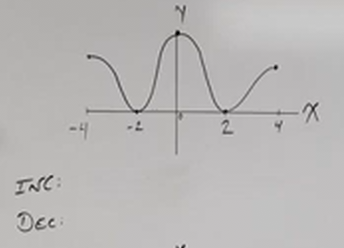
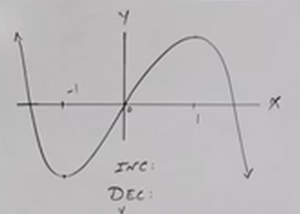
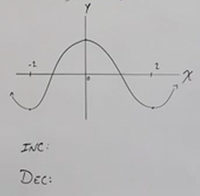
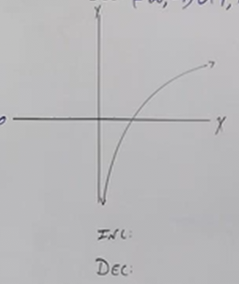

# Properties of Functions - Increasing vs Decreasing (Precalculus - College Algebra 9)

[Video](https://www.youtube.com/watch?v=cIRDvscVPr0)

---

**Increasing:**

When a function is _increasing_, if one takes the $x$ value, and go one unit
just larger than that (moving along the $x$-axis), then the function's input
(_i.e._ $x$) is _growing_, and the function's output (_i.e._ $f(x)$) is also
_growing_.

$$ \text{For } x_1 < x_2 \quad f(x_1) < f(x_2)  $$

From _Left_ to _Right_, the graph _climbs_.

---

**Decreasing:**

When a function is _decreasing_, the opposite happens. If one takes the $x$
value, and then go one unit smaller than that (moving along the $x$-axis), then
teh function's input (_i.e._ $x$) is _decreasing_, and the function's output
(_i.e._ $f(x)$) is also _decreasing_.

$$ \text{For } x_1 < x_2 \quad f(x_1) > f(x_2) $$

From _Left_ to _Right_, the graph _falls_.

All given by _open_ intervals on the $x$-axis.

---

Not all graphs will simply _increase_ or _decrease_, many will increase for one
or more _intervals_, and then decrease for one or more _intervals_. Consider the
following graph:

Again, we are accounting for _increasing_ and _decreasing_ when interpreting the
graph reading from _Left_ to _Right_. Thusly, for the interval between points
along the $x$-axis $-4$ to $-2$, our graph is _falling_ or _decreasing_. From
$-2$ to $0$, our graph is _growing_ or _increasing_, etc. etc.

Note that we _must_ use _open intervals_ when denoting _increasing_ or
_decreasing_ intervals. This means that we are _excluding_ the points
themselves, as that is the point of change, also known as a _local max_, which
is simply the point where the graph is _neither_ increasing nor decreasing. In
short, always use parentheses and _not_ square brackets when denoting intervals
to ensure it is made clear that these points are not included in the set of
numbers that we are declaring are either increasing or decreasing.

$$ \text{INC: } (-2, 0) \cup (2, 4) $$

$$ \text{DEC: } (-4, -2) \cup (0, 2) $$

---

Now consider the following graph:

There really is only one part of this graph that is increasing, and the rest
decrease from $-\infty$ and $\infty$. Otherwise the only section that is
increasing from left to right is the section, non-inclusive, from $-1$ to $1$.

$$ \text{INC: } (-1, 1) $$

$$ \text{DEC: } (-\infty, -1) \cup (1, \infty) $$

---

Consider the following graph:

Let's just try to do this one on the fly:

$$ \text{INC: } (-2, 0) \cup (2, \infty) $$

$$ \text{DEC: } (-\infty, -2) \cup (0, 2) $$

---

Consider the following graph:

This one is constantly increasing from non-inclusive $0$ onwards.

$$ \text{INC: } (0, \infty) $$

$$ \text{DEC: } \text{NONE} $$

---

**A NOTE**

Please note that we never denote the $y$ or $f(x)$ outputs here. When talking
about the properties of _increasing_ or _decreasing_, we are _observing_ and
noting the outputs, but we are only ever actually notating the values along the
$x$-axis.
