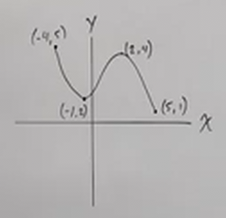
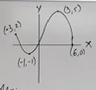
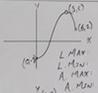
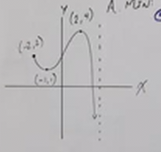
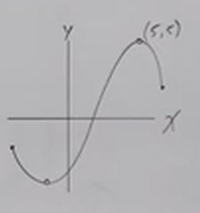
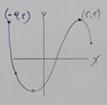

# Properties of Functions - Extrema (Precalculus - College Algebra 10)

[Video](https://www.youtube.com/watch?v=2hItEGb3KJo)

---

Here we are going to address what a _local maximum_ and _local minimum_ means in
the context of graphs. These will come up later in Calculus when we look at
_derivatives_, but for now we are going to focus solely on these more simple
topics.

So what are _local maximums_ and _local minimums_? These refer to points within
a single _interval_ that is either _increasing_ or _decreassing_ along the
$x$-axis. The _local maximum_ of a _single interval_ is the _high point_ at
which the graph stops _increasing_ (note that this doesn't inherently mean that
the graph starts decreasing, but that is what usually occurs). The _local
minimum_ of a _single interval_ is the _low point_ at which the graph stops
_decreasing_ (again, note that this doesn't inherently mean that the graph
starts increasing, but that is what usually occurs).

---

**Local/Relative Max:**

On an open interval,

$$ f(x) \leq f(c) \text{..} $$

$c$ is a _Local Max_ where the function changes from _increasing to decreasing_.

---

**Local/Relative Min:**

On an open interval,

$$ f(x) \geq f(c) \text{..} $$

$c$ is a _Local Min_ where the function changes from _decreasing to increasing_.

---

**Absolute Max and Absolute Min**

Unlike _Local Max_ and _Local Min_, _Absolute Max_ and _Absolute Min_ simply
mean the _Highest_ or the _Lowest_ points that the graph attains, respectively.

Note that _Every Closed Continuous Interval_ (_i.e._ $[, ]$) will be
_guaranteed_ to have an _Absolute Max_ and an _Absolute Min_. Note that it
_must_ be a _Closed Continuous Interval_ for this to be true, if there are any
breaks in the graph, any vertical asymptotes, etc., there is no guarantee there
will be an Absolute Max/Absolute Min.

---

**Endpoints**

Note that _Local Max/Mins_ **cannot** occur at _endpoints_, while _Absolute
Max/Mins_ **can** occur at _endpoints_. Note that an _endpoint_ is a point,
_inclusive_ where the graph begins/ends. Because an _endpoint_ is inherently
inclusive on a _Closed Continuous Interval_, and _Absolute Max/Mins_ simply
denote the point of change of whether the graph increases/decreases, the
_Absolute Max/Mins_ **can** occur at _endpoints_, while _Local Max/Mins_, due to
the nature that they are _exclusive_ **cannot** occur at _endpoints_.

---

Consider the following graph:

Let's determin the Local Max, Local Min, Absolute Max, and Absolute Min of this
graph:

$$ \text{Local maximum: } f(2) = 4 $$

$$ \text{Local minimum: } f(-1) = 2 $$

Note here that the _Local Max_ and _Local Min_ **don't** occur at $(-4, 5)$ and
$(5, 1)$ respectively. This is because there is no preceding nor following
change of the graph's direction, in the context of _Local_ Max/Mins, these are
_open_ intervals, and thusly we don't know what the direction is changing to, if
at all. In essence, you _can't include your endpoints for Local Max nor Local
Min_.

$$ \text{Absolute Maximum: } f(5) = -4 $$

$$ \text{Absolute Minimum: } f(5) = 1 $$

---

Consider the following graph:

Note that this is a _Continuous Function_ on a _Closed Interval_, there are no
gaps, there's no missing points, there's no asymptotes, this indicates we are
_guaranteed_ to have an _Absolute Max/Min_.

$$ \text{Local maximum: } f(3) = 5 $$

$$ \text{Local minimum: } f(-1) = -1 $$

$$ \text{Absolute maximum: } f(3) = 5 $$

$$ \text{Absolute minimum: } f(-1) = -1 $$

---

Consider the following graph:

Note here that our graph is _Not Continuous_, that is what the open dots in our
graph indicate, we are _excluding_ these points from our graph.

You might think there are still local maximums and minimums here, but those
values have been _removed_, and thusly we have no reference for when the graph
actually changes direction, we have _no local maximum_.

$$ \text{Local maximum: } \text{NONE} $$

$$ \text{Local minimum: } \text{NONE} $$

For this same reason, because there is no point referenced by a closed interval
where the direction of the graph changes at the highest point on the graph,
there is _no absolute maximum_.

$$ \text{Absolute maximum: } \text{NONE} $$

However, we do have a lowest point of $-3$ on the endpoint of our graph, because
it is _inclusive_ (_i.e._ closed dot).

$$ \text{Absolute minimum: } f(0) = -3 $$

---

Consider the following graph:

$$ \text{Local maximum: } f(2) = 4 $$

$$ \text{Local minimum: } f(-1) = -1 $$

$$ \text{Absolute maximum: } f(2) = 4 $$

$$ \text{Absolute minimum: } \text{NONE}$$

Note here that in this graph, we eventually hit a _Vertical Asymptote_ that
decreases to $-\infty$. This is the _limit_, which indicates a point along the
$x$-axis or $y$-axis at which we continually get closer to, but never reach a
specific point. For us to get an _Asbsolute Minimum_, however, we have to have
an actual value we can say is included in the graph, and because $-\infty$ can
never be included in any graph, we can't say this is the _Absolute Minimum_.

---

Consider the following graph:

This graph begs the question, can you have more than one local maximum and more
than one local minimum? Yes, you can.

$$ \text{Local maximum: } f(0) = 5 $$

$$ \text{Local minimum: } f(0) = -2, f(3) = 1 $$

$$ \text{Absolute maximum: } \text{NONE} $$

$$ \text{Absolute minimum: } f(0) = -2 $$

---

Consider the following graph:

This graph has no local max/min, nor any absolute max/min. The graph is broken
up, so it is _not continuous_. The left most endpoint is above the point that
_would_ be the absolute minimum, and thusly is not the absolute minimum. And the
endpoint on the right is below the point that _would_ be the absolute maximum,
and thusly is not the absolute maximum.

$$ \text{Local maximum: } \text{NONE} $$

$$ \text{Local minimum: } \text{NONE} $$

$$ \text{Absolute maximum: } \text{NONE} $$

$$ \text{Absolute minimum: } \text{NONE} $$

Now, let's change it a bit:

Now we do have a _Local max_ as well as _two_ _Absolute max_ values.

$$ \text{Local maximum: } f(5) = 5 $$

$$ \text{Local minimum: } \text{NONE} $$

$$ \text{Absolute maximum: } f(-4) = 5, f(5) = 5 $$

$$ \text{Absolute minimum: } \text{NONE} $$
