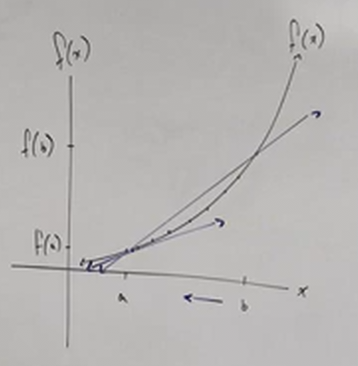

# Average Rate of Change of a Function (Precalculus - College Algebra 11)

[Video](https://www.youtube.com/watch?v=H5Y-ONkezDM)

---

The _Average Rate Of Change_ can be simplified to thinking of it as just the
_slope_ _between two points_ on a _curve_. This is more formally known as a
[**secant**](https://en.wikipedia.org/wiki/Secant_line).

You can't find the slope of a curve directly, but you can find the slope between
two points on said curve. Thusly, you can find the _Average Rate Of Change_ by
simply finding the average slope between two points that exist upon that curve.

This starts to get into trigonometric functions, as well as Differential
Calculus, but can the secant line represent the slope of another associated
trigonometric line, the _tangent line_. The answer is, "yes, but not very well."
They are associated as the _secant line has two points that touch the curve_
while the _tangent line has one point that touches the curve_.

Let's say that the secant line touches our curve at two points, point $a$, and
point $b$ along the $x$-axis. Let's say the tangent line touches our curve at
point $a$ as well. If we now move point $b$ closer to point $a$, the secant line
starts to approximate the slope value of the tangent line.

There is a point where $b$ and $a$ become negligably close (but do not actually
touch), where the slope of both the secant and tangetn lines becomes so similar
as to be negigible, at which point we are approaching calculating the
_Instantaneous Rate of Change_.

The average rate of change can be calculated like so:

$$ \text{Average Rate of Change } = \frac{f(b) - f(a)}{b - a} $$

If we look at this closely, we discover that we are simply dividing the
difference in _rise_ by the difference in _run_ (_i.e._ the slope). The
difference between the vertical values (_i.e._ the outputs) divided by the
difference between the horizontal values (_i.e._ the inputs).

This means we can find the Average Rate of Change, as long as we are provided
two points. Take this problem statement:

> For the function $f(x) = x^2 - 2x$, find the Average Rate Of Change from
> $x = 3$ to $x = 5$.

Now, do we know the values for $f(x)$ for each of these points? No, but we can
easily find out by simply plugging in our two known values for $x$.

$$ f(3) = (3)^2 - 2(3) $$

$$ f(3) = 9 - 6 \rightarrow f(3) = 3 $$

$$ f(5) = (5)^2 - 2(5) $$

$$ f(5) = 25 - 10 \rightarrow f(5) = 15 $$

So our two points are $(3, 3)$ and $(5, 15)$.

And then we can simply plug this into our Average Rate Of Change function:

$$ \text{Average Rate Of Change} = \frac{f(x) - f(a)}{x - a} $$

$$ \text{Average Rate Of Change} = \frac{(15) - (3)}{(5) - (3)} $$

$$ \text{Average Rate Of Change} = \frac{12}{2} $$

$$ \text{Average Rate Of Change} = 6 $$

We can then use this _Average Rate Of Change_ to determine the equation/graph of
a secant line, like so, where $m$ represents the Average Rate Of Change:

$$ y - y_1 = m(x - x_1) $$

$$ y - 3 = 6(x - 3) $$

$$ y - 3 = 6x - 18 $$

$$ y = 6x - 15 $$
