# How to Graph Piecewise Functions (Precalculus - College Algebra 12)

[Video](https://www.youtube.com/watch?v=KHZKgl_9o7M)

---

## What Are Piecewise Functions?

A Piecewise Function is a function, just like standard functions, for every
_one_ input, it will produce exactly _one_ output. They look like this:

$$
f(x) =
\begin{cases}
x^3 \\
3x - 2
\end{cases}
$$

But as you can see, we have two different expressions. If we _wrongly_ decide to
simply plug in our value for $x$ into _both_ expressions, then we get _two_
different outputs, and that violates our rule for functions that you can only
ever have one _output_ for every one _input_. We need to complete the expression
of each "piece" of our piecewise function. Let's complete our piecewise function
from above:

$$
f(x) =
\begin{cases}
x^3, x < 1 \\
3x - 2, x \geq 1
\end{cases}
$$

This indicates that when $x$ is defined within the _Domain_ of $x < 1$, we want
to execute the operation $x^3$ for $f(x)$. Otherwise, if $x$ is defined within
the _Domain_ of $x \geq 1$, then we want to execute the operation $3x - 2$ for
$f(x)$. Let's now take a few inputs, grab their outputs and graph them:

$$ f(-1) = (-1)^3  \rightarrow f(-1) = -1 \rightarrow (-1, -1) $$

$$ f(0) = (0)^3 \rightarrow f(0) = 0 \rightarrow (0, 0) $$

$$ f(1) = 3(1) - 2 \rightarrow f(0) = 1 \rightarrow (1, 1) $$

$$ f(3) =  3(3) - 2 \rightarrow f(3) = 7 \rightarrow (3, 7) $$

Let's now graph these points, but first let's start by dividing up the domain of
$x$ based off the condition. One can accomplish this by simply drawing a dotted
vertical line down crossing the $x$-axis where the condition changes,
specifically in this example, at the $x$-axis of $1$:

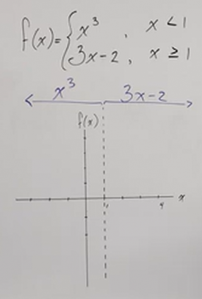

Let's take a brief moment to review what common functions generally look like
when graphed. The shape of a standard cubic function (_i.e._ $x^3$) generally
looks like an "S-Curve":

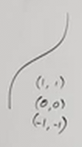

If we graph this, we get the following:

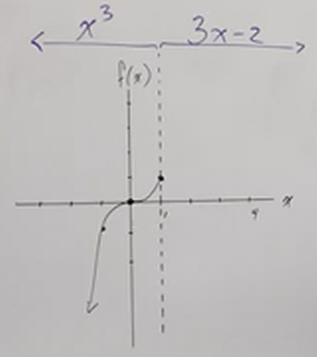

Note that there is a mistake here, however, as our graph has reached $1$, which
is at the boundary in our graph where the output equation changes, and due to
the inclusivity of the $\geq$ sign in our second piece of our piecewise
function, this point is part of the second output. We can denote this with an
open circle, saying that our first piece has outputs that go right up to $1$,
but never actually are $1$.

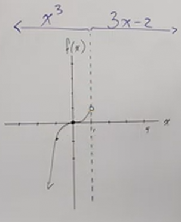

Recall however, that if we plug $1$ in to our piecewise function, this evalutes
to $(1, 1)$:

$$ f(1) = 3(1) - 2 \rightarrow f(0) = 1 \rightarrow (1, 1) $$

In order to denote this appropriately, we'll have to somehow differentiate the
second piece of our graph from the first piece. We can do this by changing the
color utilized to denote the line, and then fill in this point's open dot with
the purple line. The color of the dot's outline indicates that our first piece
goes right up to $1$, but does not include it, and let's say our next graph is
denoted by the color, purple, which we'll use to fill in the dot, and that will
indicate that the second piece of our graph _does_ include $1$. From there, we
can finish graphing our function. The function $3x - 2$ is a simple line with a
slope of $3$, we can graph this easily:

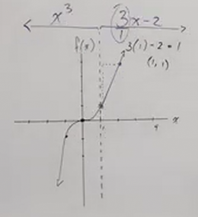

**Note:**

Just a short note here is that not _every_ piecewise function will look like
this. The fact that the two pieces of our graphs happened to leave empty and
fill in at $1$ is more just how things worked out with this particular graph.
You'll see that this doesn't happen in the next example.

---

Let's look at another example, this time with three conditions/operations.

$$
f(x) =
\begin{cases}
x^2, x < 0 \\
2, x = 0 \\
2x + 1, x > 0 \\
\end{cases}
$$

Notice that we have only one condition in which the $=$ sign is used, this is
because the other two conditions specifically refer to conditions around $0$.
Piecewise functions essentially should cover every situation in which $x$ is
held in relation to at least one value.

Let's now evaluate a few points:

$$ f(-2) =  (-2)^2 \rightarrow f(-2) = 4 \rightarrow (-2, 4) $$

$$ f(0) =  2 \rightarrow (0, 2) $$

$$ f(2) =  2(2) + 1 \rightarrow f(2) = 5 \rightarrow (2, 5) $$

Let's now graph this. Just like before, we're going to set up a dividing line.
In truth, we don't have to do that for this particular graph, because the
dividing line on which the condition changes, is $0$, the $y$-axis. But we still
want to be clear about exactly when and where our graph changes, so let's do
that now:

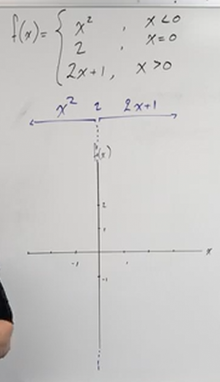

The simplest part of our graph is when $x = 0$, so let's graph the point
$(0, 2)$ now:

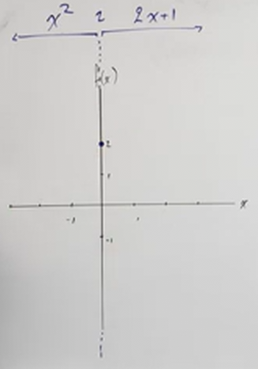

For the other parts of our graph, we'll want to ensure we leave that point open,
(_i.e._ an open dot), indicating that neither other piece of our function
includes this point. Recall that $x^2$ is a classic parabola shape, and in this
case there is no shifting along the $x$ or $y$ axis, it's a standard $x^2$
parabola shape. The only caveat to this is that it cannot cross over to $0$ or
include it. Thusly we graph a standard parabola that stops at $0$, and does not
include the point $0$:

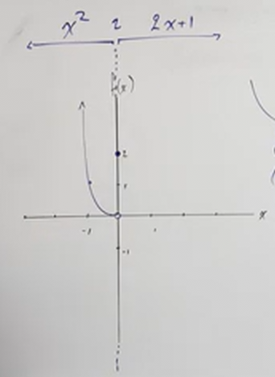

We can now determine the final piece of our graph, recall that $x > 0$ is
_non-inclusive_, but we can still plug in $0$ to find out where our third piece
of our graph starts, and simply put an open dot there to indicate we are not
including it as part of this piece of the graph. The rest of this piece is a
classic slope:

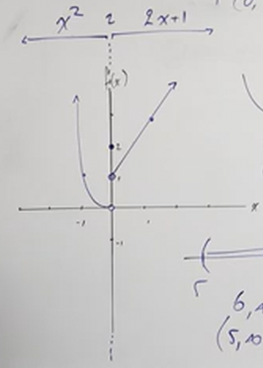

---

Let's move onto another example:

$$
f(x) =
\begin{cases}
x + 3, -4 \leq x < -2 \\
-2x - 3, x \geq -2
\end{cases}
$$

Let's start as we did before with a vertical line at our boundary...but wait, we
technically have _two_ boundaries! One at $-2$, and another at $-4$, so let's
place dotted lines at both of those boundaries:

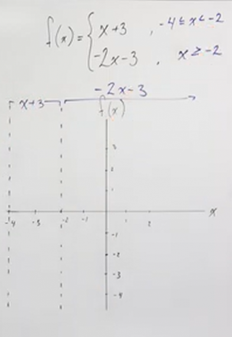

_A small note here:_ You don't _have_ to have a boundary at the same number,
sometimes there is a large gap in our graph where our function simply isn't
defined. This doesn't happen often, but it is possible.

Let's move on. Graphing on the side of our boundaries that includes the $y$-axis
is generally recommended, so let's do that, in this case that has us graphing
the piece $-2x - 3$. Let's simply take the situation where $x = 0$ and evaluate
it:

$$ f(0) = -2(0) - 3 \rightarrow f(0) = -3 \rightarrow (0, -3) $$

This piece of our function is a classic slope, the rise is $-2$ down the
$y-axis$ and over by $1$ along the $x$-axis. This graphs to the point of
$(1, -5)$.

Lastly we'll want to evaluate the point at our boundary. Note that in this case
we are _including_ this point due to the $\geq$ sign in our conditional
statement, but we would do this even if the sign was non-inclusive (_i.e._ $>$).
This allows us to graph right up to, or including (depending on the sign of the
conditional) where the condition of our piecewise function changes.

$$ f(-2) = -2(-2) - 3 \rightarrow f(-2) = 1 \rightarrow (-2, 1) $$

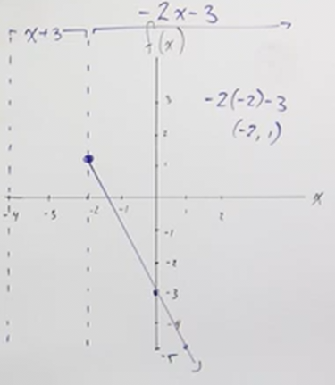

For the next piece, we can simply plug in the boundaries to graph our line since
it is another slope. If we plug $-4$ into our function we get:

$$ f(-4) = -4 + 3 \rightarrow f(-4) = -1 \rightarrow (-4, -1) $$

This point is _included_ in our graph. Let's now plot the point at the other
boundary, $-2$:

$$ f(-2) = -2 + 3 \rightarrow f(-2) = 1 \rightarrow (-2, 1) $$

This point is _excluded_ in our graph. Note that this point lies included in our
other piece, thusly we will want to use different color lines/points to indicate
which part of the graph this point is included in and excluded from.

Let's now plot out our final graph:

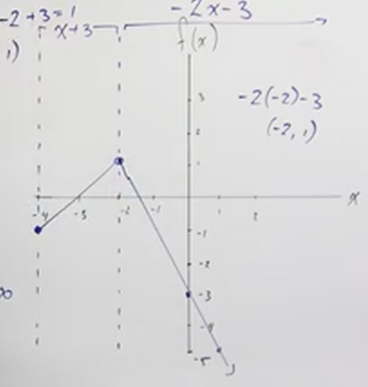
