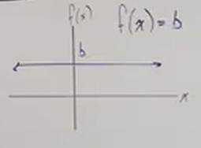
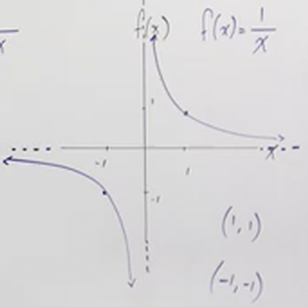

# Graphs You Must Know (Precalculus - College Algebra 13)

[Video](https://www.youtube.com/watch?v=NrmmR3-VxA8)

---

In this section, we're going to cover some very common graph shapes based off of
common functions. It is **_NECESSARY_** that you memorize these. That said, it
is also important that you understand _why_ these graphs are shaped the way they
are.

---

**Constant Function**

Let's consider the following function and it's graph:

$$ f(x) = b $$

This is a **Constant** function. Which is simply a horizontal line that runs
across the $y$-axis at $b$.

Notice also that this is an _even_ function as it has _symmetry_ about the
$y$-axis.

$$ \text{D: } \left\{x | x = \text{ALL REAL NUMBERS} \right\} $$

$$ \text{R: } \left\{f(x) | f(x) = b \right\} $$

---

**Slope Function**

$$ f(x) = x $$

Note that this is an _odd_ function.

All _odd_ functions will always have the following points $(-1, -1)$ and
$(1, 1)$, but they don't all look the same.

$$ \text{D: } \left\{x | x = \text{ALL REAL NUMBERS} \right\} $$

$$ \text{R: } \left\{f(x) | f(x) = \text{ALL REAL NUMBERS} \right\} $$

---

**Cubed Function**

$$ f(x) = x^3 $$

The **Cubed Function** give us a more "S"-curved shape that flips along the
$y$-axis and $x$-axis:

$$ \text{D: } \left\{x | x = \text{ALL REAL NUMBERS} \right\} $$

$$ \text{R: } \left\{f(x) | f(x) = \text{ALL REAL NUMBERS} \right\} $$

---

**Cube Root Function**

$$ f(x) = \sqrt[3]{x} $$

The **Cube Root Function** look similar to the **Cubed Function** except that
instead of drastically increasing along the $y$-axis, the **Cube Root Function**
drastically increases along the $x$-axis:

$$ \text{D: } \left\{x | x = \text{ALL REAL NUMBERS} \right\} $$

$$ \text{R: } \left\{f(x) | f(x) = \text{ALL REAL NUMBERS} \right\} $$

---

**Reciprocal Function**

$$ f(x) = \frac{1}{x} $$

The **Reciprocal Function** (also known as the **Rational Function**) is
interesting in that it has both Vertical Asymptotes and Horizontal Asymptotes
along the $y$-axis and the $x$-axis. Because denominators cannot be $0$, along
where $x$ approaches $0$, the graph approaches, but never touches the $x$-axis
and the $y$-axis:

$$ \text{D: } \left\{x | x = \text{ALL REAL NUMBERS}, x \neq 0 \right\} $$

$$ \text{R: } \left\{f(x) | f(x) = \text{ALL REAL NUMBERS}, f(x) \neq 0 \right\} $$

---

**Squared Function**

With the exception of our **Constant Function**, all _even_ functions (functions
which can be reflected on the $y$-axis) have the points $(1, 1)$, $(0, 0)$, and
$(-1, 1)$.

$$ f(x) = x^2 $$

The **Squared Function** always produces a parabola shape. Note here that
exponential functions generally all increase dramatically, it just depends on
whether or not they are a parabola shape graph (even number exponents), or an
S-shape graph (odd number exponents).

$$ \text{D: } \left\{x | x = \text{ALL REAL NUMBERS} \right\} $$

$$ \text{R: } \left\{f(x) | f(x) >= 0 \right\} $$

---

**Absolute Value Function**

$$ f(x) = |x| $$

The **Absolute Value Function** will always have a positive $y$ value (as long
as it is not negatively shifted along the $y$-axis). Note that this is the same
as our **Slope Function**, just that because it takes the absolute value of $x$,
this means the output can never be negative.

$$ \text{D: } \left\{x | x = \text{ALL REAL NUMBERS} \right\} $$

$$ \text{R: } \left\{f(x) | f(x) >= 0 \right\} $$

---

**Square Root Function**

$$ f(x) = \sqrt{x} $$

The **Square Root Function** can never have any negative inputs, nor can it ever
have any negative outputs. Note that this is only the case for **even** radicals
(as opposed to, say, cubed roots). This is because this results in complex,
non-real numbers, which cannot be graphed.

Also make note that this function is _neither_ even nor odd, as it can't be
reflected along the $y$-axis and produce the same graph (even), and it can't be
rotated along the center $180\degree$ and produce the same graph (odd).

$$ \text{D: } \left\{x | x >= 0 \right\} $$

$$ \text{R: } \left\{f(x) | f(x) >= 0 \right\} $$

