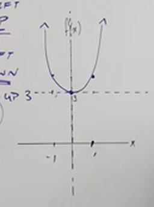
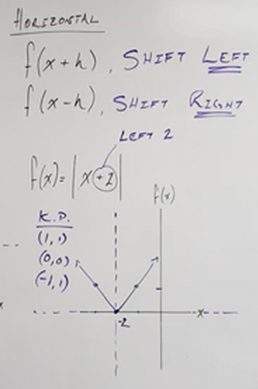
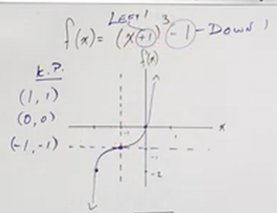
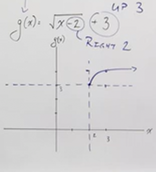
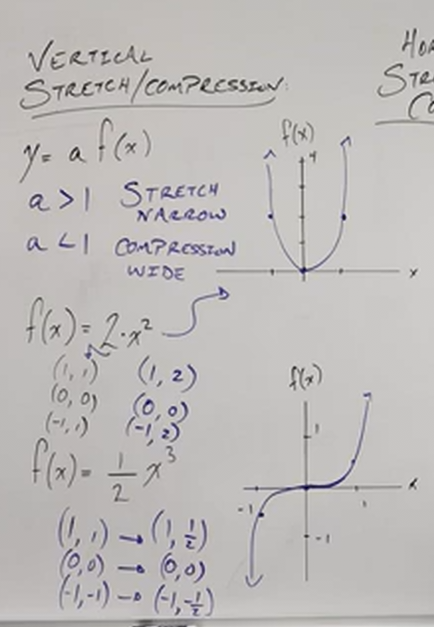
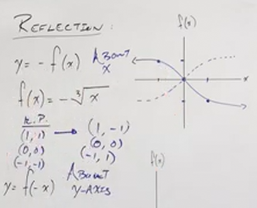
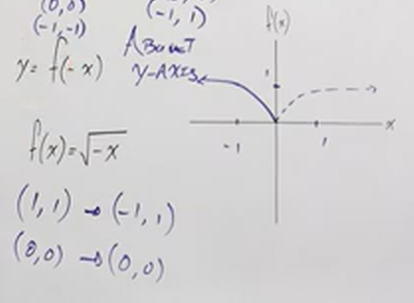

# Introduction to Graph Transformations (Precalculus - College Algebra 14)

[Video](https://www.youtube.com/watch?v=sTCRB6hMsC4)

---

Now that you have memorized the basic shapes and properties of common Graphs,
let's take a look at how these Graphs are transformed. Knowing how graphs are
transformed is useful for a number of reasons. Oftentimes we don't have time to
plug in individual points to find the shape, direction, and properties of a
graph, and this process is also often error-prone, not to mention that many
common graphs, like trigonometric functions, often can be graphed in a direction
infinitely. That is why it is imperative that we understand how these operations
shrink, expand, move, and otherwise _transform_ our graphs.

Let's start by looking at shifting our graph.

---

**Vertical Shifts**

$$ f(x) + k $$

$$ f(x) - k $$

Here we are adding/subtracting a _constant_ value, $k$, to the output of our
function, $f(x)$. Note that this _does not_ affect the _input_ of our function,
$x$, but it does affect the _output_ of our function, $f(x)$. This means that
only $f(x)$ is affected, meaning that our graph only changes in regards to it's
location in relation to the $y$-axis. This is what is known as a _Vertical
Shift_, and depending on the sign of the constant, $k$ will determine in which
direction along the $y$-axis our output, $f(x)$ is shifted. In this case, the
direction the graph is shifted is rather intuitive. By adding $k$ to $f(x)$, we
shift our graph _upwards_ along the $y$-axis, by subtracting $k$ from $f(x)$, we
shift our graph _downards_ along the $y$-axis.

Consider the following function:

$$ f(x) = x^2 + 3 $$

Recall one of our original, classic functions:

$$ f(x) =x^2 $$

Recall that this forms a classic parabola shape, which changes direction at
$(0, 0)$. Now, by adding $3$ to the output of $x^2$, we are simply starting this
change of direction at $(0, 3)$.

Recall also the key points that this shape (and almost all _even_ property
functions) will always hit are $(1, 1)$, $(0, 0)$ and $(-1, 1)$.

Now that we are taking this simple squared function, and adding $3$ to it, the
$f(x)$ output of each of these will change to $(1, 4)$, $(0, 3)$, and $(-1, 4)$.

---

**Horizontal Shifts**

$$ f(x + h) $$

$$ f(x - h) $$

Again, let's think back now on our recent discussion of _Vertical Shifts_, we
took an output value, and then added or subtracted a constant from it. This
means that our _input_ value never changed, just our _output_ value.

When we are addressing _Horizontal Shifts_, however, we are now going to adjust
the _input_ value before passing it to our function. This means that our _input_
values will change, meaning that the graph will shift along the $x$-axis.

The direction it shifts however, counterintuitive, as it is reverse of what most
students expect. Consider this example from above:

$$ f(x + h) $$

Many would initially think that this means that we would shift along the
$x$-axis to the right, but this is incorrect, in fact, we are shifting _left_.
Conversely this other example from above:

$$ f(x - h) $$

Is a shift _right_, not left.

$$
\begin{align*}
f(x + h) \text{ SHIFT LEFT} \\
f(x - h) \text{ SHIFT RIGHT}
\end{align*}
$$

Let's now consider an example:

$$ f(x) = |x + 2| $$

Now, let's see how we might graph this. Recall the more classic example from the
previous section:

$$ f(x) = |x| $$

This gave us a class "V" shape starting at $(0, 0)$, hitting both $(-1, 1)$ and
$(1, 1)$ as it expanded outwards in both positively. Now, what happens when we
add $2$ to our input, while keeping it inside of the function's operation of
applying the absolute value to it? In this case, our graph wouls shift
horizontally along the $x$-axis _to the left_. This means our new three points
would shift to be $(-2, 0)$, $(-3, 1)$, and $(-1, 1)$.

---

Now, let's combine these two concepts together, and shift our graphs along both
the $y$-axis and the $x$-axis:

$$ f(x) = (x + 1)^3 - 1 $$

Let's first start by recalling that $f(x) =x^3$, the **Cubed Function** gives a
kind of $S$ curve that wraps around the $y$-axis. Also recall from above that we
are shifting our graph along the $x$-axis _to the left_ when we adjust our input
over by $1$ within the parentheses, $(x + 1)$. Lastly, we also know that we are
shifting our output _downwards_ with the last constant, $- 1$ in our function.

Recall also that our key points for an _odd_ property function, which
$f(x) = x^3$ is, are: $(1, 1)$, $(0, 0)$, and $(-1, -1)$. This means we can
determine our points by simply shifting our graph along the $x$-axis _to the
left_ by $1$, and then also shifting these points downwards by $-1$.

---

Let's look at another example of this multiple shift graph transformations:

$$ g(x) = \sqrt{x - 2} + 3 $$

Let's recall the more basic $f(x) = \sqrt{x}$ is a graph with a curved line that
originates at $(0, 0)$ and only ever has positive outputs for both $x$ and
$f(x)$. Recall that this is because square roots cannot have any negative inputs
as those are impossible to graph due to them producing imaginary numbers. Thusly
our key points for this graph are simply $(0, 0)$ and $(1, 1)$.

In this case we are adjusting our input by $-2$, which if you recall, moves our
graph _to the right_ along the $x$-axis. We also are shifting our graph
_upwards_ by $3$ along the $y$-axis.

---

Now that we havee covered shifting, let's now talk about how we might
stretch/compress our graph horizontally and vertically, as well as how we might
reflect our graph along both the $x$-axis and the $y$-axis.

---

**Vertical Stretch/Compress**

Consider the following function:

$$ y = a(f(x)) $$

Notice a couple things right off the bat here. Our input value $x$ remains
untouched, nothing changes for $x$. What _is_ happening, is that our output
value, $f(x)$ is getting multiplied by a new constant, $a$.

This means that our output values will either _shrink_ or _grow_. The output
value will _shrink_, or in the case of a Vertical transformation, it will
_stretch_. If the output value is multiplied by a constant that is _less than
$1$_, and the output value will _grow_, or in the case of a Vertical
transformation, it will _compress_, if the output value is multipliedn by a
constant that is _greater than $1$_.

$$
\begin{align*}
a > 1 \text{ STRETCH} \\
a < 1 \text{ COMPRESS}
\end{align*}
$$

Let's consider this more specific example:

$$ f(x) = 2x^2 $$

Recall again, that $f(x) = x^2$ produces a parabola shape, and is an _even_
property function, this means the key points we can are guaranteed to have are
$(1, 1)$, $(0, 0)$ and $(-1, 1)$. Since we know that multiplying $x^2$ by $2$
will only affect the output values. We can simply multiply the outputs of these
key values by $2$ to get the new points this graph will have. These will be
$(1, 2)$, $(0, 0)$, and $(-1, 2)$.

To re-emphasize, we didn't shift up nor down, nor left nor right. All that
happened was that our graph _stretched_ upwards. Visually, our graph got _more
narrow_.

Let's consider another example:

$$ f(x) = \frac{1}{2}x^3 $$

Recall that $f(x) = x^3$ is an _odd_ property function. This means our key
points that are guaranteed to be on our graph are $(1, 1)$, $(0, 0)$, and
$(-1, -1)$.

Again, just like our other example, only our _outputs_ are affected, but
consider the points that result from adjusting our outputs:
$\left(1, \dfrac{1}{2}\right)$, $(0, 0)$, and $\left(-1, -\dfrac{1}{2}\right)$.
Visually speaking, this would look as if your graph were _compressed_, or our
graph got _more wide_.

---

**Horizontal Stretch/Compression**

$$ y = f(ax) $$

We won't be addressing _Horizontal Stretch/Compression_ is as much detail, save
for a few key details. Firstly, it is very common for a _Horizontal
Stretch/Compression_ can be _changed_ into a _Vertical Stretch/Compression_.
This will become more apparent once we get to trigonometric functions in the far
future.

For now, just know that just like with _Horizontal Shifting_, the expected
output of a _Horizontal Stretch/Compression_ is counterintuitive.

Consider this more specific example:

$$ f(x) = (3x)^2 $$

Here the constant $3$ multiplies our _input_ prior to the operation of squaring
the input. One might think that this would _stretch_ our graph horizontally, but
in fact this operation, of multiplying by $a$, which is $3$, will result in a
_Horizontal Compression_. This would be the opposite if $a$ were less than $1$,
in which case we would have a _Horizontal Stretch_.

$$
\begin{align*}
a > 1, \text{ HORIZONTAL COMPRESION} \\
a < 1, \text{ HORIZONTAL STRETCH}
\end{align*}
$$

Now, recall that at the beginning of this section, we said _Horizontal
Stretch/Compression_ often is changed into a _Vertical Stretch/Compression_.
Let's consider this evaluation of our function:

$$ f(x) = (3x)^2 = 9x^2 $$

This is _identical_ to a _Vertical Stretch_ in this case. Note that this is a
_Horizontal Compression_, but a _Vertical Stretch_.

This is why we're not really spending much time on this section, as oftentimes
it can be changed into a _Vertical Stretch/Compression_.

---

**Horizontal Reflections**

Reflections are simple operations that change the sign of either the _input_ or
_output_ of a function.

Consider these examples:

$$ y = -f(x) $$

$$ f(x) = -\sqrt[3]{x} $$

This tells us to take the original input, don't change it, but once you have the
output, _change the sign of the output_. This puts the output on the opposite
side of the $x$-axis, it _reflects the graph horizontally_.

Let's take the latter example:

$$ f(x) = -\sqrt[3]{x} $$

Recall that the key points for the _odd_ property function here is:

$$ \left\{(1, 1), (0, 0), (-1, -1)\right\} $$

In this case, we are simply changing the signs of our outputs:

$$ \left\{(1, -1), (0, 0), (-1, 1)\right\} $$

---

**Vertical Reflections**

Now what happens if instead of changing the sign of our outputs, we change the
sign of our inputs?

$$ y = f(-x) $$

$$ f(x) = \sqrt{-x} $$

This _changes the sign of the input_ before we do the major operation of the
function to get the output. This causes a reflection about the $y$-axis, it
_reflects the graph vertically_.

Recall that for our more classic $f(x) = \sqrt{x}$, our key points for an even
function would be:

$$ \left\{(1, 1), (0, 0)\right\} $$

In this case, our outputs don't change, but the input values are reversed on the
sign, thusly our keypoints would change to:

$$ \left\{(-1, 1), (0, 0)\right\} $$

