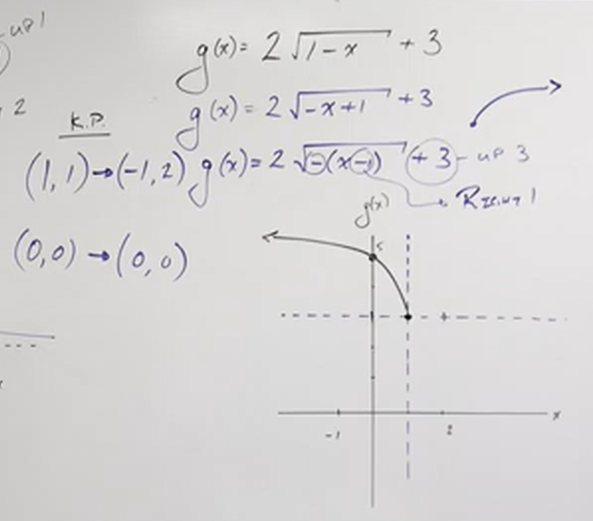

# How to Graph with Transformations (Precalculus - College Algebra 15)

[Video](https://www.youtube.com/watch?v=HkrMJLSpJFI)

---

**Practice**

This section will be a practice section of what we covered in our previous
section. Let's get started. Consider this example:

$$ f(x) = -\frac{1}{2}|x - 3| + 2 $$

This function includes pretty much every transformation covered in the previous
section. In order to simplify this, we want to first break it down to it's
essential operation. In this case, that is indicated by the presence of the
absolute value. We know that this graph shape is the "V" shape, and that it is
an _even_ property function, which indicates our key points that will be
transformed. These key points are:

$$ \left\{(-1, 1), (0, 0), (1, 1)\right\} $$

Now we will work on calculating our vertical and horizontal shifts, starting
with teh vertical. Notice that we have a _Vertical Shift_ happening outside of
the absolute value operation. We are shifting our output value by $2$ _upwards_.
Now we will see if there are any _Horizontal Shifts_ happening with our input,
and ineed we have a $-3$ inside of our absolute value operation, indicating that
we have a horizontal shift _to the right_.

Finally, we are looking towards _stretch/compress_ operations. As you can see we
are multiplying our absolute value by $-\dfrac{1}{2}$. Note that this is
affecting our _output_ as it sits outside of the major operations on our
_input_, $x$. This means that we will have a _Vertical Compression_.
Additionally, because the sign of this value is _negative_, it means we also
have a _Horizontal Reflection_ around the $x$-axis.

Taken all together, we can adjust our original default key points and adjust
them. Again our original key points are:

$$ \left\{(-1, 1), (0, 0), (1, 1)\right\} $$

Let's first adjust the keypoints by adjuting them for both the _Vertical
Compression_ and the _Horizontal Reflection_, by multiplying the _outputs_ by
$-\dfrac{1}{2}$:

$$
\begin{align*}
(-1, 1) \rightarrow \left(-1, -\frac{1}{2}\right) \\
(0, 0) \rightarrow (0, 0) \\
(1, 1) \rightarrow \left(1,  -\frac{1}{2}\right)\\
\end{align*}
$$

We can now sketch our graph relative to the shifted points, again, we shift
_over right_ by $3$, and we shift _upwards_ by $2$. We can then treat this
newfound point of $(3, 2)$ and treat it as if it were $(0, 0)$ to get a rough
sketch of our graph, then adjust to get a more accurate picture:

---

Let's try another example.

$$ g(x) = -\frac{1}{3}(x + 1)^3 - 1 $$

Since this is a **Cubed Function**, we know it will have a "S"-shape and is
guaranteed to have certain points based off it being an _odd_ property function.
Those key points are:

$$ \left\{(1, 1), (0, 0), (-1, -1)\right\} $$

Now that we have our key points down, we can identify our transformation.

The $-1 on the outside of the parentheses at the end of our function expression
indicates it is affecting the _output_, $f(x)$. It is indicating that we are
_shifting downward_ by $-1$.

The $+1$ inside the parentheses is affecting our _input_, adding $1$ to our
inptu before processing the cubed operation. This indicates we are shifting
horizontally _to the left_ by $1$.

Now, we have two different transoformations with the preceding $-\dfrac{1}{3}$
multiplier. This indicates by the $\dfrac{1}{3}$ that we have a _Vertical
Compression_, and because the sign is _negative_, this indicates that we have a
_Horizontal Reflection_ along the $x$-axis.

After shifting our points by the horizontal and vertical shifts, and have found
the new origin point of our graph, we can now take some new keypoints and get a
rough sketch of our graph. Our new keypoints should not bother with the shift,
as we can determine that from the graph, rather we can simply take the
multiplier of $-\dfrac{1}{3}$ to determine our new keypoints.

$$
\begin{align*}
(1, 1) \rightarrow \left(1, -\frac{1}{3}\right)\\
(0, 0) \rightarrow (0, 0) \\
(-1, -1) \rightarrow \left(-1, \frac{1}{3}\right)
\end{align*}
$$

---

Let's continue with another example:

$$ f(x) = \frac{3}{x - 2} + 1 $$

To get an accurate transformation, it's best for our understanding that we place
the $x - 2$ inside of parentheses:

$$ f(x) = \frac{3}{(x - 2)} + 1 $$

This allows us to understand that not only are we shifting _to the right_ by
$2$, but also know that $x$ must be _greater than $2$, as this is a **Rational
Function**, and we can't have a divisor of $0$.

We also want to take the numerator outside of our fraction to gain a better
understanding of what our graph might look like:

$$ f(x) = 3\left(\frac{1}{(x - 2)}\right) + 1 $$

Ah, now we see that this is actually a _Vertical Stretch_ transformation on a
**Rational Function** shifted _to the right_ by $2$ units, and also shifted
_upwards_ by $1$.

Recall the more simplified version of this function expression in order to get
our key points.

$$ f(x) = \frac{1}{x} $$

Our key points for this basic function are:

$$
\begin{align*}
(1, 1) \\
(-1, -1)
\end{align*}
$$

We can then graph the origin by adjusting for the shifts, again, _to the right_
by $2$, and _upwards_ by $1$.

---

And let's continue with another example:

$$ g(x) = 2\sqrt{1 - x} + 3 $$

This function isn't in a form that we would commonly recognize when
appropriately shfiting, specifically in regards to the $x$ placement. Let's
adjust that.

$$ g(x) = 2\sqrt{-x + 1} + 3 $$

It's also _negative_, which gives us the wrong interpration of which direction
to shift in along the $x$-axis.

$$ g(x) = 2\sqrt{-1(x - 1)} + 3 $$

Now we can see that we indeed are _shifting to the right_, but also that we are
_reflected about the $y$-axis_

Recall the key points for a **Square Root Function** $f(x) = \sqrt{x}$ are:

$$ \left\{(0, 0), (1, 1)\right\} $$

Now, let's graph based off our shifted units, _upwards $3$_ and _to the right by
$1$_.

From here, we can start to graph, but be careful, remember that we have a
_negative_ sign we took out to show that we are _reflected along the $y$-axis.
This means that our inputs need to be multiplied by $-1$ to determine where our
key points are.

$$ \left\{(0, 0), (-1, 1)\right\} $$

Additionally we have a _Vertical Stretch_ due to the multiplying by $2$, so
let's take our output value and multiply by $2$.

$$ \left\{(0, 0), (-1, 2)\right\} $$

