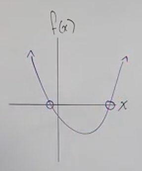
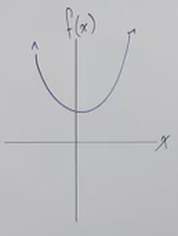

# Introduction to Solving Quadratics (Precalculus - College Algebra 16)

[Video](https://www.youtube.com/watch?v=OIEkJaPgjKs)

---

Here we're just going to give a brief introduction to solving quadratics, and
what exactly it is we are doing when we solve quadratic equations using the
various methods covered in Intermediate Algebra.

---

## The Definition Of A Quadratic Function

A Quadratic Function is a function where there exists a polynomial that is to
the power of $2$ or the degree of said power is $2$. It generally takes on this
form:

$$ f(x) = ax^2 + bx + c $$

Generally speaking, when graphed, the quadratic formula produces a _Parabola_.
If $a$ is _positive_, it _opens upwards_, and if $a$ is _negative_, it _opens
downwards_. $a$ also determines the stretch/compression of these graphs.

If we want to find where our graph crosses the $x$-axis, we set this function
equal to $0$. This is because this expression:

$$ f(x) = 0 $$

Is essentially saying, "I want to find all values of $x$ where the height is
$0$." This ends up taking on a very familiar form from Intermediate Algebra:

$$ ax^2 + bx + c = 0 $$

There are four methods for solving these Quadratic Formulas.

1. Square Root Method

2. Factoring

3. Completing the Square

4. Quadratic Formula

All these methods will be covered in more detail in the following sections.

---

## Graphing Quadratic Formulas

Please note that solving the quadratic formula for $0$ will always yield us the
values of the $x$-intercepts. There are three different results for the parabola
graphed for Quadratic Formulas.

1. The Parabola Crosses The $x$-axis 2 times.

Note that because a parabola spreads out into infinity, it can _only cross the
$x$-axis a maximum of 2 times_. This is indicative of:

- There are 2 solutions.
- There are 2 real solutions.
- There are 2 real $x$-intercepts.

2. The Vertex of the Parabola sits right on the $x$-axis.

This is a special case of a Parabola in that we don't get two solutions, we get
_the same solution twice_. This is also known as a _Double Root_. This is
indicative of:

- There is 1 real solution.
- There is 1 $x$-intercept.

3. The Parabola Doesn't meet the $x$-axis.

This can happen when there is no real solution for $i$, and instead we have
_Complex Numbers_ that include imaginary numbers (_.i.e._ $i$). This is
indicative of:

- 2 complex solutions
- No $x$-intercepts.
