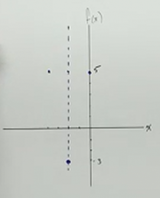
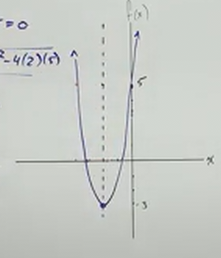

# Graphing Quadratic Functions (Precalculus - College Algebra 24)

[Video](https://www.youtube.com/watch?v=VH4tzzBVbgA)

---

This section will be a stopping off point in that it reviews how to graph these
Quadratic Equations. This will be a bit more advanced than the Graphs covered in
Intermediate Algebra in that we will often have to use the _Quadratic Formula_
to find our $x$-intercepts. Let's get started.

---

## Graphs Of Quadratic Functions

Any function that equals a polynomial expression of a second degree is a
Quadratic Function. It often looks like so:

$$ f(x) = ax^2 + bx + c $$

These are _Parabola_ in shape and open either _upwards_ or _downwards_ depending
on the sign of $a$:

Some other basic properties of parabolas include the fact that it will always
have a _$y$-intercept_, we will need to find this in order to graph it.

All parabolas will also always have a _Vertex_, the point at which our parabola
changes direction from either increasing to decreasing or visa versa. We will
need to find the _Vertex_ in order to graph it as well.

As covered in our previous sections on solving Quadratic Equations, we know that
a parabola may not always have $x$-intercepts. It can sometimes have two, one,
or no $x$-intercepts and we'll need to know where the $x$-intercepts are, if
any, to determine how to graph a parabola as well.

Let's find out how to get all these points by solving a few examples.

---

**Examples**

---

$$ f(x) = 2x^2 + 8x + 5 $$

Let's sketch out a bit of what we can know about this Parabola right off the
bat, the presence o$ $2$ as the coefficient for $x^2$ indicates two things. This
is an _upwards_ opening parabola in that $2$ is positive, and we can also
determine that this Parabola will be _narrow_ due to the fact that $2 > 1$.

We generally find our points in the following order:

1. Vertex
2. $y$-intercept
3. $x$-intercepts

This is because finding these points in this order can save us time especially
when considering the $x$-intercepts, which may not exist.

**1. Vertex**

The _Vertex_ of a parabola can be found by simply pluggingin the following
formula:

$$ \text{V: } \left(-\frac{b}{2a}, f(x)\right) $$

You can also _Complete The Square_ for the Vertex form.

Simply put, we can find the $x$-coordinate of our _Vertex_ by solving
$-\frac{b}{2a}$, and then plugging that value in for $f(x)$ and solving.

Let's find our _Vertex_.

$$ \text{V: } \left(-\frac{8}{2(2)}, f(x)\right) $$

$$ \text{V: } \left(-\frac{8}{4}, f(x)\right) $$

$$ \text{V: } \left(-2, f(x)\right) $$

Now we know the value of $x$ is $-2$, thusly we can rewrite our _Vertex_ as:

$$ \text{V: } \left(-2, f(-2)\right) $$

So, let's solve for $f(-2)$:

$$ f(-2) = 2(-2)^2 + 8(-2) + 5 $$

$$ f(-2) = 2(4) - 16 + 5 $$

$$ f(-2) = 8 - 16 + 5 $$

$$ f(-2) = -8 + 5 $$

$$ f(-2) = -3 $$

And thusly we've found our _Vertex_:

$$ \text{V: } (-2, -3) $$

We now plot this point on our graph:

**2. $y$-intercept**

Plotting the $y$-intercept is relatively straight forward, as it is indicated as
the _shift value_ determined simply by the value of $c$. Thusly in the case of
our example function:

$$ f(x) = 2x^2 + 8x + 5 $$

Our $c$ value is $5$, and thusly our $y$-intercept would be:

$$ (0, 5) $$

Let's plot our $y$-intercept:

Now, the reason we have done these first two steps prior to finding the
$x$-intercepts is because what we now know about our graph will determine if we
even need to bother. Because we know that the parabola is _upwards_ opening and
because we know the _Vertex_ is below the $x$-axis, as indicated by it's
$y$-coordinate being $-3$, we know that it _will cross_ the $x$-axis in as it
opens upwards. This means we will indeed have $x$-intercepts, and we can proceed
to find them here.

But before proceeding, let's take a moment to acknowledge that _Parabolas Are
Always Symmetrical_! This means that we can draw a dotted line along the
_Vertex_ to indicate an _Axis of Symmetry_:

This means is that any point that we plot along our Parabola can be mirrored an
equidistant amount of units along the $x$-axis across from this _Axis Of
Symmetry_. This allows us, to, for example, take our $y$-intercept and determine
another point on our graph. Because our _Vertex_ is $(-2, -3)$, and our
$y$-intercept is $(0, 5)$, we can determine that another point on our graph is
$(-4, 5)$. This is because we can simply travel another $-2$ units along the
$x$-axis at the $5$ $y$-coordinate and plot another point:

**$x$-intercepts**

Let's now find our $x$-intercepts. Recall that we have been doing this for the
past few sections on _Quadratic Equations_. We can find $x$-intercepts by taking
our original function and setting it equal to $0$:

$$ 2x^2 + 8x + 5 = 0 $$

This is where all our methods from the previous section comes into play. We can
solve this in one of four ways:

1. _Square Root_ Method
2. _Factoring_ Method
3. _Completing The Square_ Method
4. _Quadratic Formula_ Method

Right off the bat, we can see that we can't use the _Square Root_ method due to
being unable to isolate $x^2$ as the $8x$ prevents us from doing that. The
_Factoring_ method isn't easily implemented here, so we are left with the
_Completing The Square_ Method or the _Quadratic Formula_. Normally most people
would reach for the _Quadratic Formula_:

$$ x = \frac{-(8) \pm \sqrt{(8)^2 - 4(2)(5)}}{2(2)} $$

$$ x = \frac{-8 \pm \sqrt{64 - 40}}{4} $$

$$ x = \frac{-8 \pm \sqrt{24}}{4} $$

We don't necessarily need to simplify here, as in order to graph this
expression, we can't get an _exact_ solution, as we could potentially get an
incredibly small decimal point (or an irrational number that has no end to it's
decimal points), thusly we can at this point take an _approximation_ of our
points in order to graph them. We can now use our calculator to get an
_approximation_ of our $x$-intercepts:

$$ x \approx -3.22 $$

$$ x \approx -0.77 $$

This will be a little bit off due to the nature of approximations and rounding
errors, but it should be _roughly_ equidistant from the _Axis Of Symmetry_, so
check for that when plotting these points. This is what our final graph will
look like:

**Completing The Square Using Vertex Form**

Now, this step isn't absolutely necessary, but we can prove that we graphed our
Parabola correctly by _Completing The Square_. Let's do that now. Recall our
original function:

$$ f(x) = 2x^2 + 8x + 5 $$

Let's first factor out our $a$ to be $1$:

$$ f(x) = 2(x^2 + 4x + \quad) \quad + 5$$

Recall on our section on [**_Completing The Square_**](./018.md), we need to
fill in our blank spaces above by determining $\frac{b}{2}$ and then squaring it
for the space inside the parentheses, this would be
$\left(\dfrac{b}{2}\right)^2$.

Plugging our values into this gives:

$$ \left(\frac{4}{2}\right)^2 = (2)^2 = 4 $$

This fills in our first blank space inside our parentheses:

$$ f(x) = 2(x^2 + 4x + 4) \quad + 5 $$

But what about the second blank space? Well, we distribute the $2$ outside the
parentheses to our plugged in value $4$ and then we cancel it out by subtracting
it:

$$ f(x) = 2(x^2 + 4x + 4) - 8 + 5 $$

This is now simplified as:

$$ f(x) = 2(x + 2)^2 - 3 $$

This is now in _Vertex Form_. We can tell because the indication outside the
parentheses tells us the vertical shift of our vertex, in this case it is a
shift _down_ $3$ units along the $y$-axis. Then within the parentheses, we have
a shift _left_ by $2$ units along the $x$-axis. This tells us that our Vertex,
therefore is $(-2, -3)$, just as we determined by our other formula before.

Note that this form is just another form that makes it easy to read the
_Vertex_, but is _the same function_. We can determine the $y$-intercept easily
by simply looking at the coefficient outside of the parentheses. We can also
determine the $x$-intercepts from the _Vertex Form_ by setting the function
equal to $0$ and solving for $x$.

It's good to note that most people prefer the simple classic Quadratic Equation
form, as Completing The Square often gets messy, especially when not given such
easy numbers as given in this example.

---

$$ g(x) = -2x^2 - 4x + 2 $$

We know from this form that this is a _downward_ opening parabola that is
slightly narrow due to $-2$ being less than $-1$.

**Vertex**

Essentially our _Vertex_ can always be found using the following formula, as
demonstrated in the previous example:

$$ \text{V: } \left(-\frac{(b)}{2(a)}, f\left(-\frac{(b)}{2(a)}\right)\right) $$

Let's plug in our numbers:

$$ \text{V: } \left(-\frac{(-4)}{2(-2)}, g\left(-\frac{(-4)}{2(-2)}\right)\right) $$

$$ \text{V: } \left(-\frac{(-4)}{(-4)}, g\left(-\frac{(-4)}{(-4)}\right)\right) $$

$$ \text{V: } \left(-1, g\left(-1\right)\right) $$

So let's now find $g(-1)$

$$ g(-1) = -2(-1)^2 - 4(-1) + 2 $$

$$ g(-1) = -2(1) + 4 + 2 $$

$$ g(-1) = -2 + 4 + 2 $$

$$ g(-1) = -2 + 6 $$

$$ g(-1) = 4 $$

So, our _Vertex_ is:

$$ \text{V: } (-1, 4) $$

Let's graph that:

We already can tell from this that we're going to have $x$-intercepts. This
_Vertex_, in this case, because it is _downwards_ opening, and because it's
$y$-coordinate is _positive_, means that our parabola will cross the $x$-axis
and we will have $x$-intercepts.

Also note that this _Vertex_ represents the _maximum height_ of our parabola.
Again, because it is _downwards_ opening, the _Vertex_, being the point at which
our Parabola changes direction, means that our graph will never exceed
positively past the $y$-coordinate of $4$.

**$y$-intercept**

Easy peasy. Our $y$-intercept is simply $c$. So our $y$-intercept is $(0, 2)$.
And because we cand determine our _Axis Of Symmetry_ from our _Vertex, we can
use the $y$-intercept and the _Vertex_ to determine another point:

**$x$-intercepts**

We can find our $x$-intercepts by setting our function equal to $0$.

$$ -2x^2 - 4x + 2 = 0 $$

We can express this however we like to make things easier as long as we follow
the previous rules we've established in previous sections. Let's get rid of the
negative coefficient and factor out the $2$:

$$ -2(x^2 + 2x - 1) = 0 $$

Investigating this should make it clear that we can't use the _Square Root_
Method nor can we _Factor_. We'll just use the _Quadratic Formula_.

$$ x = \frac{-(2) \pm \sqrt{(2)^2 - 4(1)(-1)}}{2(1)} $$

$$ x = \frac{-2 \pm \sqrt{4 + 4}}{2} $$

$$ x = \frac{-2 \pm \sqrt{8}}{2} $$

If we want an _exact_ answer here, then we'd simplify further, but we're
graphing this, and need just an _approximation_. Let's simplify further to get
an _exact_ answer:

$$ x = \frac{2 \pm 2\sqrt{2}}{2} $$

$$ x = -1 \pm \sqrt{2} $$

Here, we can get an approximation using our calculator and graph it.

$$ x \approx 0.41 $$

$$ x \approx -2.41 $$

Here is what our graph will look like:

**Completing The Square Using Vertex Form**

$$ g(x) = -2x^2 - 4x + 2 $$

$$ g(x) = -2(x^2 + 2x \quad ) \quad + 2 $$

$$ g(x) = -2(x^2 + 2x + 1) \quad + 2 $$

$$ g(x) = -2(x^2 + 2x + 1) + 2 + 2 $$

$$ g(x) = -2(x + 1)^2 + 4 $$

---

These next few examples we'll just be typing out the logic with briefer notes.

---

$$ f(x) = -4x^2 - 4x - 1 $$

**Vertex**

$$ \left(-\frac{(b)}{2(a)}, f\left(-\frac{(b)}{2(a)}\right)\right) $$

$$ \left(-\frac{(-4)}{2(-4)}, f\left(-\frac{(-4)}{2(-4)}\right)\right) $$

$$ \left(-\frac{(-4)}{(-8)}, f\left(-\frac{(-4)}{(-8)}\right)\right) $$

$$ \left(-\frac{1}{2}, f\left(-\frac{1}{2}\right)\right) $$

$$ f\left(-\frac{1}{2}\right) = -4\left(-\frac{1}{2}\right)^2 - 4\left(-\frac{1}{2}\right) - 1 $$

$$ f\left(-\frac{1}{2}\right) = -4\left(\frac{1}{4}\right) + 2 - 1 $$

$$ f\left(-\frac{1}{2}\right) = -1 + 2 - 1 $$

$$ f\left(-\frac{1}{2}\right) = 0 $$

$$ \text{V: } \left(-\frac{1}{2}, 0\right) $$

Note here that our parabola opens _downwards_, but right away, we can realize
this is our _only_ $x$-intercept, as it _sits on the $x$-axis_! This means we
don't have to solve for $x$-intercepts.

**$y$-intercept**

$$ y\text{-intercept: } (0, -1) $$

**$x$-intercepts**

No need, you have every point to plot our graph. We could find our
$x$-intercepts (really there would only be the one we found earlier, which is
our _Vertex_), but this will only yield the same results from when we found our
_Vertex_.

_Note_ that We might instead want to find two other points, or at least one
other point and then use the _Axis Of Symmetry_ to determine the other mirrored
point in order to get a more accurate graph.

Here is what our graph will look like:

---

$$ g(x) = 3x^2 + 2x + 5 $$

**Vertex**

$$ \left(-\frac{(b)}{2(a)}, f\left(-\frac{(b)}{2(a)}\right)\right) $$

$$ \left(-\frac{(2)}{2(3)}, f\left(-\frac{(2)}{2(3)}\right)\right) $$

$$ \left(-\frac{(2)}{6}, f\left(-\frac{(2)}{6}\right)\right) $$

$$ \left(-\frac{1}{3}, f\left(-\frac{1}{3}\right)\right) $$

$$ f\left(-\frac{1}{3}\right) = 3\left(-\frac{1}{3}\right)^2 + 2\left(-\frac{1}{3}\right) + 5 $$

$$ f\left(-\frac{1}{3}\right) = 3\left(\frac{1}{9}\right) - \frac{2}{3} + 5 $$

$$ f\left(-\frac{1}{3}\right) = \frac{3}{9} - \frac{2}{3} + 5 $$

$$ f\left(-\frac{1}{3}\right) = \frac{14}{3} $$

$$ \text{V: } \left(-\frac{1}{3}, \frac{14}{3} \right) $$

**$y$-intercept**

$$ y\text{-intercept: } (0, 5) $$

**$x$-intercepts**

Because this graph opens upwards from it's lowest point along the $y$-axis at
$\dfrac{14}{3}$, we know that this graph will never touch the $x$-axis, and
thusly there are _no $x$-intercepts_. We could do our usual due diligance to
determine them using our various methods from the previous sections on
_Quadratic Equations_, but we're doing a practical exercise here in graphing our
function, so we'll omit this step considering we know that it will have no real
$x$-intercepts. Here is the (somewhat awkward looking) graph for your final
reference:

Note here that at this point we could be done, but to get a more accurate
picture, it is advisable to take at least one or two other points that we are
certain will exist along our graph, plug them into our original function, and
solve for $g(x)$ to depict a more accurate sketch of our graph.

---

**Graphing Quadratic Equations When Starting From Vertex Form**

Let's take a unique example where we are given a Quadratic Equation in _Vertex
Form_ and asked to graph it. In this case we are actually given our _Vertex_,
and our $y$-intercept in the problem statement:

> For A Parabola with a Vertex of $(1, -5)$ and a $y$-intercept of $(0, -3)$,
> find the function:
>
> $$ f(x) = a(x + h)^2 + k $$

We can use the data provided with us to plug in our values for the function:

$$ f(x) = a(x - 1)^2 - 5 $$

Now let's determine what $a$ is. We can actually use our initial values for the
$y$-intercept given to us and use them to plug in and find $a$ like so:

$$ -3 = a(0 - 1)^2 - 5 $$

$$ -3 = a(-1)^2 - 5 $$

$$ -3 = a(1) - 5 $$

$$ -3 = a - 5 $$

$$ 2 = a $$

So our final function looks like:

$$ \boxed{f(x) = 2(x - 1)^2 - 5} $$

And we can easily get the more standard Quadratic Function form by distributing
like so:

$$ f(x) = 2(x - 1)^2 - 5 $$

$$ f(x) = 2(x - 1)(x - 1) - 5 $$

$$ f(x) = 2(x^2 - 2x + 1) - 5 $$

$$ f(x) = 2x^2 - 4x + 2 - 5 $$

$$ f(x) = 2x^2 - 4x - 3 $$
