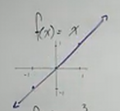
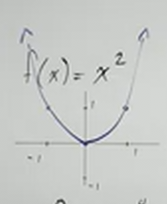
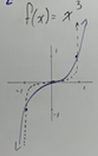
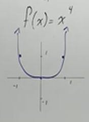
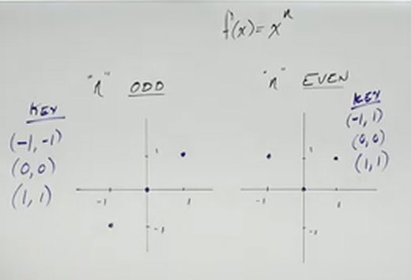
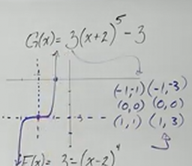
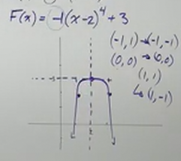

# Power Functions (Precalculus - College Algebra 28)

[Video](https://www.youtube.com/watch?v=FXTlAPOBA_U)

---

Before getting into what _Power Functions_ are, let's first establish that the
reason we are learning about _Power Functions_ is so that we can get a picture
of the end behavior of a polynomial.

When you have a polynomial, and you have found your _Leading Term_, you are
going to use that _Leading Term_ to determine the
[**_end behavior_**](https://mathmonks.com/polynomials/end-behavior-of-polynomials)
of the polynomial, and that _Leading Term_ is what is known as a _Power
Function_.

A _Power Function_ is just a Polynomial with _one term_.

---

## Standard Power Function Graphs

$$ f(x) = ax^n $$

A _Power Function_, once again, is just a Polynomial with _one term_. This means
that they are very easy to graph, and they are very predictable. Let's now look
at some very common _Power Functions_, what they look like, what happens if $n$
is even or odd, and then take in some standard transformations on these
functions.

With each of these functions, to keep things simple, we're simply going to plug
in $1$, $0$, and $-1$ to demonstrate the idea. Here is the standard slope
intercept form of this function.

---

$$ f(x) = x $$

---

$$ f(x) = x^2 $$

---

$$ f(x) = x^3 $$

---

$$ f(x) = x^4 $$

---

You'll notice some pattern here right away given whether $n$ is _odd_ or _even_.

These key points will always be the same depending on whether or not the
function's $n$ is _odd_ or _even_ as long as $a = 1$. So where does the
difference between say $x^1$ and $x^3$ show up?

The difference is the "radicalness" of the exponents themselves. In other words,
as these values for $n$ get higher, these graphs get more dramatic, more
dynamic. While these sort of shapes wouldn't happen at these low values for $x$,
consider that $x^3$ would start to curve around the $x$-axis indicating a slow
increase in values, but then the values of $x$ would dramatically increase. The
graphs above hopefully demonstrate this difference.

Despite this, the general shape still holds true, dependant on whether it is
_odd_ or _even_.

Let's now look at a few examples:

---

**Examples**

---

$$ f(x) = 2x^1 $$

The end behavior is pretty much the same as $f(x) = x^1$, it simply climbes from
$-\infty$ to $\infty$.

---

$$ f(x) = -3x^2 $$

This is a classic parabola, but with a couple of transformations. The negative
_reflects_ the parabola _downwards_ opening, and the $-3$ indicates it is rather
_narrow_.

---

$$ f(x) = -x^3 $$

The _odd_ number for $n$ indicates that we have a climbing function for our end
behavior, but we have a negative coefficient, which means that it is reflected
about the origin, and thusly our function is now dropping from $\infty$ to
$\-infty$.

---

$$ f(x) = 7x^4 $$

This is symmetrical about the $y$-axis like a classic Parabola, but it is more
dramatic in that it climbes exponentially faster, but starts off very slow, like
the "U"-shape we saw in our previous example of $f(x) = x^4$. The only
difference is the transformation of the coefficient of $7$, which means that our
final Parabola is going to be very narrow.

---

The _Domain_ for all of these previous examples is, as it is for all Polynomials
is _all real numbers_ (_i.e._ $(-\infty, \infty)$).

As far as the _Range_ is concerned.

The _Range_ for an _odd_ _Power Function_, would be $(-\infty, \infty)$, but
this is _not true_ for _even_ _Power Functions_. Instead, it ranges from
negative infinity to $0$ _or_ $0$ to positive infinity. This is expressed as:

$$ (-\infty, 0] \cap [0, \infty) $$

Also note that _odd_ _Power Functions_ are _symmetric about the origin_. While
_even_ _Power Functions_ are _symmetric about the $y$-axis_.

---

$$ G(x) = 3(x + 2)^5 - 3 $$

This would be very difficult to distribute, but we can get an idea of the shape
of our graph based off of what we now know about _odd_ _Power Functions_.
Because $n = 5$, and because $n$ is _odd_, we can determine the shape of this
graph to be an every increasing slope that expands from $-\infty$ to $\infty$.
We also know that it is rather narrow due to the coefficient of $3$. We also
know that the graph is shifted about the $x$-axis by $2$ units _to the left_,
and lastly we know that the graph is shifted gy $3$ units _downwards_ along the
$y$-axis.

A rough sketch of this while still plotting proper points of this graph would
look like this:

---

$$ F(x) = 3 - (x - 2)^4 $$

Let's put this in order first:

$$ F(x) = -(x - 2)^4 + 3 $$

What do we know about this function? We know that $n$ is $4$, it is _even_, this
indicates a Parabola like shape that is rather dramatic (meaning it flattens out
about the $x$-axis, but then dramatically climbs). We know that the graph is
_reflected_ due to the negative coefficient. We know that it is shifted _to the
right_ along the $x$-axis by $2$ unhits, and that it is shifted _upwards_ by $3$
units along the $y$-axis.

---

Note that these previous examples are sketches. In order to get a more accurate
picture, we would plug in $0$ for $x$ to find the $y$-intercept, you would plug
in $0$ for $f(x)$ to find the $x$-intercept(s). Note that when $n$ is larger
than $4$, or even then, this is not easy, and oftemtimes this returns not whole
numbers. The numbers can sometimes get so large they are not feasibly graphable.
