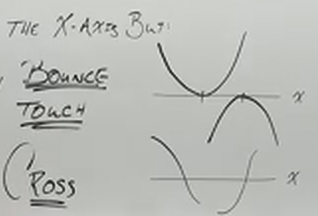
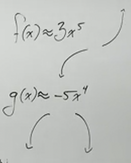

# Multiplicity and End Behavior of Polynomials (Precalculus - College Algebra 29)

[Video](https://www.youtube.com/watch?v=Gxh-mEt1K-o)

---

Here we are going to learn some techniques that will allow us to sketch out
these Polynomials more accurately with minimal work.

Here we are going to define and dive into what is _Multiplicity_ as well as what
is _End Behavior_ and how that affects our turning points of our graphs.

---

## Multiplicity

$$ f(x) = 7x^2(x - 2)\left(x + \frac{1}{2}\right)^4(x + 3)^5 $$

What _Multiplicity_ refers to is a repeated $0$ or _root_ or $x$-intercept in a
Polynomial (or any function). What this means is that if you can factor a
polynomial, and you have the exponent, that exponent is going to determine the
_Multiplicity_ of that $0$, or how many times that $0$ is repeated (we'll cover
this very soon).

Essentially we take all the factors of our function, set them all to $0$, and
look at the exponent. That exponent will determine _Multiplicity_ and will tell
you one of two things. This will tell you whether that $0$ that you get from
every one of your factors (_that has a variable_) will either "bounce" off the
$x$-axis (and not touch it), or if that factor will "cross" the $x$-axis (and
touch it). This is dependant on what your _Multiplicity_ is, whether it is
_even_ or _odd_.

---

Recall that when we want to find the $x$-intercepts of a graph, we set that
function equal to $0$.

$$ 7x^2(x - 2)\left(x + \frac{1}{2}\right)^4(x + 3)^5 = 0 $$

We now can find our $x$-intercepts by setting every factor _that has a variable
in it_ to $0$ and solving for $x$. This is because of the _Zero Product
Property_ that we have utilized in the past.

Fortunately, our Polynomial is already factored here, we will be covering how to
factor Polynomials in a future section.

Keep in mind that we don't include the coefficients when determining the
_Multiplicity_, we _omit_ such coefficients like the $7$ above. In fact,
rewriting this should make it clear:

$$ 7(x)^2(x - 2)\left(x + \frac{1}{2}\right)^4(x + 3)^5 = 0 $$

This is because, while related to graphing, these coefficients have little in
determining the roots/zeroes/_Multiplicity_ of our function.

Thusly from this function we have the following factors that need to be
evaluated for the $x$-intercepts:

$$
\begin{align*}
x = 0 \\
x - 2 = 0 \\
x + \frac{1}{2} = 0 \\
x + 3 = 0
\end{align*}
$$

These are relatively simple to evaluate

$$
\begin{align*}
x = 0 \\
x = 2 \\
x = -\frac{1}{2} \\
x = -3
\end{align*}
$$

These are all the $x$-intercepts we can have on this graph.

Now, this doesn't mean that we have $4$ zeroes on our graph, in fact we have
$12$ zeroes. But how? Adding up all of our exponents equals $12$, and while this
doesn't show us how many $x$-intercepts it has, it shows us how many times our
function evaluates to $0$. Consider the following partial expansion of our
function to demonstrate:

$$ f(x) = 7 \cdot x \cdot x \cdot (x - 1) \cdot \left(x + \frac{1}{2}\right) \cdot \left(x + \frac{1}{2}\right) \cdot \left(x + \frac{1}{2}\right) \cdot \left(x + \frac{1}{2}\right) \text{ ...}$$

Consider just the beginning of this function:

$$ f(x) = 7 \cdot x \cdot x \text{ ...} $$

This $x$ is a "repeated zero", each time each is equivalent to $0$ when solving
for the $x$-intercepts, and thusly is counted as one of our "zeroes" when
determining the _Multiplicity_ of this function, and this determines what
happens with our graph. Again, depending on how many times that zero is repeated
will determine whether or not and how many times our graph bounces of crosses
the $x$-axis.

Essentially this means, that exponents mean we have a _repeated factor_,
specifically repeated $n$ times.

We could express our function's multiplicity like so:

$$
\begin{align*}
x = 0 \quad \text{Mult. } 2 \\
x = 2 \quad \text{Mult. } 1 \\
x = -\frac{1}{2} \quad \text{Mult. } 4 \\
x = -3 \quad \text{Mult. } 5
\end{align*}
$$

We will now take note of whether the _Multiplicity_ is _even_ or _odd_ here. The
number $n$ doesn't really matter, but the property of this number matters, as it
indicates this "bounce" or "cross" property.

1. Roots with _Even_ _Multiplicity_ always _Bounce_ the $x$-axis, it will _Not
   Cross_ the $x$-axis. This is due to the fact that even number exponents can
   take either positive or negative signs and output the same number, this
   creates something _akin_ to, but not exactly, symmetry about the $y$-axis.

2. Roots with _Odd_ _Multiplicity_ will always _Cross_ the $x$-axis at that
   point. This is because odd exponents always maintain the sign of it's
   coefficient.

---

## End Behavior

What End Behavior means is, in the context of Polynomial Functions (where our
_Domain_ is _all real numbers_), will be one of four possible cases:

1. You can start from $-\infty$ and go to $\infty$ along the $y$-axis.

2. You can start from $-\infty$ and go back to $-\infty$ along the $y$-axis.

3. You can start from $\infty$ and got to $-\infty$ along the $y$-axis.

4. You can start from $\infty$ and go back to $\infty$ along the $y$-axis.

And lo and behold, we can determine _End Behavior_ by looking at our _Leading
Term_ of our _Polynomial_.

Consider:

$$ f(x) = 3x^5 - 2x^2 + 1 $$

This Polynomial is already in order, so we know that our _Leading Term_ is
$3x^5$.

Consider:

$$ g(x) = -2x^3 - 5x^4 + 7 $$

This is out of order, let's put it in order.

$$ g(x) = -5x^4 - 2x^3 + 7 $$

Our _Leading Term_ is $-5x^4$.

Let's return to the first example here:

$$ f(x) = 3x^5 - 2x^2 + 1 $$

The _End Behavior_ of this function is determined by our _Leading Term_. In
fact, we could approximate this by the following statement:

$$ f(x) \approx 3x^5 $$

And we could approximately $g(x)$ like so:

$$ g(x) \approx -5x^4 $$

Again, this indicates _End Behavior_. It is not specific to the point where the
graph turns about the origin/$y$-axis. Instead it gives you an idea of what the
shape of your graph will be at it's _Ends_.

That said, when combined with _Multiplicity_, then we only need to find the
$y$-intercept and the $x$-intercepts to be able to get a very accurate picture
of our graph without having to plug in a lot of points.

---

## A Brief Note On Turning Points

A _Turning Point_ in a graph is where we have a _Local Maximum_ and a _Local
Minimum_ where we change either from increasing to decreasing or from decreasing
to increasing along the $y$-axis. Again, our _Leading Term_ gives us answer as
to this feature of our graph. There will be _at most_ $n - 1$ _Turning Points_
on our graph.

Also note that every Polynomial will always create _Continuous_ curves with no
"Cusps". In other words, a Polynomial will have no Asymptotes where it cannot
cross. Again, Polynomials include _all real numbers_.

---

## A Word On Fake Distribution

Fake distribution is a method Professor Leonard touts as being a quick and easy
way to get your _Leading Term_ without having to go through the hassle of
actually distributing our function. Take the original example from before:

$$ f(x) = 7x^2(x - 2)\left(x + \frac{1}{2}\right)^4(x + 3)^5 $$

We can simply multiply each of the expononents by the _Leading Constant_ and
this will be our _Leading Term_:

$$ 7 \cdot x^2 \cdot x^1 \cdot x^4 \cdot x^5 $$

This gives us $7x^{12}$, which is our _Leading Coefficient_ and can help us
determine the _End Behavior_ of our graph.
