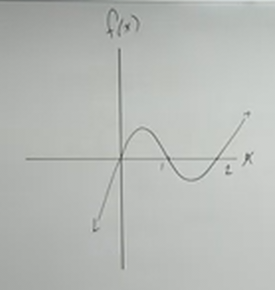
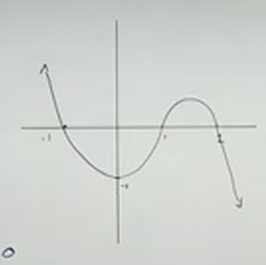
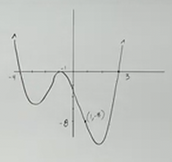

# Creating Polynomials from Real Zeros (Precalculus - College Algebra 30)

[Video](https://www.youtube.com/watch?v=v-pnhWbHmQ8)

---

In this section, we are going to look of some examples of where we can take the
$x$-intercepts of a graph and convert it into a _Polynomial Function_.

We'll start by revisiting how _Factoring_ and the _Zero Product Property_ give
us the $x$-intercepts.

We will learn here that if you have an $x$-intercept, you can create a _Factor_,
and using the _Zero Product Property_, we can take those _Factors_ and build a
_Polynomial_ from it.

We will also be able to use the methods learned here to build _Rational
Functions_ in a future section.

Let's dive in with an example:

---

$$ f(x) = x^2 + 2x - 8 $$

We start this off in familiar territory, by setting our function to $0$:

$$ x^2 + 2x - 8 = 0 $$

In this case, we have a _Quadratic Function_, which means, conveniently, that if
we have trouble factoring, we can just use the _Quadratic Formula_ to find our
$x$-intercepts.

There are ways to determine factors of $x^3$, and $x^4$, but admittedly, they
can be rather cumbersome.

With polynomials of degree $5$ and above, however, there is no general way to
factor the function. You can do it, but it requires some rather high level
Mathematics that we will not get into here.

Let's factor this example.

$$ (x + 4)(x - 2) = 0 $$

As we have discussed in previous sections, we can set each of these factors to
equal to $0$ thanks to the _Zero Prod Property_ and we will get back two _real_
$x$-intercepts.

$$ x + 4 = 0 $$

$$ x = -4 $$

$$ x - 2 = 0 $$

$$ x = 2 $$

These represent two $x$-intercepts where our graph crosses the $x$-axis.
Specifically at $(-4, 0)$ and $(2, 0)$.

But let's say we were only given these two points and were asked to contruct the
Polynomial Function from them? Can you go backwards and find the function from
it? Yes. Let's dive into this with another example:

---

Let's suppose that we have $x$-intercepts of:

$$ \left\{-3, 4, 1, 0\right\} $$

Here we can use the _Zero Product Property_, but in reverse of our usual
factoring solutions.

We know from our problem statement that for some polynomial, we will get these
$x$-intercepts:

$$
\begin{align*}
x = -3 \\
x = 4 \\
x = 1 \\
x = 0 \\
\end{align*}
$$

We can now work in reverse and get $0$ to one side and everything else on the
other:

$$
\begin{align*}
x + 3= 0 \\
x - 4 = 0 \\
x - 1 = 0 \\
x = 0 \\
\end{align*}
$$

We can then, based off of what we know about the _Zero Product Property_,
multiply these factors together to get **_a_** _Polynomial Function_. Note that
it is not the _only_ _Polynomial Function_, but **_a_** _Polynomial Function_.

$$ x(x + 3)(x - 4)(x - 1) = 0 $$

And then we could define our function:

$$ f(x) = x(x + 3)(x - 4)(x - 1) $$

Now, note that we said this was **_a_** _Polynomial_. The reason is because we
can have _any_ _Leading Coefficient_, and we will still have the same
$x$-intercepts. So:

$$ f(x) = 7x(x + 3)(x - 4)(x - 1) $$

Will have the same $x$-intercepts as:

$$ f(x) = 9x(x + 3)(x - 4)(x - 1) $$

It does not matter. It will affect the _shape_ of our graph (narrowness). It
would also affect whether we _reflect_ our graph, and also it would affect the
_End Behavior_ of our graph, but it won't affect our $x$-intercepts.

Unless we have a specific point given to us in our problem statement that is on
our graph, this leaves us with having a _variable_, an unknown coefficient,
which we can signify with the letter $a$.

$$ f(x) = ax(x + 3)(x - 4)(x - 1) $$

This indicates a sort of _family_ of functions that all have the same
$x$-intercepts.

Now, if we do have a point, then we can have _only_ one _Polynomial_, and we
will cover that in a future section when we graph these. As an aside, this will
depend on whether or not the point given to us is an $x$-intercept or not, but
we'll get there in a future section.

Should you be asked to then distribute your function, it is recommended that you
start on the right hand side and work towards the left, continuously
distributing as you go.

---

Here is another example with slightly different terminology in the problem
statement, and they also give us the _Degree_:

Suppose you have Zeroes of:

$$ \left\{-1, 0, 4, -9\right\} $$

With a _Degree_ of $4$.

Recall that we can call our set here Zeroes, Roots, or $x$-intercepts. They all
mean the same thing, at least when they are _real numbers_.

Based off our set as before we can determine the values of $x$ easily:

$$
\begin{align*}
x = -1 \\
x = 0 \\
x = 4 \\
x = -9 \\
\end{align*}
$$

And then we can produce our factors easily:

$$
\begin{align*}
x + 1= 0 \\
x = 0 \\
x - 4 = 0 \\
x + 9 = 0 \\
\end{align*}
$$

And then we can say that these are factors of some Polynomial.

$$ x(x + 1)(x - 4)(x + 9) = 0 $$

Because we are not given a specific point on our graph, we can only say that
this is one of many possible Polynomials that would have these zeroes. Thusly we
could express one of the potential functions that satisfies this like so:

$$ \boxed{f(x) = ax(x + 1)(x - 4)(x + 9)} $$

The _Degree_ given to us in the problem statement, $4, now saves us some work.
What this tells us is that we should have _at most_ $4$ factors. Without this
additional information, we could in theory tack on irreducible factors to our
polynomial which could potentially give us zeroes that are not factorable and
also potentially complex numbers (complex zeroes...we'll get to it later).

In other words, without limiting the amount of _Degrees_ of our Polynomial, we
could technically tack on as many factors to our Polynomial as we'd like, as
long as we had at least the zeroes specified in our problem statement, and they
continued to follow the other rules of a Polynomial established earlier.

This might look like:

$$ f(x) = ax(x + 1)(x - 4)(x + 9)(x^2 + 9)(x^2 + 5) $$

---

What if we are now given _Zeroes_ with _Multiplicity_ and _Degrees_? This is no
more difficult to solve, it just gives us more constraints on how to express our
solution Polynomial.

Suppose you have the following _Zeroes_, with the _Degree_ of $3$:

$$
\begin{align*}
x = 1 \text{Mult: } 1 \\
x = 2 \text{Mult: 2} \\
\end{align*}
$$

We can then find our factors as before:

$$
\begin{align*}
x - 1 = 0 \\
x - 2 = 0 \\
\end{align*}
$$

And then write the factored equation like so:

$$ (x - 1)(x - 2) = 0 $$

The multiplicity now tells us how many times this $x$-intercept is repeated,
thusly we can take our multiplicity and put it on as an exponent:

$$ (x - 1)^1(x - 2)^2 = 0 $$

Of course, we can omit an exponent of $1$, but you get the idea. Now we just
write our Polynomial in function form:

$$ f(x) = a(x - 1)(x - 2)^2 $$

And the _Degree_ should simply be checked. This indicates that we should only
have $3$ factors. The repeated factor of $(x - 2)$ counts as a third factor
here.

---

One last example:

Let's say you have _Zeroes_ with _Multiplicities_ of:

$$
\begin{align*}
x = -2 \text{ Mult: } 2 \\
x = 5 \text{ Mult: } 1 \\
x = 0 \text{ Mult: } 3 \\
x = \frac{1}{2} \text{ Mult: } 3 \\
\end{align*}
$$

With a _Degree_ of $9$. Express this as a Polynomial Function.

$$
\begin{align*}
x + 2 = 0 \\
x - 5 = 0 \\
x = 0 \\
x - \frac{1}{2} = 0 \\
\end{align*}
$$

$$ x(x + 2)(x - 5)\left(x - \frac{1}{2}\right) = 0 $$

$$ x^3(x + 2)^2(x - 5)^1\left(x - \frac{1}{2}\right)^3 = 0 $$

$$ f(x) = ax^3(x + 2)^2(x - 5)\left(x - \frac{1}{2}\right)^3 $$

---

**Taking $x$-intercepts from a Graph and constructing Polynomials**

Similar to before, we can take $x$-intercepts from a graph and construct a
polynomial. Typically we need to also have a point on our graph that doesn't lie
on the $x$-axis to be able to accomplish this.

Usually we limit the exponents to $4$ and below in order to keep things simple
when expressing these polynomials.

Consider the following graph:

Our $x$-intercepts here are $x = 0$, $x = 1$, and $x = 2$.

And this is very similar to what we have dealt with previously. We know these
intercepts come from factors:

$$
\begin{align*}
x = 0 \\
x - 1 = 0 \\
x - 2 = 0 \\
\end{align*}
$$

And thusly:

$$ x(x - 1)(x - 2) = 0 $$

Now, because we have no degree given, technically we could add irreducible
factors, but our turning points in the graph suggest we have a degree of $3$.
They don't outright state we do (it could bounce or cross the $x$-axis at some
other point on the graph), but it's unlikely.

Note that the graph _Crosses_, and this means that our degree is an _odd_ power
_Multiplicity_.

$$ f(x)  = ax(x - 1)(x - 2) $$

---

Consider the next graph:

This one is a bit different in that we do have a point that is off of the
$x$-axis, meaning that we actually can solve for $a$. Let's start as before:

$$
\begin{align*}
x = -1 \\
x = 1 \\
x = 2 \\
\end{align*}
$$

Note the other point specified at this point, $(0, -1)$.

Now let's determine our factors:

$$
\begin{align*}
x + 1 = 0 \\
x - 1 = 0 \\
x - 2 = 0 \\
\end{align*}
$$

This is an _odd_ degree, as it only has _two_ turning points. It is probably a
$3$ degree. And it is probably a negative degree as it starts from $\infty$ and
ends in $-\infty$.

$$ f(x) = a(x + 1)(x - 1)(x - 2) $$

Wherever the graph _Crosses_ the $x$ axis, we have an _odd_ power, which we can
leave as the power of $1$ for the sake of simplicity.

$$ f(x) = a(x + 1)^1(x - 1)^1(x - 2)^1 $$

Since these are just degrees of one, we can leave it as before.

$$ f(x) = a(x + 1)(x - 1)(x - 2) $$

Now we can use the point given to us (off of the $x$-axis) to determine the
value of $a$. Again, our point is $(0, -1)$. Recall that all points are actually
$(x, f(x))$. Thusly we can plug our point values in for $x$ and $f(x)$ to find
$a$.

$$ -1 = a(0 + 1)(0 - 1)(0 - 2) $$

$$ -1 = a(1)(-1)(-2) $$

a$ -1 = a(1)(2) $$

$$ -1 = 2a $$

$$ -\frac{1}{2}= a $$

And thusly our final Polynomial is:

$$ f(x) = -\frac{1}{2}(x + 1)(x - 1)(x - 2) $$

Note that this is _one exact graph_, not a family of polynomials, thanks to
finding the value of $a$.

---

Consider the following graph:

Let's start out by listing out or $x$-intercepts:

$$
\begin{align*}
x = -4 \\
x = -1 \\
x = 3 \\
\end{align*}
$$

Note here where we _Cross_ vs. where we _Bounce_ on the $x$-axis on our graph,
this will indicate whether we have an _even_ or _odd_ _Multiplicity_ at that
point.

Also note that we have a point off the $x$-axis. You may note that we do have a
point touching the $y$-axis, but we don't have a specific unit number shown to
us, and so we should _not_ guess. Instead, we _are_ given the point of
$(1, -8)$, so we'll use that later to get our final function. Let's build our
factors:

$$
\begin{align*}
x + 4 = 0 \\
x + 1 = 0 \\
x - 3 = 0 \\
\end{align*}
$$

And our function forms first like so:

$$ f(x) = a(x + 4)(x + 1)(x - 3) $$

We know that where our graph crosses the $x$-axis at $-4$, that it _Crosses_,
and thusly we have an _odd_ multiplicity. We therefore will choose $1$ as the
exponent for that factor:

$$ f(x) = a(x + 4)^1(x + 1)(x - 3) $$

Then, when the graph meets the $x$-axis again at $(-1, 0)$, we see that it
_Bounces_ or _Touches_ the $x$-axis. This indicates an _even_ multiplicity, and
thusly we will choose $2$ for the exponent of this factor:

$$ f(x) = a(x + 4)^1(x + 1)^2(x - 3) $$

We could choose $4$ for our exponent, or any even number exponent, but the
turning points on our graph always indicate that we have $n - 1$ _Turning
Points_. If we look at our graph, we notice that we have $3$ turning points, and
therefore we probably have a degree of $4$. Also we start at $\infty$ and end at
$\infty$, indicating that we have an _even_ _Degree_.

And again, we cross at the point $(3, 0)$, which indicates another _odd_
multiplicity, and we will choose the exponent of $1$ again:

$$ f(x) = a(x + 4)^1(x + 1)^2(x - 3)^1 $$

$$ f(x) = a(x + 4)(x + 1)^2(x - 3) $$

aow we can use our specific point (not on the $x$-axis) to solve for $a$.

$$ -8 = a(1 + 4)(1 + 1)^2(1 - 3) $$

$$ -8 = a(5)(2)^2(-2) $$

$$ -8 = a(5)(4)(-2) $$

$$ -8 = a(5)(-8) $$

$$ -8 = -40a $$

$$ \frac{1}{5} = a $$

And our final specific Polynomial function is:

$$ f(x) = \frac{1}{5}(x + 4)(x + 1)^2(x - 3) $$
