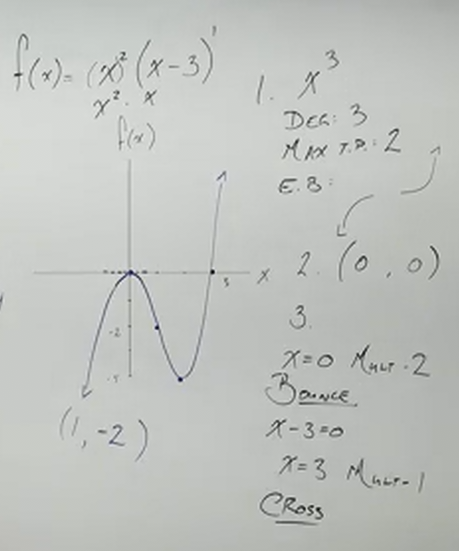

# How to Sketch Polynomial Functions (Precalculus - College Algebra 31)

[Video](https://www.youtube.com/watch?v=6MAtqY6Fqjs)

---

Here we will finally sketch out some graphs from everything we've learned about
_Polynomials_ in the previous sections. These concepts will be the building
blocks off of which we work with _Rational Functions_ and will go even
furthermore in Calculus where you will be asked "where are your _Turning Points_
of this function, how do you find that?" For now we will be simply estimating
these points for now, but given what we know about Polynomials thus far,
hopefully we can at least get an accurate sketch of our graphs.

Let's start, with a somewhat intimidating example.

---

$$ h(x) = -2(x - 7)\left(x + \frac{1}{2}\right)^2(x + 4)^3(x^2 + 9)^2 $$

Don't worry, we're not actually going to graph this (you'll see why when we
determine the $y$-intercept). But this will give us an idea about how to think
about these sorts of problems.

First let's do a bit of groundwork, and determine what we know about this
function thus far.

**1. Leading Term:**

    a. Degree:

    b. Maximum Amount Of Turning Points

    c. Ending Behavior

**2. $y$-intercept**

$$ (0, ?) $$

**3. $x$-intercept(s)**

Let's start off by finding the _Leading Term_. Remember we don't have to
distribute this entire function, but instead can use _Fake Distribution_ to do
so. You simply have to add up all exponents (unless they have an exponent also
inside the parentheses, in which case you must multiply beforehand). You can
then take the _Leading Coefficient_ and multiply it by $x$ to that power, and
you will have your _Leading Term_.

$$ -2 \cdot x^1 \cdot x^2 \cdot x^3 \cdot (x^2)^2 $$

$$ -2 \cdot x^1 \cdot x^2 \cdot x^3 \cdot x^{2 \cdot 2} $$

$$ -2 \cdot x^1 \cdot x^2 \cdot x^3 \cdot x^4 $$

This leaves us with our _Leading Term_:

$$ -2x^{10} $$

We can now determine quite a bit about our Polynomial from this.

Our _Degree_ is $10$.

Our _Maximum Amount Of Turning Points_ is $9$.

And our _End Behavior_ can also be determined by our _Degree_. An _Even Degree_
indicates that we go from one infinity to another, but in the case of the
coefficient being $-2$, we can determine that this opens downards and is a
little narrow, thusly it goes from $\-infty$ to $-\infty$.

Now we determine the $y$-intercept by simply setting all our $x$'s to $0$, and
we would get an insanely large number:

$$ y\text{-intercept: } (0, 18144) $$

So...yeah, we're not graphing that, but this is mainly just to walk you through
the process.

Let's now move onto finding the $x$-intercepts:

Finding our $x$-intercepts is very straight forward if our function is already
factored. We simply set our funtion equal to $0$, then set all our factors equal
to $0$, and find the values of our $x$-intercept(s).

$$
\begin{align*}
x - 7 = 0 \\
x + \frac{1}{2} = 0 \\
x + 4 = 0 \\
x^2 + 9 = 0 \\
\end{align*}
$$

Solving these results in:

$$
\begin{align*}
x = 7 \\
x = -\frac{1}{2} \\
x = -4 \\
x = 3i \\
\end{align*}
$$

But we can't have a complex number on our graph... thusly the $x^2 + 9$ factor
is an irreducable quadratic. This will not give us any _real_ $x$-intercepts.
This likely results in a small "bump" in our graph. This is more a subject
covered in Calculus, so we'll forego the full explanation for now, but just keep
this in mind going forward.

We can now deterine the _Multiplicity_ of each of our factors:

$$
\begin{align*}
x = 7 \text{ Mult: } 1 \\
x = -\frac{1}{2} \text{ Mult: } 2 \\
x = -4 \text{ Mult: } 3 \\
x^2 + 9 = 0 \\
\end{align*}
$$

Note that we omit the Multiplicity on the last factor $x^2 + 9$. The reason for
this is because Multiplicity really only gives us information on our
$x$-intercepts, and this factor yields no $x$-intercepts, we don't have to
bother (until we reach Calculus at least...).

We can then use our multiplicity to determine whether our graph _Bounces_ or
_Crosses_ the $x$-intercept. Every _Even_ Multiplicity _Bounces_, and every
_Odd_ Multiplicity _Crosses_. Remember this.

$$
\begin{align*}
x = 7 \text{ Mult: } 1 \text{, Cross } \\
x = -\frac{1}{2} \text{ Mult: } 2 \text{, Bounce } \\
x = -4 \text{ Mult: } 3 \text{, Cross }\\
x^2 + 9 = 0 \\
\end{align*}
$$

Note that if we changed $(x^2 + 9)^2$ to $(x^2 - 9)^2$. $x^2 - 9$ _is
factorable_!!

$$ (x + 3)(x - 3) $$

And this whole expression is squared:

$$ \left[(x + 3)(x - 3)\right]^2 $$

And therefore this would change our entire final function to:

$$ h(x) = -2(x - 7)\left(x + \frac{1}{2}\right)^2(x + 4)^3(x + 3)^2(x - 3)^2 $$

Very quickly, this would add two $x$-intercepts to our function, and they would
be bounces. It would _not_ change the _End Behavior_ of our function.

Let's now move onto a more simple example that we _can_ graph.

---

$$ f(x) = x^2(x - 3) $$

Let's determine our _Leading Term_. Using fake distribution:

$$ x^2 \cdot x $$

So our leading term is $x^3$.

**Leading Term:** $x^3$

The _Degree_ is $3$.

**Degree:** $3$

The _Maximum Number Of Turning Points_ is therefore $2$.

**Maximum Number Of Turning Points:** $2$

Our _End Behavior_ indicates that we go from $-\infty$ to $\infty$ as our
_Degree_ is _Odd_, and our _Leading Coefficient_ is positive.

**End Behavior:**

$$
\begin{align*}
\text{As } x \rightarrow -\infty, f(x) \rightarrow -\infty \\
\text{and as } x \rightarrow \infty, f(x) \rightarrow \infty \\
\end{align*}
$$

Now let's find our $y$-intercept:

We can determine our $y$-intercept by simply plugging in $0$ for $x$:

$$ f(0) = (0)^2(0 - 3) $$

$$ f(0) = 0(-3) $$

$$ f(0) = 0 $$

And thusly our $y$-intercept is $(0, 0)$.

**$\textbf{y}$-intercept:** $(0, 0)$.

And now we can find our $x$-intercepts. We can find this by setting every factor
to $0$, (as we set the entire function, $f(x)$, to equal $0$).

$$ x^2(x - 3) = 0 $$

$$
\begin{align*}
x = 0 \\
x = 3 \\
\end{align*}
$$

We can now determine the _Multiplicity_ of each factor:

$$
\begin{align*}
x = 0 \text{ Mult: } 2 \\
x = 3 \text{ Mult: } 1 \\
\end{align*}
$$

And from here we can use the _Multiplicity_ to determine whether or graph
_Bounces_ or _Crosses_ at the $x$-intercepts. Again, _Odd_ Multiplicities
_Cross_, while _Even_ Multiplicities_ _Bounce_.

$$
\begin{align*}
x = 0 \text{ Mult: } 2 \text{, Bounce } \\
x = 3 \text{ Mult: } 1 \text{, Cross } \\
\end{align*}
$$

We then can start graphing. Again, this will be a sketch, but we do have some
points. Namely, the $y$-intercept and some $x$-intercepts. If we plot these,
while keeping our _End Behavior_, _Bounces_, and _Crosses_ in mind, we can get a
pretty decent sketch of our graph.

If many of these intercepts overlap, then what we need to do is plug in some
values to get an idea of what our graph is doing. It's not ideal, but it might
be necessary like with this graph, in which we have both a $y$-intercept and one
of the $x$-intercepts overlapping.

At this point, we haven't taken the Calculus to determine the local minimums and
maximums of our curves, thusly when we do plug in values to determine the shape
of our graph at this point, we don't know if they are our local minimums or
maximums. Don't assume that they are. You can sketch them as if they are, but
they are unlikely to actually be so.

Our finalized sketch would look something like this:

Let's now hammer home our ideas here with a few more examples.

---

$$ f(x) = -2(x + 2)(x - 2)^3 $$

**1. Leading Term:**

    a. Degree:

    b. Maximum Amount Of Turning Points

    c. Ending Behavior

**2. $y$-intercept**

**3. $x$-intercept(s)**

_Leading Term Logic:_

$$ x^1 \cdot x^3 = x^4 $$

**Leading Term:** $-2x^4$

**Degree:** $4$

**Maximum Number Of Turning Points:** $3$

**Ending Behavior:**

$$
\begin{align*}
\text{As } x \rightarrow -\infty, f(x) \rightarrow -\infty \\
\text{and as } x \rightarrow \infty, f(x) \rightarrow -\infty \\
\end{align*}
$$

_$y$-intercept logic:_

$$ f(0) = -2(0 + 2)(0 - 2)^3 $$

$$ f(0) = -2(2)(-2)^3 $$

$$ f(0) = -2(2)(-8) $$

$$ f(0) = -2(-16) $$

$$ f(0) = 32 $$

**$\textbf{y}\text{-intercept: }$** $(0, 32)$

_$x$-intercepts logic:_

$$ -2(x + 2)(x - 2)^3 = 0 $$

$$
\begin{align*}
x + 2 = 0 \\
x - 2 = 0 \\
\end{align*}
$$

$$
\begin{align*}
x = -2 \\
x = 2 \\
\end{align*}
$$

$$
\begin{align*}
x = -2 \text{ Mult: } 1 \\
x = 2 \text{ Mult: } 3 \\
\end{align*}
$$

$$
\begin{align*}
x = -2 \text{ Mult: } 1 \text{, Cross} \\
x = 2 \text{ Mult: } 3 \text{, Cross} \\
\end{align*}
$$

---

$$ h(x) = (x + 4)^2(1 - x) $$

Get it in proper form first to ensure no sign errors:

$$ h(x) = (x + 4)^2(-x + 1) $$

$$ h(x) = (x + 4)^2-1(x - 1) $$

$$ h(x) = -1(x + 4)^2(x - 1) $$

**1. Leading Term:**

    a. Degree:

    b. Maximum Amount Of Turning Points

    c. Ending Behavior

**2. $y$-intercept**

**3. $x$-intercept(s)**

_Leading Term Logic:_

$$ -1 \cdot x^2 \cdot x $$

**Leading Term:** $-x^3$

**Degree:** $3$

**Maximum Amount Of Turning Points:** $2$

**End Behavior:**

$$
\begin{align*}
\text{As } x \rightarrow -\infty, h(x) \rightarrow \infty \\
\text{and as } x \rightarrow \infty, h(x) \rightarrow -\infty \\
\end{align*}
$$

_$y$-intercept logic:_

$$ h(0) = -1(0 + 4)^2(0 - 1) $$

$$ h(0) = -1(4)^2(-1) $$

$$ h(0) = -1(16)(-1) $$

$$ h(0) = -1(-16) $$

$$ h(0) = 16 $$

**$y$-intercept:** $(0, 16)$

_$x$-intercepts logic:_

$$ -1(x + 4)^2(x - 1) = 0 $$

$$
\begin{align*}
x + 4 = 0 \\
x - 1 = 0 \\
\end{align*}
$$

$$
\begin{align*}
x = -4 \\
x = 1 \\
\end{align*}
$$

$$
\begin{align*}
x = -4 \text{ Mult: } 2 \\
x = 1 \text{ Mult: } 1 \\
\end{align*}
$$

$$
\begin{align*}
x = -4 \text{ Mult: } 2 \text{ Bounce } \\
x = 1 \text{ Mult: } 1 \text{ Cross } \\
\end{align*}
$$

---

$$ f(x) = -5x(x^2 - 4)(x + 3) $$

**1. Leading Term:**

    a. Degree:

    b. Maximum Amount Of Turning Points

    c. Ending Behavior

**2. $y$-intercept**

**3. $x$-intercept(s)**

_Leading Term Logic:_

$$ -5 \cdot x^1 \cdot x^2 \cdot x^1 $$

**Leading Term:** $-5x^4$

**Degree:** $4$

**Maximum Amount Of Turning Points:** $3$

**End Behavior:**

$$
\begin{align*}
\text{As } x \rightarrow -\infty, f(x) \rightarrow -\infty \\
\text{and as } x \infty \rightarrow , f(x) \rightarrow -\infty \\
\end{align*}
$$

_$y$-intercept logic:_

$$ f(0) = -5(0)(0^2 - 4)(0 + 3) $$

$$ f(0) = -5(0)(-4)(3) $$

$$ f(0) = 0 $$

**$y$-intercept:** $(0, 0)$

_$x$-intercepts logic_:

$$ -5x(x^2 - 4)(x + 3) = 0 $$

$$ -5x(x + 2)(x - 2)(x + 3) = 0 $$

$$
\begin{align*}
x = 0 \\
x + 2 = 0 \\
x - 2 = 0 \\
x + 3 = 0 \\
\end{align*}
$$

$$
\begin{align*}
x = 0 \\
x = -2 \\
x = 2 \\
x = -3 \\
\end{align*}
$$

**$x$-intercepts:**

$$
\begin{align*}
x = 0 \text{ Mult: } 1 \text{, Cross } \\
x = -2 \text{ Mult: } 1 \text{, Cross } \\
x = 2 \text{ Mult: } 1 \text{, Cross } \\
x = -3 \text{ Mult: } 1 \text{, Cross } \\
\end{align*}
$$

---

$$ g(x) = 2(x - 1)^2(x^2 - 16) $$

**1. Leading Term:**

    a. Degree:

    b. Maximum Amount Of Turning Points

    c. Ending Behavior

**2. $y$-intercept**

**3. $x$-intercept(s)**

_Leading Term Logic:_

$$ 2 \cdot x^2 \cdot x^2 $$

**Leading Term:** $2x^4$

**Degree:** $4$

**Maximum Amount Of Turning Points:** $3$

**End Behavior:**

$$
\begin{align*}
\text{As } x \rightarrow -\infty, g(x) \rightarrow \infty \\
\text{and as } x \rightarrow \infty, g(x) \rightarrow \infty \\
\end{align*}
$$

_$y$-intercept logic:_

$$ g(0) = 2(0 - 1)^2(0^2 - 16) $$

$$ g(0) = 2(-1)^2(-16) $$

$$ g(0) = 2(1)(-16) $$

$$ g(0) = 2(-16) $$

$$ g(0) = -32 $$

**$y$-intercept:** $(0, -32)$

_$x$-intercepts logic_:

$$ g(x) = 2(x - 1)^2(x + 4)(x - 4) $$

$$
\begin{align*}
x - 1 = 0 \\
x + 4 = 0 \\
x - 4 = 0 \\
\end{align*}
$$

$$
\begin{align*}
x = 1 \\
x = -4 \\
x = 4 \\
\end{align*}
$$

**$x$-intercepts:**

$$
\begin{align*}
x = 1  \text{ Mult: } 2 \text{, Bounce} \\
x = -4 \text{ Mult: } 1 \text{, Cross}  \\
x = 4  \text{ Mult: } 1 \text{, Cross} \\
\end{align*}
$$

The values here would be quite dramatic, so this is a very rough sketch:

