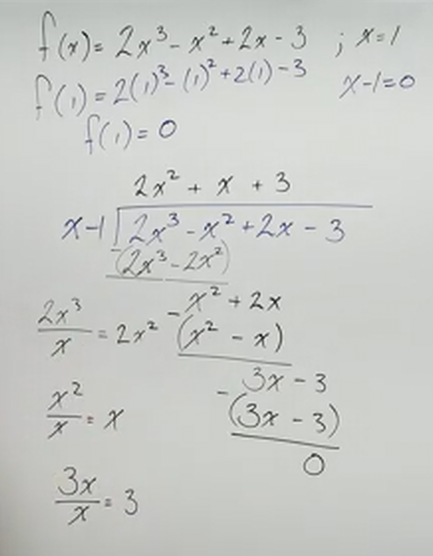
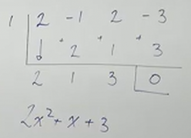
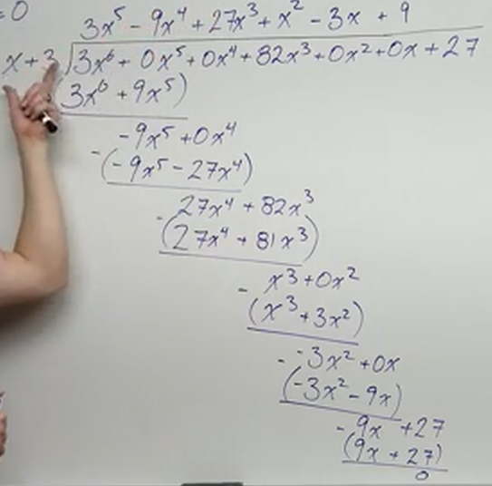
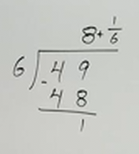
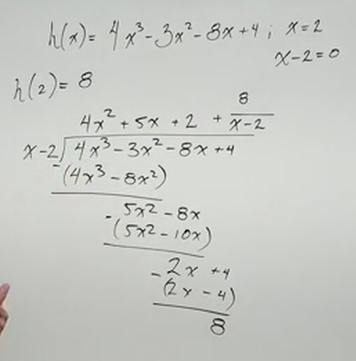
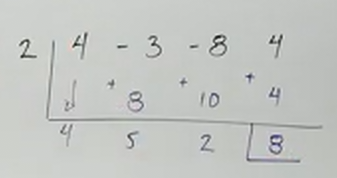

# Synthetic Division and Long Division of Polynomials (Precalculus - College Algebra 32)

[Video](https://www.youtube.com/watch?v=AKJgo-WR_K4)

---

Synthetic Division is a very fast version of Division that allows us to find
$x$-intercepts (find factors) of a Polynomial Function as long as we set it up
under certain conditions.

You can use both regular division and synthetic division to find $x$-intercepts
of a Polynomial Function, and that is what we're going to do here today.

Let's briefly cover, however, the _Factor Theorem_, which states:

> If, upon division, you get a remainder of $0$, your divisor is a factor of
> your dividend.

---

**A Basic Example:**

$$ 48 \div 6 = 8 \text{ REMAINDER: } 0 $$

This means that $6$ is indeed a factor of $48$.

---

But let's say we have a less trivial example:

$$ f(x) = 2x^3 - x^2 + 2x - 3 \text{ ; } x = 1 $$

This is obviously not easily factorable, and while there are methods to factor
out a cubic function like this, they are quite involved and outside the scope of
this Precalculus course. Instead we are going to use what is known as the
[**_Rational Zeroes Theorem_**](https://www.sparknotes.com/math/algebra2/polynomials/section4/)
that gives us a list of rational numbers that could potentially be zeroes
(factors).

Given the above expression, let's now evaluate it.

The first step is to see if $x = 1$ is an $x$-intercept of $f(x)$. If we plug in
$x = 1$, and get back $0$, we have an $x$-intercept.

$$ f(1) = 2(1)^3 - (1)^2 + 2(1) - 3 $$

$$ f(1) = 2(1) - (1) + 2 - 3 $$

$$ f(1) = 2 - 1 + 2 - 3 $$

$$ f(1) = 1 + 2 - 3 $$

$$ f(1) = 3 - 3 $$

$$ f(1) = 0 $$

And indeed we do, thusly $x = 1$ is an $x-intercept of $f(x)$. Specifically the
point $(1, 0)$.

This means that one of the factors of our Polynomial, $f(x)$ is $(x - 1)$

**Note:** Because traditional long division is hard to write in Latex, I'll
simply be posting a picture of the operations from Professor Leonard's Lecture
Video when evaluating this Polynomial.

Now, note here how he makes sure to wrap his drop down expressions in
parentheses, this is because we want to ensure we don't have any sign errors. We
are subtracting entire polynomials, not just the terms.

As you can see, the remainder of this long division does end up being $0$, and
we have found that our quotient is a new factor which we can further evaluate
(using the Quadratic formula or further division, but you'd need another
$x$-intercept to do further division) to find more factors.

The new factor yielded is:

$$ 2x^2 + x + 3 $$

And we can rewrite our function as:

$$ f(x) = (x - 1)(2x^2 + x + 3) $$

Just for your information, if we try to use the _Quadratic Formula_ on this new
factor, we'll find that this is an _irreducable quadratic_ as it yields a
complex number.

---

## Synthetic Division

Synthetic division is highly effective and very fast, but it does have a few
caveats before we can perform it. One is that it requires that our coefficient
for $x$ be $1$. You also need at least one $x$-intercept. one expression where
$x = ?$. Otherwise we have no way of doing synthetic division.

To perform Synthetic Division, first we take the coefficients of our Polynomial
and we place them in a table along the first row:

| $r$ | $x^3$ | $x^2$ | $x$ | $R$ |
| --- | ----- | ----- | --- | --- |
| 1   | 2     | -1    | 2   | -3  |

The $r$ represents what we are dividing into. If our $x$-intercept is
represented by the expression $x - 1 = 0$, then we are dividing by $x - 1$. We
change the sign here, because we evaluate to $0$ and then $x = 1$. In essence,
we take the $x$-intercept, NOT the factor (like in the long division example).
Again, this is _unlike_ the long division example.

Then after that, we fill in our table with our various coefficients for $x$. Do
not omit one even if it is missing from our function. If it is, simply plug a
$0$ in for the value there as it will still be needed to do the synthetic
division necessary.

We then bring down the first coefficient into the answer next row (we allow for
one row of space, you'll see why in a bit).

| $r$ | $x^3$ | $x^2$ | $x$ | $R$ |
| --- | ----- | ----- | --- | --- |
| 1   | 2     | -1    | 2   | -3  |
|     |       |       |     |     |
|     | 2     |       |     |     |

We then multiply by what is brought down to the answer row, add it to the next
column's coefficient value, and then repeat. Thusly our next operation would be
to multiply $1$ by $2$ and then add it to $-1$:

| $r$ | $x^3$ | $x^2$ | $x$ | $R$ |
| --- | ----- | ----- | --- | --- |
| 1   | 2     | -1    | 2   | -3  |
|     |       | 2     |     |     |
|     | 2     | 1     |     |     |

And the next step:

| $r$ | $x^3$ | $x^2$ | $x$ | $R$ |
| --- | ----- | ----- | --- | --- |
| 1   | 2     | -1    | 2   | -3  |
|     |       | 2     | 1   |     |
|     | 2     | 1     | 3   |     |

And the next step:

| $r$ | $x^3$ | $x^2$ | $x$ | $R$ |
| --- | ----- | ----- | --- | --- |
| 1   | 2     | -1    | 2   | -3  |
|     |       | 2     | 1   | 3   |
|     | 2     | 1     | 3   | 0   |

And we're done.

We then can plug back in our coefficients, but we decrement our exponents by
$1$:

$$ 2x^2 + x + 3 $$

And this was the same factor we got from our long division example.

Truthfully, this isn't exactly how this looks, but it was easier expressing this
in tables in markdown. Here is how synthetic division looks normally when
written by hand:

When expressing our answer, remember that when using synthetic division, we
changed the sign because we were looking not for the factor but the value of the
$x$-intercept. If we want to express our new factored form, we have to change
the sign. Thusly our factored form would be:

$$ f(x) = (x - 1)(2x^2 + x + 3) $$

Again, the $(x - 1)$ is easy to miss when doing synthetic division, so stay
diligent in regards to this.

Let's hammer this home with a more complicated example:

---

$$ g(x) = 3x^6 + 82x^3 + 27 \text{ ; } x = -3 $$

We won't factor this entirely, but it's just for practice.

But note here that we are given the factor $x = -3$. This is not a guess, and it
is not by accident. In a couple of lectures, we are going to cover the
[**_Rational Zeros Theorem_**](https://www.sparknotes.com/math/algebra2/polynomials/section4/)
which allows us to find factors for polynomials of degrees greater than $4$.

Let's start by verifying that indeed $x = -3$ is an $x$-intercept:

You'll need a calculator to evaluate this, but yes:

$$ g(-3) = 0 $$

This means that we can use long division to divide by the factor $(x + 3)$ and
get a degree $5$ polynomial as a quotient with no remainders.

This evaluates out to:

$$ g(x) = (x + 3)(3x^5 - 9x^4 + 27x^3 + x^2 - 3x + 9) $$

In the context of this particular lecture, we are done. In truth, we would have
a list of other factors to plug into this polynomial from the _Rational Numbers
List_ determined by the _Rational Zeros Theorem_ that we would continue to plug
into this outputted polynomial to determine more factors.

We'll now do the synthetic division version of the same problem. You'll notice
that this technique is far less tedious. Let's show the setup:

| $r$ | $x^6$ | $x^5$ | $x^4$ | $x^3$ | $x^2$ | $x$ | $R$ |
| --- | ----- | ----- | ----- | ----- | ----- | --- | --- |
| -3  | 3     | 0     | 0     | 82    | 0     | 0   | 27  |
|     |       |       |       |       |       |     |     |
|     | 3     |       |       |       |       |     |     |

Again, we just multiply the $r$ and add it to the next column to find the next
entry in our answer row. Let's just fill this out:

| $r$ | $x^6$ | $x^5$ | $x^4$ | $x^3$ | $x^2$ | $x$ | $R$ |
| --- | ----- | ----- | ----- | ----- | ----- | --- | --- |
| -3  | 3     | 0     | 0     | 82    | 0     | 0   | 27  |
|     |       | -9    | 27    | -81   | -3    | 9   | -27 |
|     | 3     | -9    | 27    | 1     | -3    | 9   | 0   |

We then decrement our exponents by one for our new factor:

$$ 3x^5 - 9x^4 + 27x^3 + x^2 - 3x + 9 $$

And look at that, we have the same answer from our long division version. Again,
be careful when expressing this in factored form, as the divisor of synthetic
division, again, is the $x$-intercept, while in long division, it is the
_factor_. Thusly our final factored form for this example is:

$$ g(x) = (x + 3)(3x^5 - 9x^4 + 27x^3 + x^2 - 3x + 9) $$

---

In our next example, we're going to cover what happens when we don't have a
remainder of $0$, but still need to divide.

$$ h(x) = 4x^3 - 3x^2 - 8x + 4 \text{ ; } x = 2 $$

Let's take a simpler example to start.

Recall what happens with remainders in basic arithmetic:

This actually can be used as a model for how we treat division of polynomials
that have a remainder:

First, of course, let's evaluate our given value for $x$:

$$ h(2) = 8 $$

Wait...that's not an $x$-intercept, it is _not_ a factor! But, we can write it
as a quotient plus a remainder. Let's evaluate it this using long division, then
write the remainder as an addition of a fraction:

Here, I'll just post Professor Leonard's Synthetic Division example as well.

