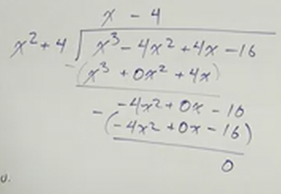
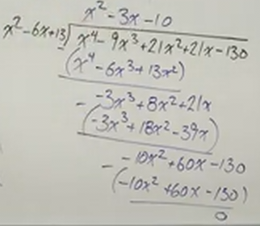

# Finding ALL Solutions of Polynomials (Precalculus - College Algebra 37)

[Video](https://www.youtube.com/watch?v=xuhk2kSVwe0)

---

We will be finding the solutions of a Polynomial in this section. Let's just
dive right in and you will find the rhythm pretty quick.

---

**Examples**

---

$$ f(x) = x^3 - 4x^2 + 4x - 16 $$

$f(x)$ has a zero of $2i$. Find the rest.

Let's first establish that with a Degree 3 Polynomial, we are going to have $3$
solutions.

We can find all solutions of a Polynomial through a series of steps:

1. Find a zero

2. Create a factor

   - For Linear, of a real 0, use synthetic division to find the remaining
     polynomial.

   - For Quadratic/Complex Pair, use long division

3. Try to factor or repeat

Here we have a zero, and since it is a complex solution, we can also utilize the
conjugate as a zero:

$$ x = 2i $$

$$ x = -2i $$

We can then get factors from these:

$$ x - 2i = 0 $$

$$ x + 2i = 0 $$

In order for us to further factor using division, we can't have complex numbers
in our divisor. Thusly we must distribute to find a factor that we can divide
by.

$$ (x - 2i)(x + 2i) \rightarrow x^2 - 4i^2 \rightarrow x^2 - 4(-1) \rightarrow x^2 + 4 $$

And this is what we will use long division. Because there is an x^2 in it, we
cannot use synthetic division, we must use long division.

Note that if we have done everything right, we will have a remainder of $0$

Also note that our answer, $x - 4$ is a linear factor and cannot be factored
further. Thusly we have our factored polynomial:

$$ f(x) = (x - 4)(x - 2i)(x + 2i) $$

If we wanted to show our polynomial's solutions over the real number system, we
would simply distribute our complex factors.

$$ f(x) = (x - 4)(x^2 + 4) $$

And if we needed to present all our solutions, we could present them like so:

$$
\boxed{
\begin{align*}
x = -2i \\
x = 2i \\
x = 4 \\
\end{align*}
}
$$

---

$$ g(x) = x^4 - 9x^3 + 21x^2 + 21x - 130 $$

You have a zero of $3 - 2i$.

We have a a complex zero given to us, which means that we can have a conjugate
as well:

$$ x = 3 - 2i $$

$$ x = 3 + 2i $$

We can then set these to 0, and group:

$$ x - (3 - 2i) = 0 $$

$$ x - 3 + 2i = 0 $$

$$ (x - 3) + 2i = 0 $$

$$ x - (3 + 2i) = 0 $$

$$ x - 3 - 2i = 0 $$

$$ (x - 3) - 2i = 0 $$

We can now distribute these two to find a factor we can divide by.

$$ \left[(x - 3) + 2i\right]\left[(x - 3) - 2i\right] $$

$$ (x - 3)^2 - 4i^2 $$

$$ (x - 3)^2 - 4(-1) $$

$$ (x - 3)^2 + 4 $$

$$ (x - 3)(x - 3) + 4 $$

$$ (x^2 - 6x + 9) + 4 $$

$$ x^2 - 6x + 13 $$

We can then use long division to find a factored polynomial from our original:

Note that the answer we got, $x^2 - 3x - 10$, is factorable! Let's do that.

$$ g(x) = (x^2 - 3x - 10)(x^2 - 6x + 13) $$

$$ g(x) = (x - 5)(x + 2)(x^2 - 6x + 13) $$

This is complete factored over the real number system. If we need it factored
over the complex number system, well we had those factors earlier.

$$ g(x) = (x - 5)(x + 2)\left[(x - 3) + 2i\right]\left[(x - 3) - 2i\right] $$

If we needed to list all our solutions, we could present those like so:

$$
\boxed{
\begin{align*}
x = 5 \\
x = 2 \\
x = 3 - 2i \\
x = 3 + 2i \\
\end{align*}
}
$$

---

$$ f(x) = x^4 - 1 $$

This is just to demonstrate that if you can factor to find all possible zeros,
we should. Note that we are not given any zeros here. We could start with the
Rational Zeros Theorem, but factoring is easier and readily available.

$$ x^4 - 1 = 0 $$

$$ (x^2 - 1)(x^2 + 1) = 0 $$

$$ (x^2 - 1)(x^2 + 1) = 0 $$

Can we factor further? Yes, but only on one of these. $x^2 + 1$ is an
Irreducible Quadratic, but $x^2 - 1$ is not.

$$ (x - 1)(x + 1)(x^2 + 1) = 0 $$

Now, this is completely factored over the real number system, but what if we are
asked to factor it over the complex number system?

Well, according to the zero product property, the following are true:

$$ x - 1 = 0 \quad x + 1 = 0 \quad x^2 + 1 = 0 $$

This means that $x = 1$ and $x = -1$, now solving for $x^2 + 1 = 0$, we can take
the square root:

$$ x^2 + 1 = 0 $$

$$ x^2 = -1 $$

$$ \sqrt{x^2} = \pm \sqrt{-1} $$

$$ x = \pm i $$

Which means:

$$ x = i $$

$$ x = -i $$

And our four solutions are:

$$
\boxed{
\begin{align*}
x = 1 \\
x = -1 \\
x = i \\
x = -i \\
\end{align*}
}
$$

We could express this factored over complex numbers as:

$$ f(x) = (x - 1)(x + 1)(x - i)(x + i) $$

---

$$ g(x) = x^4 + 13x^2 + 36 $$

Let's use substitution here:

$$ u = x^2 $$

Which rewrites our $g(x)$ as:

$$ g(x) = u^2 + 13u + 36 $$

This is factorable:

$$ g(x) = (u + 9)(u + 4) $$

Then set to $0$ and solve:

$$ u + 9 = 0 $$

$$ u = -9 $$

$$ u + 4 = 0 $$

$$ u = -4 $$

Then we resubstitute for $u$:

$$ u = -9 $$

$$ x^2 = -9 $$

$$ u = -4 $$

$$ x^2 = -4 $$

And now we run into a similar situation to the previous example:

$$ x^2 = -9 $$

$$ \sqrt{x^2} = \pm \sqrt{-9} $$

$$ \sqrt{x^2} = \pm \sqrt{9}i $$

$$ \sqrt{x^2} = \pm 3i $$

$$ x^2 = -4 $$

$$ \sqrt{x^2} = \pm \sqrt{-4} $$

$$ \sqrt{x^2} = \pm \sqrt{4}i $$

$$ \sqrt{x^2} = \pm 2i $$

And so our four solutions are:

$$
\boxed{
\begin{align*}
x = 3i \\
x = -3i \\
x = 2i \\
x = -2i \\
\end{align*}
}
$$

To express our answer factored over the real number system, we would write:

$$ g(x) = (x^2 + 9)(x^2 + 4) $$

To express our answer factoredd over the complex number system, we would write:

$$ g(x) = (x - 3i)(x + 3i)(x - 2i)(x + 2i) $$

---

Now let's look at examples where we aren't given any zeros, and it is not
factorable. Meaning we have to use the _Rational Zeros Theorem_.

$$ f(x) = x^4 + 2x^3 + 22x^2 + 50x - 75 $$

Let's first try to factor or find a GCF...not here.

We can now use _Descartes Rule of Signs_ to potentially reduce some of our work
later on.

Counting the sign changes in $f(x)$ yields us $1$, meaning that there will be
exactly $1$ _positive_ $x$-intercept.

Counting the sign changes in $f(-x)$:

$$ f(-x) = x^4 - 2x^3 + 22x^2 - 50x - 75 $$

We have $3$ or $1$ _negative_ $$-intercepts.

Let's take our constant and find all values for $P$ by factoring it:

$$ P\text{ : } \left\{\pm 1, \pm 3, \pm 5, \pm 15, \pm 25, \pm 75\right\} $$

Let's then take our leading coefficient and find all values for $q$ by factoring
it:

$$ q\text{ : } \left\{\pm 1\right\} $$

Then, our Rational Zeros list is found by simply creating a list of
$\dfrac{P}{q}$:

$$ \frac{P}{q} \text{ : } \left\{\pm 1, \pm 3, \pm 5, \pm 15, \pm 25, \pm 75\right\} $$

And now we start plugging in values, starting with $1$ and see if they equal
$0$:

$$ f(1) = 0 $$

Which means $x = 1$ is a zero of $f(x)$, and $x - 1 = 0$.

We can then use synthetic division here to determine the further factored
polynomial.

| $r$ | $x^4$ | $x^3$ | $x^2$ | $x$ | $R$ |
| --- | ----- | ----- | ----- | --- | --- |
| 1   | 1     | 2     | 22    | 50  | -75 |
|     |       | 1     | 3     | 25  | 75  |
|     | 1     | 3     | 25    | 75  | 0   |

And this means:

$$ f(x) = (x - 1)(x^3 + 3x^2 + 25x + 75) $$

Note that because we have found a positive $x$-intercept ($x = 1$), we
established using _Descartes Rule of Signs_ that this was the _only_ _positive_
$x$-intercept, thusly if we continued using our Rational Zeros List to evaluate
this further, we would no longer need to check positive signed potential factors
from that list.

But this new factor is factorable by grouping:

$$ f(x) = (x - 1)\left(x^2(x + 3) + 25(x + 3)\right) $$

$$ f(x) = (x - 1)(x^2 + 25)(x + 3) $$

This is factored over the real number system. But if we wanted to factor over
the complex number system, we'd have to further factor $(x^2 + 25)$.

$$ x^2 + 25 = 0 $$

$$ x^2 = -25 $$

$$ \sqrt{x^2} = \pm \sqrt{-25} $$

$$ x = \pm \sqrt{25}i $$

$$ x = \pm 5i $$

So that would be factored over the complex number system as:

$$ f(x) = (x - 1)(x + 3)(x - 5i)(x + 5i) $$

And we could show our four solutions like so:

$$
\boxed{
\begin{align*}
x = 1 \\
x = -3 \\
x = 5i \\
x = -5i \\
\end{align*}
}
$$

---

$$ g(x) = 3x^4 + 5x^3 + 25x^2 + 25x - 18 $$

We cannot factor, we cannot find a GCF. Let's reach for the Rational Zeros
Theorem and Descartes Rule of Signs.

Let's use Descartes Rule of Signs to see if we can cut down some of our work.
Counting the signs in $g(x)$ we find that there is exactly $1$ sign change,
meaning that we will have exactly $1$ _positive_ $x$-intercept.

If we look at $g(-x)$ we have:

$$ g(-x) = 3x^4 - 5x^3 + 25x^2 - 25x - 18 $$

Show ing we have $3$ sign changes. This means we have either $3$ or $1$
_negative_ $x$-intercepts.

Let's find all factors of our constant term to find $P$:

$$ P \text{ : } \left\{\pm 1, \pm 2, \pm 3, \pm 6, \pm 9, \pm 18\right\} $$

Let's find all factors of our leading coefficient to find a list of $q$:

$$ q \text{ : } \left\{\pm 1, \pm 3\right\} $$

And then we divide $\dfrac{P}{q}$ to find a list of our Rational Zeros:

$$ \frac{P}{q} \text{ : } \left\{\pm 1, \pm 2, \pm 3, \pm 6, \pm 9, \pm 18, \pm
\frac{1}{3}, \pm \frac{2}{3} \right\} $$

We then start to plug in, starting with $1$. To save time, we'll skip ahead and
say that evaluating $g(-2)$ will give us 0$.

Thusly $x = -2$ is a solution, and $x + 2$ is a factor of $g(x)$. Using
synthetic division, we can further factor our polynomial:

| $r$ | $x^4$ | $x^3$ | $x^2$ | $x$ | $R$ |
| --- | ----- | ----- | ----- | --- | --- |
| -2  | 3     | 5     | 25    | 45  | -18 |
|     |       | -6    | 2     | -54 | 18  |
|     | 3     | -1    | 27    | -9  | 0   |

And our new polynomial is:

$$ g(x) = (x + 2)(3x^3 - x^2 + 27x - 9) $$

This new expression is factorable by grouping, if it weren't, we'd go back to
our list, we'd start with $-2$ and continue.

$$ g(x) = (x + 2)\left((x^2(3x - 1) + 9(3x - 1))\right) $$

$$ g(x) = (x + 2)(3x - 1)(x^2 + 9) $$

This is fully factored over the real number system. Over the complex number
system, we'd have to further evaluate $(x^2 + 9)$:

$$ x^2 + 9 = 0 $$

$$ x^2 = -9 $$

$$ \sqrt{x^2} = \pm \sqrt{-9} $$

$$ x = \pm 3i $$

And our fully factored over the complex number system function would be:

$$ g(x) = (x + 2)(3x - 1)(x - 3i)(x + 3i) $$

And our list of all solutions would be:

$$
\boxed{
\begin{align*}
x = -2 \\
x = \frac{1}{3} \\
x = 3i \\
x = -3i \\
\end{align*}
}
$$
