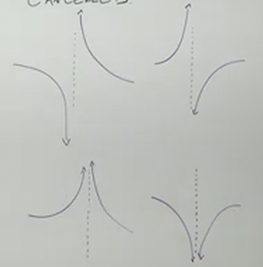

# Finding Vertical Asymptotes of Rational Functions (Precalculus - College Algebra 38)

[Video](https://www.youtube.com/watch?v=y-bSJaEonho)

---

We are now going to pivot in subject matter to start talking about Rational
Functions.

Unlike Polynomials, A Rational Function, which is defined by the fact that they
are fractions where we have variables on both the numerator and the denominator.
This can cause an issue with the Domain of the Function known as a
"Discontinuity".

Essentially, a Rational Function is a Polynomial divided by another Polynomial,
in which there are variables on both the numerator and the denominator.

Because a denominator cannot equal $0$, we end up having Domain "issues". In
other words, there are values for our variables that cannot be graphed. This
creates either a "hole" in our graph, in which a single point simply isn't part
of our graph, or we hit a Vertical Asymptote, which is an "invisible" vertical
line that our graph cannot meet/touch. There can be multiple Vertical
Asymptotes.

When evaluating the numerator of a Rational Function, we keep in mind that the
numerator will provide us the values of the $x$-intercepts, and it will tell you
whether or not your Denominator has any Domain Issues/Discontinuities, and what
type of Discontinuity it has.

---

**Discontinuities**

If the denominator of your Rational Function is equal to $0$ at $x$, then at
$x$, there will be one of two types of Discontinuities:

1. Hole (Removalbe Discontinuity)

   - This happens when the factor causing the denominator to equal $0$ _can_ be
     cancelled (by the numerator).

   - Use these as a type of "Point" the graph _must_ interact with.

2. Vertical Asymptote

   - This happens when the factor causing the denominator to equal $0$ _cannot_
     be cancelled (by the numerator).

   - Generally speaking, Vertical Asymptotes usually cause our graph to look
     like one of the four following loose examples:

Interestingly, whether the _Multiplicity_ of our function is _even_ or _odd_
determines which of these graphs our graph will look like, and we'll see
examples of this in this and the upcoming sections.

---

**Examples**

---

$$ f(x) = \frac{x + 3}{x - 4} $$

This is factored already for us, but we will normally factor as far as we can
for both the numerator and denominator.

We start then by setting the denominator equal to $0$, and solve for $x$.

$$ x - 4 = 0 $$

$$ x = 4 $$

Therefore, we cannot allow $x$ to equal $4$, as that behavior is undefined due
to us dividing by $0$. Our _Domain_ would thusly be defined as:

$$ \text{D : } \left\{x | x \neq 4 \right\}$$

Since we _can't_ "cancel" $x - 4$ with the numerator $x + 3$, then we don't have
a Hole, we have a _Vertical Asymptote_. Therefore at $x = 4$, we have a
_Vertical Asymptote_.

Since it is a _Vertical Asymptote_, we want to pay attention to the
_Multiplicity_. Since $x - 4$ is equal to $(x - 4)^1$, we know the
_Multiplicity_ is _odd_, and therefore we have a general idea of how our graph
will look, which will cover more in depth in a future section.

---

$$ g(x) = -\frac{2}{(x - 1)^2} $$

This is also already factored. Let's now take our denominator and set the
factors to $0$ and solve for $x$.

$$ x - 1 = 0 $$

$$ x = 1 $$

The purpose of discovering this is for us to define the Domain issues.
Specifically, we can't have $x$ be equal to one. This defines our Domain as:

$$ \text{D : } \left\{x | x \neq 1 \right\}$$

Now, which problem do we have? A Hole or a Vertical Asymptote?

Well, is $x - 1$ cancellable from any factor on the numerator? No. Therefore we
don't have a hole, we have a Vertical Asymptote.

Now we look at the factor's _Multiplicity_. This has an _even_ _Multiplicity_ of
$2$. This is reflected and shifted to the right from the $x$-axis. It approaches
$-\infty$ along this custom "$y$-axis".

Note here that we have no $x$-intercepts as we have no factors that have $x$ in
the numerator.

---

$$ h(x) = \frac{2x}{x^2 - 4} $$

This one does need some factoring:

$$ h(x) = \frac{2x}{(x - 2)(x + 2)} $$

Let's define our Domain, again, we have some issues:

$$ x - 2 = 0 $$

$$ x = 2 $$

$$ x + 2 = 0 $$

$$ x = -2 $$

$$ \text{D : } \left\{x | x \neq 2, x \neq -2 \right\} $$

Now, are either of these cancellable by a factor in the numerator? No, we
cannot, therefore these are Vertical Asymptotes.

Now, the Multiplicity of $x = 2$ is $1$, an _odd_ Multiplicity, that Vertical
Asymptote shows behavior of the _odd_ Multiplicity. For this same reason, we
have the same behavior of $x = -2$.

And our $x$-intercept is defined by the numerator, where we have an
$x$-intercept at $0$. $x = 0$ is an $x$-intercept of this graph.

---

$$ F(x) = \frac{x^2 - 9}{x^2 + 4x - 21} $$

This will be an example of holes. First let's factor.

$$ F(x) = \frac{(x - 3)(x + 3)}{(x + 7)(x - 3)} $$

Now, don't rush off and say you have $x$-intercepts at $3$ and $-3$, you don't.
Also, don't cancel out the $x - 3$ yet. Define your domain first.

$$ x + 7 = 0 $$

$$ x = -7 $$

$$ x - 3 = 0 $$

$$ x = 3 $$

$$ \text{D : } \left\{x | x \neq -7, x \neq 3 \right\} $$

_Now_, we define what type of issues we have with our Domain. Can we cancel out
the $x - 7$ factor? No, this creates a _Vertical Asymptote_ at $x = -7$. And
because we have _odd_ multiplicity, we know the behavior of the graph.

Now, how about the $x - 3$ factor? Yes, we can factor this out from the same
factor on the numerator, and thusly we will have a hole at $x = 3$.

Now, how do we graph this hole? Well take your simplified function after the
cancellation:

$$ F(x) = \frac{x + 3}{x + 7} $$

And if we plug in where our hole will be, we can find the $x$ and $y$
coordinates of this point and then draw it in as a point with a hole in it to
signify this domain issue.

$$ F(3) = \frac{3 + 3}{3 + 7} \rightarrow F(3) = \frac{6}{10} \rightarrow F(3) = \frac{3}{5} $$

Therefore, we have a hole at $\left(3, \dfrac{3}{5} \right)$.
