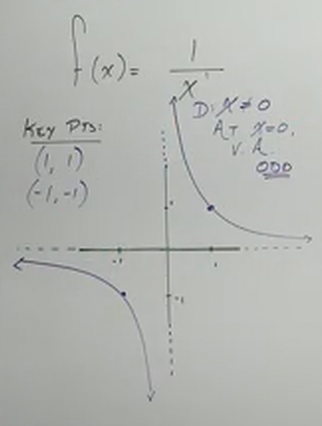
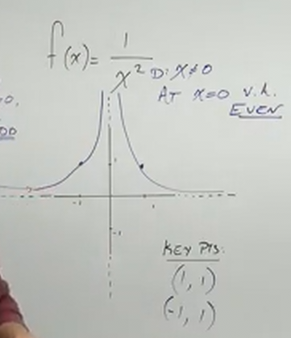
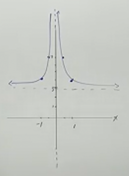
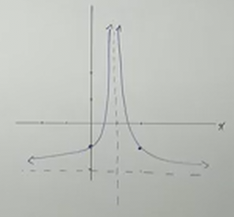
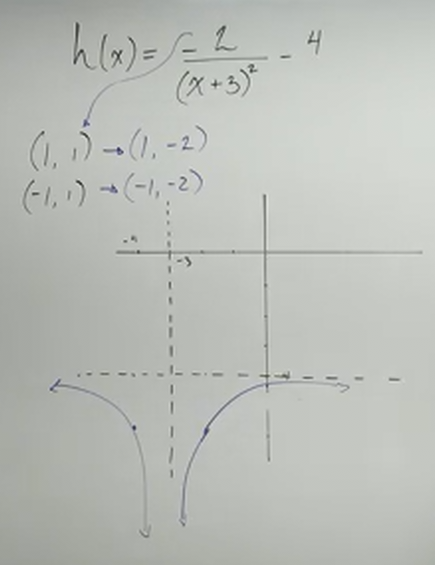
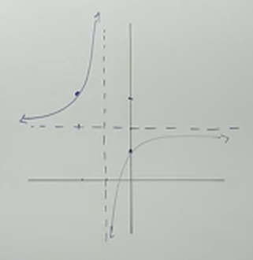

# Graphing Rational Functions with Transformations (Precalculus - College Algebra 39)

[Video](https://www.youtube.com/watch?v=-k4uXF4hsAs)

---

The main point of this section is to see how the relationship between the power
of the denominator's variable changes the _Vertical Asymptote_ of the graph.
Let's dive in.

---

$$ f(x) = \frac{1}{x} $$

This form is called the _Reciprocal Function_.

Let's look at the _Domain_ of this function, right off the bat we already know
that $x$ simply cannot equal $0$. Here, we either have a _Hole_ or a _Vertical
Asymptote_.

$$ \text{D: } \left\{x | x \neq 0 \right\} $$

Since we cannot cancel out $x$ by plugging in any specific number for it, we
will say that at $x = 0$, we have a _Vertical Asymptote_.

Note that the denominator's power is $1$ (_i.e._ $x^1$), this gives us an _Odd
Multiplicity_. This indicates that we have the graph sloping up and away from
the Vertical Asymptote in diagonal orientation to each other.

This is a topic for a future lecture, but just be assured that there is a
_Horizontal Asymptote_ as well at $y = 0$. This makes sense if you think about
it, as $x$ approaches either $-\infty$ or $\infty$, the value for $f(x)$ becomes
increasingly smaller, but never actually equals $0$. This is what is known as a
_Limit_, which is a number that our function _approaches_, but never actually
_reaches_.

When graphed, our function looks approximately like this:

This graph looks a lot like what most other odd vertical asymptote rational
function looks.

---

$$ f(x) = \frac{1}{x^2} $$

Here we have a similar function, let's determine our _Domain_ again. This has
the same domain issue in that $x$ cannot equal $0$.

$$ \text{D: } \left\{x | x \neq 0 \right\} $$

We also try to cancel it out (if we can, we have a hole), there are no values
that cancel out $x$, therefore we have a _Vertical Asymptote_ at $x = 0$.

However, the _Multiplicity_ matters! $x^2$ is an _Even_ Multiplicity. This
creates a different type of graph, in which two graphing lines approach
infinities with symmetry around the $y$-axis (instead of diagnoal symmettry
along both axis). Note that this also means we have a _Horizontal Asymptote_,
similarly evaluated based around the concept of _Limits_ that we mentioned
earlier. Again, if we plug in increasingly larger values for $x$, we will get
increasingly smaller values for $f(x)$, but it will never actually equal $0$.

Let's now move onto shifts.

---

$$ f(x) = \frac{1}{x^2} + 3 $$

Very much like previous graphing examples, we can already tell that this is a
_Vertical Shift_ _Up_ $3$ units. Otherwise, it is the same as the previous
example, we just move the _Horizontal Asymptote_ up $3$ units.

---

$$ g(x) = \frac{1}{(x - 1)^2} - 2 $$

Here we have both a _Horizontal Shift_ to the _Right_ $1$ units, and a _Vertical
Shift_ _Down_ $2$ units.

Notice also that our _Domain_ is different, here we cannot have $x$ equal $1$.

$$ \text{D: } \left\{x | x \neq 1 \right\} $$

---

$$ h(x) = \frac{-2}{(x + 3)^2} - 4 $$

The first thing to notice is simply the _Multiplicity_ of our function, which
again, is _Even_. This means our graph will generally look akin to our function
from the previous two examples. We do have a _Reflection_, and both a
_Horizontal_ and _Vertical_ shift (to the _left_ $3$, and _down_ $4$).

Note here that we no longer have a $1$ for our numerator, instead we have $-2$,
this acts as a multiplier of our function prior to the vertical shift. This
means we are going to have a _Stretch_ of our graph as well as _Reflect_ it.

Now, once again, our Domain is determined by what $x$ cannot be, in this case it
cannot be equal to $-3$ _and_ there is nothing on the numerator where we can
cancel this $x$ out. Thusly we have a _Vertical Asymptote_ where $x = -3$.

$$ \text{D: } \left\{x | x \neq -3 \right\} $$

---

$$ G(x) = -\frac{1}{x + 1} + 2 $$

Note that we can reason about this better if we set up our denominator as a
factor:

$$ G(x) = -\frac{1}{(x + 1)^1} + 2 $$

Now, how is this shifted? Well it is shifted _Vertically_ _Up_ by $2$ units, and
it is shifted _Horizontally_ _Left_ by $1$ unit.

The _Multiplicity_ is _Odd_ and therefore we know we have diagonal symmetry
along both the _Vertical_ and _Horizontal_ Asymptotes.

Additionally, the $-1$ _Reflects_ our graph.

Note also that our _Domain_ is $x \neq -1$

$$ \text{D: } \left\{x | x \neq -1 \right\} $$

Because we cannot cancel out this factor using a factor from the numerator, we
know this represents a _Vertical Asymptote_.

