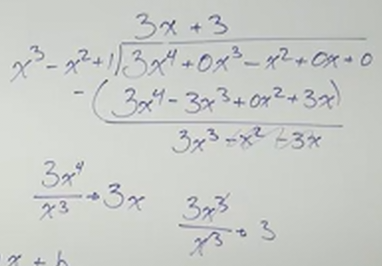

# Finding an Oblique Asymptote of a Rational Function (Precalculus - College Algebra 41)

[Video](https://www.youtube.com/watch?v=NVhaVk4wNu8)

---

Now that we have an understanding of when _Horizontal Asymptotes_ occur, let's
now move our attention to _Oblique Asymptotes_ and when those occur.

Note that we are now moving into the more advanced part of this section. We will
need to be able to divide our polynomials using _Long Division_, _Synthetic
Division_ **will not work!**, so review
[**these topics**](https://www.youtube.com/watch?v=AKJgo-WR_K4) if you need to
before moving on.

_Oblique Asymptotes_ occur when the degree of the _Numerator's_ _Leading Term's_
_Degree_ is _Larger_ than the _Denominator's_ _Leading Term's_ _Degree_ by
**Exactly** $1$.

This is because any polynomial function where it's leading term has a degree of
$1$ is always a _slope_, and thusly we have an _Oblique Asymptote_ or a _slant_
along which our graph always approaches both $\infty$ and $-\infty$.

Please also note that you _Cannot_ have both a _Horizontal Asymptote_ and a
_Oblique Asymptote_. This makes sense even when you just consider the rules of
_Horizontal Asymptotes_ (in which the leading degree of the denominator is
either greater than or equal to the leading degree of the numerator), as opposed
to the rules of _Oblique Asymptotes_ (in which the leading degree of the
numerator is greater than the leading degree of the denominator by $1$). If you
think about it, these rules contradict one another and thusly you can only have
one or the other be true.

---

**Examples**

---

$$ f(x) = \frac{3x^4 - x^2}{x^3 - x^2 + 1} $$

Much like in determining the _End Behavior_ of our functions from previous
sections, we can approximate the _End Behavior_ by looking at our leading terms.

$$ f(x) \approx \frac{3x^4}{x^3} \rightarrow f(x) \approx 3x $$

This means we can express our _End Behavior_ like so:

$$
\begin{align*}
\text{As } x \rightarrow \infty \text{ , } f(x) \rightarrow \infty \\
\text{and as } x \rightarrow -\infty \text{ , } f(x) \rightarrow -\infty \\
\end{align*}
$$

The only difference between determining the End Behavior in our other sections
is that we have no way of determining our $y$-intercept from just looking at our
Leading Degrees. We'll need to use _Long Division_ of our two polynomials to
determine where our $y$-intercept is.

Now, as you will see, we actually are not going to go very far using _Long
Division_ of polynomials. We are only trying to see our function in the form of:

$$ y = mx + b $$

This is so that we can envision the _End Behavior_ of our function.

Again, note here how we stopped and didn't even complete the _Long Division_ of
these two polynomials. That's because we're just trying to determine _Where Does
The Oblique Asymptote Occur?_ Which, in this case occurs at:

$$ y = 3x + 3 $$

This means that our function will look very much like our _Odd_ Functions that
have a _Horizontal Asymptote_, but the Asymptote, in this case, will be
_Slanted_.
