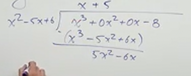

# Finding Asymptotes and Holes of Rational Functions (Precalculus - College Algebra 43)

[Video](https://www.youtube.com/watch?v=tyXWPcvSQvk)

---

This lecture, we'll put together the ideas encompassed in the past 5 lectures on
Rational Functions. Essentially, we're going to practice the following:

1. Finding the End Behavior of Rational Functions.

   - Horizontal/Oblique Asymptotes, or Power Function

2. Factoring Rational Functions

3. Defining The Domain of Rational Functions

4. Determining any Vertical Asymptotes and/or Holes in Rational Functions

5. Simplify and Evaluate For a Hole In the Rational Function if necessary

---

**Examples**

---

$$ f(x) = \frac{3x + 5}{x - 6} $$

The first thing we are going to do is find the _End Behavior_ of this function.
This means we'll look at an approximation of the simplification of the _Leading
Terms_ of our function's denominator and numerator and compare them.

$$ f(x) \approx \frac{3x}{x} \rightarrow f(x) \approx 3 $$

If we recall from our previous lecture on _Horizontal Asymptotes_, we know that
if we have the _same_ exponential power of both of these _Leading Terms_, then
we will have a _Horizontal Asymptotes_ at the fraction of the _Leading
Coefficient_.

In this case at $y = 3$, we will have a _Horizontal Asymptote_.

We're now going to Factor, which will immediately lead into defining the Domain
of our function:

$$ f(x) = \frac{3x + 5}{(x - 6)} $$

This is fairly straight forward, we can define our _Domain_ as:

$$ \text{D: } \left\{x | x \neq 6 \right\} $$

This is because we can never divide by 0.

Now we will determine whether this creates a _Vertical Asymptote_ at $x = 6$, or
whether or not it creates a _Hole_ at $x = 6$. Recall that if we can _cancel_
our factor of $(x - 6)$ due to a factor from our numerator, then this would be a
_Hole_, otherwise we have a _Vertical Asymptote_. In this case, we _cannot_
_cancel_ our denominator's factor, and thusly we have a _Vertical Asymptote_.

We'll also need to get a general idea of the shape of our graph now based off of
whether or not we have an _Even_ or an _Odd_ _Vertical Asymptote_, and this is
based off the _Multiplicity_ of our denominator's factors. In this case we have
a factor of $(x - 6)$, which can also be thought of as $(x - 6)^1$, which is an
_Odd_ _Vertical Asymptote_. This means that we will have a shape that is
dialoganally symmetric along the $x$-axis and the $y$-axis, where the lines of
our graph occupy the 1st and the 3rd quadrants of our
graph (or the 2nd and the 4th quadrants if the sign of our
entire function is negative).

We are done. This is just to get us a general idea of what our graph will look
like, we will actually graph them in the next lecture.

Let's move onto another example, going a bit quickly this time through the
explanation.

---

$$ g(x)  \frac{x^3}{x^4 - 1} $$

Find the _End Behavior_.

$$ g(x) \approx \frac{x^3}{x^4} \rightarrow g(x) \approx \frac{1}{x} $$

Recall from our previous lecture on _Horizontal Asymptotes_ that if the power of
our denominator is greater than the power of our numerator, then you will always
have a _Horizontal Asymptote at $y = 0$.

And this is the case here. Thusly, we have a _Horizontal Asymptote_ at $y = 0$.

To be a bit more concise, this form when approximating End Behavior indicates
the presence of a _Limit_. As $x$ gets larger and larger, $g(x)$ gets smaller
and smaller (approaching $0$). This can be expressed like so:

$$
\begin{align*}
\text{As } x \rightarrow \infty \text{ , } g(x) \rightarrow 0 \\
\text{and as } x \rightarrow -\infty \text{ , } g(x) \rightarrow 0
\end{align*}
$$

Next, we can indeed factor our denominator further, so we'll do just that:

$$ g(x) = \frac{x^3}{x^4 - 1} \rightarrow g(x) = \frac{x^3}{(x^2 - 1)(x^2 + 1)} \rightarrow g(x) = \frac{x^3}{(x + 1)(x - 1)(x^2 + 1)} $$

Our fully factored form is:

$$ g(x) = \frac{x^3}{(x + 1)(x - 1)(x^2 + 1)} $$

We actually we would go further in Calculus, as complex factors like $(x^2 + 1)$
create a sort of "turning point" in our graph. For now, we'll consider this the
final form of our function as far as factoring is concerned.

Let's now define our _Domain_.

Take all your factors and set them to $0$ to find which values $x$ cannot be.

$$ x - 1 = 0 $$

$$ x \neq 1 $$

$$ x + 1 = 0 $$

$$ x \neq -1 $$

$$ x^2 + 1 = 0 $$

This last one doesn't actually factor over the _Real_ number system (when
solved, this equation results in two complex solutions). As far as the _Domain_
is concerned, results on _No Real Solution_, and we would ignore it when
determining the _Domain_.

Thusly our _Domain_ can be define as:

$$ \text{D: } \left\{x | x \neq 1, x \neq -1 \right\} $$

Now we have to determine whether at these points whether a _Hole_ or a _Vertical
Asymptote_ exists, and we can determine that based off of whether those factors
cancel out from the numerator. If you can cancel it from the numerator, we have
a _Hole_.

None of our factors can be cancelled out from the numerator, thusly we have two
_Vertical Asymptotes_, one at $x = 1$ and another at $x = -1$.

In order to determine whether these are _Even_ or _Odd_ _Vertical Asymptotes_,
we look at the power of each:

$$ g(x) = \frac{x^3}{(x + 1)^1(x - 1)^1(x^2 + 1)^1} $$

Since every factor has a power of $1$, we know that this is an _Odd Powered
Factor_, and therefore our asymptote will be diagonally symmetrical along the
$x$-axis and the $y$-axis.

Let's move on and really hammer home our understanding with a couple more
examples.

---

$$ G(x) = \frac{x^4 - 16}{x^2 - 2x} $$

Let's always find _End Behavior_.

$$ G(x) \approx \frac{x^4}{x^2} \rightarrow G(x) \approx x^2 $$

Right off the bat this should tell us a couple things. _Horizontal Asymptotes_
only occur when our End Behavior shows that our denominator's power is greater
than or equal to the numerator. In this case the numerator's power is greater.
It also tells us that we don't have an _Oblique Asymptote_, as we could only
have that if the numerator's power was greater than the denominator by _exactly
$1$_.

Thusly, we have _No_ _Horizontal Asymptotes_ and we have _No_ _Oblique
Asymptotes_.

Let's move on and factor:

$$ G(x) = \frac{x^4 - 16}{x^2 - 2x} $$

$$ G(x) = \frac{(x^2 - 4)(x^2 + 4)}{x(x - 2)} $$

$$ G(x) = \frac{(x - 2)(x + 2)(x^2 + 4)}{x(x - 2)} $$

And this is fully factored.

Now, let's find our Domain _before we cancel out_.

$$ x = 0 $$

$$ x \neq 0 $$

$$ x - 2 = 0 $$

$$ x \neq 2 $$

Thusly our domain is:

$$ \text{D: } \left\{x | x \neq 0 \text{ , } x \neq 2\right\} $$

Now, let's determine if we have a _Hole_ or a _Vertical Asymptote_ at each of
our denominator's factors.

If we can cancel out a factor, then we have a _Hole_, if we can't cancel out a
factor, we have a _Vertical Asymptote_. We _Can_ cancel out at $x = 2$, and we
_Cannot_ cancel out at $x = 0$.

Thusly we have a _Hole_ at $x = 2$, and we have a _Vertical Asymptote_ at $x =
0$.

Here we have to do an extra step (see step 5 at the beginning of this lecture
regarding holes). We have to simplify and rewrite our function to further
evaluate.

$$ G(x) = \frac{(x + 2)(x^2 + 4)}{x} $$

We're now going to plug in $x = 2$ to this function and evaluate for $G(x)$,
this will give us the exact point on our graph where that _Hole_ is.

$$ G(2) = \frac{((2) + 2)((2)^2 + 4)}{(2)} $$

$$ G(2) = \frac{(4)(4 + 4)}{2} $$

$$ G(2) = \frac{(4)(8)}{2} $$

$$ G(2) = \frac{32}{2} $$

$$ G(2) = 16 $$

Thusly we will have a _Hole_ at exactly $(2, 16)$.

What kind of _Vertical Asymptote_ do we have at $x = 0$? Well, what is the power
of that factor?

$$ G(x) = \frac{(x - 2)^1(x + 2)^1(x^2 + 4)^1}{x^1(x - 2)^1} $$

It is $1$, an _Odd_ number. Thusly, at $x = 0$, we have a _Vertical Asymptote_
diagonally symmetric along the $x$-axis and $y$-axis, with graphing lines that
occupy the 1st and the 3rd quadrants of our graph.

Let's now move onto the next example.

---

$$ F(x) = \frac{2x^2 - 5x - 12}{3x^2 - 11x - 4} $$

Let's evaluate our _End Behavior_.

$$ F(x) \approx \frac{2x^2}{3x^2} \rightarrow F(x) \approx \frac{2}{3} $$

Recall our rules about _Horizontal Asymptotes_, if the power of our _Leading
Terms_ is _equal_, then we have a _Horizontal Asymptote_ at the fraction of the
leading coefficients, in this case at $y = \dfrac{2}{3}$

Let's now factor.

$$ F(x) = \frac{2x^2 - 5x - 12}{3x^2 - 11x - 4} $$

$$ F(x) = \frac{(2x + 3)(x - 4)}{(3x + 1)(x - 4)} $$

This is now fully factored. Now let's determine our _Domain_.

$$ x - 4 = 0 $$

$$ x \neq 4 $$

$$ 3x + 1 = 0 $$

$$ 3x = -1 $$

$$ x \neq -\frac{1}{3} $$

Thusly our _Domain_ can be defined as:

$$ \text{D: } \left\{x | x \neq 4 \text{ , } x \neq -\frac{1}{3} \right\} $$

Now, do we have a _Hole_ or a _Vertical Asymptote_ at these factors? Again, if
we can cancel it out, we have a _Hole_, otherwise, we have a _Vertical
Asymptote_.

We can cancel out at $x = 4$, thusly we have a _Hole_ at $x = 4$.

We cannot cancel out at $x = -\dfrac{1}{3}$, thusly we have a _Vertical
Asymptote_ at $x = -\dfrac{1}{3}$.

Now, recall that we have an extra step whenever we have a _Hole_, we need to
evaluate the specific point of all holes that we have in our graph by plugging
in the value to the simplified function. After cancellation, our function looks
like this:

$$ F(x) = \frac{(2x + 3)\cancel{(x - 4)}}{(3x + 1)\cancel{(x - 4)}} $$

$$ F(x) = \frac{2x + 3}{3x + 1} $$

And then we plug in the value of the factor we cancelled out to find exactly
where our hole is:

$$ F(4) = \frac{2(4) + 3}{3(4) + 1} $$

$$ F(4) = \frac{8 + 3}{12 + 1} $$

$$ F(4) = \frac{11}{13} $$

Thusly we have a _Hole_ exactly at $\left(4, \dfrac{11}{13} \right)$.

Now at our _Vertical Asymptote_, we want to determine what shape we'll have by
looking at the power of the factor that indicatd our _Vertical Asymptote_

$$ F(x) = \frac{(2x + 3)(x - 4)}{(3x + 1)^1(x - 4)^1} $$

Since the factor's power is $1$, that is an _Odd_ Powered factor, and thusly we
would have a _diagonally_ symmetric _Vertical Asymptote_ where the lines occupy
the 1st and the 3rd quadrant of our graph.

Let's now look at a couple examples that include _Oblique Asymptotes_.

---

$$ g(x) = \frac{x^3 - 8}{x^2 - 5x + 6} $$

All the same, let's find _End Behavior_:

$$ g(x) \approx \frac{x^3}{x^2} \rightarrow g(x) \approx x $$

Recall that _Oblique Asymptotes_ occur whenever the numerator's leading term's
power is greater than the denominator's leading term's power by exactly $1$.
That is exactly what this approximation of end behavior indicates.

Also recall that whenever we find that we have an _Oblique Asymptote_, we take a
detour to use _Long Division_ to determine exactly where this _Oblique
Asymptote_ occurs. Remember that _Synthetic Division_ will not work here.

Also remember that we don't have to go through the entire process of all the
_Long Division_, we just have to find the first two terms of our factor:

This immediately indicates that we have an _Oblique Asymptote_ at $y = x + 5$.

Now let's factor. Factoring the numerator is actually a bit tricky as it
involves
[Factoring A Difference Of Cubes](https://en.neurochispas.com/algebra/factoring-difference-of-cubes/).
There is a trick to it, which is to take the cube root of the second coefficient
(8), which translates to:

$$ (x)^3 - (2)^3 $$

Then we can use this to basically write out our numerator's factor as:

$$ (x - 2)(x^2 + 2x + 4) $$

You might want to review the link above to get a better familiarity on how this
trick works.

The denominator is a more standard quadratic factoring.

$$ g(x) = \frac{(x - 2)(x^2 + 2x + 4)}{(x - 2)(x - 3)} $$

From here, _before we cancel_, we want to determine our _Domain_.

$$ x - 2 = 0 $$

$$ x \neq 2 $$

$$ x - 3 = 0 $$

$$ x \neq 3 $$

And our Domain is:

$$ \text{D: } \left\{x | x \neq 2 \text{ , } x \neq 3 \right\} $$

Now, is it a _Hole_ or a _Vertical Asymptotes_ at these points in our _Domain_?

$(x - 2)$ is cancellable from our numerator, and thusly represents a _Hole_ at
$x = 2$.

$(x - 3)$ is not cancellable, and thusly represents a _Vertical Asymptote_ at
$x = 3$.

Whenever we have a _Hole_, we need to determine the exact point where that
exists, and we can do that by simplifying our expression via cancellation, and
then plugging the value for $x$ where that _Hole_ exists to determine the
$y$-coordinate of our _Hole_.

$$ g(x) = \frac{\cancel{(x - 2)}(x^2 + 2x + 4)}{\cancel{(x - 2)}(x - 3)} $$

$$ g(x) = \frac{x^2 + 2x + 4}{x - 3} $$

$$ g(2) = \frac{(2)^2 + 2(2) + 4}{(2) - 3} $$

$$ g(2) = \frac{4 + 4 + 4}{2 - 3} $$

$$ g(2) = \frac{12}{-1} $$

$$ g(2) = -12 $$

And thusly we have a _Hole_ exactly at $(2, -12)$

And what about the shape of our graph at the _Vertical Asymptote_? Again, the
power of the factor and whether it is _Even_ or _Odd_ determines the shape of
our graph at the _Vertical Asymptote_, in this case it is a power of $1$, which
is _Odd_. Thusly we have a _diagonally_ symmetrical graph at $x = 3$, where the
graph's lines veer of at both the $x$-axis and the $y$-axis within the
1st and 3rd quadrants of our graph.

---

$$ H(x) = \frac{6x^2 + 7x - 5}{3x + 5} $$

_End Behavior_:

$$ H(x) \approx \frac{6x^2}{3x} \rightarrow H(x) \approx 2x $$

This indicates an _Oblique Asymptote_ as we have a numerator's leading term's
power exactly $1$ greater than the denominator's leading term's power. We'll now
use _Long Division_, and only divide as far as to determine the first two terms
of our factor to find out where the _Oblique Asymptote_ occurs.

In this case, however, we can actually factor further to simplify (this is not
necessary, but it shows that this method is somewhat maleable).

$$ H(x) = \frac{(2x - 1)(3x + 5)}{(3x + 5)} $$

From here we can determine the Domain as:

$$ \text{D: } \left\{x | x \neq -\frac{5}{3} \right\} $$

And because this factor was cancellable, we have a _Hole_.

Our simplified function is:

$$ H(x) = 2x - 1 $$

Notice here that we have a _slope_ here, an _Oblique Asymptote_ exists at
$y = 2x - 1$. This is why, if we can factor, sometimes we can find the _Oblique
Asymptote_ without using _Long Division_. If you don't know how to factor out
the numerator/denominator, then use _Long Division_. However, if you can factor,
it might be worth your time to try and factor to see if you can circumvent the
_Long Division_ and save yourself some time (maybe).

All that is left is to determine the exact point at where our _Hole_ exists.

$$ H\left(-\frac{5}{3}\right) = 2\left(-\frac{5}{3}\right) - 1 $$

$$ H\left(-\frac{5}{3}\right) = -\frac{10}{3} - 1 $$

$$ H\left(-\frac{5}{3}\right) = -\frac{13}{3} $$

And thusly we have a _Hole_ at exactly
$\left(-\dfrac{5}{3}, -\dfrac{13}{3} \right)$.
