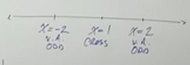
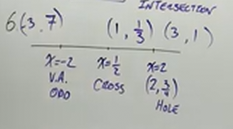

# Graphing Rational Functions (Precalculus - College Algebra 44)

[Video](https://www.youtube.com/watch?v=wHATRiYbPPA)

---

This is going to be a long lecture. So far we have covered a lot about sketching
out the Graph of Rational Functions, determining the End Behavior, finding
Asymptotes, etc. But now, it is time to actually Graph these Rational Functions,
and we're going to go step by step:

---

**Steps To Graphing Rational Functions**

1. Find The _Horizontal/Oblique Asymptotes_ **_OR_** the _End Behavior_.

2. Factor and Find the _Vertical Asymptote(s)_ and/or _Hole(s)_ along with the
   _Multiplicity_.

3. Find the $x$-intercepts: $\text{numerator } = 0$.

4. Find the $y$-intercept: $\text{plug } x = 0$.

5. Set $f(x)$ equal to the _Horizontal_ or _Oblique_ Asymptote to check for
   intersection (not for $y = 0$).

6. Make a number line with key points and find extra points.

7. Graph.

---

**Examples**

---

$$ f(x)  = \frac{x - 1}{x^2 - 4} $$

1. Find The _Horizontal/Oblique Asymptotes_ **_OR_** the _End Behavior_.

   We have already covered a lot of these steps in the previous lecture. Just
   from looking at this function, we can tell that our end behavior looks
   something like $f(x) \approx \dfrac{1}{x}$.

   This is getting a bit ahead of ourselves, but in learning Calculus, you will
   come to understand that this is a indicative of a _Limit_. As $x$ gets closer
   and closer to $\infty$, then $f(x)$ approaches the value of $\dfrac{1}{x}$.

   This is expressed as:

   $$ \lim\limits_{x \to \infty} f(x) = \frac{1}{x} $$

   Recall that whenever we have the denominator's leading term having a power
   that is greater than the numerator's leading term's power, then we have a
   _Horizontal Asymptote_ at $y = 0$. We will graph this once we have more of
   our function evaluated using the steps above.

2. Factor and Find the _Vertical Asymptote(s)_ and/or _Hole(s)_ along with the
   _Multiplicity_.

   $$ f(x)  = \frac{x - 1}{x^2 - 4} $$

   $$ f(x)  = \frac{x - 1}{(x - 2)(x + 2)} $$

   Now that we have factored our function, we want to determine if we have a
   _Hole_ or a _Vertical Asymptote_. We an see from this simple example that we
   have two factors, both of which do _not_ cancel, and therefore both are
   _Vertical Asymptotes_. Specifically we have a _Vertical Asymptote_ at $x = 2$
   and also a _Vertical Asymptote_ at $x = -2$.

   We also can see that the _Multiplicity_ of each factor is $1$, which means
   both our _Vertical Asymptotes_ are _Odd_ Powered Asymptotes.

3. Find the $x$-intercepts: $\text{numerator } = 0$.

   We can find our $x$-intercepts by simply setting our numerator to $0$ and
   solving.

   $$ x - 1 = 0 $$

   $$ x = 1 $$

   Therefore, we have an $x$-intercept at $(1, 0)$. The _Multiplicity_ will also
   tell us if this is a _Cross_ or a _Bounce_. Since this factor has an _Odd_
   Multiplicity of $1$, that means that we have a _Cross_.

4. Find the $y$-intercept: $\text{plug } x = 0$.

   This is relatively easy. You just have to plug in $0$ for $x$.

   $$ f(0)  = \frac{(0) - 1}{(0)^2 - 4} $$

   $$ f(0)  = \frac{-1}{-4} $$

   $$ f(0)  = \frac{1}{4} $$

   And that means our $y$-intercept is $\left(0, \dfrac{1}{4}\right)$.

5. Set $f(x)$ equal to the _Horizontal_ or _Oblique_ Asymptote to check for
   intersection (not for $y = 0$).

   We skip this step, because while we do have a _Horizontal Asymptote_, it is
   at $y = 0$, and we don't do this step when that is the case. This is because
   it would just give us the $x$-intercepts from Step 3 again in this case.
   You'll see when and why we need this step in the following other examples.

6. Make a number line with key points and find extra points.

   This will make graphing in the next step must easier, as essentially what we
   are doing is setting up our $x$-axis with points.

   We'll plug in first just our _Vertical Asymptotes_ as well as our
   $x$-intercept(s).

   

   Now, as opposed to sketching, when graphing, we plug in a few more points to
   get a more accurate picture of our graph, we'll do that here prior to
   actually graphing to start to get an accurate picture. We won't necessarily
   plot these points, but they will help us understand the shape of our graph
   prior to the next step. Take a few points that are not on the asymptotes or
   the $x$ or $y$-intercepts. These points should lie around these asymptotes so
   you have an idea of what the graph is doing before and after each asymptote
   and intercept:

   

7. Graph.

   Finally, we get to graphing. First let's set up both our Horizontal and
   Vertical Asymptotes, also denoting that they are odd as well:

   

   Now, we plot our $x$-intercept, with a full dot for cross (open dotted circle
   for bounce) at $(1, 0)$.

   

   Then we plot our $y$-intercept at $\left(0, \dfrac{1}{4}\right)$.

   

   At this point, if we think really hard about what everything is doing, we
   might be able to sketch out roughly what this graph would look like in our
   head, but we aren't sketching (at least not as roughly as before), we are
   graphing at this point. That is why we calculated some points in the previous
   step. Let's plug those in now:

   

   Now, you have to trust that you know the shape of the graph at this point,
   you have the $y$-intercept, you have the $x$-intercept(s), you have the
   Asymptotes, and you know the _End Behavior_. You know that the graph can only
   cross the $x$ and $y$-axis at one point each. You know that the graph cannot
   touch the _Vertical Asymptotes_, but it can cross the _Horizontal_/_Oblique_
   Asymptotes, but because we have only one $x$-intercept, that in this case the
   _Horizontal Asymptote_ is _not_ crossed. So we know the finalized graph can
   really only look like this:

   

   This is still technically a sketch, but it is much closer to graphing as we
   have some more points we've plugged in from the previous step. To get closer
   to graphing, we would need to determine the _Points of Inflection_, which is
   something we'll learn in Calculus 1.

Let's now move onto some other examples.

---

$$ f(x) = \frac{x^4 - 1}{x^2 - 4} $$

1. End Behavior:

   $$ f(x) \approx \frac{x^4}{x^2} \rightarrow f(x) \approx x^2 $$

   This tells us our graph will have a _Parabola_ shape, our end behavior can be
   expressed like:

   $$
   \begin{align*}
   \text{As } x \rightarrow \infty \text{ , } f(x) \rightarrow \infty \\
   \text{and as } x \rightarrow -\infty \text{ , } f(x) \rightarrow \infty \\
   \end{align*}
   $$

2. Factor

   $$ f(x) = \frac{x^4 - 1}{x^2 - 4}  $$

   $$ f(x) = \frac{(x^2 - 1)(x^2 + 1)}{(x - 2)(x + 2)}  $$

   $$ f(x) = \frac{(x - 1)(x + 1)(x^2 + 1)}{(x - 2)(x + 2)}  $$

   We have two _Vertical Asymptotes_ at $x = 2$ and also at $x = -2$.

   They are _Odd_ Powered factors because both have a _Multiplicity_ of $1$.

3. Find $x$-intercepts.

   Set the numerator equal to $0$ and solve. Since it's already factored, we'll
   just take that form.

   $$ (x - 1)(x + 1)(x^2 + 1) $$

   $$ x - 1 = 0 $$

   $$ x + 1 = 0 $$

   Notice we didn't bother factoring $(x^2 + 1)$ as this would result in a
   _Complex_ Solution as there is _No REAL Solution_.

   We have two $x$-intercepts at $(1, 0)$ and at $(-1, 0)$. They are also
   _Crosses_ as they both have a _Multiplicity_ of $1$.

4. Find $y$-intercept.

   Evalute for $f(0)$.

   $$ f(0) = \frac{(0)^4 - 1}{(0)^2 - 4} $$

   $$ f(0) = \frac{-1}{-4} $$

   $$ f(0) = \frac{1}{4} $$

   So we have the $y$-intercept at $\left(0, \dfrac{1}{4} \right)$.

5. We don't have a _Horizontal_ nor an _Oblique_ Asymptote, and also we don't
   have a _Horizontal_ Asymptote that doesn't equal $0$. Thusly we skip this
   step.

6. In order, let's take all our points and put them on a number line, then takes
   some points close to these points and plug them in, evaluate them so we have
   some more specific points for the next step for each interval of our number
   line (but we can use the $y$-intercept as one if you'd like). We can save
   some time in this case, because we know our function is symmetric as it is a
   Parabola, this means that both positive and negative inputs of the same
   number will give us the same output.

   

7. Now let's graph. Here is our final sketch, we'll discuss after observing it:

   

   Notice first that we sketched our End Behavior (the dotted line parabola). We
   also set up our _Vertical Asymptotes_ and noted that the have _Odd_ Powered
   Multiplicity. Thusly we know that at those Asymptotes we will have opposite
   trends towards infinities. We then plug in our intercepts, both $x$ and $y$,
   and finally our test points from the previous step. This last step ensures us
   that our middle section of our graph does indeed invert towards negative
   infinities and not positive.

   This is a fairly decent sketch. Again, we don't know where our _Points of
   Inflection_ are, but that is a method saved for Calculus 1.

---

$$ f(x) = \frac{3x^2 - 3x}{x^2 + x - 12} $$

1. End Behavior

   $$ f(x) \approx \frac{3x^2}{x^2} \rightarrow f(x) \approx 3 $$

   We have an _Horizontal Asymptote_, but not at $0$, instead we have it at
   $y = 3$.

2. Factor

   $$ f(x) = \frac{3x^2 - 3x}{x^2 + x - 12} $$

   $$ f(x) = \frac{3x(x - 1)}{(x + 4)(x - 3)} $$

   We have two _Vertical Asymptotes_ at $x = -4$ and also at $x = 3$ as they
   don't cancel (which would mean their holes). They both are _Odd_
   Multiplicity.

3. Find $x$-intercepts by setting the factors of the numerator equal to $0$.

   $$ 3x = 0 $$

   $$ x = 0 $$

   $$ x - 1 = 0 $$

   $$ x = 1 $$

   Therefore we have two $x$-intercepts, they are both _Crosses_ as their
   Multiplicities are $1$, and they occur at $(0, 0)$ and also at $(1, 0)$.

4. Find the $y$-intercept by evaluating $f(0)$.

   $$ f(0) = \frac{3(0)^2 - 3(0)}{(0)^2 + (0) - 12} $$

   $$ f(0) = \frac{0}{-12} $$

   $$ f(0) = 0 $$

   And thusly we have our $y$-intercept at $(0, 0)$.

5. Now, we do use this step for the first time. If we have a _Horizontal
   Asymptote_ that is not $0$ (or we have an _Oblique Asymptote_), then we do
   this step.

   Again, this step is:

   > Set $f(x)$ equal to the _Horizontal_ or _Oblique_ Asymptote to check for
   > intersection (not for $y = 0$).

   This means we set $f(x)$ to $3$, which if you recall is the result of
   determining the approximation of our _End Behavior_. And we solve:

   $$ \frac{3x^2 - 3x}{x^2 + x - 12} = 3 $$

   $$ 3x^2 - 3x = 3(x^2 + x - 12) $$

   $$ 3x^2 - 3x = 3x^2 + 3x - 36 $$

   $$ \cancel{3x^2} - 3x = \cancel{3x^2} + 3x - 36 $$

   $$ 36 = 6x $$

   $$ x = 6 $$

   Now, if we never found an $x$, meaning all our $x$'s cancelled out in this
   process. It means our graph does not cross the _Horizontal/Oblique
   Asymptote_. If we do find an $x$, that means we now need to take this value,
   plug it into our function, and find the point where we cross the Asymptote.
   We could plug it in like so:

   $$ f(6) = \frac{3(6)^2 - 3(6)}{(6)^2 + (6) - 12} $$

   But if we evaluate this we would get $f(6) = 3$, and that's the same as our
   evaluation for our End Behavior and our _Horizontal Asymptote_, which makes
   sense. This points out that we've already solved this. We know that we cross
   the _Horizontal Asymptote_ at $(6, 3)$.

6. Let's graph out our important points on a number line now, we'll also plug in
   points that lie inbetween our intervals:

   

7. Graph it.

   

   Note that this is relatively similar to our previous example, but do note
   what is happening with the point $(6, 3)$, where are graph crosses the
   _Horizontal Asymptote_, we want to ensure when graphing that we make sure it
   crosses this Asymptote, as it is shown in our calculations.

   You should know that you'll learn in Calculus, that when a Horizontal
   Asymptote is crossed is that the graph will eventually pull back upwards
   after crossing the Asymptote and then get very close to the Asymptote but
   will not touch after the cross.

---

$$ f(x) = \frac{2x^2 - 5x + 2}{x^2 - 4} $$

1. End Behavior.

   $$ f(x) \approx \frac{2x^2}{x^2} \rightarrow f(x) \approx 2 $$

   We have a _Horizontal Asymptote_ at $y = 2$.

2. Factor

   $$ f(x) = \frac{2x^2 - 5x + 2}{x^2 - 4} $$

   $$ f(x) = \frac{(2x - 1)(x - 2)}{(x + 2)(x - 2)} $$

   We have a _Hole_ at $x = 2$, and we also have a _Vertical Asymptote_ with
   _Odd_ Multiplicity at $x = -2$.

   Because we have a _Hole_, we plug the value for $x$ ($2$) into the cancelled
   out simplified function to determine exactly where that _Hole_ occurs.

   $$ f(x) = \frac{(2x - 1)\cancel{(x - 2)}}{(x + 2)\cancel{(x - 2)}} $$

   $$ f(x) = \frac{2x - 1}{x + 2} $$

   $$ f(2) = \frac{2(2) - 1}{(2) + 2} $$

   $$ f(2) = \frac{4 - 1}{4} $$

   $$ f(2) = \frac{3}{4} $$

   So we have a _Hole_ at exactly $\left(2, \dfrac{3}{4} \right)$.

3. Now we find our $x$-intercepts by setting them to $0$, but we take this from
   our cancelled out form, as that is a _Hole_, not an $x$-intercept.

   $$ f(x) = \frac{2x - 1}{x + 2} $$

   $$ 2x - 1 = 0 $$

   $$ 2x = 1 $$

   $$ x = \frac{1}{2} $$

   So we have a single $x$-intercept at $\left(\dfrac{1}{2}, 0\right)$ and
   because the _Multiplicity_ is _Odd_, we have a _Cross_.

4. Now find the $y$-intercept by finding $f(0)$.

   $$ f(0) = \frac{2(0)^2 - 5(0) + 2}{(0)^2 - 4} $$

   $$ f(0) = \frac{2}{-4} $$

   $$ f(0) = -\frac{1}{2} $$

   So our $y$-intercept is $\left(0, -\dfrac{1}{2} \right)$.

5. Now, we do have a _Horizontal Asymptote_ that is not $0$ as evidenced by our
   work in step 1. We can determine the point at which we cross (or don't cross)
   the _Horizontal Asymptote_ by setting our entire function to the value of the
   _Horizontal Asymptote_. You can use either form (original or simplified).
   Using the simplified is usually easier.

   $$ f(x) = \frac{2x - 1}{x + 2} $$

   $$ \frac{2x - 1}{x + 2} = 2 $$

   $$ 2x - 1 = 2(x + 2) $$

   $$ 2x - 1 = 2x + 4 $$

   $$ \cancel{2x} - 1 = \cancel{2x} + 4 $$

   $$ \boxed{-1 = 4 \text{ NO INTERSECTION }} $$

   Uhh...yeah, that can't happen. Thusly, this means that our function _never
   crosses_ the _Horizontal Asymptote_. This is useful to know when we graph our
   function and it gets close to $y = 2$.

6. Now again we set up a number line, graph our points, and creates some points
   inbetween the intervals, and evaluate them.

   

7. And then Graph.

   

   Notice we never cross the _Horizontal Asymptote_, our other points help, but
   the fact that we found that there was _NO INTERSECTION_ in step 5 helped us
   determine the behavior of what happened when our graph approached this
   _Horizontal Asymptote_.

---

$$ f(x) = \frac{x^3 - 1}{x^2 - 9} $$

1. End Behavior.

   $$ f(x) \approx \frac{x^3}{x^2} \rightarrow f(x) \approx x $$

   We have the numerator at exactly $1$ power greater than the denominator.
   Thusly we have an _Oblique Asymptote_. Now, this is a special case where we
   now have to find where our _Oblique Asymptote_ is (as you may recall from the
   previous couple sections). We only need to do _Long Division_ with two
   iterations (we do not need to divide the entire function).

   

   Notice here we stop at $x$, this is because we cannot divide $x^2 - 9$ into
   the current remainder, $9x$, so we stop.

   This means we have an _Oblique Asymptote_ at $y = x$.

2. Factor.

   Again, on the numerator we have difference of cubes, research this factoring
   if you no longer remember the trick.

   $$ f(x) = \frac{(x - 1)(x^2 + x + 1)}{(x + 3)(x - 3)} $$

   We have two _Vertical Asymptotes_, one at $x = -3$ and one at $x = 3$. They
   are _Odd_ Powered factors, and thusly will indicate opposite direction of
   infinities at these _Vertical Asymptotes_.

3. Find the $x$-intercepts from the factored function's numerator.

   $$ f(x) = \frac{(x - 1)(x^2 + x + 1)}{(x + 3)(x - 3)} $$

   $$ x - 1 = 0 $$

   $$ x = 1 $$

   We have an $x$-intercept at $(1, 0)$ and it is a _Cross_ because the factor
   has an _Odd_ Multiplicity.

   $$ x^2 + x + 1 = 0 $$

   This one is irreducible, as it is complex, no need to factor this one.

4. Find the $y$-intercept by solving for $f(0)$.

   $$ f(x) = \frac{x^3 - 1}{x^2 - 9} $$

   $$ f(0) = \frac{(0)^3 - 1}{(0)^2 - 9} $$

   $$ f(0) = \frac{-1}{-9} $$

   $$ f(0) = \frac{1}{9} $$

   And our $y$-intercept is $\left(0, \dfrac{1}{9} \right)$.

5. Whenever we have a _Horizontal Asymptote_ that isn't $0$ or we have an
   _Oblique Asymptote_, we do this step, in which we solve to find where we
   might cross our _Asymptote_. We can do this by setting our function equal to
   whatever we discovered while evaluating our _End Behavior_.

   $$ \frac{x^3 - 1}{x^2 - 9} = x $$

   $$ x^3 - 1 = x(x^2 - 9) $$

   $$ x^3 - 1 = x^3 - 9x $$

   $$ \cancel{x^3} - 1 = \cancel{x^3} - 9x $$

   $$ -1 = -9x $$

   $$ x = \frac{1}{9} $$

   Thusly we know we cross our _Oblique Asymptote_ at
   $\left(\dfrac{1}{9}, ? \right)$, so how do we determine our $y$ axis? Well,
   just plug it back in for our $x$ into our original, but again, we already
   determined that the End Behavior, and our _Oblique Asymptote_ occurs at
   $y = x$. If $y = x$, then our graph crosses the _Oblique Asymptote_ at
   $\left(\dfrac{1}{9}, \dfrac{1}{9} \right)$. If we evaluated any of our
   functions and plugged in $\dfrac{1}{9}$, we would also get this out, which
   makes sense given what we know about our _Oblique Asymptote_ from step 1.

6. Set it all up on the number line and set up some points at intervals:

   

7. Graph it.

   

   Note that we have this interesting "dip" at the interval between the
   $y$-intercept and where we cross the _Oblique Asymptote_. In order to
   accurately depict this, we would have to know more about Graphing from
   Calculus 1. Otherwise, we know that it never again crosses the _Oblique
   Asymptotes, we also know due to the _Odd_ powered _Vertical Asymptotes_ how
   this graph will behave, and our the more specific points we found in the
   previous step help us bear out our understanding of the _End Behavior_.

---

$$ f(x) = \frac{x^2(x - 1)^2}{(x + 3)^4} $$

1. Don't bother distributing, we can fake distribute it to get an approximation
   of the _End Behavior_.

   $$ f(x) \approx \frac{x^4}{x^4} \rightarrow f(x) \approx 1 $$

   This means we have a _Horizontal Asymptote_ at $y = 1$.

2. We find Holes/Vertical Asymptotes:

   $$ x + 3 = 0 $$

   $$ x = -3 $$

   This is a _Vertical Asymptote_ (it does not cancel). At a _Multiplicity_ of
   $4$, we have our first _Even_ Multiplicity, which means we trend towards the
   same infinities.

3. Find $x$-intercepts from the numerator.

   $$ (x)^2(x - 1)^2 = 0 $$

   $$ x = 0 $$

   $$ x = 1 $$

   We have an $x$-intercept at $(0, 0)$, but because we have a _Multiplicity_ of
   $2$, this is an _Even_ Multiplicity, and this means we have a _Bounce_.

   The same is true for our other $x$-intercept at $(1, 0)$, which also has a
   _Bounce_ due to it's factor having an _Even_ Multiplicity.

4. Find the $y$-intercept at $f(0)$.

   $$ f(x) = \frac{x^2(x - 1)^2}{(x + 3)^4} $$

   $$ f(0) = \frac{(0)^2((0) - 1)^2}{((0) + 3)^4} $$

   Which, long story short, evaluates to $0$.

   So our $y$-intercept is $(0, 0)$.

This is a very rough sketch, we are going to skip now to the graphing portion,
as determining where it hits, if at all, the _Horizontal Asymptote_ would
require quite a bit of distribution and it would take a lot of time. Here is a
rough sketch to show roughly what our graph would look like though:

---

**Special Cases**

These are unique and simply require viewing the lecture, start the vide off at
roughly 1:34 and watch to the end (1:45).
