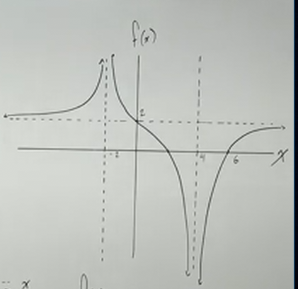

# Inequalities with Functions - Graphically (Precalculus - College Algebra 45)

[Video](https://www.youtube.com/watch?v=bngBtS7RBZ4)

---

Over the next few sections, we will be dealing with how to graph both polynomial
and rational functions that are inequalities.

When you have statements like:

$$ f(x) \geq 0 $$

Or

$$ f(x) < 0 $$

This is, in essence, asking:

> On what portion of the $x$-axis is your function less than $0$? On what
> portion of the graph are our outputs $f(x)$ below the $x$-axis?

This can be denoted using _interval notation_. So for the following graph:

We would denote where $f(x)$ is greater than or equal to $0$ like so:

$$ f(x) \geq 0 \text{ : } (-\infty, 0] \cup [1, 2] $$

$$ f(x) < 0 \text{ : } (0, 1) \cup (2, \infty) $$

Note the classic interval notation and the appropriate brackets (square brackets
mean "including this number", whereas parentheses means "up to, but not
including this number", this coincides with whether or not the "or equal to"
part of our inequality sign).

---

Let's take a look at another example:

And now let's evaluate which intervals for the following inequalities:

$$ f(x) > 0 $$

$$ f(x) \leq 0 $$

Let's go into a bit depth, let's denote the intervals where $f(x)$ is greater
than, but not including, $0$. So this would be:

$$ f(x) > 0 \text{ : } (-1, 1) \cup (2, \infty) $$

And also:

$$ f(x) \leq 0 $$

Again, this is essentially asking, "show me the intervals where $f(x)$ is less
than or equal to $0$". Our interval notation would look like:

$$ f(x) \leq 0 \text{ : } (-\infty, -1] \cup [1, 2] $$

Briefly note that whenever these inequalities are based around comparisons to
$0$, that we are really just looking at the $x$-intercepts.

Let's move onto another example.

---

Now, this is an example of a rational function with ineqeualities. This can get
a bit confusing, but honestly is very similar to comparison of standard
polynomial inequalities. Here are the inequalities we'll be trying to denote
with interval notation:

$$ f(x) < 0 $$

$$ f(x) \geq 0 $$

We can see that for this first expression, our first part of our graph is not
represented, as it is entirely positive, but then after the first vertical
asymptote, we do have some negative points graphed starting from $-2$ and going
up to $0$. Now, we do _not_ include the $-2$, as the vertical asymptote
indicates that we never actually hit $-2$, we just get very close to it. Note
that this would be the case even if this had an "or equal to part of the
equation", the same interval would exist for $f(x) \leq 0$. Additionally, we
never hit $0$, as this original inequality indicates we are less than $0$, not
less than or equal to $0$. Thusly our first interval is:

$$ f(x) < 0 \text{ : } (-2, 0) $$

We also have another part of our graph after our second vertical asymptote
indicating we have another interval where our outputs are strictly negative from
$2$ to $\infty$.

$$ f(x) < 0 \text{ : } (-2, 0) \cup (2, \infty) $$

Let's now work on the next inequality:

$$ f(x) \geq 0 $$

This is pretty much the opposite of our other inequality. Let's just express it
now:

$$ f(x) \geq 0 \text{ : } (-\infty, -2) \cup [0, 2) $$

Note that we do include the $0$, but not the $-2$ and not the $2$. This is for
the reasons we discussed prior. The vertical asymptotes are never included as
our function simply never includes these values as indicated by the Vertical
Asymptotes (but can get very close to them), but when our comparison inequality
includes a value (as it does with $0$ here), then we do include it in our set.

---

This is similar to our previous example, but here we have some horizontal
asymptotes to contend with as well. This is mainly to illustrate that the
horizontal asymptotes can sometimes throw us off. Quite simply, don't
misinterpret horizontal asymptotes for places where our function stops. They
don't. This is unlike vertical asymptotes.

$$ f(x) > 0 \text{ : } (-\infty, -2) \cup (-2, 2) \cup (6, \infty) $$

$$ f(x) \leq 0 \text{ : } [2, 4) \cup (4, 6] $$
