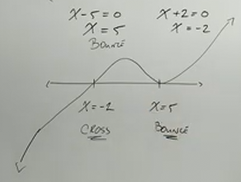
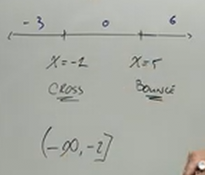
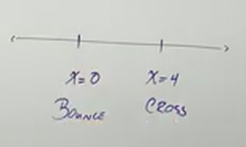
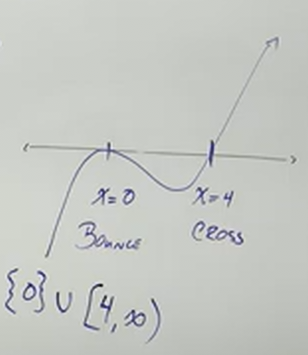
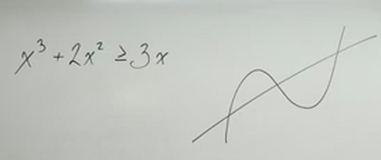
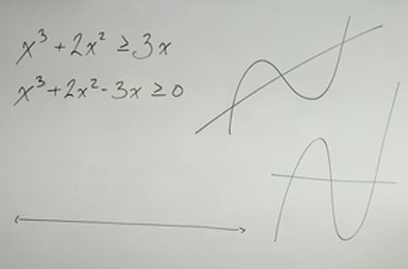
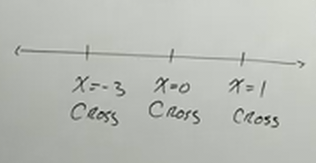
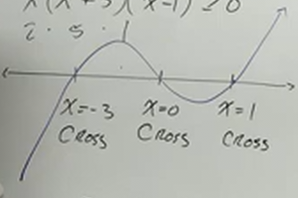
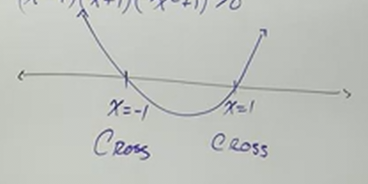

# Inequalities with Polynomial Functions (Precalculus - College Algebra 46)

[Video](https://www.youtube.com/watch?v=qFJ-Mq0XcTI)

---

In this section, we're going to cover inequalities of polynomials. We'll be
approaching this using two different methods, one involving graphing the
inequality, and the other plugging in values. Let's dive in.

---

Consider the following inequality:

$$ (x - 5)^2(x + 2) < 0 $$

If we think of the entire left hand side of the exspression as the output of a
function, this looks very similar to the previous section. If:

$$ f(x) = (x - 5)^2(x + 2) $$

Then we're simply asking for the intervals on our graph where:

$$ f(x) < 0 $$

In this case, we're asking, what are the $x$-intercepts of our function? What
kinds of intercepts are they? Are they bouncing off of or crossing the $x$-axis?
And from there, we'll be able to determine the intervals of our inequality.

In this case we find two $x$-intercepts via the zero product property:

$$ x - 5 = 0 $$

$$ x = 5 $$

$$ x + 2 = 0 $$

$$ x = -2 $$

Now, are these crosses or bounces? Well if you recall our section on
[sketching polynomials](https://www.youtube.com/watch?v=6MAtqY6Fqjs), any even
powered multiplicity polynomial factor creates a bounce, and any odd creates a
cross. Thusly:

$$ x = 5 \text{ : bounce} $$

$$ x = -2 \text{ : cross} $$

If we think about the End Behavior of our function, we know that the power of
our entire polynomial is $x^3$, which is odd, this means taht we have a
polynomial where it starts from $-\infty$ and creates a sort of curved S-shape
at $(0, 0)$ and then progresses onto $\infty$. This means we can rougly sketch
the $x$-axis like so:

And from here, we can probably easily see how we we want to denote this in
interval notation:

$$ f(x) < 0 \text{ : } (-\infty, -2) $$

Now, if we changed our inequality slightly to:

$$ f(x) \leq 0 $$

How would this change our interval notation answer? Well we'd change it first
to:

$$ f(x) < 0 \text{ : } (-\infty, -2] $$

But we wouldn't be done, notice that the bounce that occurs at $x = 5$ would
also be included, because that is where $f(x) = 0$, and in this case, the change
to "or equal to" in our inequality would require us to also include this
solitary point:

$$ f(x) < 0 \text{ : } (-\infty, -2] \cup \left\{5\right\} $$

Note the use of curly brackets here, this is how, in interval notation, we
indicate that there is a single individual value in our set.

The other way we can solve this is by plugging in values, but we do not do this
by random. We take the intervals themselves and plug in a value that is close to
wherever our crosses or bounces occur (but are not the values themselves), and
test them. In the case of our original inequality of $f(x) < 0$, we would
evaluate something like these values:

Once evaluated, we can then simply write out the interval for which the value
returns a true inequality statement. In this case that only occurs from
$-\infty$ and uup to and including $-2$.

---

$$ x^3 - 4x^2 \geq 0 $$

We can think this as:

$$ f(x) \geq 0 $$

Well, first we gotta factor:

$$ x^2(x - 4) \geq 0 $$

Now we use the zero product property to identify the $x$-intercepts.

$$ x^2 = 0 $$

$$ x = 0 $$

$$ x - 4 = 0 $$

$$ x = 4 $$

Again, the graph _crosses_ at _odd_ powered factors, and _bounces_ at _even_
powered factors:

$$ x = 0 \text{ : bounce} $$

$$ x = 4 \text{ : cross} $$

We can then put it on the number line, which helps us also sketch the graph.

Thusly our interval notation is:

$$ f(x) \geq 0 \text{ : } \left\{0\right\} \cup [4, \infty) $$

Note that we do include the $0$ value, as the bounce occurs at $0$, and that is
included in the inequality statement, "greater than or equal to $0$".

Our End Behavior is odd powered, and thusly is a rising cubic form with a bounce
and a cross due to inequality. The rough sketch of the final graph would look
like this:

---

$$ x^3 + 2x^2 \geq 3x $$

Notice that this is a comparison between two different functions, is this cubic
function greater than this linear function?

We can solve this by treating this inequality like a standard equality and
getting all terms to one side.

$$ x^3 + 2x^2 - 3x \geq 0 $$

Note that if we had divided or multiplied by a negative to get it into this form
though, that we would have to change our greater than or equal to sign to a less
than or equal to sign. In this case, we don't have to do that.

Note also that we are simply solving for where this inequality is true. We are
solving for a different inequality, but they will indeed give us the same
intervals. It essentially change solving for a slope for solving for a constant
(the constant, $0$):

But the intervals will be the same.

Now we factor and find the $x$-intercepts:

$$ x^3 + 2x^2 - 3x \geq 0 $$

$$ x(x^2 + 2x - 3) \geq 0 $$

$$ x(x + 3)(x - 1) \geq 0 $$

$$ x = 0 $$

$$ x + 3 = 0 $$

$$ x = -3 $$

$$ x - 1 = 0 $$

$$ x = 1 $$

Note that these are all odd powered factors, and thusly they are crosses.

$$ x = 0 \text{ : cross} $$

$$ x = -3 \text{ : cross} $$

$$ x = 1 \text{ : cross} $$

And we cang raph that on our number line like so:

Our end behavior is a standard cubic function as we have seen throughout our
series thus far.

By plugging in values across this number line, we can determine easily what our
intervals are. in this case they are:

$$ x^3 + 2x^2 \geq 3x \text{ : } [-3, 0] \cup [1, \infty) $$

Sketching the graph, we get:

---

$$ x^4 > 1 $$

We can solve this in a similar fashion to before.

$$ x^4 - 1 > 0 $$

Now, we can solve this as a standard quadratic:

$$ (x^2 + 1)(x^2 - 1) > 0 $$

$$ (x^2 + 1)(x + 1)(x - 1) > 0 $$

Recall that an irreducible factor like $(x^2 + 1)$ cannot cross the $x$-axis as
it doesn't exist in the real number system, so we don't account for this when
finding the intervals of our inequality functions. Let's solve for the other
two:

$$ x - 1 = 0 $$

$$ x = 1 $$

$$ x + 1 = 0 $$

$$ x = -1 $$

Both of these are an odd power which indicates they are both _crosses_. We also
know that with an even power of the leading term of the entire function, that we
have an end behavior of a parabola. When plotted on the number line it looks
like:

And based off our inequality, we can therefore determine our intervals are:

$$ x^4 > 1 \text{ : } (-\infty, -1) \cup (1, \infty) $$
